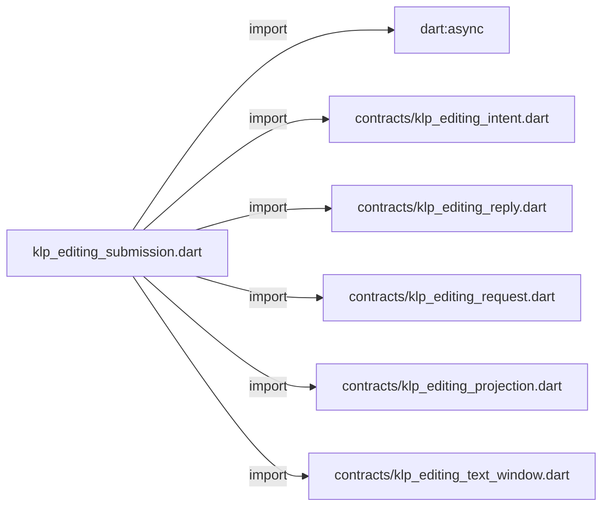
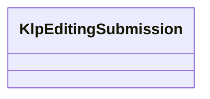

# klp_editing_submission.dart：直接依賴與宣告架構

[回到目錄](README.md) · [來源檔案](../../../../../lib/src/capabilities/editing/klp_editing_submission.dart)

## 範圍

核心是 `lib/src/capabilities/editing/klp_editing_submission.dart`。主要視角為該檔案明寫的 import／export／part；輔助視角為本檔宣告及 extends／implements／with／on 關係。只展開一層外部邊界。

## 直接依賴圖

## 依賴證據

| 關係 | 原始 directive | 來源 |
|---|---|---|
| import | <code>import &#x27;dart:async&#x27;;</code> | [lib/src/capabilities/editing/klp_editing_submission.dart:1](../../../../../lib/src/capabilities/editing/klp_editing_submission.dart#L1) |
| import | <code>import &#x27;contracts/klp_editing_intent.dart&#x27;;</code> | [lib/src/capabilities/editing/klp_editing_submission.dart:3](../../../../../lib/src/capabilities/editing/klp_editing_submission.dart#L3) |
| import | <code>import &#x27;contracts/klp_editing_reply.dart&#x27;;</code> | [lib/src/capabilities/editing/klp_editing_submission.dart:4](../../../../../lib/src/capabilities/editing/klp_editing_submission.dart#L4) |
| import | <code>import &#x27;contracts/klp_editing_request.dart&#x27;;</code> | [lib/src/capabilities/editing/klp_editing_submission.dart:5](../../../../../lib/src/capabilities/editing/klp_editing_submission.dart#L5) |
| import | <code>import &#x27;contracts/klp_editing_projection.dart&#x27;;</code> | [lib/src/capabilities/editing/klp_editing_submission.dart:6](../../../../../lib/src/capabilities/editing/klp_editing_submission.dart#L6) |
| import | <code>import &#x27;contracts/klp_editing_text_window.dart&#x27;;</code> | [lib/src/capabilities/editing/klp_editing_submission.dart:7](../../../../../lib/src/capabilities/editing/klp_editing_submission.dart#L7) |

## 宣告關係圖

本組節點是本檔宣告；沒有箭頭的宣告未在此圖主張互相依賴。

## 宣告與成員證據

成員包含 public 與 private；簽章取自來源，省略函式本體與欄位初始值。`(inferred)` 表示來源未明寫型別；建構子只顯示參數部分，不含初始化列表。

### KlpEditingSubmission

ClassDeclaration · public · [lib/src/capabilities/editing/klp_editing_submission.dart:9](../../../../../lib/src/capabilities/editing/klp_editing_submission.dart#L9)

<code>final class KlpEditingSubmission</code>

來源註解摘要：單一 session 的提交閘門；不自行修改文字，也不取消核心已開始的交易。

| 成員 | 可見性 | 簽章／型別 | 來源註解摘要 | 證據 |
|---|---|---|---|---|
| field <code>_submit</code> | private | <code>final FutureOr&lt;KlpEditingReply&gt; Function(KlpEditingRequest request) _submit</code> |  | [lib/src/capabilities/editing/klp_editing_submission.dart:12](../../../../../lib/src/capabilities/editing/klp_editing_submission.dart#L12) |
| field <code>_projection</code> | private | <code>KlpEditingProjection _projection</code> |  | [lib/src/capabilities/editing/klp_editing_submission.dart:13](../../../../../lib/src/capabilities/editing/klp_editing_submission.dart#L13) |
| field <code>_lastRequest</code> | private | <code>KlpEditingRequest? _lastRequest</code> |  | [lib/src/capabilities/editing/klp_editing_submission.dart:14](../../../../../lib/src/capabilities/editing/klp_editing_submission.dart#L14) |
| field <code>_lastFuture</code> | private | <code>Future&lt;KlpEditingReply&gt;? _lastFuture</code> |  | [lib/src/capabilities/editing/klp_editing_submission.dart:15](../../../../../lib/src/capabilities/editing/klp_editing_submission.dart#L15) |
| field <code>_pending</code> | private | <code>bool _pending</code> |  | [lib/src/capabilities/editing/klp_editing_submission.dart:16](../../../../../lib/src/capabilities/editing/klp_editing_submission.dart#L16) |
| field <code>_closed</code> | private | <code>bool _closed</code> |  | [lib/src/capabilities/editing/klp_editing_submission.dart:17](../../../../../lib/src/capabilities/editing/klp_editing_submission.dart#L17) |
| field <code>_requiresResync</code> | private | <code>bool _requiresResync</code> |  | [lib/src/capabilities/editing/klp_editing_submission.dart:18](../../../../../lib/src/capabilities/editing/klp_editing_submission.dart#L18) |
| constructor <code>KlpEditingSubmission</code> | public | <code>KlpEditingSubmission(this._projection, this._submit)</code> |  | [lib/src/capabilities/editing/klp_editing_submission.dart:20](../../../../../lib/src/capabilities/editing/klp_editing_submission.dart#L20) |
| getter <code>projection</code> | public | <code>KlpEditingProjection get projection</code> |  | [lib/src/capabilities/editing/klp_editing_submission.dart:22](../../../../../lib/src/capabilities/editing/klp_editing_submission.dart#L22) |
| getter <code>window</code> | public | <code>KlpEditingTextWindow? get window</code> |  | [lib/src/capabilities/editing/klp_editing_submission.dart:23](../../../../../lib/src/capabilities/editing/klp_editing_submission.dart#L23) |
| getter <code>pending</code> | public | <code>bool get pending</code> |  | [lib/src/capabilities/editing/klp_editing_submission.dart:24](../../../../../lib/src/capabilities/editing/klp_editing_submission.dart#L24) |
| getter <code>requiresResync</code> | public | <code>bool get requiresResync</code> |  | [lib/src/capabilities/editing/klp_editing_submission.dart:25](../../../../../lib/src/capabilities/editing/klp_editing_submission.dart#L25) |
| method <code>submit</code> | public | <code>Future&lt;KlpEditingReply&gt; submit(KlpEditingRequest request)</code> |  | [lib/src/capabilities/editing/klp_editing_submission.dart:27](../../../../../lib/src/capabilities/editing/klp_editing_submission.dart#L27) |
| method <code>resynchronize</code> | public | <code>void resynchronize(KlpEditingProjection next)</code> |  | [lib/src/capabilities/editing/klp_editing_submission.dart:84](../../../../../lib/src/capabilities/editing/klp_editing_submission.dart#L84) |
| method <code>close</code> | public | <code>void close()</code> |  | [lib/src/capabilities/editing/klp_editing_submission.dart:92](../../../../../lib/src/capabilities/editing/klp_editing_submission.dart#L92) |
| method <code>_validateSuccessor</code> | private | <code>void _validateSuccessor(KlpEditingProjection next)</code> |  | [lib/src/capabilities/editing/klp_editing_submission.dart:97](../../../../../lib/src/capabilities/editing/klp_editing_submission.dart#L97) |
| method <code>_fail</code> | private | <code>void _fail(Completer&lt;KlpEditingReply&gt; completion, Object error, StackTrace stack)</code> |  | [lib/src/capabilities/editing/klp_editing_submission.dart:109](../../../../../lib/src/capabilities/editing/klp_editing_submission.dart#L109) |
| method <code>_validateCompositionReply</code> | private | <code>void _validateCompositionReply(KlpEditingIntent intent, KlpEditingProjection next)</code> |  | [lib/src/capabilities/editing/klp_editing_submission.dart:115](../../../../../lib/src/capabilities/editing/klp_editing_submission.dart#L115) |

## 閱讀說明與限制

箭頭只表示來源明寫的靜態關係；import 不等於呼叫。未分析動態呼叫、欄位的實際物件擁有權、狀態轉移或渲染流程；型別未進行語意解析，繼承目標保留原始型別拼寫。public／private 依 Dart 名稱前綴判斷；public 宣告不代表已由 `lib/kallopis.dart` 匯出。

本頁由 `tool/architecture_atlas` 產生；編輯來源或生成工具後重新產生，避免手改本頁。
