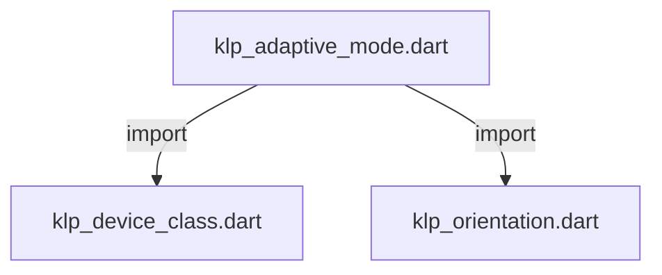
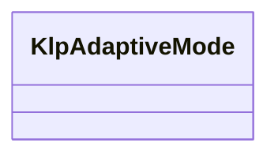

# klp_adaptive_mode.dart：直接依賴與宣告架構

[回到目錄](README.md) · [來源檔案](../../../../../lib/src/capabilities/environment/klp_adaptive_mode.dart)

## 範圍

核心是 `lib/src/capabilities/environment/klp_adaptive_mode.dart`。主要視角為該檔案明寫的 import／export／part；輔助視角為本檔宣告及 extends／implements／with／on 關係。只展開一層外部邊界。

## 直接依賴圖

## 依賴證據

| 關係 | 原始 directive | 來源 |
|---|---|---|
| import | <code>import &#x27;klp_device_class.dart&#x27;;</code> | [lib/src/capabilities/environment/klp_adaptive_mode.dart:1](../../../../../lib/src/capabilities/environment/klp_adaptive_mode.dart#L1) |
| import | <code>import &#x27;klp_orientation.dart&#x27;;</code> | [lib/src/capabilities/environment/klp_adaptive_mode.dart:2](../../../../../lib/src/capabilities/environment/klp_adaptive_mode.dart#L2) |

## 宣告關係圖

本組節點是本檔宣告；沒有箭頭的宣告未在此圖主張互相依賴。

## 宣告與成員證據

成員包含 public 與 private；簽章取自來源，省略函式本體與欄位初始值。`(inferred)` 表示來源未明寫型別；建構子只顯示參數部分，不含初始化列表。

### KlpAdaptiveMode

ClassDeclaration · public · [lib/src/capabilities/environment/klp_adaptive_mode.dart:4](../../../../../lib/src/capabilities/environment/klp_adaptive_mode.dart#L4)

<code>abstract final class KlpAdaptiveMode</code>

來源註解摘要：自適應渲染模式定義。

| 成員 | 可見性 | 簽章／型別 | 來源註解摘要 | 證據 |
|---|---|---|---|---|
| field <code>tabletLandscape</code> | public | <code>static const String tabletLandscape</code> | 平板橫向模式（例如 iPad 橫向雙欄/三欄生產力工作區）。 | [lib/src/capabilities/environment/klp_adaptive_mode.dart:8](../../../../../lib/src/capabilities/environment/klp_adaptive_mode.dart#L8) |
| field <code>tabletPortrait</code> | public | <code>static const String tabletPortrait</code> | 平板直向模式（例如 iPad 直向單欄畫布 + 抽屜導覽）。 | [lib/src/capabilities/environment/klp_adaptive_mode.dart:11](../../../../../lib/src/capabilities/environment/klp_adaptive_mode.dart#L11) |
| field <code>desktop</code> | public | <code>static const String desktop</code> | 桌面工作站模式（寬螢幕常駐側欄與面板）。 | [lib/src/capabilities/environment/klp_adaptive_mode.dart:14](../../../../../lib/src/capabilities/environment/klp_adaptive_mode.dart#L14) |
| field <code>phone</code> | public | <code>static const String phone</code> | 手機模式（單欄流動佈局與底部控制項）。 | [lib/src/capabilities/environment/klp_adaptive_mode.dart:17](../../../../../lib/src/capabilities/environment/klp_adaptive_mode.dart#L17) |
| field <code>fallback</code> | public | <code>static const String fallback</code> | 通用保底模式識別。 | [lib/src/capabilities/environment/klp_adaptive_mode.dart:20](../../../../../lib/src/capabilities/environment/klp_adaptive_mode.dart#L20) |
| method <code>resolveDefault</code> | public | <code>static String resolveDefault({required KlpDeviceClass deviceClass, required KlpOrientation orientation})</code> | 依據裝置形態與螢幕朝向解析出預設模式識別。 | [lib/src/capabilities/environment/klp_adaptive_mode.dart:22](../../../../../lib/src/capabilities/environment/klp_adaptive_mode.dart#L22) |

## 閱讀說明與限制

箭頭只表示來源明寫的靜態關係；import 不等於呼叫。未分析動態呼叫、欄位的實際物件擁有權、狀態轉移或渲染流程；型別未進行語意解析，繼承目標保留原始型別拼寫。public／private 依 Dart 名稱前綴判斷；public 宣告不代表已由 `lib/kallopis.dart` 匯出。

本頁由 `tool/architecture_atlas` 產生；編輯來源或生成工具後重新產生，避免手改本頁。
