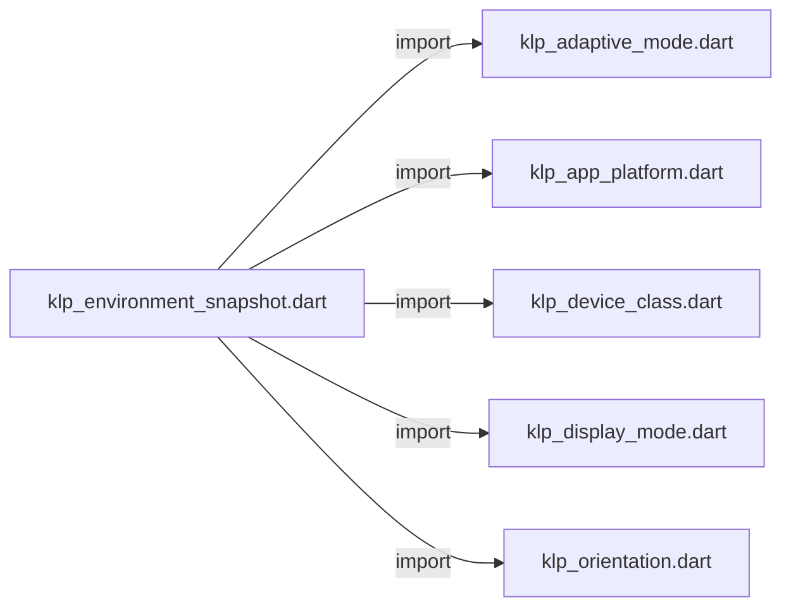
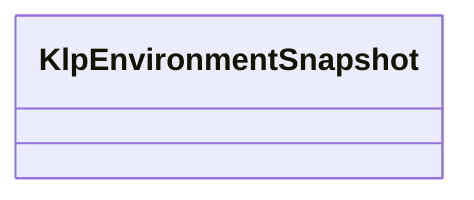

# klp_environment_snapshot.dart：直接依賴與宣告架構

[回到目錄](README.md) · [來源檔案](../../../../../lib/src/capabilities/environment/klp_environment_snapshot.dart)

## 範圍

核心是 `lib/src/capabilities/environment/klp_environment_snapshot.dart`。主要視角為該檔案明寫的 import／export／part；輔助視角為本檔宣告及 extends／implements／with／on 關係。只展開一層外部邊界。

## 直接依賴圖

## 依賴證據

| 關係 | 原始 directive | 來源 |
|---|---|---|
| import | <code>import &#x27;klp_adaptive_mode.dart&#x27;;</code> | [lib/src/capabilities/environment/klp_environment_snapshot.dart:1](../../../../../lib/src/capabilities/environment/klp_environment_snapshot.dart#L1) |
| import | <code>import &#x27;klp_app_platform.dart&#x27;;</code> | [lib/src/capabilities/environment/klp_environment_snapshot.dart:2](../../../../../lib/src/capabilities/environment/klp_environment_snapshot.dart#L2) |
| import | <code>import &#x27;klp_device_class.dart&#x27;;</code> | [lib/src/capabilities/environment/klp_environment_snapshot.dart:3](../../../../../lib/src/capabilities/environment/klp_environment_snapshot.dart#L3) |
| import | <code>import &#x27;klp_display_mode.dart&#x27;;</code> | [lib/src/capabilities/environment/klp_environment_snapshot.dart:4](../../../../../lib/src/capabilities/environment/klp_environment_snapshot.dart#L4) |
| import | <code>import &#x27;klp_orientation.dart&#x27;;</code> | [lib/src/capabilities/environment/klp_environment_snapshot.dart:5](../../../../../lib/src/capabilities/environment/klp_environment_snapshot.dart#L5) |

## 宣告關係圖

本組節點是本檔宣告；沒有箭頭的宣告未在此圖主張互相依賴。

## 宣告與成員證據

成員包含 public 與 private；簽章取自來源，省略函式本體與欄位初始值。`(inferred)` 表示來源未明寫型別；建構子只顯示參數部分，不含初始化列表。

### KlpEnvironmentSnapshot

ClassDeclaration · public · [lib/src/capabilities/environment/klp_environment_snapshot.dart:7](../../../../../lib/src/capabilities/environment/klp_environment_snapshot.dart#L7)

<code>final class KlpEnvironmentSnapshot</code>

來源註解摘要：由宿主採樣後解析的純環境快照；不持有平台來源或訂閱。

| 成員 | 可見性 | 簽章／型別 | 來源註解摘要 | 證據 |
|---|---|---|---|---|
| field <code>platform</code> | public | <code>final KlpAppPlatform platform</code> |  | [lib/src/capabilities/environment/klp_environment_snapshot.dart:10](../../../../../lib/src/capabilities/environment/klp_environment_snapshot.dart#L10) |
| field <code>deviceClass</code> | public | <code>final KlpDeviceClass deviceClass</code> |  | [lib/src/capabilities/environment/klp_environment_snapshot.dart:11](../../../../../lib/src/capabilities/environment/klp_environment_snapshot.dart#L11) |
| field <code>orientation</code> | public | <code>final KlpOrientation orientation</code> |  | [lib/src/capabilities/environment/klp_environment_snapshot.dart:12](../../../../../lib/src/capabilities/environment/klp_environment_snapshot.dart#L12) |
| field <code>displayMode</code> | public | <code>final KlpDisplayMode displayMode</code> |  | [lib/src/capabilities/environment/klp_environment_snapshot.dart:13](../../../../../lib/src/capabilities/environment/klp_environment_snapshot.dart#L13) |
| field <code>adaptiveMode</code> | public | <code>final String adaptiveMode</code> |  | [lib/src/capabilities/environment/klp_environment_snapshot.dart:14](../../../../../lib/src/capabilities/environment/klp_environment_snapshot.dart#L14) |
| field <code>isWebRuntime</code> | public | <code>final bool isWebRuntime</code> |  | [lib/src/capabilities/environment/klp_environment_snapshot.dart:15](../../../../../lib/src/capabilities/environment/klp_environment_snapshot.dart#L15) |
| constructor <code>KlpEnvironmentSnapshot</code> | public | <code>const KlpEnvironmentSnapshot({ required this.platform, this.deviceClass = KlpDeviceClass.desktop, this.orientation = KlpOrientation.landscape, this.displayMode = KlpDisplayMode.browser, this.adaptiveMode = &#x27;&#x27;, required this.isWebRuntime, })</code> |  | [lib/src/capabilities/environment/klp_environment_snapshot.dart:17](../../../../../lib/src/capabilities/environment/klp_environment_snapshot.dart#L17) |
| constructor <code>resolve</code> | public | <code>factory KlpEnvironmentSnapshot.resolve({ required KlpAppPlatform platform, required bool isWebRuntime, double? width, double? height, Map&lt;String, String&gt; queryParameters = const {}, })</code> | 依原平台、尺寸與網址優先序推導環境，不讀取全域來源。 | [lib/src/capabilities/environment/klp_environment_snapshot.dart:26](../../../../../lib/src/capabilities/environment/klp_environment_snapshot.dart#L26) |
| getter <code>effectiveAdaptiveMode</code> | public | <code>String get effectiveAdaptiveMode</code> |  | [lib/src/capabilities/environment/klp_environment_snapshot.dart:102](../../../../../lib/src/capabilities/environment/klp_environment_snapshot.dart#L102) |
| getter <code>isAndroid</code> | public | <code>bool get isAndroid</code> |  | [lib/src/capabilities/environment/klp_environment_snapshot.dart:103](../../../../../lib/src/capabilities/environment/klp_environment_snapshot.dart#L103) |
| getter <code>isWindows</code> | public | <code>bool get isWindows</code> |  | [lib/src/capabilities/environment/klp_environment_snapshot.dart:104](../../../../../lib/src/capabilities/environment/klp_environment_snapshot.dart#L104) |
| getter <code>isDesktop</code> | public | <code>bool get isDesktop</code> |  | [lib/src/capabilities/environment/klp_environment_snapshot.dart:105](../../../../../lib/src/capabilities/environment/klp_environment_snapshot.dart#L105) |
| getter <code>isMobile</code> | public | <code>bool get isMobile</code> |  | [lib/src/capabilities/environment/klp_environment_snapshot.dart:106](../../../../../lib/src/capabilities/environment/klp_environment_snapshot.dart#L106) |
| getter <code>isTablet</code> | public | <code>bool get isTablet</code> |  | [lib/src/capabilities/environment/klp_environment_snapshot.dart:107](../../../../../lib/src/capabilities/environment/klp_environment_snapshot.dart#L107) |

## 閱讀說明與限制

箭頭只表示來源明寫的靜態關係；import 不等於呼叫。未分析動態呼叫、欄位的實際物件擁有權、狀態轉移或渲染流程；型別未進行語意解析，繼承目標保留原始型別拼寫。public／private 依 Dart 名稱前綴判斷；public 宣告不代表已由 `lib/kallopis.dart` 匯出。

本頁由 `tool/architecture_atlas` 產生；編輯來源或生成工具後重新產生，避免手改本頁。
