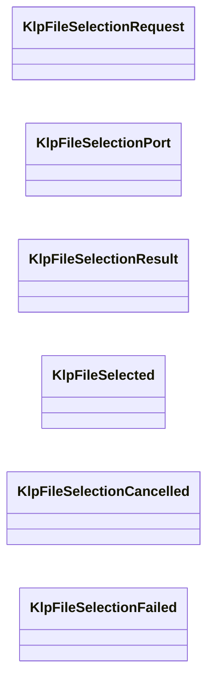
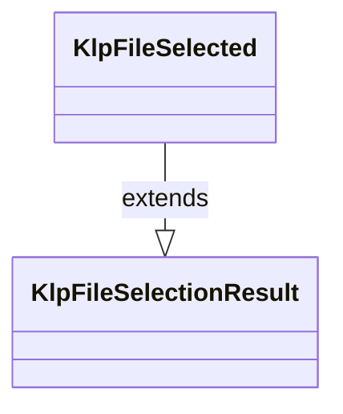
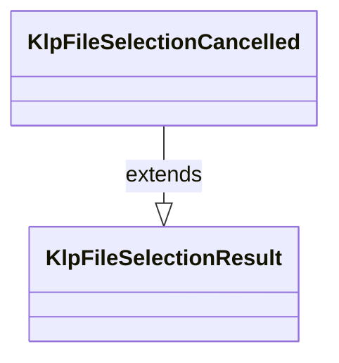
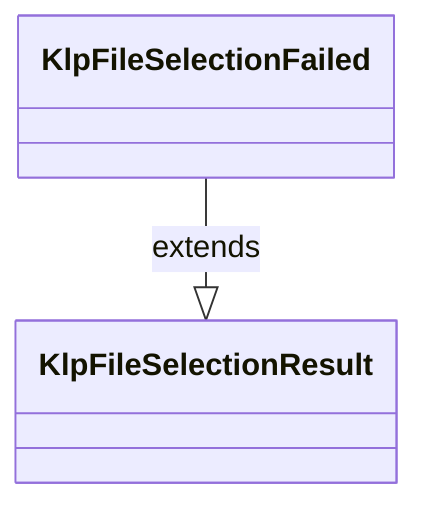

# klp_file_selection.dart：直接依賴與宣告架構

[回到目錄](README.md) · [來源檔案](../../../../../lib/src/capabilities/files/klp_file_selection.dart)

## 範圍

核心是 `lib/src/capabilities/files/klp_file_selection.dart`。主要視角為該檔案明寫的 import／export／part；輔助視角為本檔宣告及 extends／implements／with／on 關係。只展開一層外部邊界。

## 直接依賴圖

## 依賴證據

| 關係 | 原始 directive | 來源 |
|---|---|---|
| 無 | 本檔未宣告 import／export／part | [lib/src/capabilities/files/klp_file_selection.dart:1](../../../../../lib/src/capabilities/files/klp_file_selection.dart#L1) |

## 宣告關係圖

本組節點是本檔宣告；沒有箭頭的宣告未在此圖主張互相依賴。

## 宣告與成員證據

成員包含 public 與 private；簽章取自來源，省略函式本體與欄位初始值。`(inferred)` 表示來源未明寫型別；建構子只顯示參數部分，不含初始化列表。

### KlpFileSelectionRequest

ClassDeclaration · public · [lib/src/capabilities/files/klp_file_selection.dart:1](../../../../../lib/src/capabilities/files/klp_file_selection.dart#L1)

<code>final class KlpFileSelectionRequest</code>

來源註解摘要：單次啟動時的限制快照；保留每個原始值與順序。

| 成員 | 可見性 | 簽章／型別 | 來源註解摘要 | 證據 |
|---|---|---|---|---|
| field <code>acceptedExtensions</code> | public | <code>final List&lt;String&gt; acceptedExtensions</code> |  | [lib/src/capabilities/files/klp_file_selection.dart:4](../../../../../lib/src/capabilities/files/klp_file_selection.dart#L4) |
| constructor <code>KlpFileSelectionRequest</code> | public | <code>KlpFileSelectionRequest({List&lt;String&gt; acceptedExtensions = const []})</code> |  | [lib/src/capabilities/files/klp_file_selection.dart:6](../../../../../lib/src/capabilities/files/klp_file_selection.dart#L6) |

### KlpFileSelectionPort

ClassDeclaration · public · [lib/src/capabilities/files/klp_file_selection.dart:9](../../../../../lib/src/capabilities/files/klp_file_selection.dart#L9)

<code>abstract interface class KlpFileSelectionPort</code>

來源註解摘要：套件內部的選檔能力；平台與檔案讀取不屬於此契約。

| 成員 | 可見性 | 簽章／型別 | 來源註解摘要 | 證據 |
|---|---|---|---|---|
| method <code>select</code> | public | <code>Future&lt;KlpFileSelectionResult&gt; select(KlpFileSelectionRequest request)</code> |  | [lib/src/capabilities/files/klp_file_selection.dart:12](../../../../../lib/src/capabilities/files/klp_file_selection.dart#L12) |

### KlpFileSelectionResult

ClassDeclaration · public · [lib/src/capabilities/files/klp_file_selection.dart:15](../../../../../lib/src/capabilities/files/klp_file_selection.dart#L15)

<code>sealed class KlpFileSelectionResult</code>

來源註解摘要：選檔結果只攜帶路徑、取消或原始失敗，不建立另一份檔案權威。

| 成員 | 可見性 | 簽章／型別 | 來源註解摘要 | 證據 |
|---|---|---|---|---|
| constructor <code>KlpFileSelectionResult</code> | public | <code>const KlpFileSelectionResult()</code> |  | [lib/src/capabilities/files/klp_file_selection.dart:18](../../../../../lib/src/capabilities/files/klp_file_selection.dart#L18) |

### KlpFileSelected

ClassDeclaration · public · [lib/src/capabilities/files/klp_file_selection.dart:21](../../../../../lib/src/capabilities/files/klp_file_selection.dart#L21)

<code>final class KlpFileSelected extends KlpFileSelectionResult</code>

來源註解摘要：使用者已選取的原始路徑。

- `extends` → <code>KlpFileSelectionResult</code>：[lib/src/capabilities/files/klp_file_selection.dart:22](../../../../../lib/src/capabilities/files/klp_file_selection.dart#L22)

| 成員 | 可見性 | 簽章／型別 | 來源註解摘要 | 證據 |
|---|---|---|---|---|
| field <code>path</code> | public | <code>final String path</code> |  | [lib/src/capabilities/files/klp_file_selection.dart:24](../../../../../lib/src/capabilities/files/klp_file_selection.dart#L24) |
| constructor <code>KlpFileSelected</code> | public | <code>const KlpFileSelected(this.path)</code> |  | [lib/src/capabilities/files/klp_file_selection.dart:26](../../../../../lib/src/capabilities/files/klp_file_selection.dart#L26) |

### KlpFileSelectionCancelled

ClassDeclaration · public · [lib/src/capabilities/files/klp_file_selection.dart:29](../../../../../lib/src/capabilities/files/klp_file_selection.dart#L29)

<code>final class KlpFileSelectionCancelled extends KlpFileSelectionResult</code>

來源註解摘要：使用者取消選檔。

- `extends` → <code>KlpFileSelectionResult</code>：[lib/src/capabilities/files/klp_file_selection.dart:30](../../../../../lib/src/capabilities/files/klp_file_selection.dart#L30)

| 成員 | 可見性 | 簽章／型別 | 來源註解摘要 | 證據 |
|---|---|---|---|---|
| constructor <code>KlpFileSelectionCancelled</code> | public | <code>const KlpFileSelectionCancelled()</code> |  | [lib/src/capabilities/files/klp_file_selection.dart:32](../../../../../lib/src/capabilities/files/klp_file_selection.dart#L32) |

### KlpFileSelectionFailed

ClassDeclaration · public · [lib/src/capabilities/files/klp_file_selection.dart:35](../../../../../lib/src/capabilities/files/klp_file_selection.dart#L35)

<code>final class KlpFileSelectionFailed extends KlpFileSelectionResult</code>

來源註解摘要：保留平台回報的錯誤及堆疊身分。

- `extends` → <code>KlpFileSelectionResult</code>：[lib/src/capabilities/files/klp_file_selection.dart:36](../../../../../lib/src/capabilities/files/klp_file_selection.dart#L36)

| 成員 | 可見性 | 簽章／型別 | 來源註解摘要 | 證據 |
|---|---|---|---|---|
| field <code>error</code> | public | <code>final Object error</code> |  | [lib/src/capabilities/files/klp_file_selection.dart:38](../../../../../lib/src/capabilities/files/klp_file_selection.dart#L38) |
| field <code>stackTrace</code> | public | <code>final StackTrace stackTrace</code> |  | [lib/src/capabilities/files/klp_file_selection.dart:39](../../../../../lib/src/capabilities/files/klp_file_selection.dart#L39) |
| constructor <code>KlpFileSelectionFailed</code> | public | <code>const KlpFileSelectionFailed(this.error, this.stackTrace)</code> |  | [lib/src/capabilities/files/klp_file_selection.dart:41](../../../../../lib/src/capabilities/files/klp_file_selection.dart#L41) |

## 閱讀說明與限制

箭頭只表示來源明寫的靜態關係；import 不等於呼叫。未分析動態呼叫、欄位的實際物件擁有權、狀態轉移或渲染流程；型別未進行語意解析，繼承目標保留原始型別拼寫。public／private 依 Dart 名稱前綴判斷；public 宣告不代表已由 `lib/kallopis.dart` 匯出。

本頁由 `tool/architecture_atlas` 產生；編輯來源或生成工具後重新產生，避免手改本頁。
