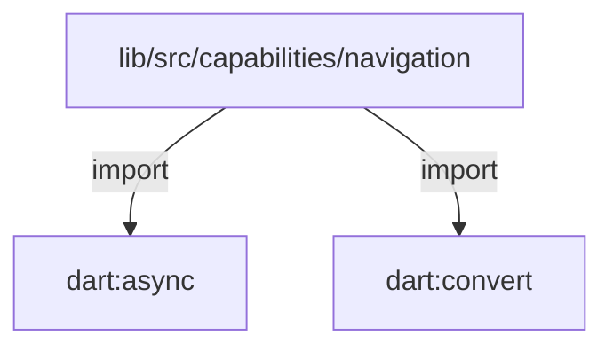
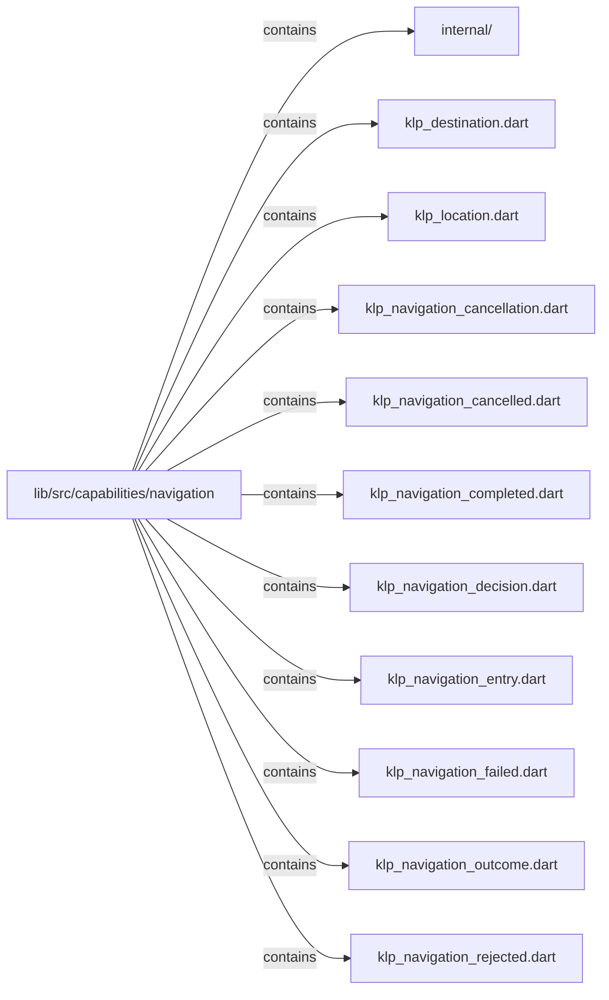
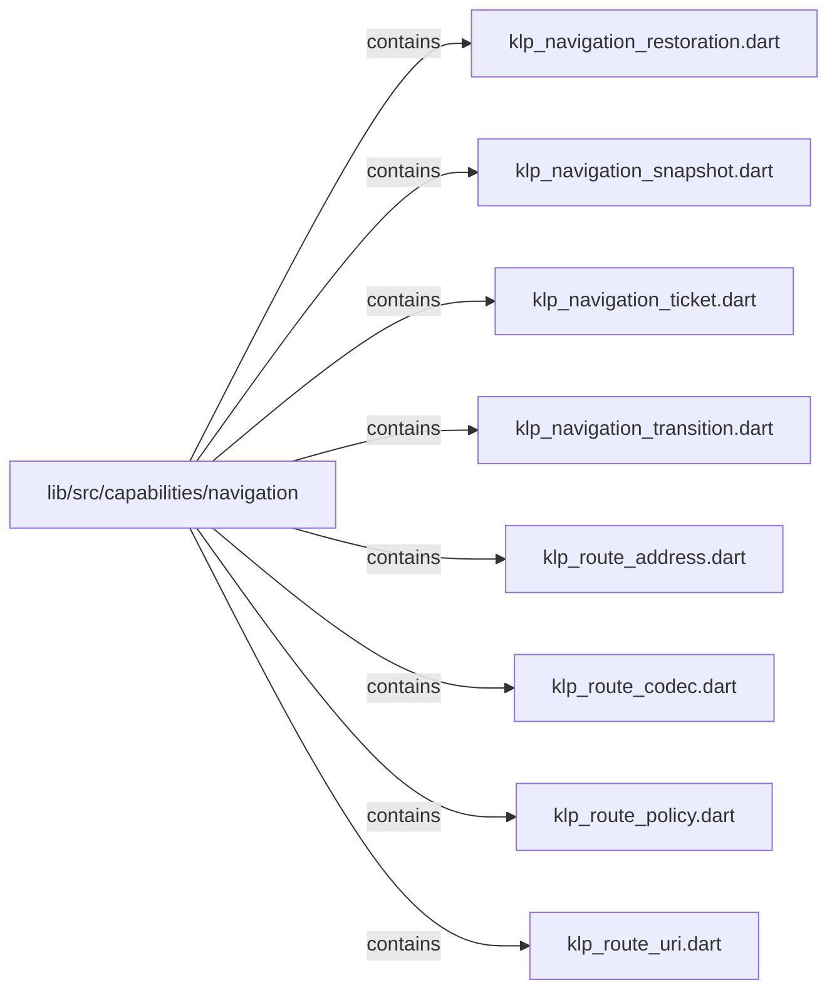

# lib/src/capabilities/navigation：架構分析入口

[上一層](../README.md)

## 範圍

閱讀 `lib/src/capabilities/navigation` 的直接子目錄與 Dart 檔案。結構圖表示實際檔案包含關係；依賴圖表示本層檔案明寫的 directives。每個檔案頁另列直接依賴、宣告、欄位、方法、建構子及行號證據。

## 本層直接依賴圖

箭頭以本層 Dart 檔案明寫的 directive 彙總到目標所在目錄或外部套件邊界；不遞迴將子目錄依賴算入本層。相同目標的不同 directive 類型分開計數。

| 目標邊界 | 關係 | directive 數 | 第一筆來源證據 |
|---|---|---|---|
| <code>dart:async</code> | import | 1 | [lib/src/capabilities/navigation/klp_route_policy.dart:1](../../../../../lib/src/capabilities/navigation/klp_route_policy.dart#L1) |
| <code>dart:convert</code> | import | 1 | [lib/src/capabilities/navigation/klp_route_uri.dart:1](../../../../../lib/src/capabilities/navigation/klp_route_uri.dart#L1) |

### 同目錄依賴

| 來源 → 目標 | 關係 | 證據 |
|---|---|---|
| <code>klp_destination.dart → klp_location.dart</code> | import | [lib/src/capabilities/navigation/klp_destination.dart:1](../../../../../lib/src/capabilities/navigation/klp_destination.dart#L1) |
| <code>klp_destination.dart → klp_route_address.dart</code> | import | [lib/src/capabilities/navigation/klp_destination.dart:2](../../../../../lib/src/capabilities/navigation/klp_destination.dart#L2) |
| <code>klp_destination.dart → klp_route_codec.dart</code> | import | [lib/src/capabilities/navigation/klp_destination.dart:3](../../../../../lib/src/capabilities/navigation/klp_destination.dart#L3) |
| <code>klp_location.dart → klp_destination.dart</code> | import | [lib/src/capabilities/navigation/klp_location.dart:1](../../../../../lib/src/capabilities/navigation/klp_location.dart#L1) |
| <code>klp_navigation_cancelled.dart → klp_navigation_outcome.dart</code> | part of | [lib/src/capabilities/navigation/klp_navigation_cancelled.dart:1](../../../../../lib/src/capabilities/navigation/klp_navigation_cancelled.dart#L1) |
| <code>klp_navigation_completed.dart → klp_navigation_outcome.dart</code> | part of | [lib/src/capabilities/navigation/klp_navigation_completed.dart:1](../../../../../lib/src/capabilities/navigation/klp_navigation_completed.dart#L1) |
| <code>klp_navigation_decision.dart → klp_navigation_outcome.dart</code> | import | [lib/src/capabilities/navigation/klp_navigation_decision.dart:1](../../../../../lib/src/capabilities/navigation/klp_navigation_decision.dart#L1) |
| <code>klp_navigation_entry.dart → klp_location.dart</code> | import | [lib/src/capabilities/navigation/klp_navigation_entry.dart:1](../../../../../lib/src/capabilities/navigation/klp_navigation_entry.dart#L1) |
| <code>klp_navigation_failed.dart → klp_navigation_outcome.dart</code> | part of | [lib/src/capabilities/navigation/klp_navigation_failed.dart:1](../../../../../lib/src/capabilities/navigation/klp_navigation_failed.dart#L1) |
| <code>klp_navigation_outcome.dart → klp_navigation_completed.dart</code> | part | [lib/src/capabilities/navigation/klp_navigation_outcome.dart:1](../../../../../lib/src/capabilities/navigation/klp_navigation_outcome.dart#L1) |
| <code>klp_navigation_outcome.dart → klp_navigation_cancelled.dart</code> | part | [lib/src/capabilities/navigation/klp_navigation_outcome.dart:2](../../../../../lib/src/capabilities/navigation/klp_navigation_outcome.dart#L2) |
| <code>klp_navigation_outcome.dart → klp_navigation_rejected.dart</code> | part | [lib/src/capabilities/navigation/klp_navigation_outcome.dart:3](../../../../../lib/src/capabilities/navigation/klp_navigation_outcome.dart#L3) |
| <code>klp_navigation_outcome.dart → klp_navigation_failed.dart</code> | part | [lib/src/capabilities/navigation/klp_navigation_outcome.dart:4](../../../../../lib/src/capabilities/navigation/klp_navigation_outcome.dart#L4) |
| <code>klp_navigation_rejected.dart → klp_navigation_outcome.dart</code> | part of | [lib/src/capabilities/navigation/klp_navigation_rejected.dart:1](../../../../../lib/src/capabilities/navigation/klp_navigation_rejected.dart#L1) |
| <code>klp_navigation_restoration.dart → klp_navigation_entry.dart</code> | import | [lib/src/capabilities/navigation/klp_navigation_restoration.dart:1](../../../../../lib/src/capabilities/navigation/klp_navigation_restoration.dart#L1) |
| <code>klp_navigation_restoration.dart → klp_navigation_snapshot.dart</code> | import | [lib/src/capabilities/navigation/klp_navigation_restoration.dart:2](../../../../../lib/src/capabilities/navigation/klp_navigation_restoration.dart#L2) |
| <code>klp_navigation_restoration.dart → klp_route_address.dart</code> | import | [lib/src/capabilities/navigation/klp_navigation_restoration.dart:3](../../../../../lib/src/capabilities/navigation/klp_navigation_restoration.dart#L3) |
| <code>klp_navigation_snapshot.dart → klp_navigation_entry.dart</code> | import | [lib/src/capabilities/navigation/klp_navigation_snapshot.dart:1](../../../../../lib/src/capabilities/navigation/klp_navigation_snapshot.dart#L1) |
| <code>klp_navigation_ticket.dart → klp_navigation_decision.dart</code> | import | [lib/src/capabilities/navigation/klp_navigation_ticket.dart:1](../../../../../lib/src/capabilities/navigation/klp_navigation_ticket.dart#L1) |
| <code>klp_navigation_ticket.dart → klp_navigation_outcome.dart</code> | import | [lib/src/capabilities/navigation/klp_navigation_ticket.dart:2](../../../../../lib/src/capabilities/navigation/klp_navigation_ticket.dart#L2) |
| <code>klp_navigation_transition.dart → klp_navigation_cancellation.dart</code> | import | [lib/src/capabilities/navigation/klp_navigation_transition.dart:1](../../../../../lib/src/capabilities/navigation/klp_navigation_transition.dart#L1) |
| <code>klp_navigation_transition.dart → klp_navigation_snapshot.dart</code> | import | [lib/src/capabilities/navigation/klp_navigation_transition.dart:2](../../../../../lib/src/capabilities/navigation/klp_navigation_transition.dart#L2) |
| <code>klp_route_policy.dart → klp_destination.dart</code> | import | [lib/src/capabilities/navigation/klp_route_policy.dart:3](../../../../../lib/src/capabilities/navigation/klp_route_policy.dart#L3) |
| <code>klp_route_policy.dart → klp_navigation_transition.dart</code> | import | [lib/src/capabilities/navigation/klp_route_policy.dart:4](../../../../../lib/src/capabilities/navigation/klp_route_policy.dart#L4) |
| <code>klp_route_uri.dart → klp_navigation_restoration.dart</code> | import | [lib/src/capabilities/navigation/klp_route_uri.dart:3](../../../../../lib/src/capabilities/navigation/klp_route_uri.dart#L3) |
| <code>klp_route_uri.dart → klp_route_address.dart</code> | import | [lib/src/capabilities/navigation/klp_route_uri.dart:4](../../../../../lib/src/capabilities/navigation/klp_route_uri.dart#L4) |

## 目錄結構圖

## 子目錄

| 目錄 | 導航 | 來源證據 |
|---|---|---|
| `internal/` | [架構入口](internal/README.md) | [來源目錄](../../../../../lib/src/capabilities/navigation/internal) |

## 本層檔案

| 檔案 | 宣告 | 細節 | 來源證據 |
|---|---|---|---|
| `klp_destination.dart` | KlpDestination | [架構與 API](klp_destination.md) | [lib/src/capabilities/navigation/klp_destination.dart:1](../../../../../lib/src/capabilities/navigation/klp_destination.dart#L1) |
| `klp_location.dart` | KlpLocation | [架構與 API](klp_location.md) | [lib/src/capabilities/navigation/klp_location.dart:1](../../../../../lib/src/capabilities/navigation/klp_location.dart#L1) |
| `klp_navigation_cancellation.dart` | KlpNavigationCancellation | [架構與 API](klp_navigation_cancellation.md) | [lib/src/capabilities/navigation/klp_navigation_cancellation.dart:1](../../../../../lib/src/capabilities/navigation/klp_navigation_cancellation.dart#L1) |
| `klp_navigation_cancelled.dart` | KlpNavigationCancelled | [架構與 API](klp_navigation_cancelled.md) | [lib/src/capabilities/navigation/klp_navigation_cancelled.dart:1](../../../../../lib/src/capabilities/navigation/klp_navigation_cancelled.dart#L1) |
| `klp_navigation_completed.dart` | KlpNavigationCompleted | [架構與 API](klp_navigation_completed.md) | [lib/src/capabilities/navigation/klp_navigation_completed.dart:1](../../../../../lib/src/capabilities/navigation/klp_navigation_completed.dart#L1) |
| `klp_navigation_decision.dart` | KlpNavigationDecision | [架構與 API](klp_navigation_decision.md) | [lib/src/capabilities/navigation/klp_navigation_decision.dart:1](../../../../../lib/src/capabilities/navigation/klp_navigation_decision.dart#L1) |
| `klp_navigation_entry.dart` | KlpNavigationEntry | [架構與 API](klp_navigation_entry.md) | [lib/src/capabilities/navigation/klp_navigation_entry.dart:1](../../../../../lib/src/capabilities/navigation/klp_navigation_entry.dart#L1) |
| `klp_navigation_failed.dart` | KlpNavigationFailed | [架構與 API](klp_navigation_failed.md) | [lib/src/capabilities/navigation/klp_navigation_failed.dart:1](../../../../../lib/src/capabilities/navigation/klp_navigation_failed.dart#L1) |
| `klp_navigation_outcome.dart` | KlpNavigationOutcome | [架構與 API](klp_navigation_outcome.md) | [lib/src/capabilities/navigation/klp_navigation_outcome.dart:1](../../../../../lib/src/capabilities/navigation/klp_navigation_outcome.dart#L1) |
| `klp_navigation_rejected.dart` | KlpNavigationRejected | [架構與 API](klp_navigation_rejected.md) | [lib/src/capabilities/navigation/klp_navigation_rejected.dart:1](../../../../../lib/src/capabilities/navigation/klp_navigation_rejected.dart#L1) |
| `klp_navigation_restoration.dart` | KlpNavigationRestoration | [架構與 API](klp_navigation_restoration.md) | [lib/src/capabilities/navigation/klp_navigation_restoration.dart:1](../../../../../lib/src/capabilities/navigation/klp_navigation_restoration.dart#L1) |
| `klp_navigation_snapshot.dart` | KlpNavigationSnapshot | [架構與 API](klp_navigation_snapshot.md) | [lib/src/capabilities/navigation/klp_navigation_snapshot.dart:1](../../../../../lib/src/capabilities/navigation/klp_navigation_snapshot.dart#L1) |
| `klp_navigation_ticket.dart` | KlpNavigationTicket | [架構與 API](klp_navigation_ticket.md) | [lib/src/capabilities/navigation/klp_navigation_ticket.dart:1](../../../../../lib/src/capabilities/navigation/klp_navigation_ticket.dart#L1) |
| `klp_navigation_transition.dart` | KlpNavigationTransition | [架構與 API](klp_navigation_transition.md) | [lib/src/capabilities/navigation/klp_navigation_transition.dart:1](../../../../../lib/src/capabilities/navigation/klp_navigation_transition.dart#L1) |
| `klp_route_address.dart` | KlpRouteAddress | [架構與 API](klp_route_address.md) | [lib/src/capabilities/navigation/klp_route_address.dart:1](../../../../../lib/src/capabilities/navigation/klp_route_address.dart#L1) |
| `klp_route_codec.dart` | KlpRouteCodec | [架構與 API](klp_route_codec.md) | [lib/src/capabilities/navigation/klp_route_codec.dart:1](../../../../../lib/src/capabilities/navigation/klp_route_codec.dart#L1) |
| `klp_route_policy.dart` | KlpRoutePolicy | [架構與 API](klp_route_policy.md) | [lib/src/capabilities/navigation/klp_route_policy.dart:1](../../../../../lib/src/capabilities/navigation/klp_route_policy.dart#L1) |
| `klp_route_uri.dart` | KlpRouteUri | [架構與 API](klp_route_uri.md) | [lib/src/capabilities/navigation/klp_route_uri.dart:1](../../../../../lib/src/capabilities/navigation/klp_route_uri.dart#L1) |

## 閱讀說明

箭頭只表示來源明寫的靜態關係；import 不等於呼叫。未分析動態呼叫、欄位的實際物件擁有權、狀態轉移或渲染流程；型別未進行語意解析，繼承目標保留原始型別拼寫。public／private 依 Dart 名稱前綴判斷；public 宣告不代表已由 `lib/kallopis.dart` 匯出。

本頁的目錄與檔案由來源清冊產生；`manifest.json` 位於本圖集根目錄，可核對 SHA-256 與覆蓋數。人工模組摘要存於 `tool/architecture_atlas/briefs/`，重新生成時保留。
