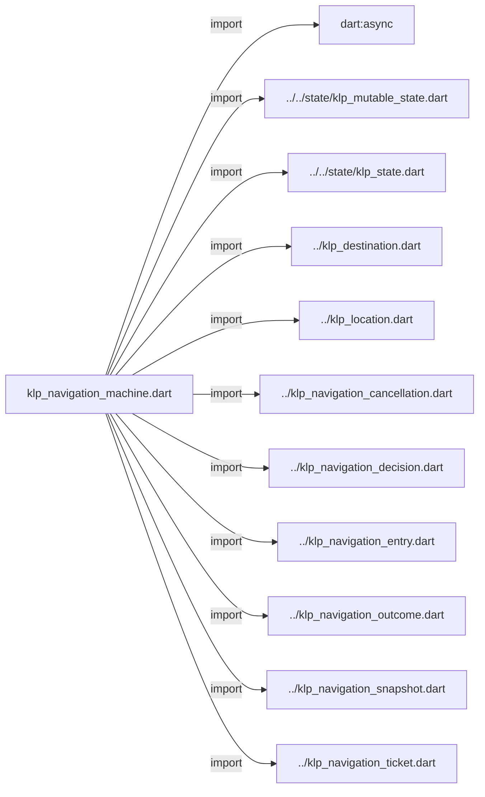
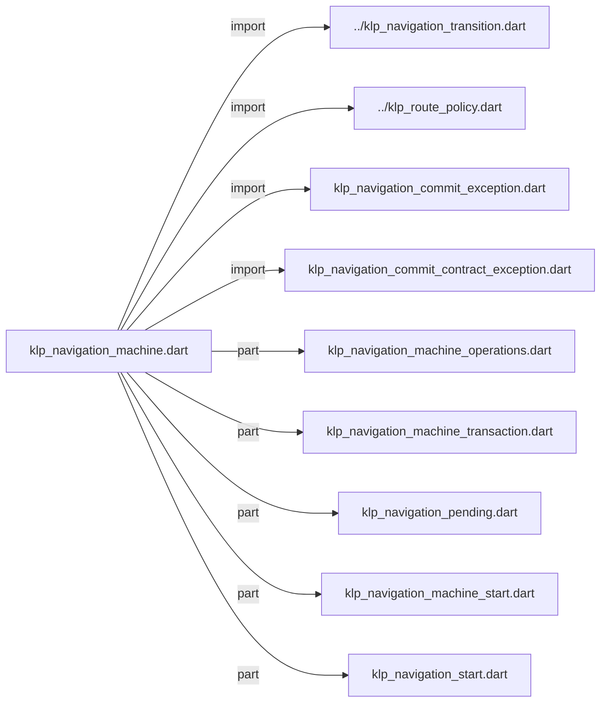
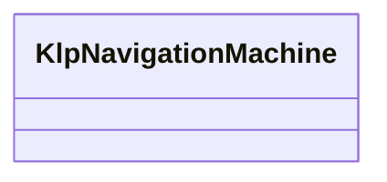

# klp_navigation_machine.dart：直接依賴與宣告架構

[回到目錄](README.md) · [來源檔案](../../../../../../lib/src/capabilities/navigation/internal/klp_navigation_machine.dart)

## 範圍

核心是 `lib/src/capabilities/navigation/internal/klp_navigation_machine.dart`。主要視角為該檔案明寫的 import／export／part；輔助視角為本檔宣告及 extends／implements／with／on 關係。只展開一層外部邊界。

## 直接依賴圖

## 依賴證據

| 關係 | 原始 directive | 來源 |
|---|---|---|
| import | <code>import &#x27;dart:async&#x27;;</code> | [lib/src/capabilities/navigation/internal/klp_navigation_machine.dart:1](../../../../../../lib/src/capabilities/navigation/internal/klp_navigation_machine.dart#L1) |
| import | <code>import &#x27;../../state/klp_mutable_state.dart&#x27;;</code> | [lib/src/capabilities/navigation/internal/klp_navigation_machine.dart:3](../../../../../../lib/src/capabilities/navigation/internal/klp_navigation_machine.dart#L3) |
| import | <code>import &#x27;../../state/klp_state.dart&#x27;;</code> | [lib/src/capabilities/navigation/internal/klp_navigation_machine.dart:4](../../../../../../lib/src/capabilities/navigation/internal/klp_navigation_machine.dart#L4) |
| import | <code>import &#x27;../klp_destination.dart&#x27;;</code> | [lib/src/capabilities/navigation/internal/klp_navigation_machine.dart:5](../../../../../../lib/src/capabilities/navigation/internal/klp_navigation_machine.dart#L5) |
| import | <code>import &#x27;../klp_location.dart&#x27;;</code> | [lib/src/capabilities/navigation/internal/klp_navigation_machine.dart:6](../../../../../../lib/src/capabilities/navigation/internal/klp_navigation_machine.dart#L6) |
| import | <code>import &#x27;../klp_navigation_cancellation.dart&#x27;;</code> | [lib/src/capabilities/navigation/internal/klp_navigation_machine.dart:7](../../../../../../lib/src/capabilities/navigation/internal/klp_navigation_machine.dart#L7) |
| import | <code>import &#x27;../klp_navigation_decision.dart&#x27;;</code> | [lib/src/capabilities/navigation/internal/klp_navigation_machine.dart:8](../../../../../../lib/src/capabilities/navigation/internal/klp_navigation_machine.dart#L8) |
| import | <code>import &#x27;../klp_navigation_entry.dart&#x27;;</code> | [lib/src/capabilities/navigation/internal/klp_navigation_machine.dart:9](../../../../../../lib/src/capabilities/navigation/internal/klp_navigation_machine.dart#L9) |
| import | <code>import &#x27;../klp_navigation_outcome.dart&#x27;;</code> | [lib/src/capabilities/navigation/internal/klp_navigation_machine.dart:10](../../../../../../lib/src/capabilities/navigation/internal/klp_navigation_machine.dart#L10) |
| import | <code>import &#x27;../klp_navigation_snapshot.dart&#x27;;</code> | [lib/src/capabilities/navigation/internal/klp_navigation_machine.dart:11](../../../../../../lib/src/capabilities/navigation/internal/klp_navigation_machine.dart#L11) |
| import | <code>import &#x27;../klp_navigation_ticket.dart&#x27;;</code> | [lib/src/capabilities/navigation/internal/klp_navigation_machine.dart:12](../../../../../../lib/src/capabilities/navigation/internal/klp_navigation_machine.dart#L12) |
| import | <code>import &#x27;../klp_navigation_transition.dart&#x27;;</code> | [lib/src/capabilities/navigation/internal/klp_navigation_machine.dart:13](../../../../../../lib/src/capabilities/navigation/internal/klp_navigation_machine.dart#L13) |
| import | <code>import &#x27;../klp_route_policy.dart&#x27;;</code> | [lib/src/capabilities/navigation/internal/klp_navigation_machine.dart:14](../../../../../../lib/src/capabilities/navigation/internal/klp_navigation_machine.dart#L14) |
| import | <code>import &#x27;klp_navigation_commit_exception.dart&#x27;;</code> | [lib/src/capabilities/navigation/internal/klp_navigation_machine.dart:15](../../../../../../lib/src/capabilities/navigation/internal/klp_navigation_machine.dart#L15) |
| import | <code>import &#x27;klp_navigation_commit_contract_exception.dart&#x27;;</code> | [lib/src/capabilities/navigation/internal/klp_navigation_machine.dart:16](../../../../../../lib/src/capabilities/navigation/internal/klp_navigation_machine.dart#L16) |
| part | <code>part &#x27;klp_navigation_machine_operations.dart&#x27;;</code> | [lib/src/capabilities/navigation/internal/klp_navigation_machine.dart:18](../../../../../../lib/src/capabilities/navigation/internal/klp_navigation_machine.dart#L18) |
| part | <code>part &#x27;klp_navigation_machine_transaction.dart&#x27;;</code> | [lib/src/capabilities/navigation/internal/klp_navigation_machine.dart:19](../../../../../../lib/src/capabilities/navigation/internal/klp_navigation_machine.dart#L19) |
| part | <code>part &#x27;klp_navigation_pending.dart&#x27;;</code> | [lib/src/capabilities/navigation/internal/klp_navigation_machine.dart:20](../../../../../../lib/src/capabilities/navigation/internal/klp_navigation_machine.dart#L20) |
| part | <code>part &#x27;klp_navigation_machine_start.dart&#x27;;</code> | [lib/src/capabilities/navigation/internal/klp_navigation_machine.dart:21](../../../../../../lib/src/capabilities/navigation/internal/klp_navigation_machine.dart#L21) |
| part | <code>part &#x27;klp_navigation_start.dart&#x27;;</code> | [lib/src/capabilities/navigation/internal/klp_navigation_machine.dart:22](../../../../../../lib/src/capabilities/navigation/internal/klp_navigation_machine.dart#L22) |

## 宣告關係圖

本組節點是本檔宣告；沒有箭頭的宣告未在此圖主張互相依賴。

## 宣告與成員證據

成員包含 public 與 private；簽章取自來源，省略函式本體與欄位初始值。`(inferred)` 表示來源未明寫型別；建構子只顯示參數部分，不含初始化列表。

### KlpNavigationMachine

ClassDeclaration · public · [lib/src/capabilities/navigation/internal/klp_navigation_machine.dart:24](../../../../../../lib/src/capabilities/navigation/internal/klp_navigation_machine.dart#L24)

<code>final class KlpNavigationMachine</code>

來源註解摘要：非視覺導覽引擎；只有提交埠能將候選堆疊交給唯一樹安裝流程。

| 成員 | 可見性 | 簽章／型別 | 來源註解摘要 | 證據 |
|---|---|---|---|---|
| field <code>commit</code> | public | <code>final void Function( KlpNavigationSnapshot, { required bool replaceRouteInformation, }) commit</code> |  | [lib/src/capabilities/navigation/internal/klp_navigation_machine.dart:30](../../../../../../lib/src/capabilities/navigation/internal/klp_navigation_machine.dart#L30) |
| field <code>_state</code> | private | <code>late final KlpMutableState&lt;KlpNavigationSnapshot&gt; _state</code> |  | [lib/src/capabilities/navigation/internal/klp_navigation_machine.dart:31](../../../../../../lib/src/capabilities/navigation/internal/klp_navigation_machine.dart#L31) |
| field <code>_policies</code> | private | <code>late Map&lt;KlpDestination&lt;Object?, Object?&gt;, KlpRoutePolicy&gt; _policies</code> |  | [lib/src/capabilities/navigation/internal/klp_navigation_machine.dart:32](../../../../../../lib/src/capabilities/navigation/internal/klp_navigation_machine.dart#L32) |
| field <code>_results</code> | private | <code>final Map&lt;String, void Function(Object?, bool, String)&gt; _results</code> |  | [lib/src/capabilities/navigation/internal/klp_navigation_machine.dart:33](../../../../../../lib/src/capabilities/navigation/internal/klp_navigation_machine.dart#L33) |
| field <code>_pending</code> | private | <code>_NavigationPending? _pending</code> |  | [lib/src/capabilities/navigation/internal/klp_navigation_machine.dart:34](../../../../../../lib/src/capabilities/navigation/internal/klp_navigation_machine.dart#L34) |
| field <code>_entrySequence</code> | private | <code>int _entrySequence</code> |  | [lib/src/capabilities/navigation/internal/klp_navigation_machine.dart:35](../../../../../../lib/src/capabilities/navigation/internal/klp_navigation_machine.dart#L35) |
| field <code>_disposed</code> | private | <code>bool _disposed</code> |  | [lib/src/capabilities/navigation/internal/klp_navigation_machine.dart:36](../../../../../../lib/src/capabilities/navigation/internal/klp_navigation_machine.dart#L36) |
| field <code>_committing</code> | private | <code>bool _committing</code> |  | [lib/src/capabilities/navigation/internal/klp_navigation_machine.dart:37](../../../../../../lib/src/capabilities/navigation/internal/klp_navigation_machine.dart#L37) |
| field <code>initialDecision</code> | public | <code>late final KlpNavigationDecision initialDecision</code> |  | [lib/src/capabilities/navigation/internal/klp_navigation_machine.dart:38](../../../../../../lib/src/capabilities/navigation/internal/klp_navigation_machine.dart#L38) |
| constructor <code>_</code> | private | <code>KlpNavigationMachine._({ required Iterable&lt;KlpRoutePolicy&gt; policies, required KlpLocation&lt;Object?&gt; initial, Iterable&lt;KlpLocation&lt;Object?&gt;&gt;? restored, required this.commit, })</code> | 尚未發布的候選機器，只能經過 start 完成守衛後交給應用擁有端。 | [lib/src/capabilities/navigation/internal/klp_navigation_machine.dart:40](../../../../../../lib/src/capabilities/navigation/internal/klp_navigation_machine.dart#L40) |
| method <code>start</code> | public | <code>static FutureOr&lt;KlpNavigationStart&gt; start({ required Iterable&lt;KlpRoutePolicy&gt; policies, required KlpLocation&lt;Object?&gt; initial, Iterable&lt;KlpLocation&lt;Object?&gt;&gt;? restored, required void Function( KlpNavigationSnapshot, { required bool replaceRouteInformation, }) commit, required KlpNavigationCancellation cancellation, })</code> | 初始政策與來源世代都有效才提交；同步政策保持同步完成。 | [lib/src/capabilities/navigation/internal/klp_navigation_machine.dart:65](../../../../../../lib/src/capabilities/navigation/internal/klp_navigation_machine.dart#L65) |
| getter <code>state</code> | public | <code>KlpState&lt;KlpNavigationSnapshot&gt; get state</code> |  | [lib/src/capabilities/navigation/internal/klp_navigation_machine.dart:78](../../../../../../lib/src/capabilities/navigation/internal/klp_navigation_machine.dart#L78) |
| getter <code>isDisposed</code> | public | <code>bool get isDisposed</code> |  | [lib/src/capabilities/navigation/internal/klp_navigation_machine.dart:79](../../../../../../lib/src/capabilities/navigation/internal/klp_navigation_machine.dart#L79) |
| getter <code>isBusy</code> | public | <code>bool get isBusy</code> |  | [lib/src/capabilities/navigation/internal/klp_navigation_machine.dart:80](../../../../../../lib/src/capabilities/navigation/internal/klp_navigation_machine.dart#L80) |
| getter <code>isCommitting</code> | public | <code>bool get isCommitting</code> |  | [lib/src/capabilities/navigation/internal/klp_navigation_machine.dart:81](../../../../../../lib/src/capabilities/navigation/internal/klp_navigation_machine.dart#L81) |
| method <code>push</code> | public | <code>KlpNavigationTicket&lt;R&gt; push&lt;R&gt;(KlpLocation&lt;R&gt; location)</code> |  | [lib/src/capabilities/navigation/internal/klp_navigation_machine.dart:83](../../../../../../lib/src/capabilities/navigation/internal/klp_navigation_machine.dart#L83) |
| method <code>pop</code> | public | <code>Future&lt;KlpNavigationDecision&gt; pop()</code> |  | [lib/src/capabilities/navigation/internal/klp_navigation_machine.dart:84](../../../../../../lib/src/capabilities/navigation/internal/klp_navigation_machine.dart#L84) |
| method <code>complete</code> | public | <code>Future&lt;KlpNavigationDecision&gt; complete&lt;R&gt;( KlpDestination&lt;Object?, R&gt; destination, R result, )</code> |  | [lib/src/capabilities/navigation/internal/klp_navigation_machine.dart:85](../../../../../../lib/src/capabilities/navigation/internal/klp_navigation_machine.dart#L85) |
| method <code>restore</code> | public | <code>Future&lt;KlpNavigationDecision&gt; restore( Iterable&lt;KlpLocation&lt;Object?&gt;&gt; locations, )</code> | 平台還原只可經由應用 session 換入完整候選堆疊，不能取得導覽控制器。 | [lib/src/capabilities/navigation/internal/klp_navigation_machine.dart:90](../../../../../../lib/src/capabilities/navigation/internal/klp_navigation_machine.dart#L90) |
| method <code>replacePolicies</code> | public | <code>void replacePolicies(Iterable&lt;KlpRoutePolicy&gt; policies)</code> | 先完整驗證，拒絕以來源更新偷偷移除仍在堆疊中的畫面。 | [lib/src/capabilities/navigation/internal/klp_navigation_machine.dart:95](../../../../../../lib/src/capabilities/navigation/internal/klp_navigation_machine.dart#L95) |
| method <code>invalidatePending</code> | public | <code>void invalidatePending([String reason = &#x27;sourceUpdated&#x27;])</code> |  | [lib/src/capabilities/navigation/internal/klp_navigation_machine.dart:106](../../../../../../lib/src/capabilities/navigation/internal/klp_navigation_machine.dart#L106) |
| method <code>dispose</code> | public | <code>void dispose()</code> |  | [lib/src/capabilities/navigation/internal/klp_navigation_machine.dart:114](../../../../../../lib/src/capabilities/navigation/internal/klp_navigation_machine.dart#L114) |
| method <code>_entry</code> | private | <code>KlpNavigationEntry _entry(KlpLocation&lt;Object?&gt; location)</code> |  | [lib/src/capabilities/navigation/internal/klp_navigation_machine.dart:130](../../../../../../lib/src/capabilities/navigation/internal/klp_navigation_machine.dart#L130) |
| method <code>_validatedPolicies</code> | private | <code>Map&lt;KlpDestination&lt;Object?, Object?&gt;, KlpRoutePolicy&gt; _validatedPolicies( Iterable&lt;KlpRoutePolicy&gt; policies, )</code> |  | [lib/src/capabilities/navigation/internal/klp_navigation_machine.dart:133](../../../../../../lib/src/capabilities/navigation/internal/klp_navigation_machine.dart#L133) |
| method <code>_validateLocation</code> | private | <code>void _validateLocation( KlpLocation&lt;Object?&gt; location, Map&lt;KlpDestination&lt;Object?, Object?&gt;, KlpRoutePolicy&gt; policies, )</code> |  | [lib/src/capabilities/navigation/internal/klp_navigation_machine.dart:148](../../../../../../lib/src/capabilities/navigation/internal/klp_navigation_machine.dart#L148) |
| method <code>_requireMutable</code> | private | <code>void _requireMutable()</code> |  | [lib/src/capabilities/navigation/internal/klp_navigation_machine.dart:162](../../../../../../lib/src/capabilities/navigation/internal/klp_navigation_machine.dart#L162) |

## 閱讀說明與限制

箭頭只表示來源明寫的靜態關係；import 不等於呼叫。未分析動態呼叫、欄位的實際物件擁有權、狀態轉移或渲染流程；型別未進行語意解析，繼承目標保留原始型別拼寫。public／private 依 Dart 名稱前綴判斷；public 宣告不代表已由 `lib/kallopis.dart` 匯出。

本頁由 `tool/architecture_atlas` 產生；編輯來源或生成工具後重新產生，避免手改本頁。
