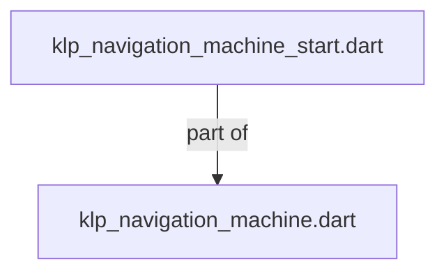

# klp_navigation_machine_start.dart：直接依賴與宣告架構

[回到目錄](README.md) · [來源檔案](../../../../../../lib/src/capabilities/navigation/internal/klp_navigation_machine_start.dart)

## 範圍

核心是 `lib/src/capabilities/navigation/internal/klp_navigation_machine_start.dart`。主要視角為該檔案明寫的 import／export／part；輔助視角為本檔宣告及 extends／implements／with／on 關係。只展開一層外部邊界。

## 直接依賴圖

## 依賴證據

| 關係 | 原始 directive | 來源 |
|---|---|---|
| part of | <code>part of &#x27;klp_navigation_machine.dart&#x27;;</code> | [lib/src/capabilities/navigation/internal/klp_navigation_machine_start.dart:1](../../../../../../lib/src/capabilities/navigation/internal/klp_navigation_machine_start.dart#L1) |

## 宣告關係圖

本檔沒有 class／enum／mixin／extension 宣告；頂層函式、變數與 typedef 見下表。

## 宣告與成員證據

成員包含 public 與 private；簽章取自來源，省略函式本體與欄位初始值。`(inferred)` 表示來源未明寫型別；建構子只顯示參數部分，不含初始化列表。

### _startNavigation

FunctionDeclaration · private · [lib/src/capabilities/navigation/internal/klp_navigation_machine_start.dart:3](../../../../../../lib/src/capabilities/navigation/internal/klp_navigation_machine_start.dart#L3)

<code>FutureOr&lt;KlpNavigationStart&gt; _startNavigation( Iterable&lt;KlpRoutePolicy&gt; policies, KlpLocation&lt;Object?&gt; initial, Iterable&lt;KlpLocation&lt;Object?&gt;&gt;? restored, void Function(KlpNavigationSnapshot, {required bool replaceRouteInformation}) commit, KlpNavigationCancellation cancellation, )</code>

### _runInitialGuards

FunctionDeclaration · private · [lib/src/capabilities/navigation/internal/klp_navigation_machine_start.dart:41](../../../../../../lib/src/capabilities/navigation/internal/klp_navigation_machine_start.dart#L41)

<code>FutureOr&lt;KlpNavigationStart&gt; _runInitialGuards( KlpNavigationMachine machine, KlpNavigationCancellation cancellation, [ int index = 0, ])</code>

### _awaitInitialGuard

FunctionDeclaration · private · [lib/src/capabilities/navigation/internal/klp_navigation_machine_start.dart:77](../../../../../../lib/src/capabilities/navigation/internal/klp_navigation_machine_start.dart#L77)

<code>Future&lt;KlpNavigationStart&gt; _awaitInitialGuard( KlpNavigationMachine machine, KlpNavigationCancellation cancellation, Future&lt;bool&gt; guard, int index, )</code>

### _commitStart

FunctionDeclaration · private · [lib/src/capabilities/navigation/internal/klp_navigation_machine_start.dart:109](../../../../../../lib/src/capabilities/navigation/internal/klp_navigation_machine_start.dart#L109)

<code>KlpNavigationStart _commitStart( KlpNavigationMachine machine, KlpNavigationCancellation cancellation, )</code>

### _rejectStart

FunctionDeclaration · private · [lib/src/capabilities/navigation/internal/klp_navigation_machine_start.dart:144](../../../../../../lib/src/capabilities/navigation/internal/klp_navigation_machine_start.dart#L144)

<code>KlpNavigationStart _rejectStart( KlpNavigationMachine machine, KlpNavigationOutcome&lt;void&gt; outcome, )</code>

## 閱讀說明與限制

箭頭只表示來源明寫的靜態關係；import 不等於呼叫。未分析動態呼叫、欄位的實際物件擁有權、狀態轉移或渲染流程；型別未進行語意解析，繼承目標保留原始型別拼寫。public／private 依 Dart 名稱前綴判斷；public 宣告不代表已由 `lib/kallopis.dart` 匯出。

本頁由 `tool/architecture_atlas` 產生；編輯來源或生成工具後重新產生，避免手改本頁。
