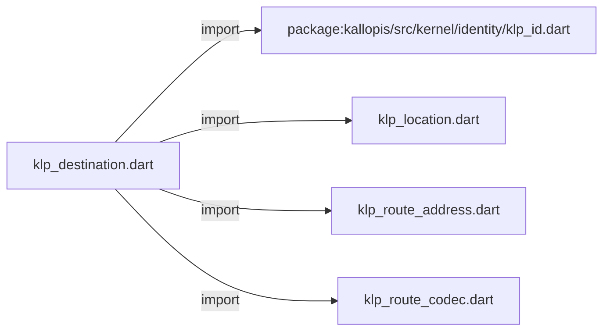
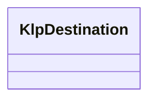

# klp_destination.dart：直接依賴與宣告架構

[回到目錄](README.md) · [來源檔案](../../../../../lib/src/capabilities/navigation/klp_destination.dart)

## 範圍

核心是 `lib/src/capabilities/navigation/klp_destination.dart`。主要視角為該檔案明寫的 import／export／part；輔助視角為本檔宣告及 extends／implements／with／on 關係。只展開一層外部邊界。

## 直接依賴圖

## 依賴證據

| 關係 | 原始 directive | 來源 |
|---|---|---|
| import | <code>import &#x27;package:kallopis/src/kernel/identity/klp_id.dart&#x27;;</code> | [lib/src/capabilities/navigation/klp_destination.dart:1](../../../../../lib/src/capabilities/navigation/klp_destination.dart#L1) |
| import | <code>import &#x27;klp_location.dart&#x27;;</code> | [lib/src/capabilities/navigation/klp_destination.dart:2](../../../../../lib/src/capabilities/navigation/klp_destination.dart#L2) |
| import | <code>import &#x27;klp_route_address.dart&#x27;;</code> | [lib/src/capabilities/navigation/klp_destination.dart:3](../../../../../lib/src/capabilities/navigation/klp_destination.dart#L3) |
| import | <code>import &#x27;klp_route_codec.dart&#x27;;</code> | [lib/src/capabilities/navigation/klp_destination.dart:4](../../../../../lib/src/capabilities/navigation/klp_destination.dart#L4) |

## 宣告關係圖

本組節點是本檔宣告；沒有箭頭的宣告未在此圖主張互相依賴。

## 宣告與成員證據

成員包含 public 與 private；簽章取自來源，省略函式本體與欄位初始值。`(inferred)` 表示來源未明寫型別；建構子只顯示參數部分，不含初始化列表。

### KlpDestination

ClassDeclaration · public · [lib/src/capabilities/navigation/klp_destination.dart:6](../../../../../lib/src/capabilities/navigation/klp_destination.dart#L6)

<code>final class KlpDestination&lt;P, R&gt;</code>

來源註解摘要：目的地保留建立當時的型別驗證，不因泛型向上轉型而放寬。

| 成員 | 可見性 | 簽章／型別 | 來源註解摘要 | 證據 |
|---|---|---|---|---|
| field <code>id</code> | public | <code>final KlpId id</code> |  | [lib/src/capabilities/navigation/klp_destination.dart:8](../../../../../lib/src/capabilities/navigation/klp_destination.dart#L8) |
| field <code>_parameters</code> | private | <code>final bool Function(Object?) _parameters</code> |  | [lib/src/capabilities/navigation/klp_destination.dart:9](../../../../../lib/src/capabilities/navigation/klp_destination.dart#L9) |
| field <code>_result</code> | private | <code>final bool Function(Object?) _result</code> |  | [lib/src/capabilities/navigation/klp_destination.dart:10](../../../../../lib/src/capabilities/navigation/klp_destination.dart#L10) |
| field <code>_encode</code> | private | <code>final Map&lt;String, String&gt; Function(Object?)? _encode</code> |  | [lib/src/capabilities/navigation/klp_destination.dart:11](../../../../../lib/src/capabilities/navigation/klp_destination.dart#L11) |
| field <code>_decode</code> | private | <code>final Object? Function(Map&lt;String, String&gt;)? _decode</code> |  | [lib/src/capabilities/navigation/klp_destination.dart:12](../../../../../lib/src/capabilities/navigation/klp_destination.dart#L12) |
| constructor <code>KlpDestination</code> | public | <code>KlpDestination(this.id, {KlpRouteCodec&lt;P&gt;? codec})</code> |  | [lib/src/capabilities/navigation/klp_destination.dart:14](../../../../../lib/src/capabilities/navigation/klp_destination.dart#L14) |
| method <code>acceptsParameters</code> | public | <code>bool acceptsParameters(Object? value)</code> |  | [lib/src/capabilities/navigation/klp_destination.dart:28](../../../../../lib/src/capabilities/navigation/klp_destination.dart#L28) |
| method <code>acceptsResult</code> | public | <code>bool acceptsResult(Object? value)</code> |  | [lib/src/capabilities/navigation/klp_destination.dart:29](../../../../../lib/src/capabilities/navigation/klp_destination.dart#L29) |
| getter <code>supportsRestoration</code> | public | <code>bool get supportsRestoration</code> |  | [lib/src/capabilities/navigation/klp_destination.dart:30](../../../../../lib/src/capabilities/navigation/klp_destination.dart#L30) |
| method <code>location</code> | public | <code>KlpLocation&lt;R&gt; location(P parameters)</code> |  | [lib/src/capabilities/navigation/klp_destination.dart:32](../../../../../lib/src/capabilities/navigation/klp_destination.dart#L32) |
| method <code>encodeAddress</code> | public | <code>KlpRouteAddress encodeAddress(Object? parameters)</code> |  | [lib/src/capabilities/navigation/klp_destination.dart:44](../../../../../lib/src/capabilities/navigation/klp_destination.dart#L44) |
| method <code>decodeAddress</code> | public | <code>KlpLocation&lt;Object?&gt; decodeAddress(KlpRouteAddress address)</code> |  | [lib/src/capabilities/navigation/klp_destination.dart:60](../../../../../lib/src/capabilities/navigation/klp_destination.dart#L60) |

## 閱讀說明與限制

箭頭只表示來源明寫的靜態關係；import 不等於呼叫。未分析動態呼叫、欄位的實際物件擁有權、狀態轉移或渲染流程；型別未進行語意解析，繼承目標保留原始型別拼寫。public／private 依 Dart 名稱前綴判斷；public 宣告不代表已由 `lib/kallopis.dart` 匯出。

本頁由 `tool/architecture_atlas` 產生；編輯來源或生成工具後重新產生，避免手改本頁。
