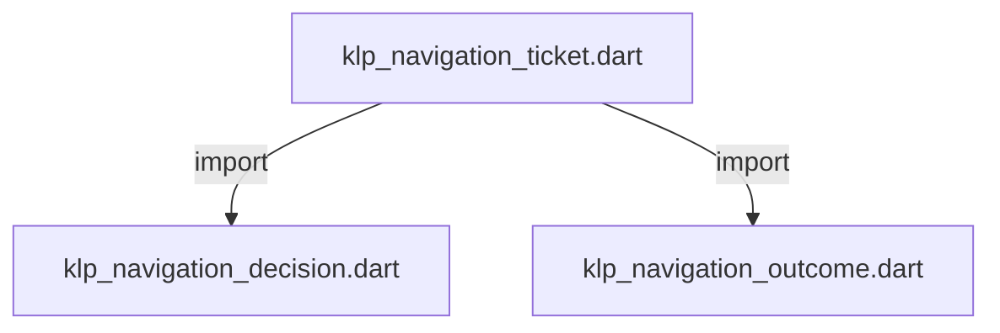
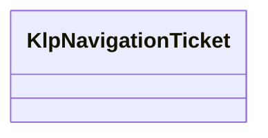

# klp_navigation_ticket.dart：直接依賴與宣告架構

[回到目錄](README.md) · [來源檔案](../../../../../lib/src/capabilities/navigation/klp_navigation_ticket.dart)

## 範圍

核心是 `lib/src/capabilities/navigation/klp_navigation_ticket.dart`。主要視角為該檔案明寫的 import／export／part；輔助視角為本檔宣告及 extends／implements／with／on 關係。只展開一層外部邊界。

## 直接依賴圖

## 依賴證據

| 關係 | 原始 directive | 來源 |
|---|---|---|
| import | <code>import &#x27;klp_navigation_decision.dart&#x27;;</code> | [lib/src/capabilities/navigation/klp_navigation_ticket.dart:1](../../../../../lib/src/capabilities/navigation/klp_navigation_ticket.dart#L1) |
| import | <code>import &#x27;klp_navigation_outcome.dart&#x27;;</code> | [lib/src/capabilities/navigation/klp_navigation_ticket.dart:2](../../../../../lib/src/capabilities/navigation/klp_navigation_ticket.dart#L2) |

## 宣告關係圖

本組節點是本檔宣告；沒有箭頭的宣告未在此圖主張互相依賴。

## 宣告與成員證據

成員包含 public 與 private；簽章取自來源，省略函式本體與欄位初始值。`(inferred)` 表示來源未明寫型別；建構子只顯示參數部分，不含初始化列表。

### KlpNavigationTicket

ClassDeclaration · public · [lib/src/capabilities/navigation/klp_navigation_ticket.dart:4](../../../../../lib/src/capabilities/navigation/klp_navigation_ticket.dart#L4)

<code>final class KlpNavigationTicket&lt;R&gt;</code>

來源註解摘要：接受結果與畫面返回結果各自完成一次；取消只影響尚未提交的請求。

| 成員 | 可見性 | 簽章／型別 | 來源註解摘要 | 證據 |
|---|---|---|---|---|
| field <code>decision</code> | public | <code>final Future&lt;KlpNavigationDecision&gt; decision</code> |  | [lib/src/capabilities/navigation/klp_navigation_ticket.dart:7](../../../../../lib/src/capabilities/navigation/klp_navigation_ticket.dart#L7) |
| field <code>result</code> | public | <code>final Future&lt;KlpNavigationOutcome&lt;R&gt;&gt; result</code> |  | [lib/src/capabilities/navigation/klp_navigation_ticket.dart:8](../../../../../lib/src/capabilities/navigation/klp_navigation_ticket.dart#L8) |
| field <code>_cancel</code> | private | <code>final void Function() _cancel</code> |  | [lib/src/capabilities/navigation/klp_navigation_ticket.dart:9](../../../../../lib/src/capabilities/navigation/klp_navigation_ticket.dart#L9) |
| constructor <code>KlpNavigationTicket</code> | public | <code>const KlpNavigationTicket(this.decision, this.result, void Function() cancel)</code> |  | [lib/src/capabilities/navigation/klp_navigation_ticket.dart:11](../../../../../lib/src/capabilities/navigation/klp_navigation_ticket.dart#L11) |
| method <code>cancel</code> | public | <code>void cancel()</code> |  | [lib/src/capabilities/navigation/klp_navigation_ticket.dart:13](../../../../../lib/src/capabilities/navigation/klp_navigation_ticket.dart#L13) |

## 閱讀說明與限制

箭頭只表示來源明寫的靜態關係；import 不等於呼叫。未分析動態呼叫、欄位的實際物件擁有權、狀態轉移或渲染流程；型別未進行語意解析，繼承目標保留原始型別拼寫。public／private 依 Dart 名稱前綴判斷；public 宣告不代表已由 `lib/kallopis.dart` 匯出。

本頁由 `tool/architecture_atlas` 產生；編輯來源或生成工具後重新產生，避免手改本頁。
