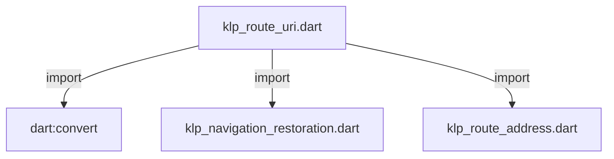

# klp_route_uri.dart：直接依賴與宣告架構

[回到目錄](README.md) · [來源檔案](../../../../../lib/src/capabilities/navigation/klp_route_uri.dart)

## 範圍

核心是 `lib/src/capabilities/navigation/klp_route_uri.dart`。主要視角為該檔案明寫的 import／export／part；輔助視角為本檔宣告及 extends／implements／with／on 關係。只展開一層外部邊界。

## 直接依賴圖

## 依賴證據

| 關係 | 原始 directive | 來源 |
|---|---|---|
| import | <code>import &#x27;dart:convert&#x27;;</code> | [lib/src/capabilities/navigation/klp_route_uri.dart:1](../../../../../lib/src/capabilities/navigation/klp_route_uri.dart#L1) |
| import | <code>import &#x27;klp_navigation_restoration.dart&#x27;;</code> | [lib/src/capabilities/navigation/klp_route_uri.dart:3](../../../../../lib/src/capabilities/navigation/klp_route_uri.dart#L3) |
| import | <code>import &#x27;klp_route_address.dart&#x27;;</code> | [lib/src/capabilities/navigation/klp_route_uri.dart:4](../../../../../lib/src/capabilities/navigation/klp_route_uri.dart#L4) |

## 宣告關係圖

本組節點是本檔宣告；沒有箭頭的宣告未在此圖主張互相依賴。

## 宣告與成員證據

成員包含 public 與 private；簽章取自來源，省略函式本體與欄位初始值。`(inferred)` 表示來源未明寫型別；建構子只顯示參數部分，不含初始化列表。

### KlpRouteUri

ClassDeclaration · public · [lib/src/capabilities/navigation/klp_route_uri.dart:6](../../../../../lib/src/capabilities/navigation/klp_route_uri.dart#L6)

<code>final class KlpRouteUri</code>

來源註解摘要：Kallopis 路由的預設 URI 資料格式；支援單頁進入與本庫完整 stack 回報。

| 成員 | 可見性 | 簽章／型別 | 來源註解摘要 | 證據 |
|---|---|---|---|---|
| field <code>_stackParameter</code> | private | <code>static const String _stackParameter</code> |  | [lib/src/capabilities/navigation/klp_route_uri.dart:8](../../../../../lib/src/capabilities/navigation/klp_route_uri.dart#L8) |
| method <code>encode</code> | public | <code>static Uri encode({ required String routerId, required KlpRouteAddress address, })</code> |  | [lib/src/capabilities/navigation/klp_route_uri.dart:10](../../../../../lib/src/capabilities/navigation/klp_route_uri.dart#L10) |
| method <code>encodeRestoration</code> | public | <code>static Uri encodeRestoration(KlpNavigationRestoration restoration)</code> | 本庫回報的完整 stack 保留在單一受控欄位，避免和 route 參數混用。 | [lib/src/capabilities/navigation/klp_route_uri.dart:22](../../../../../lib/src/capabilities/navigation/klp_route_uri.dart#L22) |
| method <code>decode</code> | public | <code>static KlpNavigationRestoration? decode(Uri uri)</code> | 無法辨識的 URI 交還平台，避免攔截宿主或其他框架的位址。 | [lib/src/capabilities/navigation/klp_route_uri.dart:42](../../../../../lib/src/capabilities/navigation/klp_route_uri.dart#L42) |
| method <code>_decodeRestoration</code> | private | <code>static KlpNavigationRestoration? _decodeRestoration( String routerId, Map&lt;String, List&lt;String&gt;&gt; parameters, )</code> |  | [lib/src/capabilities/navigation/klp_route_uri.dart:76](../../../../../lib/src/capabilities/navigation/klp_route_uri.dart#L76) |
| method <code>_validateRouterId</code> | private | <code>static void _validateRouterId(String routerId)</code> |  | [lib/src/capabilities/navigation/klp_route_uri.dart:122](../../../../../lib/src/capabilities/navigation/klp_route_uri.dart#L122) |
| method <code>_validateDestinationId</code> | private | <code>static void _validateDestinationId(String destinationId)</code> |  | [lib/src/capabilities/navigation/klp_route_uri.dart:132](../../../../../lib/src/capabilities/navigation/klp_route_uri.dart#L132) |

## 閱讀說明與限制

箭頭只表示來源明寫的靜態關係；import 不等於呼叫。未分析動態呼叫、欄位的實際物件擁有權、狀態轉移或渲染流程；型別未進行語意解析，繼承目標保留原始型別拼寫。public／private 依 Dart 名稱前綴判斷；public 宣告不代表已由 `lib/kallopis.dart` 匯出。

本頁由 `tool/architecture_atlas` 產生；編輯來源或生成工具後重新產生，避免手改本頁。
