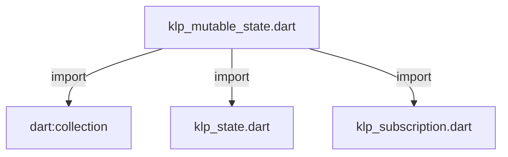
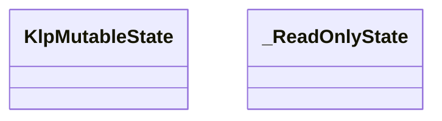
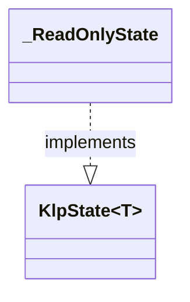

# klp_mutable_state.dart：直接依賴與宣告架構

[回到目錄](README.md) · [來源檔案](../../../../../lib/src/capabilities/state/klp_mutable_state.dart)

## 範圍

核心是 `lib/src/capabilities/state/klp_mutable_state.dart`。主要視角為該檔案明寫的 import／export／part；輔助視角為本檔宣告及 extends／implements／with／on 關係。只展開一層外部邊界。

## 直接依賴圖

## 依賴證據

| 關係 | 原始 directive | 來源 |
|---|---|---|
| import | <code>import &#x27;dart:collection&#x27;;</code> | [lib/src/capabilities/state/klp_mutable_state.dart:1](../../../../../lib/src/capabilities/state/klp_mutable_state.dart#L1) |
| import | <code>import &#x27;klp_state.dart&#x27;;</code> | [lib/src/capabilities/state/klp_mutable_state.dart:3](../../../../../lib/src/capabilities/state/klp_mutable_state.dart#L3) |
| import | <code>import &#x27;klp_subscription.dart&#x27;;</code> | [lib/src/capabilities/state/klp_mutable_state.dart:4](../../../../../lib/src/capabilities/state/klp_mutable_state.dart#L4) |

## 宣告關係圖

本組節點是本檔宣告；沒有箭頭的宣告未在此圖主張互相依賴。

## 宣告與成員證據

成員包含 public 與 private；簽章取自來源，省略函式本體與欄位初始值。`(inferred)` 表示來源未明寫型別；建構子只顯示參數部分，不含初始化列表。

### KlpMutableState

ClassDeclaration · public · [lib/src/capabilities/state/klp_mutable_state.dart:6](../../../../../lib/src/capabilities/state/klp_mutable_state.dart#L6)

<code>final class KlpMutableState&lt;T&gt;</code>

來源註解摘要：擁有者保留此物件，借用端只能取得 [readOnly]。 值應採不可變資料；相等值不通知。通知內的更新依序排入佇列， 新訂閱從下一次通知開始，取消的訂閱不再收到尚未派送的通知。

| 成員 | 可見性 | 簽章／型別 | 來源註解摘要 | 證據 |
|---|---|---|---|---|
| field <code>_value</code> | private | <code>T _value</code> |  | [lib/src/capabilities/state/klp_mutable_state.dart:12](../../../../../lib/src/capabilities/state/klp_mutable_state.dart#L12) |
| field <code>_isDisposed</code> | private | <code>bool _isDisposed</code> |  | [lib/src/capabilities/state/klp_mutable_state.dart:13](../../../../../lib/src/capabilities/state/klp_mutable_state.dart#L13) |
| field <code>_isNotifying</code> | private | <code>bool _isNotifying</code> |  | [lib/src/capabilities/state/klp_mutable_state.dart:14](../../../../../lib/src/capabilities/state/klp_mutable_state.dart#L14) |
| field <code>_listeners</code> | private | <code>final (inferred) _listeners</code> |  | [lib/src/capabilities/state/klp_mutable_state.dart:15](../../../../../lib/src/capabilities/state/klp_mutable_state.dart#L15) |
| field <code>_pending</code> | private | <code>final (inferred) _pending</code> |  | [lib/src/capabilities/state/klp_mutable_state.dart:16](../../../../../lib/src/capabilities/state/klp_mutable_state.dart#L16) |
| field <code>readOnly</code> | public | <code>late final KlpState&lt;T&gt; readOnly</code> |  | [lib/src/capabilities/state/klp_mutable_state.dart:17](../../../../../lib/src/capabilities/state/klp_mutable_state.dart#L17) |
| constructor <code>KlpMutableState</code> | public | <code>KlpMutableState(T value)</code> |  | [lib/src/capabilities/state/klp_mutable_state.dart:19](../../../../../lib/src/capabilities/state/klp_mutable_state.dart#L19) |
| getter <code>isDisposed</code> | public | <code>bool get isDisposed</code> |  | [lib/src/capabilities/state/klp_mutable_state.dart:21](../../../../../lib/src/capabilities/state/klp_mutable_state.dart#L21) |
| getter <code>value</code> | public | <code>T get value</code> |  | [lib/src/capabilities/state/klp_mutable_state.dart:23](../../../../../lib/src/capabilities/state/klp_mutable_state.dart#L23) |
| setter <code>value</code> | public | <code>set value(T next)</code> |  | [lib/src/capabilities/state/klp_mutable_state.dart:28](../../../../../lib/src/capabilities/state/klp_mutable_state.dart#L28) |
| method <code>dispose</code> | public | <code>void dispose()</code> |  | [lib/src/capabilities/state/klp_mutable_state.dart:37](../../../../../lib/src/capabilities/state/klp_mutable_state.dart#L37) |
| method <code>_subscribe</code> | private | <code>KlpSubscription _subscribe(void Function(T) listener)</code> |  | [lib/src/capabilities/state/klp_mutable_state.dart:47](../../../../../lib/src/capabilities/state/klp_mutable_state.dart#L47) |
| method <code>_drain</code> | private | <code>void _drain()</code> |  | [lib/src/capabilities/state/klp_mutable_state.dart:55](../../../../../lib/src/capabilities/state/klp_mutable_state.dart#L55) |
| method <code>_requireActive</code> | private | <code>void _requireActive()</code> |  | [lib/src/capabilities/state/klp_mutable_state.dart:89](../../../../../lib/src/capabilities/state/klp_mutable_state.dart#L89) |

### _ReadOnlyState

ClassDeclaration · private · [lib/src/capabilities/state/klp_mutable_state.dart:96](../../../../../lib/src/capabilities/state/klp_mutable_state.dart#L96)

<code>final class _ReadOnlyState&lt;T&gt; implements KlpState&lt;T&gt;</code>

- `implements` → <code>KlpState&lt;T&gt;</code>：[lib/src/capabilities/state/klp_mutable_state.dart:96](../../../../../lib/src/capabilities/state/klp_mutable_state.dart#L96)

| 成員 | 可見性 | 簽章／型別 | 來源註解摘要 | 證據 |
|---|---|---|---|---|
| field <code>_owner</code> | private | <code>final KlpMutableState&lt;T&gt; _owner</code> |  | [lib/src/capabilities/state/klp_mutable_state.dart:98](../../../../../lib/src/capabilities/state/klp_mutable_state.dart#L98) |
| constructor <code>_ReadOnlyState</code> | private | <code>_ReadOnlyState(this._owner)</code> |  | [lib/src/capabilities/state/klp_mutable_state.dart:100](../../../../../lib/src/capabilities/state/klp_mutable_state.dart#L100) |
| getter <code>value</code> | public | <code>T get value</code> |  | [lib/src/capabilities/state/klp_mutable_state.dart:102](../../../../../lib/src/capabilities/state/klp_mutable_state.dart#L102) |
| method <code>subscribe</code> | public | <code>KlpSubscription subscribe(void Function(T) listener)</code> |  | [lib/src/capabilities/state/klp_mutable_state.dart:105](../../../../../lib/src/capabilities/state/klp_mutable_state.dart#L105) |

## 閱讀說明與限制

箭頭只表示來源明寫的靜態關係；import 不等於呼叫。未分析動態呼叫、欄位的實際物件擁有權、狀態轉移或渲染流程；型別未進行語意解析，繼承目標保留原始型別拼寫。public／private 依 Dart 名稱前綴判斷；public 宣告不代表已由 `lib/kallopis.dart` 匯出。

本頁由 `tool/architecture_atlas` 產生；編輯來源或生成工具後重新產生，避免手改本頁。
