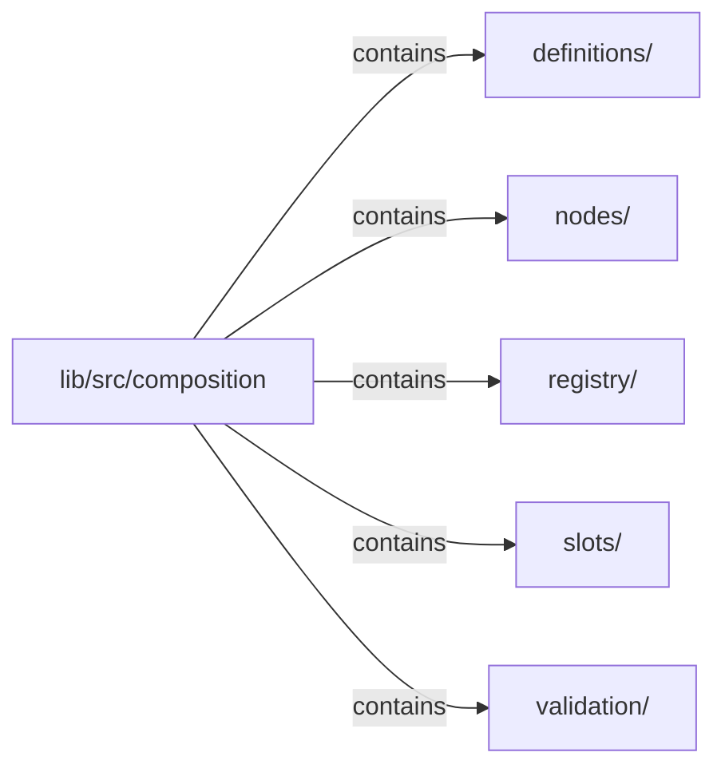

# lib/src/composition：架構分析入口

[上一層](../README.md)

## 範圍

閱讀 `lib/src/composition` 的直接子目錄與 Dart 檔案。結構圖表示實際檔案包含關係；依賴圖表示本層檔案明寫的 directives。每個檔案頁另列直接依賴、宣告、欄位、方法、建構子及行號證據。

## 模組閱讀重點

## 分析入口

Kallopis 純 Dart 結構契約。`nodes/klp_node.dart` 是宣告介面；`definitions/klp_definition.dart` 固定註冊型別資格與語意 owner；`registry/klp_registry.dart` 驗證依賴、風格引用與結構；`validation/` 保存不再讀取消費端 getter 的不可變快照。Foundation 展開及渲染由上層 runtime 與 renderer 負責。

`nodes/klp_composite_node.dart` 收窄唯一 children 輸入為 final `slots/klp_children.dart`。`KlpSlot<C>` 以物件身分、型別資格與數量限制描述插槽；assignment 只能由 slot 建立。定義保存 schema，實例必須完整且依序配置。

`validation/internal/klp_tree_capture.dart` 是 registry 與 runtime 共用的單次擷取流程：驗證 slot 身分、順序、覆蓋及資格後，公開快照只保存中立 metadata 與 `KlpValidatedSlot` 子項範圍；原始節點映射只供本次內部編譯。`slots/klp_screen_body.dart` 定義 screen child 資格；rail item 的專用資格仍由 rail 功能契約擁有。Screen、rail 與外部複合元件共用此驗證路徑。

放置快照唯一保存 `KlpPlacementId` 與完整子放置識別，local `id`／`childrenIds` 是衍生 getter。`nodes/internal/klp_scope_boundary.dart` 是本庫封閉的 scope 授權接點，capture 只對該型別延伸作用域；沒有消費端開 scope 的布林參數。不同 entry 可有相同 local id，同一 scope 仍禁止重複；來源索引直接使用結構化識別，不串接路徑字串。

依賴方向：registry 使用 definition、node、validation、styling 解析與 kernel 診斷；不依賴 Flutter、Klp 元件或可變全域 registry。語意依賴自動納入定義相依，未引用的錯誤用途也在註冊時拒絕。通用合格子插槽已接入應用流程，仍不代表完整容器能力已完成。

## 本層直接依賴圖

箭頭以本層 Dart 檔案明寫的 directive 彙總到目標所在目錄或外部套件邊界；不遞迴將子目錄依賴算入本層。相同目標的不同 directive 類型分開計數。

本層檔案未宣告跨目錄依賴；子目錄依賴請循下一層入口閱讀。

| 目標邊界 | 關係 | directive 數 | 第一筆來源證據 |
|---|---|---|---|
| 無 | — | 0 | 來源清單見本層檔案 |

## 目錄結構圖

## 子目錄

| 目錄 | 導航 | 來源證據 |
|---|---|---|
| `definitions/` | [架構入口](definitions/README.md) | [來源目錄](../../../../lib/src/composition/definitions) |
| `nodes/` | [架構入口](nodes/README.md) | [來源目錄](../../../../lib/src/composition/nodes) |
| `registry/` | [架構入口](registry/README.md) | [來源目錄](../../../../lib/src/composition/registry) |
| `slots/` | [架構入口](slots/README.md) | [來源目錄](../../../../lib/src/composition/slots) |
| `validation/` | [架構入口](validation/README.md) | [來源目錄](../../../../lib/src/composition/validation) |

## 本層檔案

| 檔案 | 宣告 | 細節 | 來源證據 |
|---|---|---|---|
| 無 | 本層沒有 Dart 檔案 | — | — |

## 閱讀說明

箭頭只表示來源明寫的靜態關係；import 不等於呼叫。未分析動態呼叫、欄位的實際物件擁有權、狀態轉移或渲染流程；型別未進行語意解析，繼承目標保留原始型別拼寫。public／private 依 Dart 名稱前綴判斷；public 宣告不代表已由 `lib/kallopis.dart` 匯出。

本頁的目錄與檔案由來源清冊產生；`manifest.json` 位於本圖集根目錄，可核對 SHA-256 與覆蓋數。人工模組摘要存於 `tool/architecture_atlas/briefs/`，重新生成時保留。
