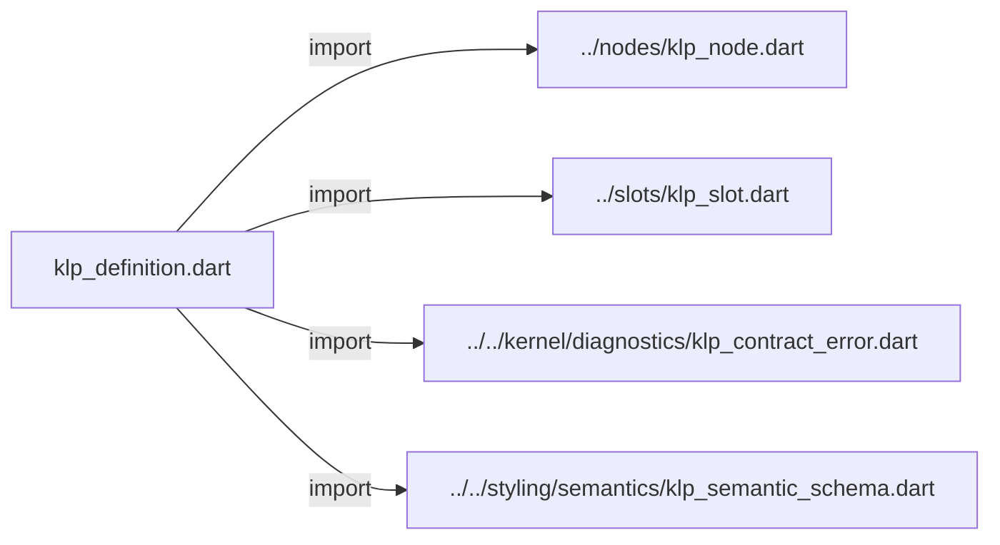
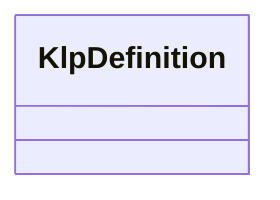

# klp_definition.dart：直接依賴與宣告架構

[回到目錄](README.md) · [來源檔案](../../../../../lib/src/composition/definitions/klp_definition.dart)

## 範圍

核心是 `lib/src/composition/definitions/klp_definition.dart`。主要視角為該檔案明寫的 import／export／part；輔助視角為本檔宣告及 extends／implements／with／on 關係。只展開一層外部邊界。

## 直接依賴圖

## 依賴證據

| 關係 | 原始 directive | 來源 |
|---|---|---|
| import | <code>import &#x27;../nodes/klp_node.dart&#x27;;</code> | [lib/src/composition/definitions/klp_definition.dart:1](../../../../../lib/src/composition/definitions/klp_definition.dart#L1) |
| import | <code>import &#x27;../slots/klp_slot.dart&#x27;;</code> | [lib/src/composition/definitions/klp_definition.dart:2](../../../../../lib/src/composition/definitions/klp_definition.dart#L2) |
| import | <code>import &#x27;../../kernel/diagnostics/klp_contract_error.dart&#x27;;</code> | [lib/src/composition/definitions/klp_definition.dart:3](../../../../../lib/src/composition/definitions/klp_definition.dart#L3) |
| import | <code>import &#x27;../../styling/semantics/klp_semantic_schema.dart&#x27;;</code> | [lib/src/composition/definitions/klp_definition.dart:4](../../../../../lib/src/composition/definitions/klp_definition.dart#L4) |

## 宣告關係圖

本組節點是本檔宣告；沒有箭頭的宣告未在此圖主張互相依賴。

## 宣告與成員證據

成員包含 public 與 private；簽章取自來源，省略函式本體與欄位初始值。`(inferred)` 表示來源未明寫型別；建構子只顯示參數部分，不含初始化列表。

### KlpDefinition

ClassDeclaration · public · [lib/src/composition/definitions/klp_definition.dart:6](../../../../../lib/src/composition/definitions/klp_definition.dart#L6)

<code>final class KlpDefinition&lt;T extends KlpNode&gt;</code>

來源註解摘要：不可變的節點定義；資格只由型別決定，不能注入驗證演算法。

| 成員 | 可見性 | 簽章／型別 | 來源註解摘要 | 證據 |
|---|---|---|---|---|
| field <code>id</code> | public | <code>final String id</code> |  | [lib/src/composition/definitions/klp_definition.dart:9](../../../../../lib/src/composition/definitions/klp_definition.dart#L9) |
| field <code>dependencies</code> | public | <code>final List&lt;String&gt; dependencies</code> |  | [lib/src/composition/definitions/klp_definition.dart:10](../../../../../lib/src/composition/definitions/klp_definition.dart#L10) |
| field <code>semantics</code> | public | <code>final KlpSemanticSchema semantics</code> |  | [lib/src/composition/definitions/klp_definition.dart:11](../../../../../lib/src/composition/definitions/klp_definition.dart#L11) |
| field <code>slots</code> | public | <code>final List&lt;KlpSlot&lt;KlpNode&gt;&gt; slots</code> |  | [lib/src/composition/definitions/klp_definition.dart:12](../../../../../lib/src/composition/definitions/klp_definition.dart#L12) |
| constructor <code>KlpDefinition</code> | public | <code>KlpDefinition(this.id, {Iterable&lt;String&gt; dependencies = const [], KlpSemanticSchema? semantics, Iterable&lt;KlpSlot&lt;KlpNode&gt;&gt; slots = const []})</code> |  | [lib/src/composition/definitions/klp_definition.dart:14](../../../../../lib/src/composition/definitions/klp_definition.dart#L14) |
| method <code>accepts</code> | public | <code>bool accepts(KlpNode node)</code> |  | [lib/src/composition/definitions/klp_definition.dart:24](../../../../../lib/src/composition/definitions/klp_definition.dart#L24) |

## 閱讀說明與限制

箭頭只表示來源明寫的靜態關係；import 不等於呼叫。未分析動態呼叫、欄位的實際物件擁有權、狀態轉移或渲染流程；型別未進行語意解析，繼承目標保留原始型別拼寫。public／private 依 Dart 名稱前綴判斷；public 宣告不代表已由 `lib/kallopis.dart` 匯出。

本頁由 `tool/architecture_atlas` 產生；編輯來源或生成工具後重新產生，避免手改本頁。
