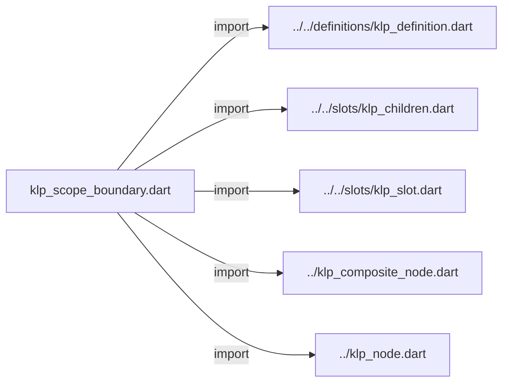
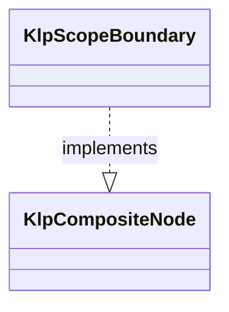

# klp_scope_boundary.dart：直接依賴與宣告架構

[回到目錄](README.md) · [來源檔案](../../../../../../lib/src/composition/nodes/internal/klp_scope_boundary.dart)

## 範圍

核心是 `lib/src/composition/nodes/internal/klp_scope_boundary.dart`。主要視角為該檔案明寫的 import／export／part；輔助視角為本檔宣告及 extends／implements／with／on 關係。只展開一層外部邊界。

## 直接依賴圖

## 依賴證據

| 關係 | 原始 directive | 來源 |
|---|---|---|
| import | <code>import &#x27;../../definitions/klp_definition.dart&#x27;;</code> | [lib/src/composition/nodes/internal/klp_scope_boundary.dart:1](../../../../../../lib/src/composition/nodes/internal/klp_scope_boundary.dart#L1) |
| import | <code>import &#x27;../../slots/klp_children.dart&#x27;;</code> | [lib/src/composition/nodes/internal/klp_scope_boundary.dart:2](../../../../../../lib/src/composition/nodes/internal/klp_scope_boundary.dart#L2) |
| import | <code>import &#x27;../../slots/klp_slot.dart&#x27;;</code> | [lib/src/composition/nodes/internal/klp_scope_boundary.dart:3](../../../../../../lib/src/composition/nodes/internal/klp_scope_boundary.dart#L3) |
| import | <code>import &#x27;../klp_composite_node.dart&#x27;;</code> | [lib/src/composition/nodes/internal/klp_scope_boundary.dart:4](../../../../../../lib/src/composition/nodes/internal/klp_scope_boundary.dart#L4) |
| import | <code>import &#x27;../klp_node.dart&#x27;;</code> | [lib/src/composition/nodes/internal/klp_scope_boundary.dart:5](../../../../../../lib/src/composition/nodes/internal/klp_scope_boundary.dart#L5) |

## 宣告關係圖

本組節點是本檔宣告；沒有箭頭的宣告未在此圖主張互相依賴。

## 宣告與成員證據

成員包含 public 與 private；簽章取自來源，省略函式本體與欄位初始值。`(inferred)` 表示來源未明寫型別；建構子只顯示參數部分，不含初始化列表。

### KlpScopeBoundary

ClassDeclaration · public · [lib/src/composition/nodes/internal/klp_scope_boundary.dart:7](../../../../../../lib/src/composition/nodes/internal/klp_scope_boundary.dart#L7)

<code>final class KlpScopeBoundary implements KlpCompositeNode</code>

來源註解摘要：只有本庫組合根建立的作用域邊界，外部定義不能自行開啟識別作用域。

- `implements` → <code>KlpCompositeNode</code>：[lib/src/composition/nodes/internal/klp_scope_boundary.dart:8](../../../../../../lib/src/composition/nodes/internal/klp_scope_boundary.dart#L8)

| 成員 | 可見性 | 簽章／型別 | 來源註解摘要 | 證據 |
|---|---|---|---|---|
| field <code>typeId</code> | public | <code>static const (inferred) typeId</code> |  | [lib/src/composition/nodes/internal/klp_scope_boundary.dart:9](../../../../../../lib/src/composition/nodes/internal/klp_scope_boundary.dart#L9) |
| field <code>childSlot</code> | public | <code>static final (inferred) childSlot</code> |  | [lib/src/composition/nodes/internal/klp_scope_boundary.dart:10](../../../../../../lib/src/composition/nodes/internal/klp_scope_boundary.dart#L10) |
| field <code>contract</code> | public | <code>static final (inferred) contract</code> |  | [lib/src/composition/nodes/internal/klp_scope_boundary.dart:16](../../../../../../lib/src/composition/nodes/internal/klp_scope_boundary.dart#L16) |
| field <code>id</code> | public | <code>final String id</code> |  | [lib/src/composition/nodes/internal/klp_scope_boundary.dart:22](../../../../../../lib/src/composition/nodes/internal/klp_scope_boundary.dart#L22) |
| field <code>children</code> | public | <code>final KlpChildren children</code> |  | [lib/src/composition/nodes/internal/klp_scope_boundary.dart:24](../../../../../../lib/src/composition/nodes/internal/klp_scope_boundary.dart#L24) |
| field <code>active</code> | public | <code>final bool active</code> |  | [lib/src/composition/nodes/internal/klp_scope_boundary.dart:25](../../../../../../lib/src/composition/nodes/internal/klp_scope_boundary.dart#L25) |
| constructor <code>KlpScopeBoundary</code> | public | <code>KlpScopeBoundary({ required this.id, required KlpNode child, this.active = true, })</code> |  | [lib/src/composition/nodes/internal/klp_scope_boundary.dart:27](../../../../../../lib/src/composition/nodes/internal/klp_scope_boundary.dart#L27) |
| getter <code>definitionId</code> | public | <code>String get definitionId</code> |  | [lib/src/composition/nodes/internal/klp_scope_boundary.dart:35](../../../../../../lib/src/composition/nodes/internal/klp_scope_boundary.dart#L35) |

## 閱讀說明與限制

箭頭只表示來源明寫的靜態關係；import 不等於呼叫。未分析動態呼叫、欄位的實際物件擁有權、狀態轉移或渲染流程；型別未進行語意解析，繼承目標保留原始型別拼寫。public／private 依 Dart 名稱前綴判斷；public 宣告不代表已由 `lib/kallopis.dart` 匯出。

本頁由 `tool/architecture_atlas` 產生；編輯來源或生成工具後重新產生，避免手改本頁。
