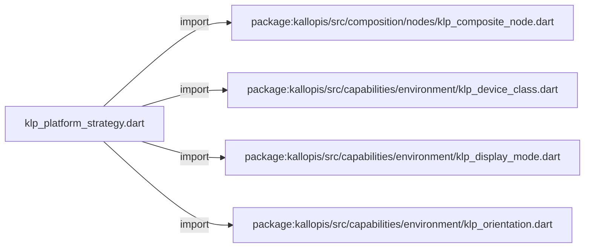
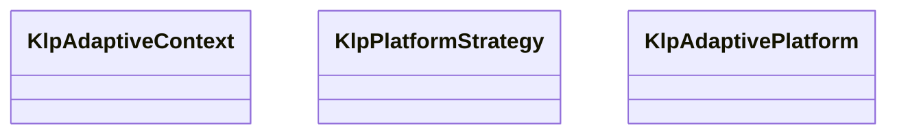

# klp_platform_strategy.dart：直接依賴與宣告架構

[回到目錄](README.md) · [來源檔案](../../../../../lib/src/composition/nodes/klp_platform_strategy.dart)

## 範圍

核心是 `lib/src/composition/nodes/klp_platform_strategy.dart`。主要視角為該檔案明寫的 import／export／part；輔助視角為本檔宣告及 extends／implements／with／on 關係。只展開一層外部邊界。

## 直接依賴圖

## 依賴證據

| 關係 | 原始 directive | 來源 |
|---|---|---|
| import | <code>import &#x27;package:kallopis/src/composition/nodes/klp_composite_node.dart&#x27;;</code> | [lib/src/composition/nodes/klp_platform_strategy.dart:1](../../../../../lib/src/composition/nodes/klp_platform_strategy.dart#L1) |
| import | <code>import &#x27;package:kallopis/src/capabilities/environment/klp_device_class.dart&#x27;;</code> | [lib/src/composition/nodes/klp_platform_strategy.dart:2](../../../../../lib/src/composition/nodes/klp_platform_strategy.dart#L2) |
| import | <code>import &#x27;package:kallopis/src/capabilities/environment/klp_display_mode.dart&#x27;;</code> | [lib/src/composition/nodes/klp_platform_strategy.dart:3](../../../../../lib/src/composition/nodes/klp_platform_strategy.dart#L3) |
| import | <code>import &#x27;package:kallopis/src/capabilities/environment/klp_orientation.dart&#x27;;</code> | [lib/src/composition/nodes/klp_platform_strategy.dart:4](../../../../../lib/src/composition/nodes/klp_platform_strategy.dart#L4) |

## 宣告關係圖

本組節點是本檔宣告；沒有箭頭的宣告未在此圖主張互相依賴。

## 宣告與成員證據

成員包含 public 與 private；簽章取自來源，省略函式本體與欄位初始值。`(inferred)` 表示來源未明寫型別；建構子只顯示參數部分，不含初始化列表。

### KlpAdaptiveContext

ClassDeclaration · public · [lib/src/composition/nodes/klp_platform_strategy.dart:6](../../../../../lib/src/composition/nodes/klp_platform_strategy.dart#L6)

<code>final class KlpAdaptiveContext</code>

來源註解摘要：不依賴 Flutter 的平台策略輸入；由 Kallopis host 唯一建立。

| 成員 | 可見性 | 簽章／型別 | 來源註解摘要 | 證據 |
|---|---|---|---|---|
| field <code>platform</code> | public | <code>final KlpAdaptivePlatform platform</code> |  | [lib/src/composition/nodes/klp_platform_strategy.dart:8](../../../../../lib/src/composition/nodes/klp_platform_strategy.dart#L8) |
| field <code>deviceClass</code> | public | <code>final KlpDeviceClass deviceClass</code> |  | [lib/src/composition/nodes/klp_platform_strategy.dart:9](../../../../../lib/src/composition/nodes/klp_platform_strategy.dart#L9) |
| field <code>orientation</code> | public | <code>final KlpOrientation orientation</code> |  | [lib/src/composition/nodes/klp_platform_strategy.dart:10](../../../../../lib/src/composition/nodes/klp_platform_strategy.dart#L10) |
| field <code>displayMode</code> | public | <code>final KlpDisplayMode displayMode</code> |  | [lib/src/composition/nodes/klp_platform_strategy.dart:11](../../../../../lib/src/composition/nodes/klp_platform_strategy.dart#L11) |
| constructor <code>KlpAdaptiveContext</code> | public | <code>const KlpAdaptiveContext({ required this.platform, required this.deviceClass, required this.orientation, required this.displayMode, })</code> |  | [lib/src/composition/nodes/klp_platform_strategy.dart:13](../../../../../lib/src/composition/nodes/klp_platform_strategy.dart#L13) |

### KlpPlatformStrategy

ClassDeclaration · public · [lib/src/composition/nodes/klp_platform_strategy.dart:21](../../../../../lib/src/composition/nodes/klp_platform_strategy.dart#L21)

<code>abstract interface class KlpPlatformStrategy</code>

來源註解摘要：宣告式策略只能回傳受控節點，不能取得 Widget 或 BuildContext。

| 成員 | 可見性 | 簽章／型別 | 來源註解摘要 | 證據 |
|---|---|---|---|---|
| method <code>build</code> | public | <code>KlpCompositeNode build(KlpAdaptiveContext context)</code> |  | [lib/src/composition/nodes/klp_platform_strategy.dart:23](../../../../../lib/src/composition/nodes/klp_platform_strategy.dart#L23) |

### KlpAdaptivePlatform

EnumDeclaration · public · [lib/src/composition/nodes/klp_platform_strategy.dart:26](../../../../../lib/src/composition/nodes/klp_platform_strategy.dart#L26)

<code>enum KlpAdaptivePlatform</code>

來源註解摘要：公開策略鍵；與 desktop／tablet 等 viewport mode 分離。

| 成員 | 可見性 | 簽章／型別 | 來源註解摘要 | 證據 |
|---|---|---|---|---|
| enum value <code>android</code> | public | <code>android</code> |  | [lib/src/composition/nodes/klp_platform_strategy.dart:27](../../../../../lib/src/composition/nodes/klp_platform_strategy.dart#L27) |
| enum value <code>ios</code> | public | <code>ios</code> |  | [lib/src/composition/nodes/klp_platform_strategy.dart:27](../../../../../lib/src/composition/nodes/klp_platform_strategy.dart#L27) |
| enum value <code>windows</code> | public | <code>windows</code> |  | [lib/src/composition/nodes/klp_platform_strategy.dart:27](../../../../../lib/src/composition/nodes/klp_platform_strategy.dart#L27) |
| enum value <code>macos</code> | public | <code>macos</code> |  | [lib/src/composition/nodes/klp_platform_strategy.dart:27](../../../../../lib/src/composition/nodes/klp_platform_strategy.dart#L27) |
| enum value <code>linux</code> | public | <code>linux</code> |  | [lib/src/composition/nodes/klp_platform_strategy.dart:27](../../../../../lib/src/composition/nodes/klp_platform_strategy.dart#L27) |
| enum value <code>web</code> | public | <code>web</code> |  | [lib/src/composition/nodes/klp_platform_strategy.dart:27](../../../../../lib/src/composition/nodes/klp_platform_strategy.dart#L27) |
| enum value <code>other</code> | public | <code>other</code> |  | [lib/src/composition/nodes/klp_platform_strategy.dart:27](../../../../../lib/src/composition/nodes/klp_platform_strategy.dart#L27) |

## 閱讀說明與限制

箭頭只表示來源明寫的靜態關係；import 不等於呼叫。未分析動態呼叫、欄位的實際物件擁有權、狀態轉移或渲染流程；型別未進行語意解析，繼承目標保留原始型別拼寫。public／private 依 Dart 名稱前綴判斷；public 宣告不代表已由 `lib/kallopis.dart` 匯出。

本頁由 `tool/architecture_atlas` 產生；編輯來源或生成工具後重新產生，避免手改本頁。
