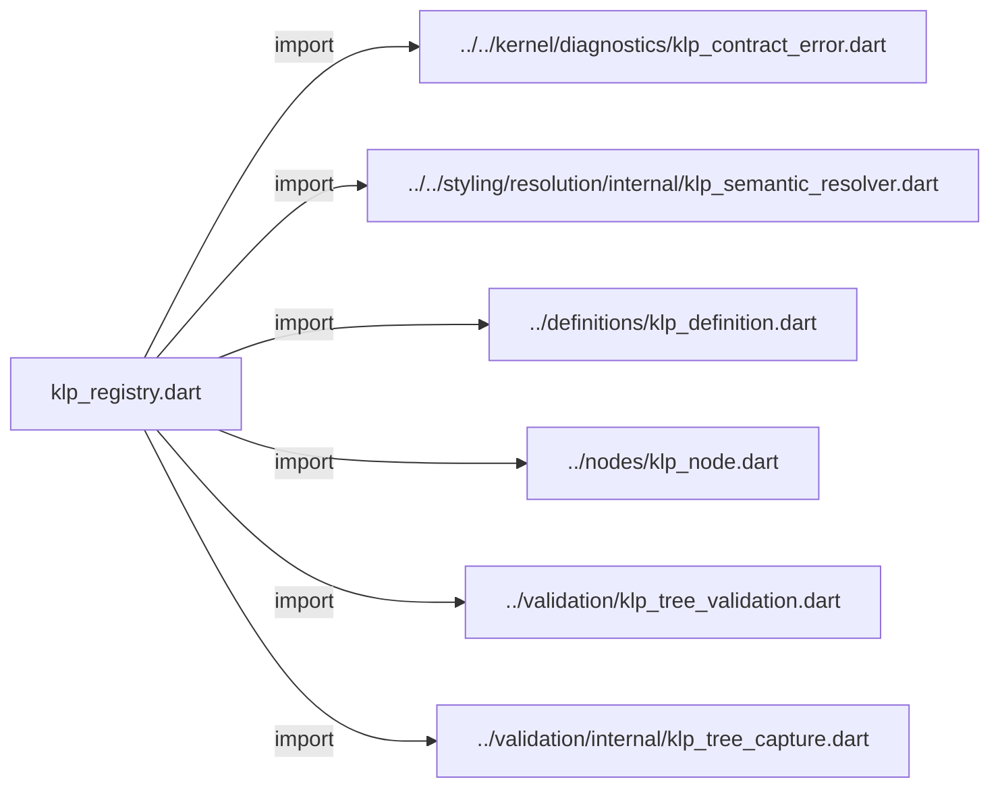
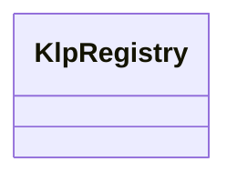

# klp_registry.dart：直接依賴與宣告架構

[回到目錄](README.md) · [來源檔案](../../../../../lib/src/composition/registry/klp_registry.dart)

## 範圍

核心是 `lib/src/composition/registry/klp_registry.dart`。主要視角為該檔案明寫的 import／export／part；輔助視角為本檔宣告及 extends／implements／with／on 關係。只展開一層外部邊界。

## 直接依賴圖

## 依賴證據

| 關係 | 原始 directive | 來源 |
|---|---|---|
| import | <code>import &#x27;../../kernel/diagnostics/klp_contract_error.dart&#x27;;</code> | [lib/src/composition/registry/klp_registry.dart:1](../../../../../lib/src/composition/registry/klp_registry.dart#L1) |
| import | <code>import &#x27;../../styling/resolution/internal/klp_semantic_resolver.dart&#x27;;</code> | [lib/src/composition/registry/klp_registry.dart:2](../../../../../lib/src/composition/registry/klp_registry.dart#L2) |
| import | <code>import &#x27;../definitions/klp_definition.dart&#x27;;</code> | [lib/src/composition/registry/klp_registry.dart:3](../../../../../lib/src/composition/registry/klp_registry.dart#L3) |
| import | <code>import &#x27;../nodes/klp_node.dart&#x27;;</code> | [lib/src/composition/registry/klp_registry.dart:4](../../../../../lib/src/composition/registry/klp_registry.dart#L4) |
| import | <code>import &#x27;../validation/klp_tree_validation.dart&#x27;;</code> | [lib/src/composition/registry/klp_registry.dart:5](../../../../../lib/src/composition/registry/klp_registry.dart#L5) |
| import | <code>import &#x27;../validation/internal/klp_tree_capture.dart&#x27;;</code> | [lib/src/composition/registry/klp_registry.dart:6](../../../../../lib/src/composition/registry/klp_registry.dart#L6) |

## 宣告關係圖

本組節點是本檔宣告；沒有箭頭的宣告未在此圖主張互相依賴。

## 宣告與成員證據

成員包含 public 與 private；簽章取自來源，省略函式本體與欄位初始值。`(inferred)` 表示來源未明寫型別；建構子只顯示參數部分，不含初始化列表。

### KlpRegistry

ClassDeclaration · public · [lib/src/composition/registry/klp_registry.dart:8](../../../../../lib/src/composition/registry/klp_registry.dart#L8)

<code>final class KlpRegistry</code>

來源註解摘要：封存註冊定義，驗證依賴及結構，不能接受渲染回呼。

| 成員 | 可見性 | 簽章／型別 | 來源註解摘要 | 證據 |
|---|---|---|---|---|
| field <code>definitions</code> | public | <code>final List&lt;KlpDefinition&lt;KlpNode&gt;&gt; definitions</code> |  | [lib/src/composition/registry/klp_registry.dart:10](../../../../../lib/src/composition/registry/klp_registry.dart#L10) |
| field <code>_byId</code> | private | <code>final Map&lt;String, KlpDefinition&lt;KlpNode&gt;&gt; _byId</code> |  | [lib/src/composition/registry/klp_registry.dart:11](../../../../../lib/src/composition/registry/klp_registry.dart#L11) |
| constructor <code>KlpRegistry</code> | public | <code>KlpRegistry(Iterable&lt;KlpDefinition&lt;KlpNode&gt;&gt; definitions)</code> |  | [lib/src/composition/registry/klp_registry.dart:13](../../../../../lib/src/composition/registry/klp_registry.dart#L13) |
| method <code>definition</code> | public | <code>KlpDefinition&lt;KlpNode&gt; definition(String id)</code> |  | [lib/src/composition/registry/klp_registry.dart:33](../../../../../lib/src/composition/registry/klp_registry.dart#L33) |
| method <code>validate</code> | public | <code>KlpTreeValidation validate(KlpNode root)</code> |  | [lib/src/composition/registry/klp_registry.dart:41](../../../../../lib/src/composition/registry/klp_registry.dart#L41) |
| method <code>_validateDependencies</code> | private | <code>void _validateDependencies( String id, Set&lt;String&gt; active, Set&lt;String&gt; complete, )</code> |  | [lib/src/composition/registry/klp_registry.dart:44](../../../../../lib/src/composition/registry/klp_registry.dart#L44) |
| method <code>_requireId</code> | private | <code>void _requireId(String id)</code> |  | [lib/src/composition/registry/klp_registry.dart:61](../../../../../lib/src/composition/registry/klp_registry.dart#L61) |

## 閱讀說明與限制

箭頭只表示來源明寫的靜態關係；import 不等於呼叫。未分析動態呼叫、欄位的實際物件擁有權、狀態轉移或渲染流程；型別未進行語意解析，繼承目標保留原始型別拼寫。public／private 依 Dart 名稱前綴判斷；public 宣告不代表已由 `lib/kallopis.dart` 匯出。

本頁由 `tool/architecture_atlas` 產生；編輯來源或生成工具後重新產生，避免手改本頁。
