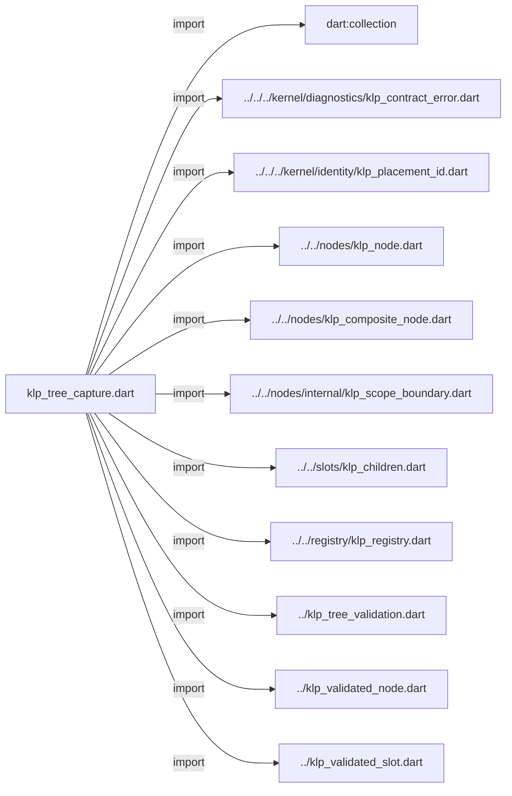
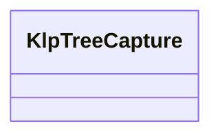

# klp_tree_capture.dart：直接依賴與宣告架構

[回到目錄](README.md) · [來源檔案](../../../../../../lib/src/composition/validation/internal/klp_tree_capture.dart)

## 範圍

核心是 `lib/src/composition/validation/internal/klp_tree_capture.dart`。主要視角為該檔案明寫的 import／export／part；輔助視角為本檔宣告及 extends／implements／with／on 關係。只展開一層外部邊界。

## 直接依賴圖

## 依賴證據

| 關係 | 原始 directive | 來源 |
|---|---|---|
| import | <code>import &#x27;dart:collection&#x27;;</code> | [lib/src/composition/validation/internal/klp_tree_capture.dart:1](../../../../../../lib/src/composition/validation/internal/klp_tree_capture.dart#L1) |
| import | <code>import &#x27;../../../kernel/diagnostics/klp_contract_error.dart&#x27;;</code> | [lib/src/composition/validation/internal/klp_tree_capture.dart:3](../../../../../../lib/src/composition/validation/internal/klp_tree_capture.dart#L3) |
| import | <code>import &#x27;../../../kernel/identity/klp_placement_id.dart&#x27;;</code> | [lib/src/composition/validation/internal/klp_tree_capture.dart:4](../../../../../../lib/src/composition/validation/internal/klp_tree_capture.dart#L4) |
| import | <code>import &#x27;../../nodes/klp_node.dart&#x27;;</code> | [lib/src/composition/validation/internal/klp_tree_capture.dart:5](../../../../../../lib/src/composition/validation/internal/klp_tree_capture.dart#L5) |
| import | <code>import &#x27;../../nodes/klp_composite_node.dart&#x27;;</code> | [lib/src/composition/validation/internal/klp_tree_capture.dart:6](../../../../../../lib/src/composition/validation/internal/klp_tree_capture.dart#L6) |
| import | <code>import &#x27;../../nodes/internal/klp_scope_boundary.dart&#x27;;</code> | [lib/src/composition/validation/internal/klp_tree_capture.dart:7](../../../../../../lib/src/composition/validation/internal/klp_tree_capture.dart#L7) |
| import | <code>import &#x27;../../slots/klp_children.dart&#x27;;</code> | [lib/src/composition/validation/internal/klp_tree_capture.dart:8](../../../../../../lib/src/composition/validation/internal/klp_tree_capture.dart#L8) |
| import | <code>import &#x27;../../registry/klp_registry.dart&#x27;;</code> | [lib/src/composition/validation/internal/klp_tree_capture.dart:9](../../../../../../lib/src/composition/validation/internal/klp_tree_capture.dart#L9) |
| import | <code>import &#x27;../klp_tree_validation.dart&#x27;;</code> | [lib/src/composition/validation/internal/klp_tree_capture.dart:10](../../../../../../lib/src/composition/validation/internal/klp_tree_capture.dart#L10) |
| import | <code>import &#x27;../klp_validated_node.dart&#x27;;</code> | [lib/src/composition/validation/internal/klp_tree_capture.dart:11](../../../../../../lib/src/composition/validation/internal/klp_tree_capture.dart#L11) |
| import | <code>import &#x27;../klp_validated_slot.dart&#x27;;</code> | [lib/src/composition/validation/internal/klp_tree_capture.dart:12](../../../../../../lib/src/composition/validation/internal/klp_tree_capture.dart#L12) |

## 宣告關係圖

本組節點是本檔宣告；沒有箭頭的宣告未在此圖主張互相依賴。

## 宣告與成員證據

成員包含 public 與 private；簽章取自來源，省略函式本體與欄位初始值。`(inferred)` 表示來源未明寫型別；建構子只顯示參數部分，不含初始化列表。

### KlpTreeCapture

ClassDeclaration · public · [lib/src/composition/validation/internal/klp_tree_capture.dart:14](../../../../../../lib/src/composition/validation/internal/klp_tree_capture.dart#L14)

<code>final class KlpTreeCapture</code>

來源註解摘要：原始節點只供同次資料準備使用，不存入公開驗證結果或已提交畫面。

| 成員 | 可見性 | 簽章／型別 | 來源註解摘要 | 證據 |
|---|---|---|---|---|
| field <code>validation</code> | public | <code>final KlpTreeValidation validation</code> |  | [lib/src/composition/validation/internal/klp_tree_capture.dart:17](../../../../../../lib/src/composition/validation/internal/klp_tree_capture.dart#L17) |
| field <code>sources</code> | public | <code>final Map&lt;KlpPlacementId, KlpNode&gt; sources</code> |  | [lib/src/composition/validation/internal/klp_tree_capture.dart:18](../../../../../../lib/src/composition/validation/internal/klp_tree_capture.dart#L18) |
| constructor <code>KlpTreeCapture</code> | public | <code>KlpTreeCapture(this.validation, Map&lt;KlpPlacementId, KlpNode&gt; sources)</code> |  | [lib/src/composition/validation/internal/klp_tree_capture.dart:20](../../../../../../lib/src/composition/validation/internal/klp_tree_capture.dart#L20) |

### captureKlpTree

FunctionDeclaration · public · [lib/src/composition/validation/internal/klp_tree_capture.dart:23](../../../../../../lib/src/composition/validation/internal/klp_tree_capture.dart#L23)

<code>KlpTreeCapture captureKlpTree(KlpRegistry registry, KlpNode root)</code>

來源註解摘要：結構驗證與編譯共用唯一擷取流程，每個結構 getter 僅讀取一次。

## 閱讀說明與限制

箭頭只表示來源明寫的靜態關係；import 不等於呼叫。未分析動態呼叫、欄位的實際物件擁有權、狀態轉移或渲染流程；型別未進行語意解析，繼承目標保留原始型別拼寫。public／private 依 Dart 名稱前綴判斷；public 宣告不代表已由 `lib/kallopis.dart` 匯出。

本頁由 `tool/architecture_atlas` 產生；編輯來源或生成工具後重新產生，避免手改本頁。
