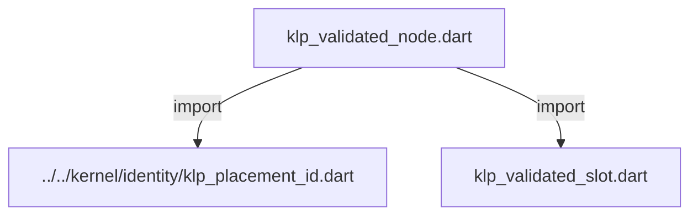
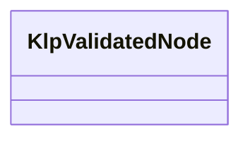

# klp_validated_node.dart：直接依賴與宣告架構

[回到目錄](README.md) · [來源檔案](../../../../../lib/src/composition/validation/klp_validated_node.dart)

## 範圍

核心是 `lib/src/composition/validation/klp_validated_node.dart`。主要視角為該檔案明寫的 import／export／part；輔助視角為本檔宣告及 extends／implements／with／on 關係。只展開一層外部邊界。

## 直接依賴圖

## 依賴證據

| 關係 | 原始 directive | 來源 |
|---|---|---|
| import | <code>import &#x27;../../kernel/identity/klp_placement_id.dart&#x27;;</code> | [lib/src/composition/validation/klp_validated_node.dart:1](../../../../../lib/src/composition/validation/klp_validated_node.dart#L1) |
| import | <code>import &#x27;klp_validated_slot.dart&#x27;;</code> | [lib/src/composition/validation/klp_validated_node.dart:2](../../../../../lib/src/composition/validation/klp_validated_node.dart#L2) |

## 宣告關係圖

本組節點是本檔宣告；沒有箭頭的宣告未在此圖主張互相依賴。

## 宣告與成員證據

成員包含 public 與 private；簽章取自來源，省略函式本體與欄位初始值。`(inferred)` 表示來源未明寫型別；建構子只顯示參數部分，不含初始化列表。

### KlpValidatedNode

ClassDeclaration · public · [lib/src/composition/validation/klp_validated_node.dart:4](../../../../../lib/src/composition/validation/klp_validated_node.dart#L4)

<code>final class KlpValidatedNode</code>

來源註解摘要：一次驗證取得的放置快照，不再讀取消費端節點 getter。

| 成員 | 可見性 | 簽章／型別 | 來源註解摘要 | 證據 |
|---|---|---|---|---|
| field <code>placementId</code> | public | <code>final KlpPlacementId placementId</code> |  | [lib/src/composition/validation/klp_validated_node.dart:6](../../../../../lib/src/composition/validation/klp_validated_node.dart#L6) |
| field <code>definitionId</code> | public | <code>final String definitionId</code> |  | [lib/src/composition/validation/klp_validated_node.dart:7](../../../../../lib/src/composition/validation/klp_validated_node.dart#L7) |
| field <code>childrenPlacements</code> | public | <code>final List&lt;KlpPlacementId&gt; childrenPlacements</code> |  | [lib/src/composition/validation/klp_validated_node.dart:8](../../../../../lib/src/composition/validation/klp_validated_node.dart#L8) |
| field <code>slotRanges</code> | public | <code>final List&lt;KlpValidatedSlot&gt; slotRanges</code> |  | [lib/src/composition/validation/klp_validated_node.dart:9](../../../../../lib/src/composition/validation/klp_validated_node.dart#L9) |
| constructor <code>KlpValidatedNode</code> | public | <code>KlpValidatedNode( String id, String definitionId, Iterable&lt;String&gt; childrenIds, { Iterable&lt;KlpValidatedSlot&gt; slotRanges = const [], })</code> |  | [lib/src/composition/validation/klp_validated_node.dart:11](../../../../../lib/src/composition/validation/klp_validated_node.dart#L11) |
| constructor <code>scoped</code> | public | <code>KlpValidatedNode.scoped( this.placementId, this.definitionId, Iterable&lt;KlpPlacementId&gt; childrenPlacements, { Iterable&lt;KlpValidatedSlot&gt; slotRanges = const [], })</code> |  | [lib/src/composition/validation/klp_validated_node.dart:23](../../../../../lib/src/composition/validation/klp_validated_node.dart#L23) |
| getter <code>id</code> | public | <code>String get id</code> |  | [lib/src/composition/validation/klp_validated_node.dart:31](../../../../../lib/src/composition/validation/klp_validated_node.dart#L31) |
| getter <code>childrenIds</code> | public | <code>List&lt;String&gt; get childrenIds</code> |  | [lib/src/composition/validation/klp_validated_node.dart:32](../../../../../lib/src/composition/validation/klp_validated_node.dart#L32) |

## 閱讀說明與限制

箭頭只表示來源明寫的靜態關係；import 不等於呼叫。未分析動態呼叫、欄位的實際物件擁有權、狀態轉移或渲染流程；型別未進行語意解析，繼承目標保留原始型別拼寫。public／private 依 Dart 名稱前綴判斷；public 宣告不代表已由 `lib/kallopis.dart` 匯出。

本頁由 `tool/architecture_atlas` 產生；編輯來源或生成工具後重新產生，避免手改本頁。
