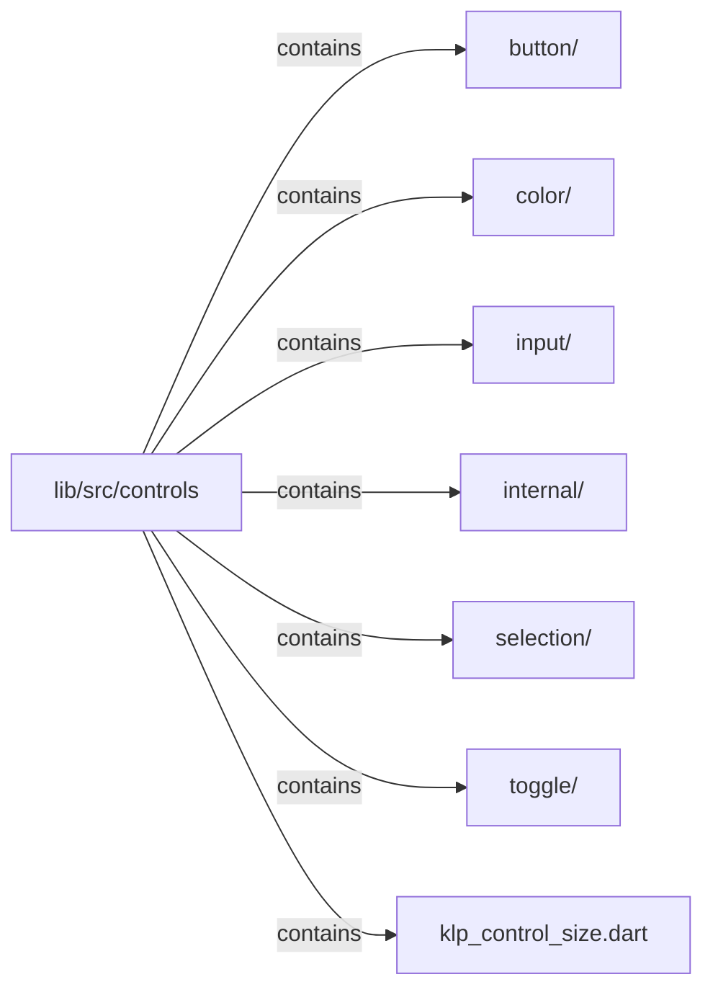

# lib/src/controls：架構分析入口

[上一層](../README.md)

## 範圍

閱讀 `lib/src/controls` 的直接子目錄與 Dart 檔案。結構圖表示實際檔案包含關係；依賴圖表示本層檔案明寫的 directives。每個檔案頁另列直接依賴、宣告、欄位、方法、建構子及行號證據。

## 模組閱讀重點

## 分析入口

`controls/` 包含按鈕、文字輸入、選擇器、切換與 OKLCH 色彩編輯 UI；不同控件以各自的 value／callback 契約接收與回報資料。閱讀入口可先選 KlpButton、KlpTextField 或 KlpCombobox，再追蹤該控件的互動與樣式。`internal/` 目前放置按鈕樣式解析 KlpButtonStyle，與公開按鈕 widget 分檔。

| 想查的問題 | 符號與來源 |
| --- | --- |
| 按鈕外觀如何解析？ | KlpButtonStyle.resolve — `lib/src/controls/internal/klp_button_style.dart:38` |
| 文字輸入的入口？ | KlpTextField — `lib/src/controls/klp_text_field.dart:12` |
| 可搜尋選項從哪查？ | KlpCombobox — `lib/src/controls/klp_combobox.dart:34` |
| 色彩平面與數值編輯如何分工？ | KlpOklchColorPicker — `lib/src/controls/klp_oklch_color_picker.dart:15`；KlpOklchColorEditor — `lib/src/controls/klp_oklch_color_editor.dart:11` |

重要關係：

- `KlpButton` → `KlpButtonStyle.resolve` → 主題 token：build 解析樣式，再建立 KlpPressable（`lib/src/controls/klp_button.dart:58`、`lib/src/controls/klp_button.dart:83`）。
- `klp_combobox.dart` → roving index、menu、text field：import 反映鍵盤索引、浮層與輸入元件的直接依賴（`lib/src/controls/klp_combobox.dart:4`）。
- 目錄層級有 `controls ↔ interaction` 雙向依賴：button 引入 pressable；filter bar 引入 button（`lib/src/controls/klp_button.dart:6`、`lib/src/interaction/klp_filter_bar.dart:3`）。這不是同一對檔案互相 import。

import 箭頭表示靜態依賴，不表示事件或執行先後。

## 本層直接依賴圖

箭頭以本層 Dart 檔案明寫的 directive 彙總到目標所在目錄或外部套件邊界；不遞迴將子目錄依賴算入本層。相同目標的不同 directive 類型分開計數。

本層檔案未宣告跨目錄依賴；子目錄依賴請循下一層入口閱讀。

| 目標邊界 | 關係 | directive 數 | 第一筆來源證據 |
|---|---|---|---|
| 無 | — | 0 | 來源清單見本層檔案 |

## 目錄結構圖

## 子目錄

| 目錄 | 導航 | 來源證據 |
|---|---|---|
| `button/` | [架構入口](button/README.md) | [來源目錄](../../../../lib/src/controls/button) |
| `color/` | [架構入口](color/README.md) | [來源目錄](../../../../lib/src/controls/color) |
| `input/` | [架構入口](input/README.md) | [來源目錄](../../../../lib/src/controls/input) |
| `internal/` | [架構入口](internal/README.md) | [來源目錄](../../../../lib/src/controls/internal) |
| `selection/` | [架構入口](selection/README.md) | [來源目錄](../../../../lib/src/controls/selection) |
| `toggle/` | [架構入口](toggle/README.md) | [來源目錄](../../../../lib/src/controls/toggle) |

## 本層檔案

| 檔案 | 宣告 | 細節 | 來源證據 |
|---|---|---|---|
| `klp_control_size.dart` | KlpControlSize | [架構與 API](klp_control_size.md) | [lib/src/controls/klp_control_size.dart:1](../../../../lib/src/controls/klp_control_size.dart#L1) |

## 閱讀說明

箭頭只表示來源明寫的靜態關係；import 不等於呼叫。未分析動態呼叫、欄位的實際物件擁有權、狀態轉移或渲染流程；型別未進行語意解析，繼承目標保留原始型別拼寫。public／private 依 Dart 名稱前綴判斷；public 宣告不代表已由 `lib/kallopis.dart` 匯出。

本頁的目錄與檔案由來源清冊產生；`manifest.json` 位於本圖集根目錄，可核對 SHA-256 與覆蓋數。人工模組摘要存於 `tool/architecture_atlas/briefs/`，重新生成時保留。
