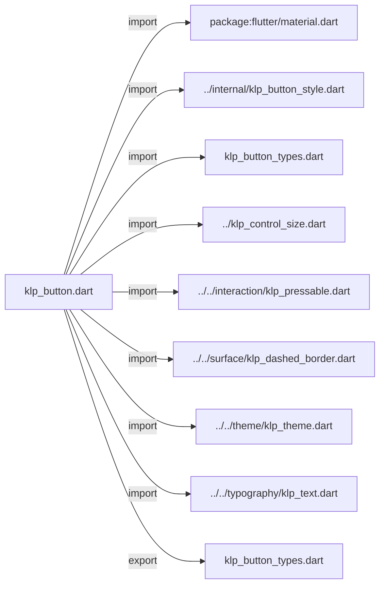
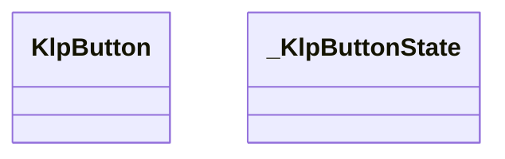
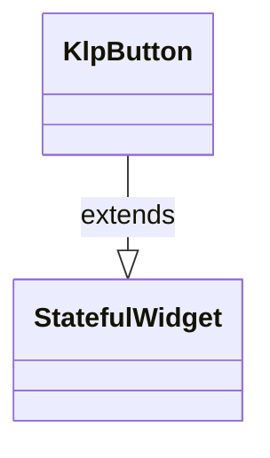
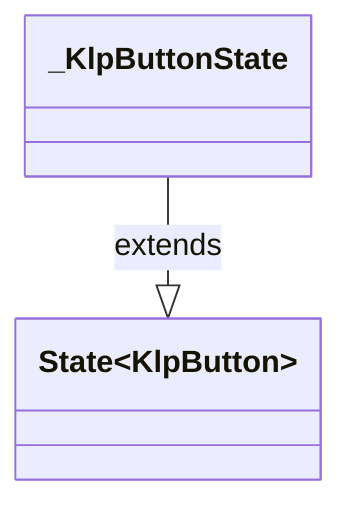

# klp_button.dart：直接依賴與宣告架構

[回到目錄](README.md) · [來源檔案](../../../../../lib/src/controls/button/klp_button.dart)

## 範圍

核心是 `lib/src/controls/button/klp_button.dart`。主要視角為該檔案明寫的 import／export／part；輔助視角為本檔宣告及 extends／implements／with／on 關係。只展開一層外部邊界。

## 直接依賴圖

## 依賴證據

| 關係 | 原始 directive | 來源 |
|---|---|---|
| import | <code>import &#x27;package:flutter/material.dart&#x27;;</code> | [lib/src/controls/button/klp_button.dart:1](../../../../../lib/src/controls/button/klp_button.dart#L1) |
| import | <code>import &#x27;../internal/klp_button_style.dart&#x27;;</code> | [lib/src/controls/button/klp_button.dart:3](../../../../../lib/src/controls/button/klp_button.dart#L3) |
| import | <code>import &#x27;klp_button_types.dart&#x27;;</code> | [lib/src/controls/button/klp_button.dart:4](../../../../../lib/src/controls/button/klp_button.dart#L4) |
| import | <code>import &#x27;../klp_control_size.dart&#x27;;</code> | [lib/src/controls/button/klp_button.dart:5](../../../../../lib/src/controls/button/klp_button.dart#L5) |
| import | <code>import &#x27;../../interaction/klp_pressable.dart&#x27;;</code> | [lib/src/controls/button/klp_button.dart:6](../../../../../lib/src/controls/button/klp_button.dart#L6) |
| import | <code>import &#x27;../../surface/klp_dashed_border.dart&#x27;;</code> | [lib/src/controls/button/klp_button.dart:7](../../../../../lib/src/controls/button/klp_button.dart#L7) |
| import | <code>import &#x27;../../theme/klp_theme.dart&#x27;;</code> | [lib/src/controls/button/klp_button.dart:8](../../../../../lib/src/controls/button/klp_button.dart#L8) |
| import | <code>import &#x27;../../typography/klp_text.dart&#x27;;</code> | [lib/src/controls/button/klp_button.dart:9](../../../../../lib/src/controls/button/klp_button.dart#L9) |
| export | <code>export &#x27;klp_button_types.dart&#x27;;</code> | [lib/src/controls/button/klp_button.dart:11](../../../../../lib/src/controls/button/klp_button.dart#L11) |

## 宣告關係圖

本組節點是本檔宣告；沒有箭頭的宣告未在此圖主張互相依賴。

## 宣告與成員證據

成員包含 public 與 private；簽章取自來源，省略函式本體與欄位初始值。`(inferred)` 表示來源未明寫型別；建構子只顯示參數部分，不含初始化列表。

### KlpButton

ClassDeclaration · public · [lib/src/controls/button/klp_button.dart:13](../../../../../lib/src/controls/button/klp_button.dart#L13)

<code>class KlpButton extends StatefulWidget</code>

來源註解摘要：主要動作按鈕。`tone` 決定語意強度（primary／secondary／ghost／dashed／danger）， `size` 支援五段緊湊尺寸階級（xs: 28px, sm: 32px, md: 36px, lg: 40px, xl: 48px）， 預設使用 sm，`compact` 使用 xs；`selected` 是由呼叫端持有的持續選取狀態。 圓角、內距、高度、狀態 wash 與邊框皆由風格表解析目前 theme。

- `extends` → <code>StatefulWidget</code>：[lib/src/controls/button/klp_button.dart:17](../../../../../lib/src/controls/button/klp_button.dart#L17)

| 成員 | 可見性 | 簽章／型別 | 來源註解摘要 | 證據 |
|---|---|---|---|---|
| field <code>label</code> | public | <code>final String label</code> |  | [lib/src/controls/button/klp_button.dart:19](../../../../../lib/src/controls/button/klp_button.dart#L19) |
| field <code>onPressed</code> | public | <code>final VoidCallback? onPressed</code> |  | [lib/src/controls/button/klp_button.dart:20](../../../../../lib/src/controls/button/klp_button.dart#L20) |
| field <code>tone</code> | public | <code>final KlpButtonTone tone</code> |  | [lib/src/controls/button/klp_button.dart:21](../../../../../lib/src/controls/button/klp_button.dart#L21) |
| field <code>size</code> | public | <code>final KlpControlSize? size</code> |  | [lib/src/controls/button/klp_button.dart:22](../../../../../lib/src/controls/button/klp_button.dart#L22) |
| field <code>leading</code> | public | <code>final Widget? leading</code> |  | [lib/src/controls/button/klp_button.dart:23](../../../../../lib/src/controls/button/klp_button.dart#L23) |
| field <code>trailing</code> | public | <code>final Widget? trailing</code> |  | [lib/src/controls/button/klp_button.dart:24](../../../../../lib/src/controls/button/klp_button.dart#L24) |
| field <code>compact</code> | public | <code>final bool compact</code> |  | [lib/src/controls/button/klp_button.dart:25](../../../../../lib/src/controls/button/klp_button.dart#L25) |
| field <code>selected</code> | public | <code>final bool selected</code> |  | [lib/src/controls/button/klp_button.dart:26](../../../../../lib/src/controls/button/klp_button.dart#L26) |
| field <code>onLongPress</code> | public | <code>final VoidCallback? onLongPress</code> |  | [lib/src/controls/button/klp_button.dart:27](../../../../../lib/src/controls/button/klp_button.dart#L27) |
| constructor <code>KlpButton</code> | public | <code>const KlpButton({ super.key, required this.label, required this.onPressed, this.tone = KlpButtonTone.primary, this.size, this.leading, this.trailing, this.compact = false, this.selected = false, this.onLongPress, })</code> |  | [lib/src/controls/button/klp_button.dart:29](../../../../../lib/src/controls/button/klp_button.dart#L29) |
| method <code>createState</code> | public | <code>State&lt;KlpButton&gt; createState()</code> |  | [lib/src/controls/button/klp_button.dart:42](../../../../../lib/src/controls/button/klp_button.dart#L42) |

### _KlpButtonState

ClassDeclaration · private · [lib/src/controls/button/klp_button.dart:46](../../../../../lib/src/controls/button/klp_button.dart#L46)

<code>class _KlpButtonState extends State&lt;KlpButton&gt;</code>

- `extends` → <code>State&lt;KlpButton&gt;</code>：[lib/src/controls/button/klp_button.dart:46](../../../../../lib/src/controls/button/klp_button.dart#L46)

| 成員 | 可見性 | 簽章／型別 | 來源註解摘要 | 證據 |
|---|---|---|---|---|
| field <code>_hovered</code> | private | <code>bool _hovered</code> |  | [lib/src/controls/button/klp_button.dart:48](../../../../../lib/src/controls/button/klp_button.dart#L48) |
| field <code>_focused</code> | private | <code>bool _focused</code> |  | [lib/src/controls/button/klp_button.dart:49](../../../../../lib/src/controls/button/klp_button.dart#L49) |
| method <code>_setHovered</code> | private | <code>void _setHovered(bool value)</code> |  | [lib/src/controls/button/klp_button.dart:51](../../../../../lib/src/controls/button/klp_button.dart#L51) |
| method <code>_setFocused</code> | private | <code>void _setFocused(bool value)</code> |  | [lib/src/controls/button/klp_button.dart:53](../../../../../lib/src/controls/button/klp_button.dart#L53) |
| method <code>build</code> | public | <code>Widget build(BuildContext context)</code> |  | [lib/src/controls/button/klp_button.dart:55](../../../../../lib/src/controls/button/klp_button.dart#L55) |
| method <code>_buildContent</code> | private | <code>Widget _buildContent(KlpButtonStyle style)</code> |  | [lib/src/controls/button/klp_button.dart:97](../../../../../lib/src/controls/button/klp_button.dart#L97) |
| method <code>_buildLabel</code> | private | <code>Widget _buildLabel(KlpButtonStyle style)</code> |  | [lib/src/controls/button/klp_button.dart:116](../../../../../lib/src/controls/button/klp_button.dart#L116) |

## 閱讀說明與限制

箭頭只表示來源明寫的靜態關係；import 不等於呼叫。未分析動態呼叫、欄位的實際物件擁有權、狀態轉移或渲染流程；型別未進行語意解析，繼承目標保留原始型別拼寫。public／private 依 Dart 名稱前綴判斷；public 宣告不代表已由 `lib/kallopis.dart` 匯出。

本頁由 `tool/architecture_atlas` 產生；編輯來源或生成工具後重新產生，避免手改本頁。
