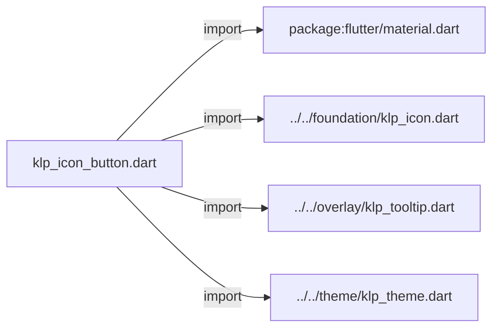
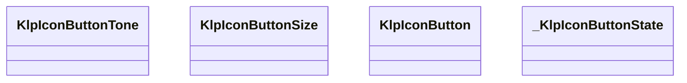
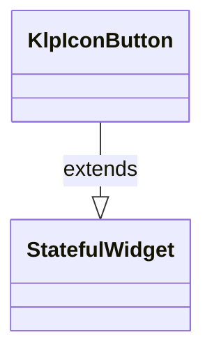
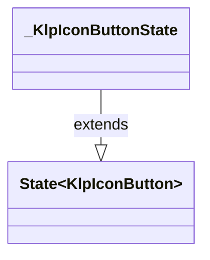

# klp_icon_button.dart：直接依賴與宣告架構

[回到目錄](README.md) · [來源檔案](../../../../../lib/src/controls/button/klp_icon_button.dart)

## 範圍

核心是 `lib/src/controls/button/klp_icon_button.dart`。主要視角為該檔案明寫的 import／export／part；輔助視角為本檔宣告及 extends／implements／with／on 關係。只展開一層外部邊界。

## 直接依賴圖

## 依賴證據

| 關係 | 原始 directive | 來源 |
|---|---|---|
| import | <code>import &#x27;package:flutter/material.dart&#x27;;</code> | [lib/src/controls/button/klp_icon_button.dart:1](../../../../../lib/src/controls/button/klp_icon_button.dart#L1) |
| import | <code>import &#x27;../../foundation/klp_icon.dart&#x27;;</code> | [lib/src/controls/button/klp_icon_button.dart:3](../../../../../lib/src/controls/button/klp_icon_button.dart#L3) |
| import | <code>import &#x27;../../overlay/klp_tooltip.dart&#x27;;</code> | [lib/src/controls/button/klp_icon_button.dart:4](../../../../../lib/src/controls/button/klp_icon_button.dart#L4) |
| import | <code>import &#x27;../../theme/klp_theme.dart&#x27;;</code> | [lib/src/controls/button/klp_icon_button.dart:5](../../../../../lib/src/controls/button/klp_icon_button.dart#L5) |

## 宣告關係圖

本組節點是本檔宣告；沒有箭頭的宣告未在此圖主張互相依賴。

## 宣告與成員證據

成員包含 public 與 private；簽章取自來源，省略函式本體與欄位初始值。`(inferred)` 表示來源未明寫型別；建構子只顯示參數部分，不含初始化列表。

### KlpIconButtonTone

EnumDeclaration · public · [lib/src/controls/button/klp_icon_button.dart:7](../../../../../lib/src/controls/button/klp_icon_button.dart#L7)

<code>enum KlpIconButtonTone</code>

來源註解摘要：圖示按鈕在版面中的**角色**，不是外觀參數。 消費端只宣告這顆按鈕是「獨立控制項」還是「嵌在既有表面上」， 由 Kallopis 決定兩者各自長什麼樣。

| 成員 | 可見性 | 簽章／型別 | 來源註解摘要 | 證據 |
|---|---|---|---|---|
| enum value <code>standalone</code> | public | <code>standalone</code> | 獨立控制項：靜置時就有底色，讓它在空白區域中可辨識。 | [lib/src/controls/button/klp_icon_button.dart:12](../../../../../lib/src/controls/button/klp_icon_button.dart#L12) |
| enum value <code>inline</code> | public | <code>inline</code> | 嵌在既有表面上：靜置時**透明**，只在 hover／focus／selected 時浮出底色。 用於視窗標題列、工具列這類本身已有背景的容器——在那裡給每顆按鈕 都畫一塊底色，會讓標題列看起來像一排色塊而不是一排動作。 | [lib/src/controls/button/klp_icon_button.dart:15](../../../../../lib/src/controls/button/klp_icon_button.dart#L15) |

### KlpIconButtonSize

EnumDeclaration · public · [lib/src/controls/button/klp_icon_button.dart:22](../../../../../lib/src/controls/button/klp_icon_button.dart#L22)

<code>enum KlpIconButtonSize</code>

來源註解摘要：圖示按鈕的語意尺寸。

| 成員 | 可見性 | 簽章／型別 | 來源註解摘要 | 證據 |
|---|---|---|---|---|
| enum value <code>standard</code> | public | <code>standard</code> | 一般控制項尺寸。 | [lib/src/controls/button/klp_icon_button.dart:24](../../../../../lib/src/controls/button/klp_icon_button.dart#L24) |
| enum value <code>window</code> | public | <code>window</code> | 視窗標題列尺寸，與 App icon 的正方形槽位一致。 | [lib/src/controls/button/klp_icon_button.dart:27](../../../../../lib/src/controls/button/klp_icon_button.dart#L27) |

### KlpIconButton

ClassDeclaration · public · [lib/src/controls/button/klp_icon_button.dart:31](../../../../../lib/src/controls/button/klp_icon_button.dart#L31)

<code>class KlpIconButton extends StatefulWidget</code>

來源註解摘要：只有圖示的按鈕。`label` 為必填且用於無障礙標註——圖示本身沒有可讀文字， 沒有 label 的圖示按鈕對螢幕閱讀器等於不存在。

- `extends` → <code>StatefulWidget</code>：[lib/src/controls/button/klp_icon_button.dart:33](../../../../../lib/src/controls/button/klp_icon_button.dart#L33)

| 成員 | 可見性 | 簽章／型別 | 來源註解摘要 | 證據 |
|---|---|---|---|---|
| constructor <code>KlpIconButton</code> | public | <code>const KlpIconButton({ super.key, required this.icon, required this.label, required this.onPressed, this.selected = false, this.quarterTurns = 0, this.tone = KlpIconButtonTone.standalone, this.size = KlpIconButtonSize.standard, })</code> |  | [lib/src/controls/button/klp_icon_button.dart:34](../../../../../lib/src/controls/button/klp_icon_button.dart#L34) |
| field <code>icon</code> | public | <code>final KlpIconData icon</code> |  | [lib/src/controls/button/klp_icon_button.dart:45](../../../../../lib/src/controls/button/klp_icon_button.dart#L45) |
| field <code>label</code> | public | <code>final String label</code> |  | [lib/src/controls/button/klp_icon_button.dart:46](../../../../../lib/src/controls/button/klp_icon_button.dart#L46) |
| field <code>onPressed</code> | public | <code>final VoidCallback? onPressed</code> |  | [lib/src/controls/button/klp_icon_button.dart:47](../../../../../lib/src/controls/button/klp_icon_button.dart#L47) |
| field <code>selected</code> | public | <code>final bool selected</code> |  | [lib/src/controls/button/klp_icon_button.dart:48](../../../../../lib/src/controls/button/klp_icon_button.dart#L48) |
| field <code>quarterTurns</code> | public | <code>final int quarterTurns</code> |  | [lib/src/controls/button/klp_icon_button.dart:49](../../../../../lib/src/controls/button/klp_icon_button.dart#L49) |
| field <code>size</code> | public | <code>final KlpIconButtonSize size</code> |  | [lib/src/controls/button/klp_icon_button.dart:50](../../../../../lib/src/controls/button/klp_icon_button.dart#L50) |
| field <code>tone</code> | public | <code>final KlpIconButtonTone tone</code> | 見 [KlpIconButtonTone]。預設為 [KlpIconButtonTone.standalone]， 維持既有呼叫端的外觀不變。 | [lib/src/controls/button/klp_icon_button.dart:54](../../../../../lib/src/controls/button/klp_icon_button.dart#L54) |
| method <code>createState</code> | public | <code>State&lt;KlpIconButton&gt; createState()</code> |  | [lib/src/controls/button/klp_icon_button.dart:56](../../../../../lib/src/controls/button/klp_icon_button.dart#L56) |

### _KlpIconButtonState

ClassDeclaration · private · [lib/src/controls/button/klp_icon_button.dart:60](../../../../../lib/src/controls/button/klp_icon_button.dart#L60)

<code>class _KlpIconButtonState extends State&lt;KlpIconButton&gt;</code>

- `extends` → <code>State&lt;KlpIconButton&gt;</code>：[lib/src/controls/button/klp_icon_button.dart:60](../../../../../lib/src/controls/button/klp_icon_button.dart#L60)

| 成員 | 可見性 | 簽章／型別 | 來源註解摘要 | 證據 |
|---|---|---|---|---|
| field <code>_hovered</code> | private | <code>bool _hovered</code> |  | [lib/src/controls/button/klp_icon_button.dart:61](../../../../../lib/src/controls/button/klp_icon_button.dart#L61) |
| field <code>_focused</code> | private | <code>bool _focused</code> |  | [lib/src/controls/button/klp_icon_button.dart:62](../../../../../lib/src/controls/button/klp_icon_button.dart#L62) |
| method <code>build</code> | public | <code>Widget build(BuildContext context)</code> |  | [lib/src/controls/button/klp_icon_button.dart:64](../../../../../lib/src/controls/button/klp_icon_button.dart#L64) |

## 閱讀說明與限制

箭頭只表示來源明寫的靜態關係；import 不等於呼叫。未分析動態呼叫、欄位的實際物件擁有權、狀態轉移或渲染流程；型別未進行語意解析，繼承目標保留原始型別拼寫。public／private 依 Dart 名稱前綴判斷；public 宣告不代表已由 `lib/kallopis.dart` 匯出。

本頁由 `tool/architecture_atlas` 產生；編輯來源或生成工具後重新產生，避免手改本頁。
