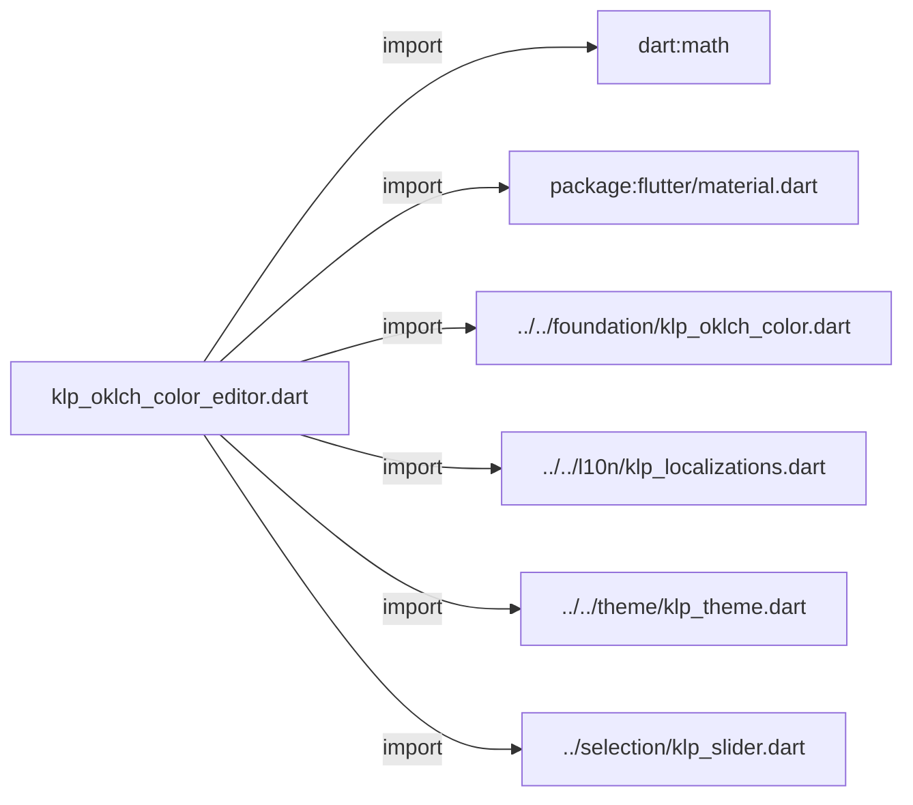
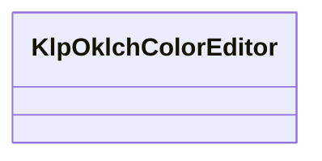
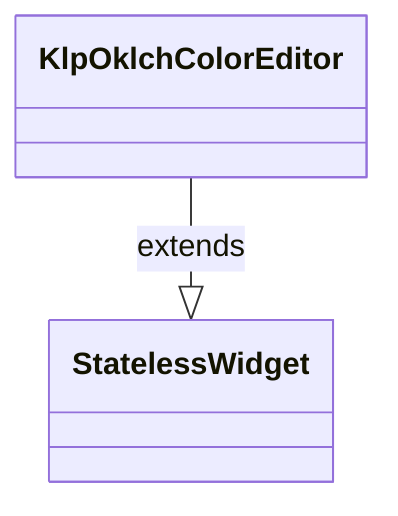

# klp_oklch_color_editor.dart：直接依賴與宣告架構

[回到目錄](README.md) · [來源檔案](../../../../../lib/src/controls/color/klp_oklch_color_editor.dart)

## 範圍

核心是 `lib/src/controls/color/klp_oklch_color_editor.dart`。主要視角為該檔案明寫的 import／export／part；輔助視角為本檔宣告及 extends／implements／with／on 關係。只展開一層外部邊界。

## 直接依賴圖

## 依賴證據

| 關係 | 原始 directive | 來源 |
|---|---|---|
| import | <code>import &#x27;dart:math&#x27; as math;</code> | [lib/src/controls/color/klp_oklch_color_editor.dart:1](../../../../../lib/src/controls/color/klp_oklch_color_editor.dart#L1) |
| import | <code>import &#x27;package:flutter/material.dart&#x27;;</code> | [lib/src/controls/color/klp_oklch_color_editor.dart:3](../../../../../lib/src/controls/color/klp_oklch_color_editor.dart#L3) |
| import | <code>import &#x27;../../foundation/klp_oklch_color.dart&#x27;;</code> | [lib/src/controls/color/klp_oklch_color_editor.dart:5](../../../../../lib/src/controls/color/klp_oklch_color_editor.dart#L5) |
| import | <code>import &#x27;../../l10n/klp_localizations.dart&#x27;;</code> | [lib/src/controls/color/klp_oklch_color_editor.dart:6](../../../../../lib/src/controls/color/klp_oklch_color_editor.dart#L6) |
| import | <code>import &#x27;../../theme/klp_theme.dart&#x27;;</code> | [lib/src/controls/color/klp_oklch_color_editor.dart:7](../../../../../lib/src/controls/color/klp_oklch_color_editor.dart#L7) |
| import | <code>import &#x27;../selection/klp_slider.dart&#x27;;</code> | [lib/src/controls/color/klp_oklch_color_editor.dart:8](../../../../../lib/src/controls/color/klp_oklch_color_editor.dart#L8) |

## 宣告關係圖

本組節點是本檔宣告；沒有箭頭的宣告未在此圖主張互相依賴。

## 宣告與成員證據

成員包含 public 與 private；簽章取自來源，省略函式本體與欄位初始值。`(inferred)` 表示來源未明寫型別；建構子只顯示參數部分，不含初始化列表。

### KlpOklchColorEditor

ClassDeclaration · public · [lib/src/controls/color/klp_oklch_color_editor.dart:10](../../../../../lib/src/controls/color/klp_oklch_color_editor.dart#L10)

<code>class KlpOklchColorEditor extends StatelessWidget</code>

來源註解摘要：以 Lightness、Chroma、Hue 與 Alpha 編輯 [KlpOklchColor] 的控制項。

- `extends` → <code>StatelessWidget</code>：[lib/src/controls/color/klp_oklch_color_editor.dart:11](../../../../../lib/src/controls/color/klp_oklch_color_editor.dart#L11)

| 成員 | 可見性 | 簽章／型別 | 來源註解摘要 | 證據 |
|---|---|---|---|---|
| constructor <code>KlpOklchColorEditor</code> | public | <code>const KlpOklchColorEditor({ super.key, required this.value, required this.onChanged, this.maxChroma = 0.4, })</code> |  | [lib/src/controls/color/klp_oklch_color_editor.dart:12](../../../../../lib/src/controls/color/klp_oklch_color_editor.dart#L12) |
| field <code>value</code> | public | <code>final KlpOklchColor value</code> |  | [lib/src/controls/color/klp_oklch_color_editor.dart:19](../../../../../lib/src/controls/color/klp_oklch_color_editor.dart#L19) |
| field <code>onChanged</code> | public | <code>final ValueChanged&lt;KlpOklchColor&gt;? onChanged</code> |  | [lib/src/controls/color/klp_oklch_color_editor.dart:20](../../../../../lib/src/controls/color/klp_oklch_color_editor.dart#L20) |
| field <code>maxChroma</code> | public | <code>final double maxChroma</code> | Chroma slider 的編輯上限；不限制 [KlpOklchColor] 可表達的值。 | [lib/src/controls/color/klp_oklch_color_editor.dart:23](../../../../../lib/src/controls/color/klp_oklch_color_editor.dart#L23) |
| method <code>build</code> | public | <code>Widget build(BuildContext context)</code> |  | [lib/src/controls/color/klp_oklch_color_editor.dart:25](../../../../../lib/src/controls/color/klp_oklch_color_editor.dart#L25) |
| method <code>_lightness</code> | private | <code>Widget _lightness(KlpLocalizations labels)</code> |  | [lib/src/controls/color/klp_oklch_color_editor.dart:52](../../../../../lib/src/controls/color/klp_oklch_color_editor.dart#L52) |
| method <code>_chroma</code> | private | <code>Widget _chroma(KlpLocalizations labels)</code> |  | [lib/src/controls/color/klp_oklch_color_editor.dart:66](../../../../../lib/src/controls/color/klp_oklch_color_editor.dart#L66) |
| method <code>_hue</code> | private | <code>Widget _hue(KlpLocalizations labels)</code> |  | [lib/src/controls/color/klp_oklch_color_editor.dart:81](../../../../../lib/src/controls/color/klp_oklch_color_editor.dart#L81) |
| method <code>_alpha</code> | private | <code>Widget _alpha(KlpLocalizations labels)</code> |  | [lib/src/controls/color/klp_oklch_color_editor.dart:97](../../../../../lib/src/controls/color/klp_oklch_color_editor.dart#L97) |

## 閱讀說明與限制

箭頭只表示來源明寫的靜態關係；import 不等於呼叫。未分析動態呼叫、欄位的實際物件擁有權、狀態轉移或渲染流程；型別未進行語意解析，繼承目標保留原始型別拼寫。public／private 依 Dart 名稱前綴判斷；public 宣告不代表已由 `lib/kallopis.dart` 匯出。

本頁由 `tool/architecture_atlas` 產生；編輯來源或生成工具後重新產生，避免手改本頁。
