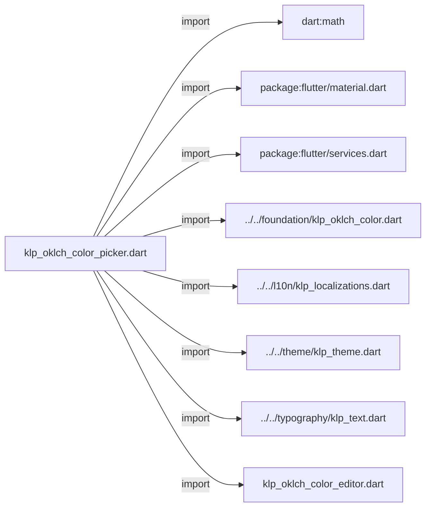
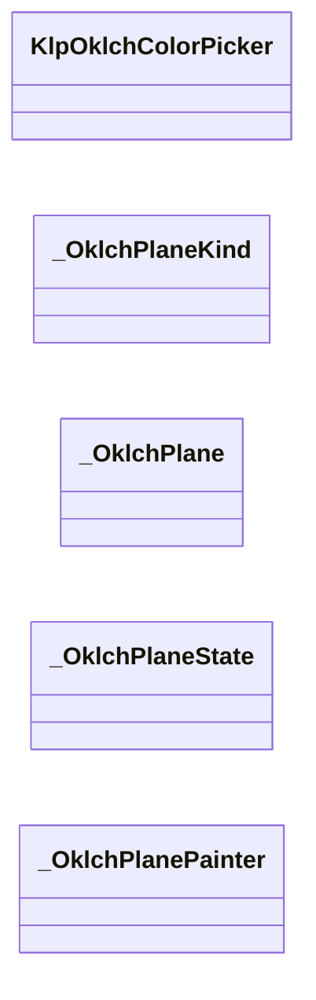
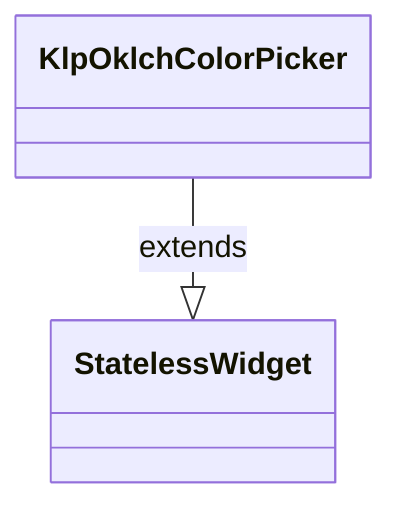
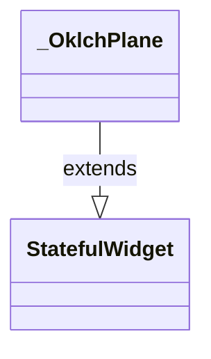
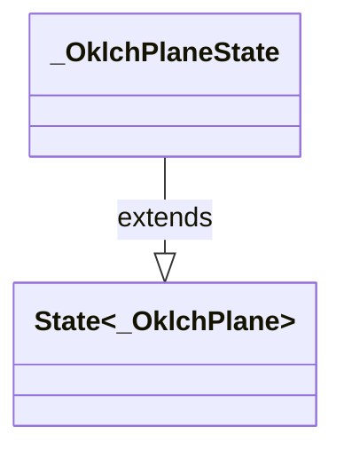
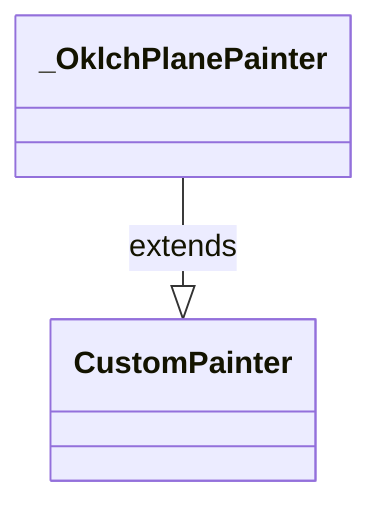

# klp_oklch_color_picker.dart：直接依賴與宣告架構

[回到目錄](README.md) · [來源檔案](../../../../../lib/src/controls/color/klp_oklch_color_picker.dart)

## 範圍

核心是 `lib/src/controls/color/klp_oklch_color_picker.dart`。主要視角為該檔案明寫的 import／export／part；輔助視角為本檔宣告及 extends／implements／with／on 關係。只展開一層外部邊界。

## 直接依賴圖

## 依賴證據

| 關係 | 原始 directive | 來源 |
|---|---|---|
| import | <code>import &#x27;dart:math&#x27; as math;</code> | [lib/src/controls/color/klp_oklch_color_picker.dart:1](../../../../../lib/src/controls/color/klp_oklch_color_picker.dart#L1) |
| import | <code>import &#x27;package:flutter/material.dart&#x27;;</code> | [lib/src/controls/color/klp_oklch_color_picker.dart:3](../../../../../lib/src/controls/color/klp_oklch_color_picker.dart#L3) |
| import | <code>import &#x27;package:flutter/services.dart&#x27;;</code> | [lib/src/controls/color/klp_oklch_color_picker.dart:4](../../../../../lib/src/controls/color/klp_oklch_color_picker.dart#L4) |
| import | <code>import &#x27;../../foundation/klp_oklch_color.dart&#x27;;</code> | [lib/src/controls/color/klp_oklch_color_picker.dart:6](../../../../../lib/src/controls/color/klp_oklch_color_picker.dart#L6) |
| import | <code>import &#x27;../../l10n/klp_localizations.dart&#x27;;</code> | [lib/src/controls/color/klp_oklch_color_picker.dart:7](../../../../../lib/src/controls/color/klp_oklch_color_picker.dart#L7) |
| import | <code>import &#x27;../../theme/klp_theme.dart&#x27;;</code> | [lib/src/controls/color/klp_oklch_color_picker.dart:8](../../../../../lib/src/controls/color/klp_oklch_color_picker.dart#L8) |
| import | <code>import &#x27;../../typography/klp_text.dart&#x27;;</code> | [lib/src/controls/color/klp_oklch_color_picker.dart:9](../../../../../lib/src/controls/color/klp_oklch_color_picker.dart#L9) |
| import | <code>import &#x27;klp_oklch_color_editor.dart&#x27;;</code> | [lib/src/controls/color/klp_oklch_color_picker.dart:10](../../../../../lib/src/controls/color/klp_oklch_color_picker.dart#L10) |

## 宣告關係圖

本組節點是本檔宣告；沒有箭頭的宣告未在此圖主張互相依賴。

## 宣告與成員證據

成員包含 public 與 private；簽章取自來源，省略函式本體與欄位初始值。`(inferred)` 表示來源未明寫型別；建構子只顯示參數部分，不含初始化列表。

### KlpOklchColorPicker

ClassDeclaration · public · [lib/src/controls/color/klp_oklch_color_picker.dart:12](../../../../../lib/src/controls/color/klp_oklch_color_picker.dart#L12)

<code>class KlpOklchColorPicker extends StatelessWidget</code>

來源註解摘要：以三個二維色彩平面與四軸控制編輯 [KlpOklchColor]。 元件不持有產品狀態；呼叫端以 [value] 與 [onChanged] 控制目前色彩。

- `extends` → <code>StatelessWidget</code>：[lib/src/controls/color/klp_oklch_color_picker.dart:15](../../../../../lib/src/controls/color/klp_oklch_color_picker.dart#L15)

| 成員 | 可見性 | 簽章／型別 | 來源註解摘要 | 證據 |
|---|---|---|---|---|
| constructor <code>KlpOklchColorPicker</code> | public | <code>const KlpOklchColorPicker({ super.key, required this.value, required this.onChanged, this.maxChroma = 0.4, })</code> |  | [lib/src/controls/color/klp_oklch_color_picker.dart:16](../../../../../lib/src/controls/color/klp_oklch_color_picker.dart#L16) |
| field <code>value</code> | public | <code>final KlpOklchColor value</code> |  | [lib/src/controls/color/klp_oklch_color_picker.dart:23](../../../../../lib/src/controls/color/klp_oklch_color_picker.dart#L23) |
| field <code>onChanged</code> | public | <code>final ValueChanged&lt;KlpOklchColor&gt;? onChanged</code> |  | [lib/src/controls/color/klp_oklch_color_picker.dart:24](../../../../../lib/src/controls/color/klp_oklch_color_picker.dart#L24) |
| field <code>maxChroma</code> | public | <code>final double maxChroma</code> | Chroma 平面與控制項的編輯上限，不限制 [KlpOklchColor] 可表達的值。 | [lib/src/controls/color/klp_oklch_color_picker.dart:27](../../../../../lib/src/controls/color/klp_oklch_color_picker.dart#L27) |
| method <code>build</code> | public | <code>Widget build(BuildContext context)</code> |  | [lib/src/controls/color/klp_oklch_color_picker.dart:29](../../../../../lib/src/controls/color/klp_oklch_color_picker.dart#L29) |
| method <code>_plane</code> | private | <code>Widget _plane( BuildContext context, _OklchPlaneKind kind, String label, double extent, )</code> |  | [lib/src/controls/color/klp_oklch_color_picker.dart:70](../../../../../lib/src/controls/color/klp_oklch_color_picker.dart#L70) |
| method <code>_preview</code> | private | <code>Widget _preview(BuildContext context, String label, Color color, double width)</code> |  | [lib/src/controls/color/klp_oklch_color_picker.dart:99](../../../../../lib/src/controls/color/klp_oklch_color_picker.dart#L99) |

### _OklchPlaneKind

EnumDeclaration · private · [lib/src/controls/color/klp_oklch_color_picker.dart:127](../../../../../lib/src/controls/color/klp_oklch_color_picker.dart#L127)

<code>enum _OklchPlaneKind</code>

| 成員 | 可見性 | 簽章／型別 | 來源註解摘要 | 證據 |
|---|---|---|---|---|
| enum value <code>lightness</code> | public | <code>lightness</code> |  | [lib/src/controls/color/klp_oklch_color_picker.dart:127](../../../../../lib/src/controls/color/klp_oklch_color_picker.dart#L127) |
| enum value <code>chroma</code> | public | <code>chroma</code> |  | [lib/src/controls/color/klp_oklch_color_picker.dart:127](../../../../../lib/src/controls/color/klp_oklch_color_picker.dart#L127) |
| enum value <code>hue</code> | public | <code>hue</code> |  | [lib/src/controls/color/klp_oklch_color_picker.dart:127](../../../../../lib/src/controls/color/klp_oklch_color_picker.dart#L127) |

### _OklchPlane

ClassDeclaration · private · [lib/src/controls/color/klp_oklch_color_picker.dart:129](../../../../../lib/src/controls/color/klp_oklch_color_picker.dart#L129)

<code>class _OklchPlane extends StatefulWidget</code>

- `extends` → <code>StatefulWidget</code>：[lib/src/controls/color/klp_oklch_color_picker.dart:129](../../../../../lib/src/controls/color/klp_oklch_color_picker.dart#L129)

| 成員 | 可見性 | 簽章／型別 | 來源註解摘要 | 證據 |
|---|---|---|---|---|
| constructor <code>_OklchPlane</code> | private | <code>const _OklchPlane({ required this.kind, required this.label, required this.value, required this.maxChroma, required this.onChanged, })</code> |  | [lib/src/controls/color/klp_oklch_color_picker.dart:130](../../../../../lib/src/controls/color/klp_oklch_color_picker.dart#L130) |
| field <code>kind</code> | public | <code>final _OklchPlaneKind kind</code> |  | [lib/src/controls/color/klp_oklch_color_picker.dart:138](../../../../../lib/src/controls/color/klp_oklch_color_picker.dart#L138) |
| field <code>label</code> | public | <code>final String label</code> |  | [lib/src/controls/color/klp_oklch_color_picker.dart:139](../../../../../lib/src/controls/color/klp_oklch_color_picker.dart#L139) |
| field <code>value</code> | public | <code>final KlpOklchColor value</code> |  | [lib/src/controls/color/klp_oklch_color_picker.dart:140](../../../../../lib/src/controls/color/klp_oklch_color_picker.dart#L140) |
| field <code>maxChroma</code> | public | <code>final double maxChroma</code> |  | [lib/src/controls/color/klp_oklch_color_picker.dart:141](../../../../../lib/src/controls/color/klp_oklch_color_picker.dart#L141) |
| field <code>onChanged</code> | public | <code>final ValueChanged&lt;KlpOklchColor&gt;? onChanged</code> |  | [lib/src/controls/color/klp_oklch_color_picker.dart:142](../../../../../lib/src/controls/color/klp_oklch_color_picker.dart#L142) |
| method <code>createState</code> | public | <code>State&lt;_OklchPlane&gt; createState()</code> |  | [lib/src/controls/color/klp_oklch_color_picker.dart:144](../../../../../lib/src/controls/color/klp_oklch_color_picker.dart#L144) |

### _OklchPlaneState

ClassDeclaration · private · [lib/src/controls/color/klp_oklch_color_picker.dart:148](../../../../../lib/src/controls/color/klp_oklch_color_picker.dart#L148)

<code>class _OklchPlaneState extends State&lt;_OklchPlane&gt;</code>

- `extends` → <code>State&lt;_OklchPlane&gt;</code>：[lib/src/controls/color/klp_oklch_color_picker.dart:148](../../../../../lib/src/controls/color/klp_oklch_color_picker.dart#L148)

| 成員 | 可見性 | 簽章／型別 | 來源註解摘要 | 證據 |
|---|---|---|---|---|
| field <code>_focusNode</code> | private | <code>final FocusNode _focusNode</code> |  | [lib/src/controls/color/klp_oklch_color_picker.dart:149](../../../../../lib/src/controls/color/klp_oklch_color_picker.dart#L149) |
| method <code>dispose</code> | public | <code>void dispose()</code> |  | [lib/src/controls/color/klp_oklch_color_picker.dart:151](../../../../../lib/src/controls/color/klp_oklch_color_picker.dart#L151) |
| method <code>build</code> | public | <code>Widget build(BuildContext context)</code> |  | [lib/src/controls/color/klp_oklch_color_picker.dart:157](../../../../../lib/src/controls/color/klp_oklch_color_picker.dart#L157) |
| getter <code>_semanticValue</code> | private | <code>String get _semanticValue</code> |  | [lib/src/controls/color/klp_oklch_color_picker.dart:198](../../../../../lib/src/controls/color/klp_oklch_color_picker.dart#L198) |
| getter <code>_normalizedHue</code> | private | <code>double get _normalizedHue</code> |  | [lib/src/controls/color/klp_oklch_color_picker.dart:204](../../../../../lib/src/controls/color/klp_oklch_color_picker.dart#L204) |
| method <code>_handleKeyEvent</code> | private | <code>KeyEventResult _handleKeyEvent(FocusNode node, KeyEvent event)</code> |  | [lib/src/controls/color/klp_oklch_color_picker.dart:206](../../../../../lib/src/controls/color/klp_oklch_color_picker.dart#L206) |
| method <code>_updateFromPosition</code> | private | <code>void _updateFromPosition(Offset position, Size size)</code> |  | [lib/src/controls/color/klp_oklch_color_picker.dart:222](../../../../../lib/src/controls/color/klp_oklch_color_picker.dart#L222) |
| getter <code>_normalizedPosition</code> | private | <code>Offset get _normalizedPosition</code> |  | [lib/src/controls/color/klp_oklch_color_picker.dart:227](../../../../../lib/src/controls/color/klp_oklch_color_picker.dart#L227) |
| method <code>_emitNormalized</code> | private | <code>void _emitNormalized(Offset position)</code> |  | [lib/src/controls/color/klp_oklch_color_picker.dart:235](../../../../../lib/src/controls/color/klp_oklch_color_picker.dart#L235) |

### _OklchPlanePainter

ClassDeclaration · private · [lib/src/controls/color/klp_oklch_color_picker.dart:247](../../../../../lib/src/controls/color/klp_oklch_color_picker.dart#L247)

<code>class _OklchPlanePainter extends CustomPainter</code>

- `extends` → <code>CustomPainter</code>：[lib/src/controls/color/klp_oklch_color_picker.dart:247](../../../../../lib/src/controls/color/klp_oklch_color_picker.dart#L247)

| 成員 | 可見性 | 簽章／型別 | 來源註解摘要 | 證據 |
|---|---|---|---|---|
| constructor <code>_OklchPlanePainter</code> | private | <code>const _OklchPlanePainter({ required this.kind, required this.value, required this.maxChroma, required this.borderColor, required this.borderWidth, required this.cursorRadius, required this.cursorWidth, })</code> |  | [lib/src/controls/color/klp_oklch_color_picker.dart:248](../../../../../lib/src/controls/color/klp_oklch_color_picker.dart#L248) |
| field <code>_samples</code> | private | <code>static const int _samples</code> |  | [lib/src/controls/color/klp_oklch_color_picker.dart:258](../../../../../lib/src/controls/color/klp_oklch_color_picker.dart#L258) |
| field <code>_opaqueAlpha</code> | private | <code>static const double _opaqueAlpha</code> |  | [lib/src/controls/color/klp_oklch_color_picker.dart:259](../../../../../lib/src/controls/color/klp_oklch_color_picker.dart#L259) |
| field <code>kind</code> | public | <code>final _OklchPlaneKind kind</code> |  | [lib/src/controls/color/klp_oklch_color_picker.dart:261](../../../../../lib/src/controls/color/klp_oklch_color_picker.dart#L261) |
| field <code>value</code> | public | <code>final KlpOklchColor value</code> |  | [lib/src/controls/color/klp_oklch_color_picker.dart:262](../../../../../lib/src/controls/color/klp_oklch_color_picker.dart#L262) |
| field <code>maxChroma</code> | public | <code>final double maxChroma</code> |  | [lib/src/controls/color/klp_oklch_color_picker.dart:263](../../../../../lib/src/controls/color/klp_oklch_color_picker.dart#L263) |
| field <code>borderColor</code> | public | <code>final Color borderColor</code> |  | [lib/src/controls/color/klp_oklch_color_picker.dart:264](../../../../../lib/src/controls/color/klp_oklch_color_picker.dart#L264) |
| field <code>borderWidth</code> | public | <code>final double borderWidth</code> |  | [lib/src/controls/color/klp_oklch_color_picker.dart:265](../../../../../lib/src/controls/color/klp_oklch_color_picker.dart#L265) |
| field <code>cursorRadius</code> | public | <code>final double cursorRadius</code> |  | [lib/src/controls/color/klp_oklch_color_picker.dart:266](../../../../../lib/src/controls/color/klp_oklch_color_picker.dart#L266) |
| field <code>cursorWidth</code> | public | <code>final double cursorWidth</code> |  | [lib/src/controls/color/klp_oklch_color_picker.dart:267](../../../../../lib/src/controls/color/klp_oklch_color_picker.dart#L267) |
| method <code>paint</code> | public | <code>void paint(Canvas canvas, Size size)</code> |  | [lib/src/controls/color/klp_oklch_color_picker.dart:269](../../../../../lib/src/controls/color/klp_oklch_color_picker.dart#L269) |
| method <code>_colorAt</code> | private | <code>Color _colorAt(double x, double y)</code> |  | [lib/src/controls/color/klp_oklch_color_picker.dart:302](../../../../../lib/src/controls/color/klp_oklch_color_picker.dart#L302) |
| method <code>_cursorOffset</code> | private | <code>Offset _cursorOffset(Size size)</code> |  | [lib/src/controls/color/klp_oklch_color_picker.dart:313](../../../../../lib/src/controls/color/klp_oklch_color_picker.dart#L313) |
| method <code>shouldRepaint</code> | public | <code>bool shouldRepaint(covariant _OklchPlanePainter oldDelegate)</code> |  | [lib/src/controls/color/klp_oklch_color_picker.dart:323](../../../../../lib/src/controls/color/klp_oklch_color_picker.dart#L323) |

## 閱讀說明與限制

箭頭只表示來源明寫的靜態關係；import 不等於呼叫。未分析動態呼叫、欄位的實際物件擁有權、狀態轉移或渲染流程；型別未進行語意解析，繼承目標保留原始型別拼寫。public／private 依 Dart 名稱前綴判斷；public 宣告不代表已由 `lib/kallopis.dart` 匯出。

本頁由 `tool/architecture_atlas` 產生；編輯來源或生成工具後重新產生，避免手改本頁。
