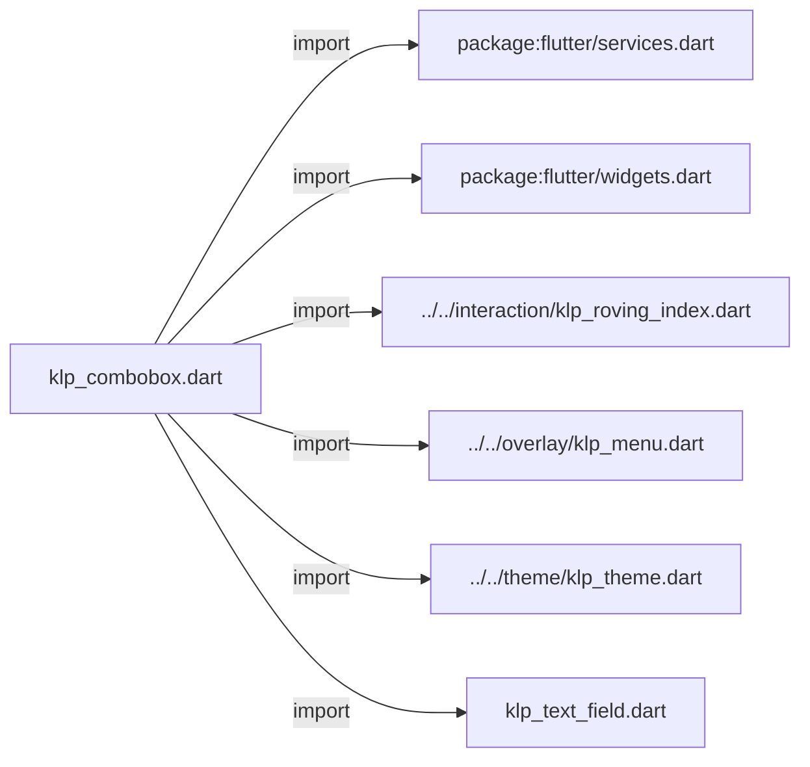
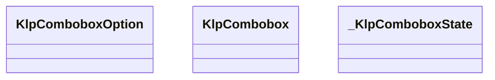
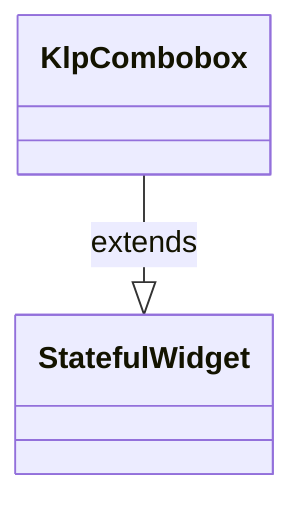
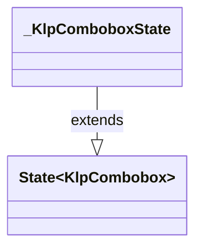

# klp_combobox.dart：直接依賴與宣告架構

[回到目錄](README.md) · [來源檔案](../../../../../lib/src/controls/input/klp_combobox.dart)

## 範圍

核心是 `lib/src/controls/input/klp_combobox.dart`。主要視角為該檔案明寫的 import／export／part；輔助視角為本檔宣告及 extends／implements／with／on 關係。只展開一層外部邊界。

## 直接依賴圖

## 依賴證據

| 關係 | 原始 directive | 來源 |
|---|---|---|
| import | <code>import &#x27;package:flutter/services.dart&#x27;;</code> | [lib/src/controls/input/klp_combobox.dart:1](../../../../../lib/src/controls/input/klp_combobox.dart#L1) |
| import | <code>import &#x27;package:flutter/widgets.dart&#x27;;</code> | [lib/src/controls/input/klp_combobox.dart:2](../../../../../lib/src/controls/input/klp_combobox.dart#L2) |
| import | <code>import &#x27;../../interaction/klp_roving_index.dart&#x27;;</code> | [lib/src/controls/input/klp_combobox.dart:4](../../../../../lib/src/controls/input/klp_combobox.dart#L4) |
| import | <code>import &#x27;../../overlay/klp_menu.dart&#x27;;</code> | [lib/src/controls/input/klp_combobox.dart:5](../../../../../lib/src/controls/input/klp_combobox.dart#L5) |
| import | <code>import &#x27;../../theme/klp_theme.dart&#x27;;</code> | [lib/src/controls/input/klp_combobox.dart:6](../../../../../lib/src/controls/input/klp_combobox.dart#L6) |
| import | <code>import &#x27;klp_text_field.dart&#x27;;</code> | [lib/src/controls/input/klp_combobox.dart:7](../../../../../lib/src/controls/input/klp_combobox.dart#L7) |

## 宣告關係圖

本組節點是本檔宣告；沒有箭頭的宣告未在此圖主張互相依賴。

## 宣告與成員證據

成員包含 public 與 private；簽章取自來源，省略函式本體與欄位初始值。`(inferred)` 表示來源未明寫型別；建構子只顯示參數部分，不含初始化列表。

### KlpComboboxOption

ClassDeclaration · public · [lib/src/controls/input/klp_combobox.dart:9](../../../../../lib/src/controls/input/klp_combobox.dart#L9)

<code>class KlpComboboxOption</code>

來源註解摘要：[KlpCombobox] 的一個候選項。

| 成員 | 可見性 | 簽章／型別 | 來源註解摘要 | 證據 |
|---|---|---|---|---|
| constructor <code>KlpComboboxOption</code> | public | <code>const KlpComboboxOption({required this.id, required this.label})</code> |  | [lib/src/controls/input/klp_combobox.dart:12](../../../../../lib/src/controls/input/klp_combobox.dart#L12) |
| field <code>id</code> | public | <code>final String id</code> | 穩定識別碼，用於 `Key` 與比對，不用於顯示。 | [lib/src/controls/input/klp_combobox.dart:15](../../../../../lib/src/controls/input/klp_combobox.dart#L15) |
| field <code>label</code> | public | <code>final String label</code> | 顯示文字，也是輸入時比對過濾的依據。 | [lib/src/controls/input/klp_combobox.dart:18](../../../../../lib/src/controls/input/klp_combobox.dart#L18) |

### KlpCombobox

ClassDeclaration · public · [lib/src/controls/input/klp_combobox.dart:21](../../../../../lib/src/controls/input/klp_combobox.dart#L21)

<code>class KlpCombobox extends StatefulWidget</code>

來源註解摘要：可輸入的下拉選單（autocomplete）。 **輸入框重用 [KlpTextField]，下拉面板重用 [KlpMenu]**——本庫「一條規則只能有 一個實作」：欄位外觀與選單外觀已經各自只有一份，這裡不重新畫一套。 是**受控元件**：目前的輸入文字（[query]）、候選清單（[options]）都由呼叫端 持有並傳入，本元件只負責過濾顯示、鍵盤導覽與觸發 [onQueryChanged]／ [onSelected]。選出一個選項後，呼叫端通常會把 [query] 更新成該選項的 [KlpComboboxOption.label]。 鍵盤：↓／↑ 在目前過濾結果間移動，Enter 選定醒目提示的項目；[allowFreeText] 為 `true` 時，Enter 在沒有醒目提示項目但輸入框非空時改觸發 [onFreeTextSubmitted]，讓呼叫端接受清單以外的自由輸入值。Esc 收起面板。

- `extends` → <code>StatefulWidget</code>：[lib/src/controls/input/klp_combobox.dart:34](../../../../../lib/src/controls/input/klp_combobox.dart#L34)

| 成員 | 可見性 | 簽章／型別 | 來源註解摘要 | 證據 |
|---|---|---|---|---|
| constructor <code>KlpCombobox</code> | public | <code>const KlpCombobox({ super.key, required this.label, required this.query, required this.options, required this.menuLabel, required this.onQueryChanged, required this.onSelected, this.placeholder, this.helper, this.error, this.enabled = true, this.allowFreeText = false, this.onFreeTextSubmitted, })</code> |  | [lib/src/controls/input/klp_combobox.dart:35](../../../../../lib/src/controls/input/klp_combobox.dart#L35) |
| field <code>label</code> | public | <code>final String label</code> | 輸入框的標籤。 | [lib/src/controls/input/klp_combobox.dart:55](../../../../../lib/src/controls/input/klp_combobox.dart#L55) |
| field <code>query</code> | public | <code>final String query</code> | 目前的輸入文字。過濾候選清單時以此比對。 | [lib/src/controls/input/klp_combobox.dart:58](../../../../../lib/src/controls/input/klp_combobox.dart#L58) |
| field <code>options</code> | public | <code>final List&lt;KlpComboboxOption&gt; options</code> | 全部候選項；本元件依 [query] 在其中過濾顯示，不會向外發出額外的查詢。 | [lib/src/controls/input/klp_combobox.dart:61](../../../../../lib/src/controls/input/klp_combobox.dart#L61) |
| field <code>menuLabel</code> | public | <code>final String menuLabel</code> | 下拉面板（[KlpMenu]）頂部的分組標題文字。 | [lib/src/controls/input/klp_combobox.dart:64](../../../../../lib/src/controls/input/klp_combobox.dart#L64) |
| field <code>placeholder</code> | public | <code>final String? placeholder</code> |  | [lib/src/controls/input/klp_combobox.dart:66](../../../../../lib/src/controls/input/klp_combobox.dart#L66) |
| field <code>helper</code> | public | <code>final String? helper</code> |  | [lib/src/controls/input/klp_combobox.dart:67](../../../../../lib/src/controls/input/klp_combobox.dart#L67) |
| field <code>error</code> | public | <code>final String? error</code> |  | [lib/src/controls/input/klp_combobox.dart:68](../../../../../lib/src/controls/input/klp_combobox.dart#L68) |
| field <code>enabled</code> | public | <code>final bool enabled</code> |  | [lib/src/controls/input/klp_combobox.dart:69](../../../../../lib/src/controls/input/klp_combobox.dart#L69) |
| field <code>onQueryChanged</code> | public | <code>final ValueChanged&lt;String&gt; onQueryChanged</code> | 使用者輸入文字時呼叫，攜帶最新的輸入內容。 | [lib/src/controls/input/klp_combobox.dart:72](../../../../../lib/src/controls/input/klp_combobox.dart#L72) |
| field <code>onSelected</code> | public | <code>final ValueChanged&lt;KlpComboboxOption&gt; onSelected</code> | 使用者以滑鼠或鍵盤選定一個候選項時呼叫。 | [lib/src/controls/input/klp_combobox.dart:75](../../../../../lib/src/controls/input/klp_combobox.dart#L75) |
| field <code>allowFreeText</code> | public | <code>final bool allowFreeText</code> | 是否允許輸入清單以外的自由文字。為 `true` 時必須提供 [onFreeTextSubmitted]。 | [lib/src/controls/input/klp_combobox.dart:78](../../../../../lib/src/controls/input/klp_combobox.dart#L78) |
| field <code>onFreeTextSubmitted</code> | public | <code>final ValueChanged&lt;String&gt;? onFreeTextSubmitted</code> | [allowFreeText] 為 `true` 時，按下 Enter 但沒有醒目提示項目時呼叫， 攜帶目前的輸入文字。 | [lib/src/controls/input/klp_combobox.dart:82](../../../../../lib/src/controls/input/klp_combobox.dart#L82) |
| method <code>createState</code> | public | <code>State&lt;KlpCombobox&gt; createState()</code> |  | [lib/src/controls/input/klp_combobox.dart:84](../../../../../lib/src/controls/input/klp_combobox.dart#L84) |

### _KlpComboboxState

ClassDeclaration · private · [lib/src/controls/input/klp_combobox.dart:88](../../../../../lib/src/controls/input/klp_combobox.dart#L88)

<code>class _KlpComboboxState extends State&lt;KlpCombobox&gt;</code>

- `extends` → <code>State&lt;KlpCombobox&gt;</code>：[lib/src/controls/input/klp_combobox.dart:88](../../../../../lib/src/controls/input/klp_combobox.dart#L88)

| 成員 | 可見性 | 簽章／型別 | 來源註解摘要 | 證據 |
|---|---|---|---|---|
| field <code>_focusNode</code> | private | <code>final FocusNode _focusNode</code> |  | [lib/src/controls/input/klp_combobox.dart:89](../../../../../lib/src/controls/input/klp_combobox.dart#L89) |
| field <code>_controller</code> | private | <code>late final TextEditingController _controller</code> |  | [lib/src/controls/input/klp_combobox.dart:90](../../../../../lib/src/controls/input/klp_combobox.dart#L90) |
| field <code>_highlightedIndex</code> | private | <code>int _highlightedIndex</code> |  | [lib/src/controls/input/klp_combobox.dart:93](../../../../../lib/src/controls/input/klp_combobox.dart#L93) |
| method <code>initState</code> | public | <code>void initState()</code> |  | [lib/src/controls/input/klp_combobox.dart:95](../../../../../lib/src/controls/input/klp_combobox.dart#L95) |
| method <code>didUpdateWidget</code> | public | <code>void didUpdateWidget(covariant KlpCombobox oldWidget)</code> |  | [lib/src/controls/input/klp_combobox.dart:101](../../../../../lib/src/controls/input/klp_combobox.dart#L101) |
| method <code>dispose</code> | public | <code>void dispose()</code> |  | [lib/src/controls/input/klp_combobox.dart:117](../../../../../lib/src/controls/input/klp_combobox.dart#L117) |
| method <code>_handleFocusChange</code> | private | <code>void _handleFocusChange()</code> |  | [lib/src/controls/input/klp_combobox.dart:125](../../../../../lib/src/controls/input/klp_combobox.dart#L125) |
| getter <code>_filteredOptions</code> | private | <code>List&lt;KlpComboboxOption&gt; get _filteredOptions</code> |  | [lib/src/controls/input/klp_combobox.dart:132](../../../../../lib/src/controls/input/klp_combobox.dart#L132) |
| method <code>_select</code> | private | <code>void _select(KlpComboboxOption option)</code> |  | [lib/src/controls/input/klp_combobox.dart:140](../../../../../lib/src/controls/input/klp_combobox.dart#L140) |
| method <code>_submitHighlightedOrFreeText</code> | private | <code>void _submitHighlightedOrFreeText()</code> |  | [lib/src/controls/input/klp_combobox.dart:145](../../../../../lib/src/controls/input/klp_combobox.dart#L145) |
| method <code>_handleKey</code> | private | <code>KeyEventResult _handleKey(FocusNode node, KeyEvent event)</code> |  | [lib/src/controls/input/klp_combobox.dart:157](../../../../../lib/src/controls/input/klp_combobox.dart#L157) |
| method <code>build</code> | public | <code>Widget build(BuildContext context)</code> |  | [lib/src/controls/input/klp_combobox.dart:196](../../../../../lib/src/controls/input/klp_combobox.dart#L196) |

## 閱讀說明與限制

箭頭只表示來源明寫的靜態關係；import 不等於呼叫。未分析動態呼叫、欄位的實際物件擁有權、狀態轉移或渲染流程；型別未進行語意解析，繼承目標保留原始型別拼寫。public／private 依 Dart 名稱前綴判斷；public 宣告不代表已由 `lib/kallopis.dart` 匯出。

本頁由 `tool/architecture_atlas` 產生；編輯來源或生成工具後重新產生，避免手改本頁。
