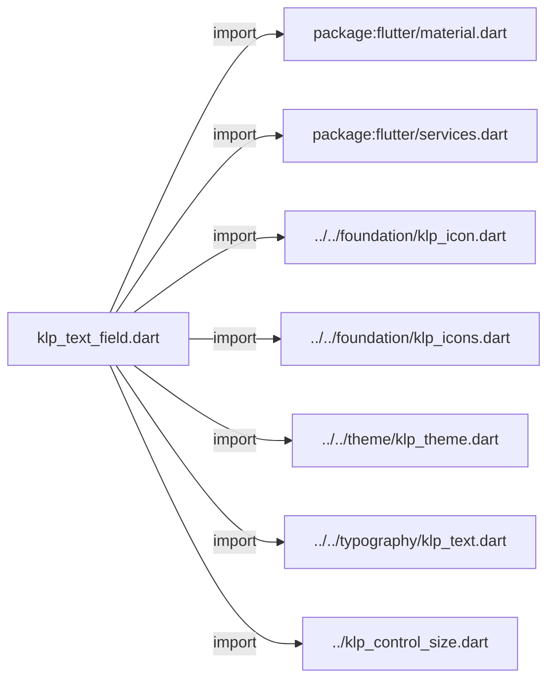
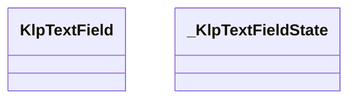
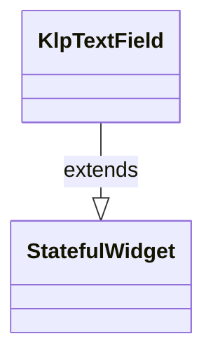
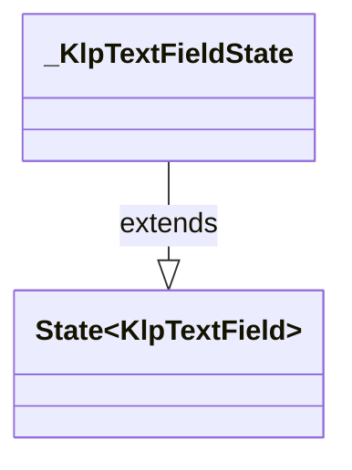

# klp_text_field.dart：直接依賴與宣告架構

[回到目錄](README.md) · [來源檔案](../../../../../lib/src/controls/input/klp_text_field.dart)

## 範圍

核心是 `lib/src/controls/input/klp_text_field.dart`。主要視角為該檔案明寫的 import／export／part；輔助視角為本檔宣告及 extends／implements／with／on 關係。只展開一層外部邊界。

## 直接依賴圖

## 依賴證據

| 關係 | 原始 directive | 來源 |
|---|---|---|
| import | <code>import &#x27;package:flutter/material.dart&#x27;;</code> | [lib/src/controls/input/klp_text_field.dart:1](../../../../../lib/src/controls/input/klp_text_field.dart#L1) |
| import | <code>import &#x27;package:flutter/services.dart&#x27;;</code> | [lib/src/controls/input/klp_text_field.dart:2](../../../../../lib/src/controls/input/klp_text_field.dart#L2) |
| import | <code>import &#x27;../../foundation/klp_icon.dart&#x27;;</code> | [lib/src/controls/input/klp_text_field.dart:4](../../../../../lib/src/controls/input/klp_text_field.dart#L4) |
| import | <code>import &#x27;../../foundation/klp_icons.dart&#x27;;</code> | [lib/src/controls/input/klp_text_field.dart:5](../../../../../lib/src/controls/input/klp_text_field.dart#L5) |
| import | <code>import &#x27;../../theme/klp_theme.dart&#x27;;</code> | [lib/src/controls/input/klp_text_field.dart:6](../../../../../lib/src/controls/input/klp_text_field.dart#L6) |
| import | <code>import &#x27;../../typography/klp_text.dart&#x27;;</code> | [lib/src/controls/input/klp_text_field.dart:7](../../../../../lib/src/controls/input/klp_text_field.dart#L7) |
| import | <code>import &#x27;../klp_control_size.dart&#x27;;</code> | [lib/src/controls/input/klp_text_field.dart:8](../../../../../lib/src/controls/input/klp_text_field.dart#L8) |

## 宣告關係圖

本組節點是本檔宣告；沒有箭頭的宣告未在此圖主張互相依賴。

## 宣告與成員證據

成員包含 public 與 private；簽章取自來源，省略函式本體與欄位初始值。`(inferred)` 表示來源未明寫型別；建構子只顯示參數部分，不含初始化列表。

### KlpTextField

ClassDeclaration · public · [lib/src/controls/input/klp_text_field.dart:10](../../../../../lib/src/controls/input/klp_text_field.dart#L10)

<code>class KlpTextField extends StatefulWidget</code>

來源註解摘要：單行或多行文字輸入。內部使用 `TextFormField`，所需的 `Material` 祖先由本元件 自行提供，消費者不需要另外包一層。

- `extends` → <code>StatefulWidget</code>：[lib/src/controls/input/klp_text_field.dart:12](../../../../../lib/src/controls/input/klp_text_field.dart#L12)

| 成員 | 可見性 | 簽章／型別 | 來源註解摘要 | 證據 |
|---|---|---|---|---|
| constructor <code>KlpTextField</code> | public | <code>const KlpTextField({ super.key, this.label, this.placeholder, this.helper, this.error, this.leadingIcon, this.initialValue, this.controller, this.maxLength, this.size = KlpControlSize.md, this.onChanged, this.onSubmitted, this.focusNode, this.autofocus = false, this.enabled = true, this.multiline = false, this.minLines, this.maxLines, this.unboundedLines = false, this.outlined = false, this.suffixText, this.stepper = false, this.clearable = false, this.conflict = false, this.readOnly = false, this.onClear, this.onStepUp, this.onStepDown, })</code> |  | [lib/src/controls/input/klp_text_field.dart:13](../../../../../lib/src/controls/input/klp_text_field.dart#L13) |
| field <code>label</code> | public | <code>final String? label</code> |  | [lib/src/controls/input/klp_text_field.dart:51](../../../../../lib/src/controls/input/klp_text_field.dart#L51) |
| field <code>placeholder</code> | public | <code>final String? placeholder</code> |  | [lib/src/controls/input/klp_text_field.dart:52](../../../../../lib/src/controls/input/klp_text_field.dart#L52) |
| field <code>helper</code> | public | <code>final String? helper</code> |  | [lib/src/controls/input/klp_text_field.dart:53](../../../../../lib/src/controls/input/klp_text_field.dart#L53) |
| field <code>error</code> | public | <code>final String? error</code> |  | [lib/src/controls/input/klp_text_field.dart:54](../../../../../lib/src/controls/input/klp_text_field.dart#L54) |
| field <code>leadingIcon</code> | public | <code>final KlpIconData? leadingIcon</code> |  | [lib/src/controls/input/klp_text_field.dart:55](../../../../../lib/src/controls/input/klp_text_field.dart#L55) |
| field <code>initialValue</code> | public | <code>final String? initialValue</code> |  | [lib/src/controls/input/klp_text_field.dart:56](../../../../../lib/src/controls/input/klp_text_field.dart#L56) |
| field <code>controller</code> | public | <code>final TextEditingController? controller</code> | 外部持有的文字控制器。多數呼叫端不需要——沒有給時本元件用 `initialValue` 自行管理，這是既有行為。給了 [controller] 就由呼叫端全權掌控文字內容 （例如 `KlpCombobox` 需要在使用者選定選項後改寫欄位文字）， 兩者互斥，與 `TextFormField` 的限制一致。 | [lib/src/controls/input/klp_text_field.dart:62](../../../../../lib/src/controls/input/klp_text_field.dart#L62) |
| field <code>maxLength</code> | public | <code>final int? maxLength</code> |  | [lib/src/controls/input/klp_text_field.dart:63](../../../../../lib/src/controls/input/klp_text_field.dart#L63) |
| field <code>size</code> | public | <code>final KlpControlSize size</code> |  | [lib/src/controls/input/klp_text_field.dart:64](../../../../../lib/src/controls/input/klp_text_field.dart#L64) |
| field <code>onChanged</code> | public | <code>final ValueChanged&lt;String&gt;? onChanged</code> |  | [lib/src/controls/input/klp_text_field.dart:65](../../../../../lib/src/controls/input/klp_text_field.dart#L65) |
| field <code>onSubmitted</code> | public | <code>final ValueChanged&lt;String&gt;? onSubmitted</code> |  | [lib/src/controls/input/klp_text_field.dart:66](../../../../../lib/src/controls/input/klp_text_field.dart#L66) |
| field <code>focusNode</code> | public | <code>final FocusNode? focusNode</code> |  | [lib/src/controls/input/klp_text_field.dart:67](../../../../../lib/src/controls/input/klp_text_field.dart#L67) |
| field <code>autofocus</code> | public | <code>final bool autofocus</code> |  | [lib/src/controls/input/klp_text_field.dart:68](../../../../../lib/src/controls/input/klp_text_field.dart#L68) |
| field <code>enabled</code> | public | <code>final bool enabled</code> |  | [lib/src/controls/input/klp_text_field.dart:69](../../../../../lib/src/controls/input/klp_text_field.dart#L69) |
| field <code>multiline</code> | public | <code>final bool multiline</code> |  | [lib/src/controls/input/klp_text_field.dart:70](../../../../../lib/src/controls/input/klp_text_field.dart#L70) |
| field <code>minLines</code> | public | <code>final int? minLines</code> |  | [lib/src/controls/input/klp_text_field.dart:71](../../../../../lib/src/controls/input/klp_text_field.dart#L71) |
| field <code>maxLines</code> | public | <code>final int? maxLines</code> |  | [lib/src/controls/input/klp_text_field.dart:72](../../../../../lib/src/controls/input/klp_text_field.dart#L72) |
| field <code>unboundedLines</code> | public | <code>final bool unboundedLines</code> |  | [lib/src/controls/input/klp_text_field.dart:73](../../../../../lib/src/controls/input/klp_text_field.dart#L73) |
| field <code>outlined</code> | public | <code>final bool outlined</code> |  | [lib/src/controls/input/klp_text_field.dart:74](../../../../../lib/src/controls/input/klp_text_field.dart#L74) |
| field <code>suffixText</code> | public | <code>final String? suffixText</code> |  | [lib/src/controls/input/klp_text_field.dart:75](../../../../../lib/src/controls/input/klp_text_field.dart#L75) |
| field <code>stepper</code> | public | <code>final bool stepper</code> |  | [lib/src/controls/input/klp_text_field.dart:76](../../../../../lib/src/controls/input/klp_text_field.dart#L76) |
| field <code>clearable</code> | public | <code>final bool clearable</code> |  | [lib/src/controls/input/klp_text_field.dart:77](../../../../../lib/src/controls/input/klp_text_field.dart#L77) |
| field <code>conflict</code> | public | <code>final bool conflict</code> |  | [lib/src/controls/input/klp_text_field.dart:78](../../../../../lib/src/controls/input/klp_text_field.dart#L78) |
| field <code>readOnly</code> | public | <code>final bool readOnly</code> |  | [lib/src/controls/input/klp_text_field.dart:79](../../../../../lib/src/controls/input/klp_text_field.dart#L79) |
| field <code>onClear</code> | public | <code>final VoidCallback? onClear</code> |  | [lib/src/controls/input/klp_text_field.dart:80](../../../../../lib/src/controls/input/klp_text_field.dart#L80) |
| field <code>onStepUp</code> | public | <code>final VoidCallback? onStepUp</code> |  | [lib/src/controls/input/klp_text_field.dart:81](../../../../../lib/src/controls/input/klp_text_field.dart#L81) |
| field <code>onStepDown</code> | public | <code>final VoidCallback? onStepDown</code> |  | [lib/src/controls/input/klp_text_field.dart:82](../../../../../lib/src/controls/input/klp_text_field.dart#L82) |
| method <code>createState</code> | public | <code>State&lt;KlpTextField&gt; createState()</code> |  | [lib/src/controls/input/klp_text_field.dart:84](../../../../../lib/src/controls/input/klp_text_field.dart#L84) |

### _KlpTextFieldState

ClassDeclaration · private · [lib/src/controls/input/klp_text_field.dart:88](../../../../../lib/src/controls/input/klp_text_field.dart#L88)

<code>class _KlpTextFieldState extends State&lt;KlpTextField&gt;</code>

- `extends` → <code>State&lt;KlpTextField&gt;</code>：[lib/src/controls/input/klp_text_field.dart:88](../../../../../lib/src/controls/input/klp_text_field.dart#L88)

| 成員 | 可見性 | 簽章／型別 | 來源註解摘要 | 證據 |
|---|---|---|---|---|
| field <code>_focused</code> | private | <code>bool _focused</code> |  | [lib/src/controls/input/klp_text_field.dart:89](../../../../../lib/src/controls/input/klp_text_field.dart#L89) |
| method <code>_handleFocusChanged</code> | private | <code>void _handleFocusChanged(bool value)</code> |  | [lib/src/controls/input/klp_text_field.dart:91](../../../../../lib/src/controls/input/klp_text_field.dart#L91) |
| method <code>build</code> | public | <code>Widget build(BuildContext context)</code> |  | [lib/src/controls/input/klp_text_field.dart:96](../../../../../lib/src/controls/input/klp_text_field.dart#L96) |

## 閱讀說明與限制

箭頭只表示來源明寫的靜態關係；import 不等於呼叫。未分析動態呼叫、欄位的實際物件擁有權、狀態轉移或渲染流程；型別未進行語意解析，繼承目標保留原始型別拼寫。public／private 依 Dart 名稱前綴判斷；public 宣告不代表已由 `lib/kallopis.dart` 匯出。

本頁由 `tool/architecture_atlas` 產生；編輯來源或生成工具後重新產生，避免手改本頁。
