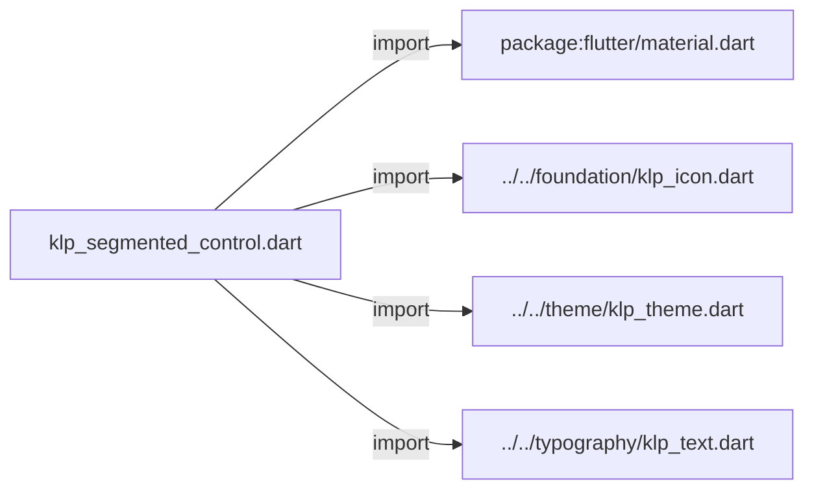
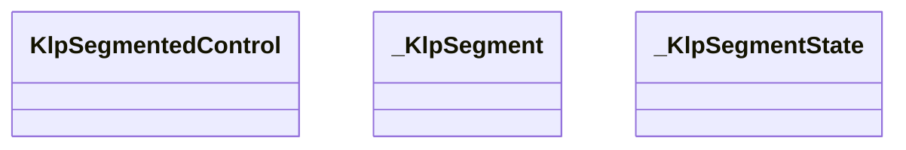
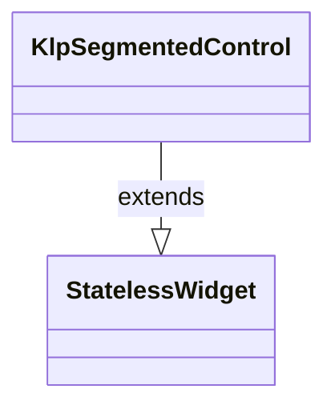
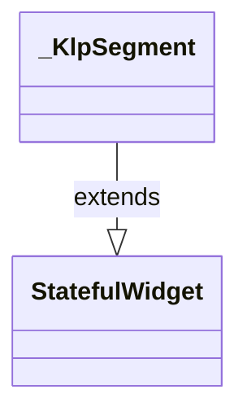
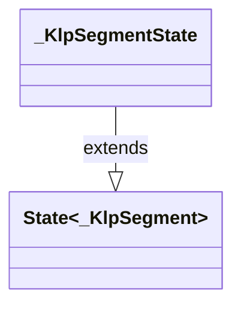

# klp_segmented_control.dart：直接依賴與宣告架構

[回到目錄](README.md) · [來源檔案](../../../../../lib/src/controls/selection/klp_segmented_control.dart)

## 範圍

核心是 `lib/src/controls/selection/klp_segmented_control.dart`。主要視角為該檔案明寫的 import／export／part；輔助視角為本檔宣告及 extends／implements／with／on 關係。只展開一層外部邊界。

## 直接依賴圖

## 依賴證據

| 關係 | 原始 directive | 來源 |
|---|---|---|
| import | <code>import &#x27;package:flutter/material.dart&#x27;;</code> | [lib/src/controls/selection/klp_segmented_control.dart:1](../../../../../lib/src/controls/selection/klp_segmented_control.dart#L1) |
| import | <code>import &#x27;../../foundation/klp_icon.dart&#x27;;</code> | [lib/src/controls/selection/klp_segmented_control.dart:3](../../../../../lib/src/controls/selection/klp_segmented_control.dart#L3) |
| import | <code>import &#x27;../../theme/klp_theme.dart&#x27;;</code> | [lib/src/controls/selection/klp_segmented_control.dart:4](../../../../../lib/src/controls/selection/klp_segmented_control.dart#L4) |
| import | <code>import &#x27;../../typography/klp_text.dart&#x27;;</code> | [lib/src/controls/selection/klp_segmented_control.dart:5](../../../../../lib/src/controls/selection/klp_segmented_control.dart#L5) |

## 宣告關係圖

本組節點是本檔宣告；沒有箭頭的宣告未在此圖主張互相依賴。

## 宣告與成員證據

成員包含 public 與 private；簽章取自來源，省略函式本體與欄位初始值。`(inferred)` 表示來源未明寫型別；建構子只顯示參數部分，不含初始化列表。

### KlpSegmentedControl

ClassDeclaration · public · [lib/src/controls/selection/klp_segmented_control.dart:7](../../../../../lib/src/controls/selection/klp_segmented_control.dart#L7)

<code>class KlpSegmentedControl extends StatelessWidget</code>

- `extends` → <code>StatelessWidget</code>：[lib/src/controls/selection/klp_segmented_control.dart:7](../../../../../lib/src/controls/selection/klp_segmented_control.dart#L7)

| 成員 | 可見性 | 簽章／型別 | 來源註解摘要 | 證據 |
|---|---|---|---|---|
| constructor <code>KlpSegmentedControl</code> | public | <code>const KlpSegmentedControl({ super.key, required this.items, required this.selected, required this.onSelected, this.icons, this.itemKeys, this.expanded = false, this.dense = false, })</code> |  | [lib/src/controls/selection/klp_segmented_control.dart:8](../../../../../lib/src/controls/selection/klp_segmented_control.dart#L8) |
| field <code>items</code> | public | <code>final List&lt;String&gt; items</code> |  | [lib/src/controls/selection/klp_segmented_control.dart:20](../../../../../lib/src/controls/selection/klp_segmented_control.dart#L20) |
| field <code>selected</code> | public | <code>final int selected</code> |  | [lib/src/controls/selection/klp_segmented_control.dart:21](../../../../../lib/src/controls/selection/klp_segmented_control.dart#L21) |
| field <code>onSelected</code> | public | <code>final ValueChanged&lt;int&gt; onSelected</code> |  | [lib/src/controls/selection/klp_segmented_control.dart:22](../../../../../lib/src/controls/selection/klp_segmented_control.dart#L22) |
| field <code>icons</code> | public | <code>final List&lt;KlpIconData&gt;? icons</code> |  | [lib/src/controls/selection/klp_segmented_control.dart:23](../../../../../lib/src/controls/selection/klp_segmented_control.dart#L23) |
| field <code>itemKeys</code> | public | <code>final List&lt;Key?&gt;? itemKeys</code> |  | [lib/src/controls/selection/klp_segmented_control.dart:24](../../../../../lib/src/controls/selection/klp_segmented_control.dart#L24) |
| field <code>expanded</code> | public | <code>final bool expanded</code> |  | [lib/src/controls/selection/klp_segmented_control.dart:25](../../../../../lib/src/controls/selection/klp_segmented_control.dart#L25) |
| field <code>dense</code> | public | <code>final bool dense</code> |  | [lib/src/controls/selection/klp_segmented_control.dart:26](../../../../../lib/src/controls/selection/klp_segmented_control.dart#L26) |
| method <code>build</code> | public | <code>Widget build(BuildContext context)</code> |  | [lib/src/controls/selection/klp_segmented_control.dart:28](../../../../../lib/src/controls/selection/klp_segmented_control.dart#L28) |

### _KlpSegment

ClassDeclaration · private · [lib/src/controls/selection/klp_segmented_control.dart:73](../../../../../lib/src/controls/selection/klp_segmented_control.dart#L73)

<code>class _KlpSegment extends StatefulWidget</code>

- `extends` → <code>StatefulWidget</code>：[lib/src/controls/selection/klp_segmented_control.dart:73](../../../../../lib/src/controls/selection/klp_segmented_control.dart#L73)

| 成員 | 可見性 | 簽章／型別 | 來源註解摘要 | 證據 |
|---|---|---|---|---|
| constructor <code>_KlpSegment</code> | private | <code>const _KlpSegment({ super.key, required this.label, required this.icon, required this.selected, required this.dense, required this.onPressed, })</code> |  | [lib/src/controls/selection/klp_segmented_control.dart:74](../../../../../lib/src/controls/selection/klp_segmented_control.dart#L74) |
| field <code>label</code> | public | <code>final String label</code> |  | [lib/src/controls/selection/klp_segmented_control.dart:83](../../../../../lib/src/controls/selection/klp_segmented_control.dart#L83) |
| field <code>icon</code> | public | <code>final KlpIconData? icon</code> |  | [lib/src/controls/selection/klp_segmented_control.dart:84](../../../../../lib/src/controls/selection/klp_segmented_control.dart#L84) |
| field <code>selected</code> | public | <code>final bool selected</code> |  | [lib/src/controls/selection/klp_segmented_control.dart:85](../../../../../lib/src/controls/selection/klp_segmented_control.dart#L85) |
| field <code>dense</code> | public | <code>final bool dense</code> |  | [lib/src/controls/selection/klp_segmented_control.dart:86](../../../../../lib/src/controls/selection/klp_segmented_control.dart#L86) |
| field <code>onPressed</code> | public | <code>final VoidCallback onPressed</code> |  | [lib/src/controls/selection/klp_segmented_control.dart:87](../../../../../lib/src/controls/selection/klp_segmented_control.dart#L87) |
| method <code>createState</code> | public | <code>State&lt;_KlpSegment&gt; createState()</code> |  | [lib/src/controls/selection/klp_segmented_control.dart:89](../../../../../lib/src/controls/selection/klp_segmented_control.dart#L89) |

### _KlpSegmentState

ClassDeclaration · private · [lib/src/controls/selection/klp_segmented_control.dart:93](../../../../../lib/src/controls/selection/klp_segmented_control.dart#L93)

<code>class _KlpSegmentState extends State&lt;_KlpSegment&gt;</code>

- `extends` → <code>State&lt;_KlpSegment&gt;</code>：[lib/src/controls/selection/klp_segmented_control.dart:93](../../../../../lib/src/controls/selection/klp_segmented_control.dart#L93)

| 成員 | 可見性 | 簽章／型別 | 來源註解摘要 | 證據 |
|---|---|---|---|---|
| field <code>_hovered</code> | private | <code>bool _hovered</code> |  | [lib/src/controls/selection/klp_segmented_control.dart:94](../../../../../lib/src/controls/selection/klp_segmented_control.dart#L94) |
| method <code>build</code> | public | <code>Widget build(BuildContext context)</code> |  | [lib/src/controls/selection/klp_segmented_control.dart:96](../../../../../lib/src/controls/selection/klp_segmented_control.dart#L96) |

## 閱讀說明與限制

箭頭只表示來源明寫的靜態關係；import 不等於呼叫。未分析動態呼叫、欄位的實際物件擁有權、狀態轉移或渲染流程；型別未進行語意解析，繼承目標保留原始型別拼寫。public／private 依 Dart 名稱前綴判斷；public 宣告不代表已由 `lib/kallopis.dart` 匯出。

本頁由 `tool/architecture_atlas` 產生；編輯來源或生成工具後重新產生，避免手改本頁。
