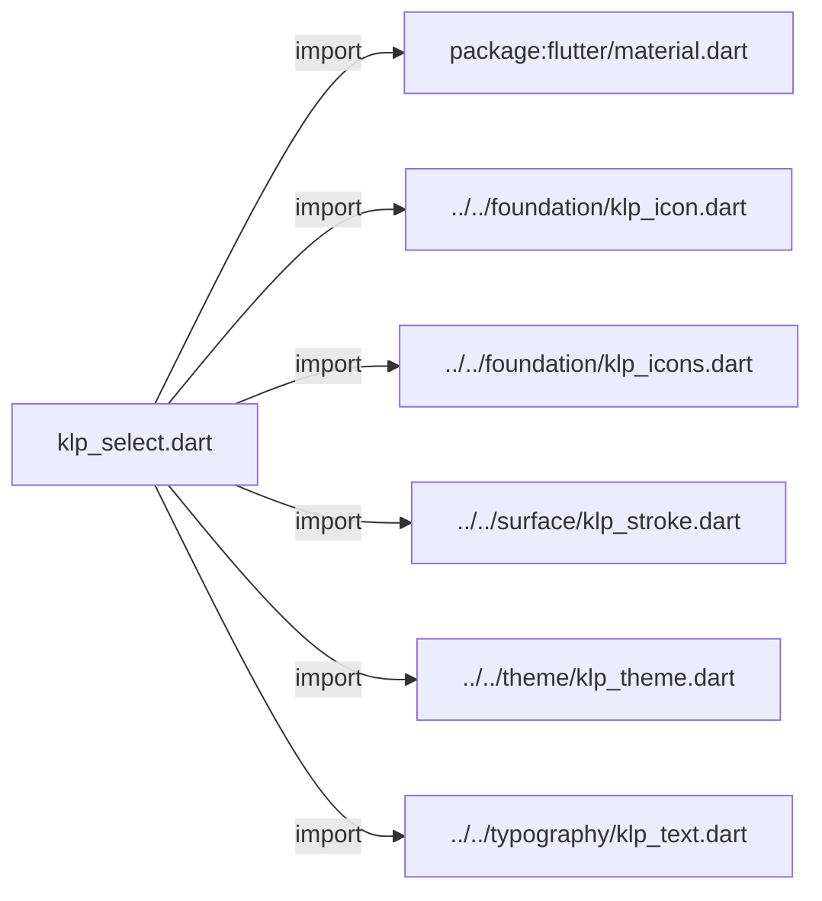
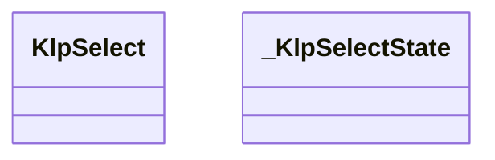
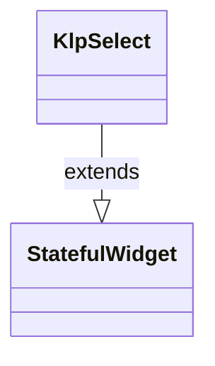
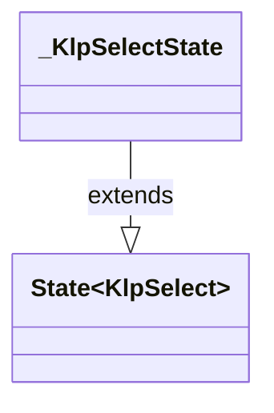

# klp_select.dart：直接依賴與宣告架構

[回到目錄](README.md) · [來源檔案](../../../../../lib/src/controls/selection/klp_select.dart)

## 範圍

核心是 `lib/src/controls/selection/klp_select.dart`。主要視角為該檔案明寫的 import／export／part；輔助視角為本檔宣告及 extends／implements／with／on 關係。只展開一層外部邊界。

## 直接依賴圖

## 依賴證據

| 關係 | 原始 directive | 來源 |
|---|---|---|
| import | <code>import &#x27;package:flutter/material.dart&#x27;;</code> | [lib/src/controls/selection/klp_select.dart:1](../../../../../lib/src/controls/selection/klp_select.dart#L1) |
| import | <code>import &#x27;../../foundation/klp_icon.dart&#x27;;</code> | [lib/src/controls/selection/klp_select.dart:3](../../../../../lib/src/controls/selection/klp_select.dart#L3) |
| import | <code>import &#x27;../../foundation/klp_icons.dart&#x27;;</code> | [lib/src/controls/selection/klp_select.dart:4](../../../../../lib/src/controls/selection/klp_select.dart#L4) |
| import | <code>import &#x27;../../surface/klp_stroke.dart&#x27;;</code> | [lib/src/controls/selection/klp_select.dart:5](../../../../../lib/src/controls/selection/klp_select.dart#L5) |
| import | <code>import &#x27;../../theme/klp_theme.dart&#x27;;</code> | [lib/src/controls/selection/klp_select.dart:6](../../../../../lib/src/controls/selection/klp_select.dart#L6) |
| import | <code>import &#x27;../../typography/klp_text.dart&#x27;;</code> | [lib/src/controls/selection/klp_select.dart:7](../../../../../lib/src/controls/selection/klp_select.dart#L7) |

## 宣告關係圖

本組節點是本檔宣告；沒有箭頭的宣告未在此圖主張互相依賴。

## 宣告與成員證據

成員包含 public 與 private；簽章取自來源，省略函式本體與欄位初始值。`(inferred)` 表示來源未明寫型別；建構子只顯示參數部分，不含初始化列表。

### KlpSelect

ClassDeclaration · public · [lib/src/controls/selection/klp_select.dart:9](../../../../../lib/src/controls/selection/klp_select.dart#L9)

<code>class KlpSelect extends StatefulWidget</code>

來源註解摘要：下拉選擇的觸發器。**它只負責顯示目前的值與觸發 `onPressed`**，選單本身由呼叫端 以 `KlpMenu` 開啟——選項來源是產品資料，不屬於視覺層。

- `extends` → <code>StatefulWidget</code>：[lib/src/controls/selection/klp_select.dart:11](../../../../../lib/src/controls/selection/klp_select.dart#L11)

| 成員 | 可見性 | 簽章／型別 | 來源註解摘要 | 證據 |
|---|---|---|---|---|
| constructor <code>KlpSelect</code> | public | <code>const KlpSelect({ super.key, required this.label, required this.value, required this.onPressed, this.enabled = true, })</code> |  | [lib/src/controls/selection/klp_select.dart:12](../../../../../lib/src/controls/selection/klp_select.dart#L12) |
| field <code>label</code> | public | <code>final String label</code> |  | [lib/src/controls/selection/klp_select.dart:20](../../../../../lib/src/controls/selection/klp_select.dart#L20) |
| field <code>value</code> | public | <code>final String value</code> |  | [lib/src/controls/selection/klp_select.dart:21](../../../../../lib/src/controls/selection/klp_select.dart#L21) |
| field <code>onPressed</code> | public | <code>final VoidCallback onPressed</code> |  | [lib/src/controls/selection/klp_select.dart:22](../../../../../lib/src/controls/selection/klp_select.dart#L22) |
| field <code>enabled</code> | public | <code>final bool enabled</code> |  | [lib/src/controls/selection/klp_select.dart:23](../../../../../lib/src/controls/selection/klp_select.dart#L23) |
| method <code>createState</code> | public | <code>State&lt;KlpSelect&gt; createState()</code> |  | [lib/src/controls/selection/klp_select.dart:25](../../../../../lib/src/controls/selection/klp_select.dart#L25) |

### _KlpSelectState

ClassDeclaration · private · [lib/src/controls/selection/klp_select.dart:29](../../../../../lib/src/controls/selection/klp_select.dart#L29)

<code>class _KlpSelectState extends State&lt;KlpSelect&gt;</code>

- `extends` → <code>State&lt;KlpSelect&gt;</code>：[lib/src/controls/selection/klp_select.dart:29](../../../../../lib/src/controls/selection/klp_select.dart#L29)

| 成員 | 可見性 | 簽章／型別 | 來源註解摘要 | 證據 |
|---|---|---|---|---|
| field <code>_hovered</code> | private | <code>bool _hovered</code> |  | [lib/src/controls/selection/klp_select.dart:30](../../../../../lib/src/controls/selection/klp_select.dart#L30) |
| field <code>_focused</code> | private | <code>bool _focused</code> |  | [lib/src/controls/selection/klp_select.dart:31](../../../../../lib/src/controls/selection/klp_select.dart#L31) |
| method <code>build</code> | public | <code>Widget build(BuildContext context)</code> |  | [lib/src/controls/selection/klp_select.dart:33](../../../../../lib/src/controls/selection/klp_select.dart#L33) |

## 閱讀說明與限制

箭頭只表示來源明寫的靜態關係；import 不等於呼叫。未分析動態呼叫、欄位的實際物件擁有權、狀態轉移或渲染流程；型別未進行語意解析，繼承目標保留原始型別拼寫。public／private 依 Dart 名稱前綴判斷；public 宣告不代表已由 `lib/kallopis.dart` 匯出。

本頁由 `tool/architecture_atlas` 產生；編輯來源或生成工具後重新產生，避免手改本頁。
