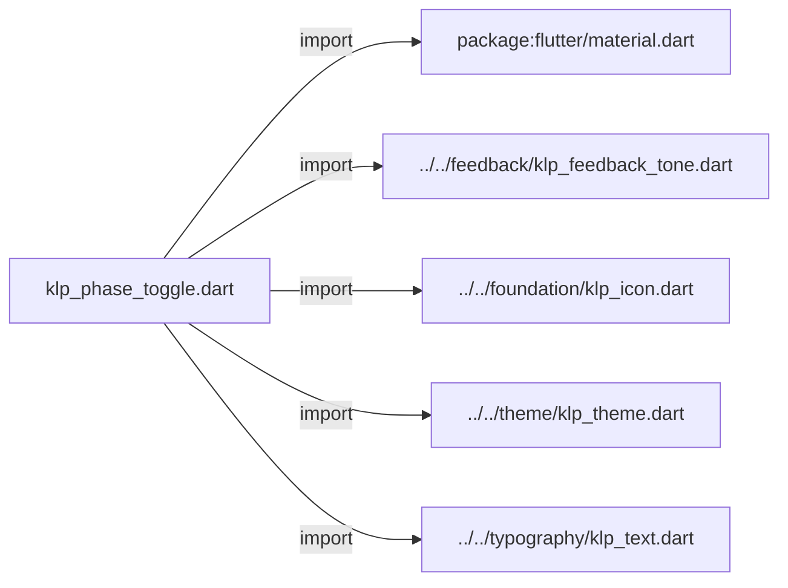
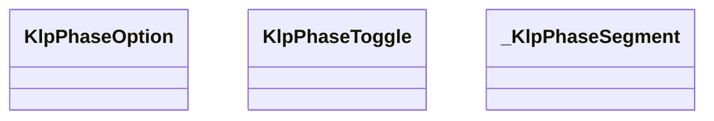
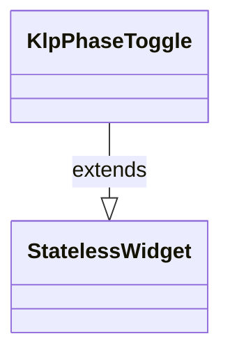
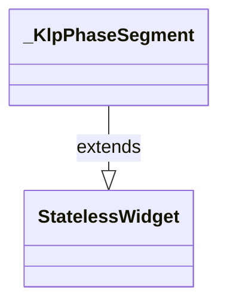

# klp_phase_toggle.dart：直接依賴與宣告架構

[回到目錄](README.md) · [來源檔案](../../../../../lib/src/controls/toggle/klp_phase_toggle.dart)

## 範圍

核心是 `lib/src/controls/toggle/klp_phase_toggle.dart`。主要視角為該檔案明寫的 import／export／part；輔助視角為本檔宣告及 extends／implements／with／on 關係。只展開一層外部邊界。

## 直接依賴圖

## 依賴證據

| 關係 | 原始 directive | 來源 |
|---|---|---|
| import | <code>import &#x27;package:flutter/material.dart&#x27;;</code> | [lib/src/controls/toggle/klp_phase_toggle.dart:1](../../../../../lib/src/controls/toggle/klp_phase_toggle.dart#L1) |
| import | <code>import &#x27;../../feedback/klp_feedback_tone.dart&#x27;;</code> | [lib/src/controls/toggle/klp_phase_toggle.dart:3](../../../../../lib/src/controls/toggle/klp_phase_toggle.dart#L3) |
| import | <code>import &#x27;../../foundation/klp_icon.dart&#x27;;</code> | [lib/src/controls/toggle/klp_phase_toggle.dart:4](../../../../../lib/src/controls/toggle/klp_phase_toggle.dart#L4) |
| import | <code>import &#x27;../../theme/klp_theme.dart&#x27;;</code> | [lib/src/controls/toggle/klp_phase_toggle.dart:5](../../../../../lib/src/controls/toggle/klp_phase_toggle.dart#L5) |
| import | <code>import &#x27;../../typography/klp_text.dart&#x27;;</code> | [lib/src/controls/toggle/klp_phase_toggle.dart:6](../../../../../lib/src/controls/toggle/klp_phase_toggle.dart#L6) |

## 宣告關係圖

本組節點是本檔宣告；沒有箭頭的宣告未在此圖主張互相依賴。

## 宣告與成員證據

成員包含 public 與 private；簽章取自來源，省略函式本體與欄位初始值。`(inferred)` 表示來源未明寫型別；建構子只顯示參數部分，不含初始化列表。

### KlpPhaseOption

ClassDeclaration · public · [lib/src/controls/toggle/klp_phase_toggle.dart:8](../../../../../lib/src/controls/toggle/klp_phase_toggle.dart#L8)

<code>class KlpPhaseOption&lt;T&gt;</code>

來源註解摘要：階段選項資料。包含選項值、文字標籤或圖示，與啟用時的語意色調。

| 成員 | 可見性 | 簽章／型別 | 來源註解摘要 | 證據 |
|---|---|---|---|---|
| constructor <code>KlpPhaseOption</code> | public | <code>const KlpPhaseOption({ required this.value, this.label, this.icon, this.activeTone, this.activeColor, })</code> |  | [lib/src/controls/toggle/klp_phase_toggle.dart:11](../../../../../lib/src/controls/toggle/klp_phase_toggle.dart#L11) |
| field <code>value</code> | public | <code>final T value</code> |  | [lib/src/controls/toggle/klp_phase_toggle.dart:19](../../../../../lib/src/controls/toggle/klp_phase_toggle.dart#L19) |
| field <code>label</code> | public | <code>final String? label</code> |  | [lib/src/controls/toggle/klp_phase_toggle.dart:20](../../../../../lib/src/controls/toggle/klp_phase_toggle.dart#L20) |
| field <code>icon</code> | public | <code>final KlpIconData? icon</code> |  | [lib/src/controls/toggle/klp_phase_toggle.dart:21](../../../../../lib/src/controls/toggle/klp_phase_toggle.dart#L21) |
| field <code>activeTone</code> | public | <code>final KlpFeedbackTone? activeTone</code> |  | [lib/src/controls/toggle/klp_phase_toggle.dart:22](../../../../../lib/src/controls/toggle/klp_phase_toggle.dart#L22) |
| field <code>activeColor</code> | public | <code>final Color? activeColor</code> |  | [lib/src/controls/toggle/klp_phase_toggle.dart:23](../../../../../lib/src/controls/toggle/klp_phase_toggle.dart#L23) |

### KlpPhaseToggle

ClassDeclaration · public · [lib/src/controls/toggle/klp_phase_toggle.dart:26](../../../../../lib/src/controls/toggle/klp_phase_toggle.dart#L26)

<code>class KlpPhaseToggle&lt;T&gt; extends StatelessWidget</code>

來源註解摘要：階段／多態切換按鈕組 (Phase Toggle)。 邊框軌道、正方形分段，寬度隨選項數量延展。支援二態、三態與多選項目。

- `extends` → <code>StatelessWidget</code>：[lib/src/controls/toggle/klp_phase_toggle.dart:29](../../../../../lib/src/controls/toggle/klp_phase_toggle.dart#L29)

| 成員 | 可見性 | 簽章／型別 | 來源註解摘要 | 證據 |
|---|---|---|---|---|
| constructor <code>KlpPhaseToggle</code> | public | <code>const KlpPhaseToggle({ super.key, required this.options, required this.selected, this.onSelected, this.enabled = true, })</code> |  | [lib/src/controls/toggle/klp_phase_toggle.dart:30](../../../../../lib/src/controls/toggle/klp_phase_toggle.dart#L30) |
| field <code>options</code> | public | <code>final List&lt;KlpPhaseOption&lt;T&gt;&gt; options</code> |  | [lib/src/controls/toggle/klp_phase_toggle.dart:38](../../../../../lib/src/controls/toggle/klp_phase_toggle.dart#L38) |
| field <code>selected</code> | public | <code>final T? selected</code> |  | [lib/src/controls/toggle/klp_phase_toggle.dart:39](../../../../../lib/src/controls/toggle/klp_phase_toggle.dart#L39) |
| field <code>onSelected</code> | public | <code>final ValueChanged&lt;T&gt;? onSelected</code> |  | [lib/src/controls/toggle/klp_phase_toggle.dart:40](../../../../../lib/src/controls/toggle/klp_phase_toggle.dart#L40) |
| field <code>enabled</code> | public | <code>final bool enabled</code> |  | [lib/src/controls/toggle/klp_phase_toggle.dart:41](../../../../../lib/src/controls/toggle/klp_phase_toggle.dart#L41) |
| method <code>build</code> | public | <code>Widget build(BuildContext context)</code> |  | [lib/src/controls/toggle/klp_phase_toggle.dart:43](../../../../../lib/src/controls/toggle/klp_phase_toggle.dart#L43) |

### _KlpPhaseSegment

ClassDeclaration · private · [lib/src/controls/toggle/klp_phase_toggle.dart:124](../../../../../lib/src/controls/toggle/klp_phase_toggle.dart#L124)

<code>class _KlpPhaseSegment&lt;T&gt; extends StatelessWidget</code>

- `extends` → <code>StatelessWidget</code>：[lib/src/controls/toggle/klp_phase_toggle.dart:124](../../../../../lib/src/controls/toggle/klp_phase_toggle.dart#L124)

| 成員 | 可見性 | 簽章／型別 | 來源註解摘要 | 證據 |
|---|---|---|---|---|
| constructor <code>_KlpPhaseSegment</code> | private | <code>const _KlpPhaseSegment({ required this.option, required this.selected, required this.enabled, required this.size, required this.onTap, })</code> |  | [lib/src/controls/toggle/klp_phase_toggle.dart:125](../../../../../lib/src/controls/toggle/klp_phase_toggle.dart#L125) |
| field <code>option</code> | public | <code>final KlpPhaseOption&lt;T&gt; option</code> |  | [lib/src/controls/toggle/klp_phase_toggle.dart:133](../../../../../lib/src/controls/toggle/klp_phase_toggle.dart#L133) |
| field <code>selected</code> | public | <code>final bool selected</code> |  | [lib/src/controls/toggle/klp_phase_toggle.dart:134](../../../../../lib/src/controls/toggle/klp_phase_toggle.dart#L134) |
| field <code>enabled</code> | public | <code>final bool enabled</code> |  | [lib/src/controls/toggle/klp_phase_toggle.dart:135](../../../../../lib/src/controls/toggle/klp_phase_toggle.dart#L135) |
| field <code>size</code> | public | <code>final double size</code> |  | [lib/src/controls/toggle/klp_phase_toggle.dart:136](../../../../../lib/src/controls/toggle/klp_phase_toggle.dart#L136) |
| field <code>onTap</code> | public | <code>final VoidCallback? onTap</code> |  | [lib/src/controls/toggle/klp_phase_toggle.dart:137](../../../../../lib/src/controls/toggle/klp_phase_toggle.dart#L137) |
| method <code>build</code> | public | <code>Widget build(BuildContext context)</code> |  | [lib/src/controls/toggle/klp_phase_toggle.dart:139](../../../../../lib/src/controls/toggle/klp_phase_toggle.dart#L139) |

## 閱讀說明與限制

箭頭只表示來源明寫的靜態關係；import 不等於呼叫。未分析動態呼叫、欄位的實際物件擁有權、狀態轉移或渲染流程；型別未進行語意解析，繼承目標保留原始型別拼寫。public／private 依 Dart 名稱前綴判斷；public 宣告不代表已由 `lib/kallopis.dart` 匯出。

本頁由 `tool/architecture_atlas` 產生；編輯來源或生成工具後重新產生，避免手改本頁。
