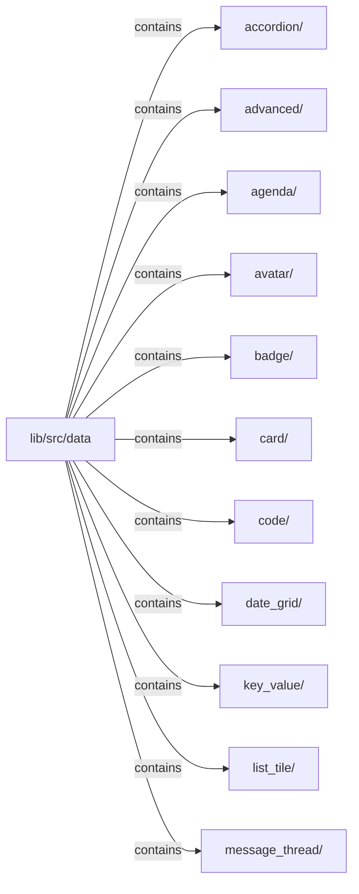
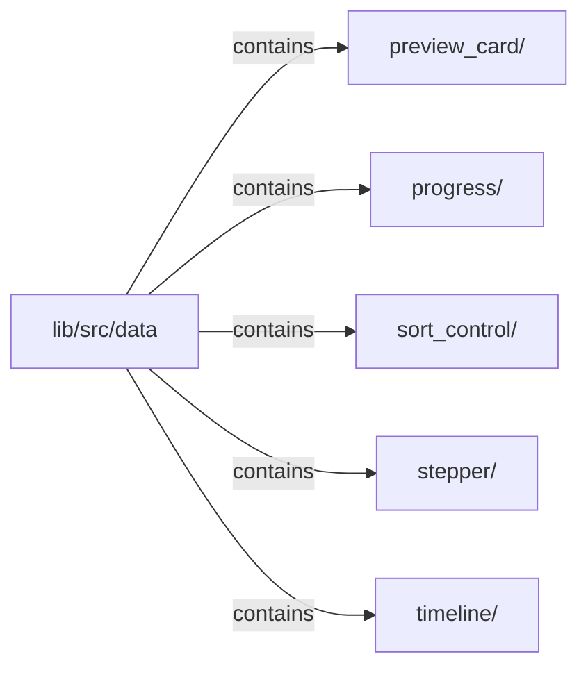

# lib/src/data：架構分析入口

[上一層](../README.md)

## 範圍

閱讀 `lib/src/data` 的直接子目錄與 Dart 檔案。結構圖表示實際檔案包含關係；依賴圖表示本層檔案明寫的 directives。每個檔案頁另列直接依賴、宣告、欄位、方法、建構子及行號證據。

## 模組閱讀重點

## 分析入口

此目錄集中資料的視覺呈現元件，包括表格、樹、訊息、日期與進度；入口應依呈現類型選擇。`KlpDataTable` 與 `KlpTree` 共置於 advanced data 檔，不能將一個檔案誤畫成一個類別。此目錄目前沒有巢狀子目錄。

| 想回答的問題 | 精確符號與來源 |
| --- | --- |
| 表格列與欄的資料形狀在哪裡？ | `KlpDataColumn`、`KlpDataRow`：lib/src/data/klp_advanced_data.dart:21、64 |
| 表格與樹各自從哪裡建構？ | `KlpDataTable`、`KlpTree`：lib/src/data/klp_advanced_data.dart:76、316 |
| 訊息容器與單則訊息如何分工？ | `KlpMessageThread`、`KlpMessageBubble`：lib/src/data/klp_message_thread.dart:68、11 |

重要依賴：`klp_message_thread.dart:3` 匯入 `KlpButton` 所在模組；同檔 :4、:6 匯入 surface 與 typography。這些證據表示靜態來源依賴，不代表資料載入或執行時呼叫順序。

## 本層直接依賴圖

箭頭以本層 Dart 檔案明寫的 directive 彙總到目標所在目錄或外部套件邊界；不遞迴將子目錄依賴算入本層。相同目標的不同 directive 類型分開計數。

本層檔案未宣告跨目錄依賴；子目錄依賴請循下一層入口閱讀。

| 目標邊界 | 關係 | directive 數 | 第一筆來源證據 |
|---|---|---|---|
| 無 | — | 0 | 來源清單見本層檔案 |

## 目錄結構圖

## 子目錄

| 目錄 | 導航 | 來源證據 |
|---|---|---|
| `accordion/` | [架構入口](accordion/README.md) | [來源目錄](../../../../lib/src/data/accordion) |
| `advanced/` | [架構入口](advanced/README.md) | [來源目錄](../../../../lib/src/data/advanced) |
| `agenda/` | [架構入口](agenda/README.md) | [來源目錄](../../../../lib/src/data/agenda) |
| `avatar/` | [架構入口](avatar/README.md) | [來源目錄](../../../../lib/src/data/avatar) |
| `badge/` | [架構入口](badge/README.md) | [來源目錄](../../../../lib/src/data/badge) |
| `card/` | [架構入口](card/README.md) | [來源目錄](../../../../lib/src/data/card) |
| `code/` | [架構入口](code/README.md) | [來源目錄](../../../../lib/src/data/code) |
| `date_grid/` | [架構入口](date_grid/README.md) | [來源目錄](../../../../lib/src/data/date_grid) |
| `key_value/` | [架構入口](key_value/README.md) | [來源目錄](../../../../lib/src/data/key_value) |
| `list_tile/` | [架構入口](list_tile/README.md) | [來源目錄](../../../../lib/src/data/list_tile) |
| `message_thread/` | [架構入口](message_thread/README.md) | [來源目錄](../../../../lib/src/data/message_thread) |
| `preview_card/` | [架構入口](preview_card/README.md) | [來源目錄](../../../../lib/src/data/preview_card) |
| `progress/` | [架構入口](progress/README.md) | [來源目錄](../../../../lib/src/data/progress) |
| `sort_control/` | [架構入口](sort_control/README.md) | [來源目錄](../../../../lib/src/data/sort_control) |
| `stepper/` | [架構入口](stepper/README.md) | [來源目錄](../../../../lib/src/data/stepper) |
| `timeline/` | [架構入口](timeline/README.md) | [來源目錄](../../../../lib/src/data/timeline) |

## 本層檔案

| 檔案 | 宣告 | 細節 | 來源證據 |
|---|---|---|---|
| 無 | 本層沒有 Dart 檔案 | — | — |

## 閱讀說明

箭頭只表示來源明寫的靜態關係；import 不等於呼叫。未分析動態呼叫、欄位的實際物件擁有權、狀態轉移或渲染流程；型別未進行語意解析，繼承目標保留原始型別拼寫。public／private 依 Dart 名稱前綴判斷；public 宣告不代表已由 `lib/kallopis.dart` 匯出。

本頁的目錄與檔案由來源清冊產生；`manifest.json` 位於本圖集根目錄，可核對 SHA-256 與覆蓋數。人工模組摘要存於 `tool/architecture_atlas/briefs/`，重新生成時保留。
