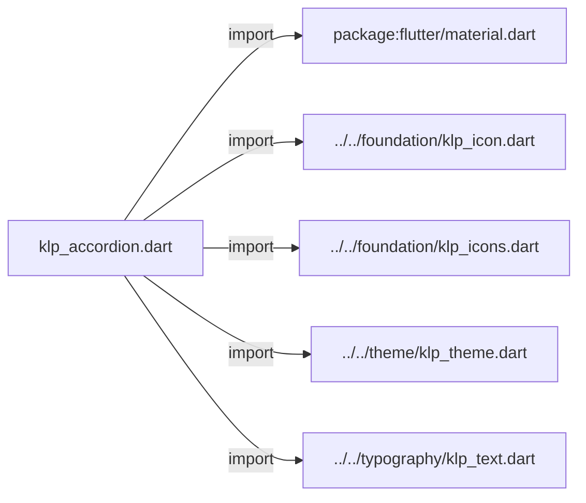
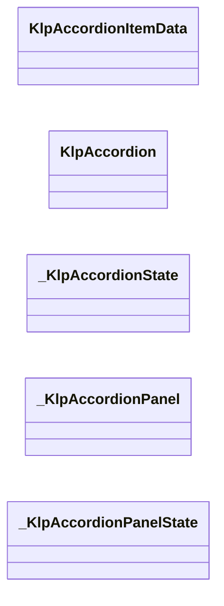
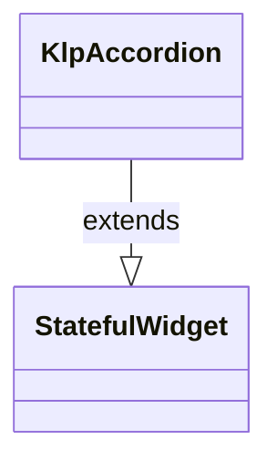
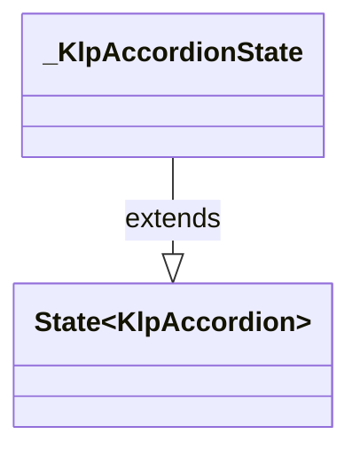
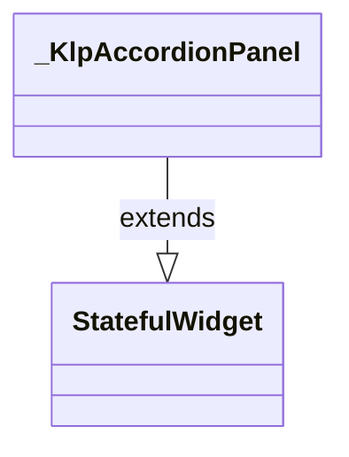
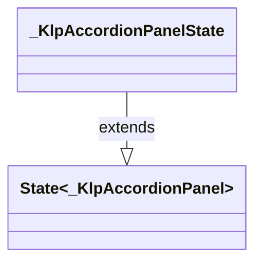

# klp_accordion.dart：直接依賴與宣告架構

[回到目錄](README.md) · [來源檔案](../../../../../lib/src/data/accordion/klp_accordion.dart)

## 範圍

核心是 `lib/src/data/accordion/klp_accordion.dart`。主要視角為該檔案明寫的 import／export／part；輔助視角為本檔宣告及 extends／implements／with／on 關係。只展開一層外部邊界。

## 直接依賴圖

## 依賴證據

| 關係 | 原始 directive | 來源 |
|---|---|---|
| import | <code>import &#x27;package:flutter/material.dart&#x27;;</code> | [lib/src/data/accordion/klp_accordion.dart:1](../../../../../lib/src/data/accordion/klp_accordion.dart#L1) |
| import | <code>import &#x27;../../foundation/klp_icon.dart&#x27;;</code> | [lib/src/data/accordion/klp_accordion.dart:3](../../../../../lib/src/data/accordion/klp_accordion.dart#L3) |
| import | <code>import &#x27;../../foundation/klp_icons.dart&#x27;;</code> | [lib/src/data/accordion/klp_accordion.dart:4](../../../../../lib/src/data/accordion/klp_accordion.dart#L4) |
| import | <code>import &#x27;../../theme/klp_theme.dart&#x27;;</code> | [lib/src/data/accordion/klp_accordion.dart:5](../../../../../lib/src/data/accordion/klp_accordion.dart#L5) |
| import | <code>import &#x27;../../typography/klp_text.dart&#x27;;</code> | [lib/src/data/accordion/klp_accordion.dart:6](../../../../../lib/src/data/accordion/klp_accordion.dart#L6) |

## 宣告關係圖

本組節點是本檔宣告；沒有箭頭的宣告未在此圖主張互相依賴。

## 宣告與成員證據

成員包含 public 與 private；簽章取自來源，省略函式本體與欄位初始值。`(inferred)` 表示來源未明寫型別；建構子只顯示參數部分，不含初始化列表。

### KlpAccordionItemData

ClassDeclaration · public · [lib/src/data/accordion/klp_accordion.dart:8](../../../../../lib/src/data/accordion/klp_accordion.dart#L8)

<code>class KlpAccordionItemData</code>

來源註解摘要：[KlpAccordion] 裡的單一可摺疊項目。 [id] 在同一個 [KlpAccordion] 內須唯一，用來追蹤展開狀態；[child] 是展開後顯示的 內容——它何時被建構、狀態如何保留由呼叫端決定，這裡不快取也不知道內容是什麼。

| 成員 | 可見性 | 簽章／型別 | 來源註解摘要 | 證據 |
|---|---|---|---|---|
| constructor <code>KlpAccordionItemData</code> | public | <code>const KlpAccordionItemData({ required this.id, required this.title, required this.child, this.subtitle, })</code> |  | [lib/src/data/accordion/klp_accordion.dart:14](../../../../../lib/src/data/accordion/klp_accordion.dart#L14) |
| field <code>id</code> | public | <code>final String id</code> |  | [lib/src/data/accordion/klp_accordion.dart:21](../../../../../lib/src/data/accordion/klp_accordion.dart#L21) |
| field <code>title</code> | public | <code>final String title</code> |  | [lib/src/data/accordion/klp_accordion.dart:22](../../../../../lib/src/data/accordion/klp_accordion.dart#L22) |
| field <code>subtitle</code> | public | <code>final String? subtitle</code> |  | [lib/src/data/accordion/klp_accordion.dart:23](../../../../../lib/src/data/accordion/klp_accordion.dart#L23) |
| field <code>child</code> | public | <code>final Widget child</code> |  | [lib/src/data/accordion/klp_accordion.dart:24](../../../../../lib/src/data/accordion/klp_accordion.dart#L24) |

### KlpAccordion

ClassDeclaration · public · [lib/src/data/accordion/klp_accordion.dart:27](../../../../../lib/src/data/accordion/klp_accordion.dart#L27)

<code>class KlpAccordion extends StatefulWidget</code>

來源註解摘要：可摺疊的內容區清單。 [multiple] 為 `false`（預設）時同一時間只能展開一項，再點其他標題會先收合原本 展開的那項；為 `true` 時各項互不影響。展開狀態是暫存的 UI 狀態而非產品資料， 因此元件自行持有——需要預先展開特定項目或觀察變化時用 [initialExpandedIds] 與 [onExpandedChanged]。

- `extends` → <code>StatefulWidget</code>：[lib/src/data/accordion/klp_accordion.dart:33](../../../../../lib/src/data/accordion/klp_accordion.dart#L33)

| 成員 | 可見性 | 簽章／型別 | 來源註解摘要 | 證據 |
|---|---|---|---|---|
| constructor <code>KlpAccordion</code> | public | <code>const KlpAccordion({ super.key, required this.items, this.multiple = false, this.initialExpandedIds = const &lt;String&gt;{}, this.onExpandedChanged, })</code> |  | [lib/src/data/accordion/klp_accordion.dart:34](../../../../../lib/src/data/accordion/klp_accordion.dart#L34) |
| field <code>items</code> | public | <code>final List&lt;KlpAccordionItemData&gt; items</code> |  | [lib/src/data/accordion/klp_accordion.dart:42](../../../../../lib/src/data/accordion/klp_accordion.dart#L42) |
| field <code>multiple</code> | public | <code>final bool multiple</code> |  | [lib/src/data/accordion/klp_accordion.dart:43](../../../../../lib/src/data/accordion/klp_accordion.dart#L43) |
| field <code>initialExpandedIds</code> | public | <code>final Set&lt;String&gt; initialExpandedIds</code> |  | [lib/src/data/accordion/klp_accordion.dart:44](../../../../../lib/src/data/accordion/klp_accordion.dart#L44) |
| field <code>onExpandedChanged</code> | public | <code>final ValueChanged&lt;Set&lt;String&gt;&gt;? onExpandedChanged</code> |  | [lib/src/data/accordion/klp_accordion.dart:45](../../../../../lib/src/data/accordion/klp_accordion.dart#L45) |
| method <code>createState</code> | public | <code>State&lt;KlpAccordion&gt; createState()</code> |  | [lib/src/data/accordion/klp_accordion.dart:47](../../../../../lib/src/data/accordion/klp_accordion.dart#L47) |

### _KlpAccordionState

ClassDeclaration · private · [lib/src/data/accordion/klp_accordion.dart:51](../../../../../lib/src/data/accordion/klp_accordion.dart#L51)

<code>class _KlpAccordionState extends State&lt;KlpAccordion&gt;</code>

- `extends` → <code>State&lt;KlpAccordion&gt;</code>：[lib/src/data/accordion/klp_accordion.dart:51](../../../../../lib/src/data/accordion/klp_accordion.dart#L51)

| 成員 | 可見性 | 簽章／型別 | 來源註解摘要 | 證據 |
|---|---|---|---|---|
| field <code>_expandedIds</code> | private | <code>late Set&lt;String&gt; _expandedIds</code> |  | [lib/src/data/accordion/klp_accordion.dart:52](../../../../../lib/src/data/accordion/klp_accordion.dart#L52) |
| method <code>initState</code> | public | <code>void initState()</code> |  | [lib/src/data/accordion/klp_accordion.dart:54](../../../../../lib/src/data/accordion/klp_accordion.dart#L54) |
| method <code>_toggle</code> | private | <code>void _toggle(String id)</code> |  | [lib/src/data/accordion/klp_accordion.dart:60](../../../../../lib/src/data/accordion/klp_accordion.dart#L60) |
| method <code>build</code> | public | <code>Widget build(BuildContext context)</code> |  | [lib/src/data/accordion/klp_accordion.dart:76](../../../../../lib/src/data/accordion/klp_accordion.dart#L76) |

### _KlpAccordionPanel

ClassDeclaration · private · [lib/src/data/accordion/klp_accordion.dart:96](../../../../../lib/src/data/accordion/klp_accordion.dart#L96)

<code>class _KlpAccordionPanel extends StatefulWidget</code>

- `extends` → <code>StatefulWidget</code>：[lib/src/data/accordion/klp_accordion.dart:96](../../../../../lib/src/data/accordion/klp_accordion.dart#L96)

| 成員 | 可見性 | 簽章／型別 | 來源註解摘要 | 證據 |
|---|---|---|---|---|
| constructor <code>_KlpAccordionPanel</code> | private | <code>const _KlpAccordionPanel({ required this.item, required this.expanded, required this.onToggle, })</code> |  | [lib/src/data/accordion/klp_accordion.dart:97](../../../../../lib/src/data/accordion/klp_accordion.dart#L97) |
| field <code>item</code> | public | <code>final KlpAccordionItemData item</code> |  | [lib/src/data/accordion/klp_accordion.dart:103](../../../../../lib/src/data/accordion/klp_accordion.dart#L103) |
| field <code>expanded</code> | public | <code>final bool expanded</code> |  | [lib/src/data/accordion/klp_accordion.dart:104](../../../../../lib/src/data/accordion/klp_accordion.dart#L104) |
| field <code>onToggle</code> | public | <code>final VoidCallback onToggle</code> |  | [lib/src/data/accordion/klp_accordion.dart:105](../../../../../lib/src/data/accordion/klp_accordion.dart#L105) |
| method <code>createState</code> | public | <code>State&lt;_KlpAccordionPanel&gt; createState()</code> |  | [lib/src/data/accordion/klp_accordion.dart:107](../../../../../lib/src/data/accordion/klp_accordion.dart#L107) |

### _KlpAccordionPanelState

ClassDeclaration · private · [lib/src/data/accordion/klp_accordion.dart:111](../../../../../lib/src/data/accordion/klp_accordion.dart#L111)

<code>class _KlpAccordionPanelState extends State&lt;_KlpAccordionPanel&gt;</code>

- `extends` → <code>State&lt;_KlpAccordionPanel&gt;</code>：[lib/src/data/accordion/klp_accordion.dart:111](../../../../../lib/src/data/accordion/klp_accordion.dart#L111)

| 成員 | 可見性 | 簽章／型別 | 來源註解摘要 | 證據 |
|---|---|---|---|---|
| field <code>_hovered</code> | private | <code>bool _hovered</code> |  | [lib/src/data/accordion/klp_accordion.dart:112](../../../../../lib/src/data/accordion/klp_accordion.dart#L112) |
| field <code>_focused</code> | private | <code>bool _focused</code> |  | [lib/src/data/accordion/klp_accordion.dart:113](../../../../../lib/src/data/accordion/klp_accordion.dart#L113) |
| method <code>build</code> | public | <code>Widget build(BuildContext context)</code> |  | [lib/src/data/accordion/klp_accordion.dart:115](../../../../../lib/src/data/accordion/klp_accordion.dart#L115) |

## 閱讀說明與限制

箭頭只表示來源明寫的靜態關係；import 不等於呼叫。未分析動態呼叫、欄位的實際物件擁有權、狀態轉移或渲染流程；型別未進行語意解析，繼承目標保留原始型別拼寫。public／private 依 Dart 名稱前綴判斷；public 宣告不代表已由 `lib/kallopis.dart` 匯出。

本頁由 `tool/architecture_atlas` 產生；編輯來源或生成工具後重新產生，避免手改本頁。
