# klp_advanced_data.dart：直接依賴與宣告架構

[回到目錄](README.md) · [來源檔案](../../../../../lib/src/data/advanced/klp_advanced_data.dart)

## 範圍

核心是 `lib/src/data/advanced/klp_advanced_data.dart`。主要視角為該檔案明寫的 import／export／part；輔助視角為本檔宣告及 extends／implements／with／on 關係。只展開一層外部邊界。

## 直接依賴圖

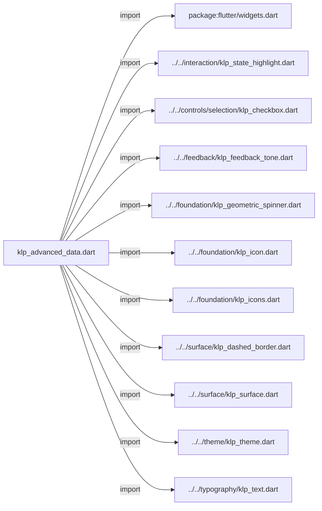

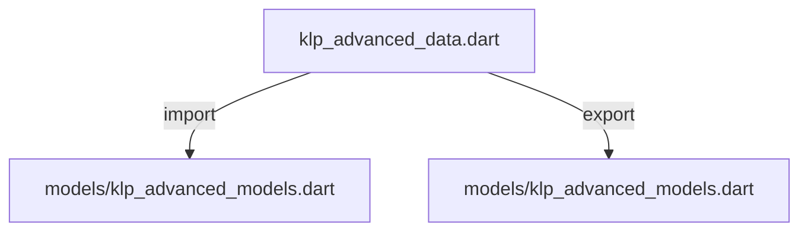

## 依賴證據

| 關係 | 原始 directive | 來源 |
|---|---|---|
| import | <code>import &#x27;package:flutter/widgets.dart&#x27;;</code> | [lib/src/data/advanced/klp_advanced_data.dart:1](../../../../../lib/src/data/advanced/klp_advanced_data.dart#L1) |
| import | <code>import &#x27;../../interaction/klp_state_highlight.dart&#x27;;</code> | [lib/src/data/advanced/klp_advanced_data.dart:3](../../../../../lib/src/data/advanced/klp_advanced_data.dart#L3) |
| import | <code>import &#x27;../../controls/selection/klp_checkbox.dart&#x27;;</code> | [lib/src/data/advanced/klp_advanced_data.dart:4](../../../../../lib/src/data/advanced/klp_advanced_data.dart#L4) |
| import | <code>import &#x27;../../feedback/klp_feedback_tone.dart&#x27;;</code> | [lib/src/data/advanced/klp_advanced_data.dart:5](../../../../../lib/src/data/advanced/klp_advanced_data.dart#L5) |
| import | <code>import &#x27;../../foundation/klp_geometric_spinner.dart&#x27;;</code> | [lib/src/data/advanced/klp_advanced_data.dart:6](../../../../../lib/src/data/advanced/klp_advanced_data.dart#L6) |
| import | <code>import &#x27;../../foundation/klp_icon.dart&#x27;;</code> | [lib/src/data/advanced/klp_advanced_data.dart:7](../../../../../lib/src/data/advanced/klp_advanced_data.dart#L7) |
| import | <code>import &#x27;../../foundation/klp_icons.dart&#x27;;</code> | [lib/src/data/advanced/klp_advanced_data.dart:8](../../../../../lib/src/data/advanced/klp_advanced_data.dart#L8) |
| import | <code>import &#x27;../../surface/klp_dashed_border.dart&#x27;;</code> | [lib/src/data/advanced/klp_advanced_data.dart:9](../../../../../lib/src/data/advanced/klp_advanced_data.dart#L9) |
| import | <code>import &#x27;../../surface/klp_surface.dart&#x27;;</code> | [lib/src/data/advanced/klp_advanced_data.dart:10](../../../../../lib/src/data/advanced/klp_advanced_data.dart#L10) |
| import | <code>import &#x27;../../theme/klp_theme.dart&#x27;;</code> | [lib/src/data/advanced/klp_advanced_data.dart:11](../../../../../lib/src/data/advanced/klp_advanced_data.dart#L11) |
| import | <code>import &#x27;../../typography/klp_text.dart&#x27;;</code> | [lib/src/data/advanced/klp_advanced_data.dart:12](../../../../../lib/src/data/advanced/klp_advanced_data.dart#L12) |
| import | <code>import &#x27;models/klp_advanced_models.dart&#x27;;</code> | [lib/src/data/advanced/klp_advanced_data.dart:13](../../../../../lib/src/data/advanced/klp_advanced_data.dart#L13) |
| export | <code>export &#x27;models/klp_advanced_models.dart&#x27;;</code> | [lib/src/data/advanced/klp_advanced_data.dart:15](../../../../../lib/src/data/advanced/klp_advanced_data.dart#L15) |

## 宣告關係圖

本組節點是本檔宣告；沒有箭頭的宣告未在此圖主張互相依賴。

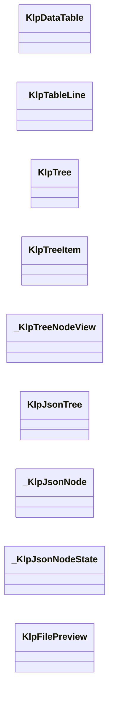

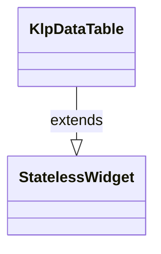

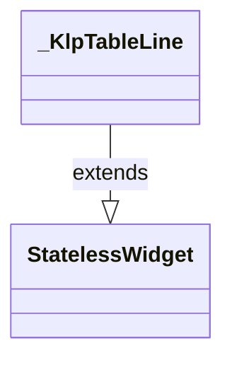

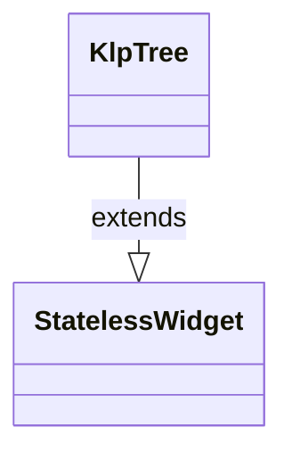

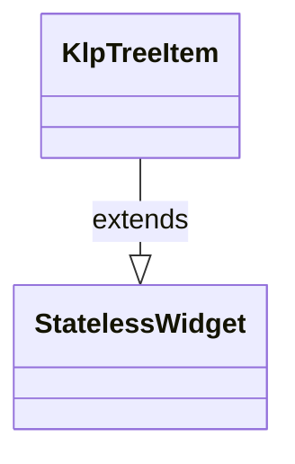

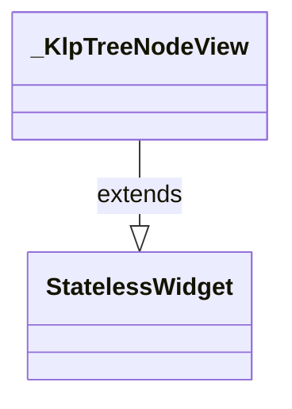

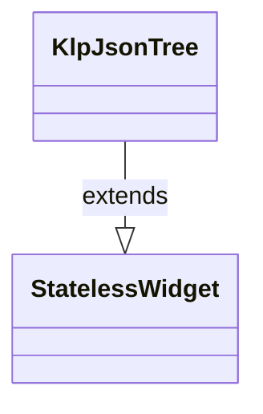

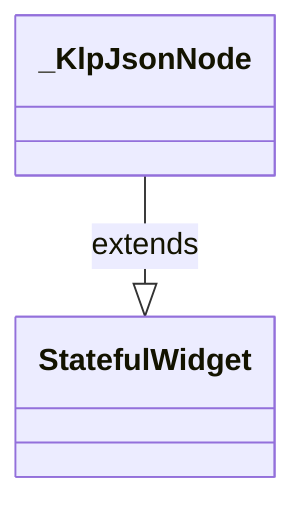

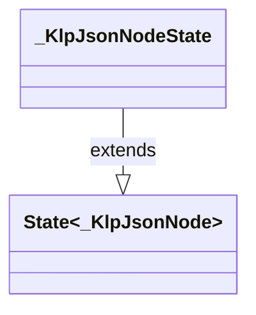

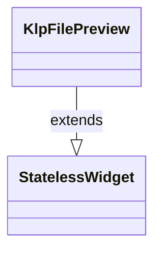

## 宣告與成員證據

成員包含 public 與 private；簽章取自來源，省略函式本體與欄位初始值。`(inferred)` 表示來源未明寫型別；建構子只顯示參數部分，不含初始化列表。

### KlpDataTable

ClassDeclaration · public · [lib/src/data/advanced/klp_advanced_data.dart:17](../../../../../lib/src/data/advanced/klp_advanced_data.dart#L17)

<code>class KlpDataTable extends StatelessWidget</code>

來源註解摘要：結構化資料表格：固定欄位、可選排序與多選。 不做分頁或虛擬捲動——列數多時請自行分頁後再傳入 [rows]。選取狀態 （[selectedIds]）與排序狀態（[sort]）都由呼叫端持有，這個元件本身無狀態， 只在使用者互動時透過 [onSelected]／[onSort] 回報意圖。

- `extends` → <code>StatelessWidget</code>：[lib/src/data/advanced/klp_advanced_data.dart:22](../../../../../lib/src/data/advanced/klp_advanced_data.dart#L22)

| 成員 | 可見性 | 簽章／型別 | 來源註解摘要 | 證據 |
|---|---|---|---|---|
| constructor <code>KlpDataTable</code> | public | <code>const KlpDataTable({ super.key, required this.columns, required this.rows, this.onRowPressed, this.selectable = false, this.selectedIds = const {}, this.sort, this.onSelected, this.onSort, })</code> |  | [lib/src/data/advanced/klp_advanced_data.dart:23](../../../../../lib/src/data/advanced/klp_advanced_data.dart#L23) |
| field <code>columns</code> | public | <code>final List&lt;KlpDataColumn&gt; columns</code> |  | [lib/src/data/advanced/klp_advanced_data.dart:35](../../../../../lib/src/data/advanced/klp_advanced_data.dart#L35) |
| field <code>rows</code> | public | <code>final List&lt;KlpDataRow&gt; rows</code> |  | [lib/src/data/advanced/klp_advanced_data.dart:36](../../../../../lib/src/data/advanced/klp_advanced_data.dart#L36) |
| field <code>onRowPressed</code> | public | <code>final ValueChanged&lt;String&gt;? onRowPressed</code> |  | [lib/src/data/advanced/klp_advanced_data.dart:37](../../../../../lib/src/data/advanced/klp_advanced_data.dart#L37) |
| field <code>selectable</code> | public | <code>final bool selectable</code> |  | [lib/src/data/advanced/klp_advanced_data.dart:38](../../../../../lib/src/data/advanced/klp_advanced_data.dart#L38) |
| field <code>selectedIds</code> | public | <code>final Set&lt;String&gt; selectedIds</code> |  | [lib/src/data/advanced/klp_advanced_data.dart:39](../../../../../lib/src/data/advanced/klp_advanced_data.dart#L39) |
| field <code>sort</code> | public | <code>final KlpDataSort? sort</code> |  | [lib/src/data/advanced/klp_advanced_data.dart:40](../../../../../lib/src/data/advanced/klp_advanced_data.dart#L40) |
| field <code>onSelected</code> | public | <code>final ValueChanged&lt;Set&lt;String&gt;&gt;? onSelected</code> |  | [lib/src/data/advanced/klp_advanced_data.dart:41](../../../../../lib/src/data/advanced/klp_advanced_data.dart#L41) |
| field <code>onSort</code> | public | <code>final ValueChanged&lt;String&gt;? onSort</code> |  | [lib/src/data/advanced/klp_advanced_data.dart:42](../../../../../lib/src/data/advanced/klp_advanced_data.dart#L42) |
| method <code>build</code> | public | <code>Widget build(BuildContext context)</code> |  | [lib/src/data/advanced/klp_advanced_data.dart:44](../../../../../lib/src/data/advanced/klp_advanced_data.dart#L44) |

### _KlpTableLine

ClassDeclaration · private · [lib/src/data/advanced/klp_advanced_data.dart:103](../../../../../lib/src/data/advanced/klp_advanced_data.dart#L103)

<code>class _KlpTableLine extends StatelessWidget</code>

- `extends` → <code>StatelessWidget</code>：[lib/src/data/advanced/klp_advanced_data.dart:103](../../../../../lib/src/data/advanced/klp_advanced_data.dart#L103)

| 成員 | 可見性 | 簽章／型別 | 來源註解摘要 | 證據 |
|---|---|---|---|---|
| constructor <code>_KlpTableLine</code> | private | <code>const _KlpTableLine({ required this.columns, required this.values, this.header = false, this.rowId, this.selectable = false, this.selected = false, this.sort, this.onPressed, this.onSelectionChanged, this.onSort, })</code> |  | [lib/src/data/advanced/klp_advanced_data.dart:104](../../../../../lib/src/data/advanced/klp_advanced_data.dart#L104) |
| field <code>columns</code> | public | <code>final List&lt;KlpDataColumn&gt; columns</code> |  | [lib/src/data/advanced/klp_advanced_data.dart:117](../../../../../lib/src/data/advanced/klp_advanced_data.dart#L117) |
| field <code>values</code> | public | <code>final Map&lt;String, Object?&gt; values</code> |  | [lib/src/data/advanced/klp_advanced_data.dart:118](../../../../../lib/src/data/advanced/klp_advanced_data.dart#L118) |
| field <code>header</code> | public | <code>final bool header</code> |  | [lib/src/data/advanced/klp_advanced_data.dart:119](../../../../../lib/src/data/advanced/klp_advanced_data.dart#L119) |
| field <code>rowId</code> | public | <code>final String? rowId</code> |  | [lib/src/data/advanced/klp_advanced_data.dart:120](../../../../../lib/src/data/advanced/klp_advanced_data.dart#L120) |
| field <code>selectable</code> | public | <code>final bool selectable</code> |  | [lib/src/data/advanced/klp_advanced_data.dart:121](../../../../../lib/src/data/advanced/klp_advanced_data.dart#L121) |
| field <code>selected</code> | public | <code>final bool selected</code> |  | [lib/src/data/advanced/klp_advanced_data.dart:122](../../../../../lib/src/data/advanced/klp_advanced_data.dart#L122) |
| field <code>sort</code> | public | <code>final KlpDataSort? sort</code> |  | [lib/src/data/advanced/klp_advanced_data.dart:123](../../../../../lib/src/data/advanced/klp_advanced_data.dart#L123) |
| field <code>onPressed</code> | public | <code>final VoidCallback? onPressed</code> |  | [lib/src/data/advanced/klp_advanced_data.dart:124](../../../../../lib/src/data/advanced/klp_advanced_data.dart#L124) |
| field <code>onSelectionChanged</code> | public | <code>final ValueChanged&lt;bool&gt;? onSelectionChanged</code> |  | [lib/src/data/advanced/klp_advanced_data.dart:125](../../../../../lib/src/data/advanced/klp_advanced_data.dart#L125) |
| field <code>onSort</code> | public | <code>final ValueChanged&lt;String&gt;? onSort</code> |  | [lib/src/data/advanced/klp_advanced_data.dart:126](../../../../../lib/src/data/advanced/klp_advanced_data.dart#L126) |
| method <code>build</code> | public | <code>Widget build(BuildContext context)</code> |  | [lib/src/data/advanced/klp_advanced_data.dart:128](../../../../../lib/src/data/advanced/klp_advanced_data.dart#L128) |

### KlpTree

ClassDeclaration · public · [lib/src/data/advanced/klp_advanced_data.dart:222](../../../../../lib/src/data/advanced/klp_advanced_data.dart#L222)

<code>class KlpTree extends StatelessWidget</code>

來源註解摘要：[KlpTree]／[KlpTreeItem] 的一個節點。 [hasChildren] 與 [children] 是分開的兩個訊號：[hasChildren] 讓呼叫端在還沒 載入子節點（例如遠端延遲載入）時就先畫出展開箭頭，[children] 才是實際已知 的子節點資料。[expanded] 是這個節點的預設展開狀態，只有在 [KlpTree.expandedIds] 為 null 時才生效——傳了 `expandedIds` 之後展開狀態 改由呼叫端控管，這個欄位就不再讀取。[tone] 為節點加上狀態色（例如標示 錯誤或警告的檔案）。 樹狀節點清單，用於檔案總管、大綱這類階層式導覽。 展開／選取狀態預設由每個 [KlpTreeNode] 自帶（[KlpTreeNode.expanded]／ [KlpTreeNode.selected]），適合靜態或一次性渲染；若要由呼叫端集中控管， 傳入 [expandedIds]／[selectedId] 即可覆蓋節點自帶的狀態。

- `extends` → <code>StatelessWidget</code>：[lib/src/data/advanced/klp_advanced_data.dart:235](../../../../../lib/src/data/advanced/klp_advanced_data.dart#L235)

| 成員 | 可見性 | 簽章／型別 | 來源註解摘要 | 證據 |
|---|---|---|---|---|
| constructor <code>KlpTree</code> | public | <code>const KlpTree({ super.key, required this.nodes, this.label, this.expandedIds, this.selectedId, this.onSelected, this.onExpanded, })</code> |  | [lib/src/data/advanced/klp_advanced_data.dart:236](../../../../../lib/src/data/advanced/klp_advanced_data.dart#L236) |
| field <code>nodes</code> | public | <code>final List&lt;KlpTreeNode&gt; nodes</code> |  | [lib/src/data/advanced/klp_advanced_data.dart:246](../../../../../lib/src/data/advanced/klp_advanced_data.dart#L246) |
| field <code>label</code> | public | <code>final String? label</code> |  | [lib/src/data/advanced/klp_advanced_data.dart:247](../../../../../lib/src/data/advanced/klp_advanced_data.dart#L247) |
| field <code>expandedIds</code> | public | <code>final Set&lt;String&gt;? expandedIds</code> |  | [lib/src/data/advanced/klp_advanced_data.dart:248](../../../../../lib/src/data/advanced/klp_advanced_data.dart#L248) |
| field <code>selectedId</code> | public | <code>final String? selectedId</code> |  | [lib/src/data/advanced/klp_advanced_data.dart:249](../../../../../lib/src/data/advanced/klp_advanced_data.dart#L249) |
| field <code>onSelected</code> | public | <code>final ValueChanged&lt;String&gt;? onSelected</code> |  | [lib/src/data/advanced/klp_advanced_data.dart:250](../../../../../lib/src/data/advanced/klp_advanced_data.dart#L250) |
| field <code>onExpanded</code> | public | <code>final ValueChanged&lt;String&gt;? onExpanded</code> |  | [lib/src/data/advanced/klp_advanced_data.dart:251](../../../../../lib/src/data/advanced/klp_advanced_data.dart#L251) |
| method <code>build</code> | public | <code>Widget build(BuildContext context)</code> |  | [lib/src/data/advanced/klp_advanced_data.dart:253](../../../../../lib/src/data/advanced/klp_advanced_data.dart#L253) |

### KlpTreeItem

ClassDeclaration · public · [lib/src/data/advanced/klp_advanced_data.dart:275](../../../../../lib/src/data/advanced/klp_advanced_data.dart#L275)

<code>class KlpTreeItem extends StatelessWidget</code>

來源註解摘要：單一樹狀節點（含其子節點）的獨立渲染入口。 用於只需畫出一棵子樹、不需要 [KlpTree] 的清單容器與 `Semantics` 分組時。 展開／選取狀態一律讀取節點自帶的 [KlpTreeNode.expanded]／ [KlpTreeNode.selected]，沒有 [KlpTree] 那種由呼叫端集中控管的選項。

- `extends` → <code>StatelessWidget</code>：[lib/src/data/advanced/klp_advanced_data.dart:280](../../../../../lib/src/data/advanced/klp_advanced_data.dart#L280)

| 成員 | 可見性 | 簽章／型別 | 來源註解摘要 | 證據 |
|---|---|---|---|---|
| constructor <code>KlpTreeItem</code> | public | <code>const KlpTreeItem({super.key, required this.node, this.onSelected})</code> |  | [lib/src/data/advanced/klp_advanced_data.dart:281](../../../../../lib/src/data/advanced/klp_advanced_data.dart#L281) |
| field <code>node</code> | public | <code>final KlpTreeNode node</code> |  | [lib/src/data/advanced/klp_advanced_data.dart:283](../../../../../lib/src/data/advanced/klp_advanced_data.dart#L283) |
| field <code>onSelected</code> | public | <code>final ValueChanged&lt;String&gt;? onSelected</code> |  | [lib/src/data/advanced/klp_advanced_data.dart:284](../../../../../lib/src/data/advanced/klp_advanced_data.dart#L284) |
| method <code>build</code> | public | <code>Widget build(BuildContext context)</code> |  | [lib/src/data/advanced/klp_advanced_data.dart:286](../../../../../lib/src/data/advanced/klp_advanced_data.dart#L286) |

### _KlpTreeNodeView

ClassDeclaration · private · [lib/src/data/advanced/klp_advanced_data.dart:292](../../../../../lib/src/data/advanced/klp_advanced_data.dart#L292)

<code>class _KlpTreeNodeView extends StatelessWidget</code>

- `extends` → <code>StatelessWidget</code>：[lib/src/data/advanced/klp_advanced_data.dart:292](../../../../../lib/src/data/advanced/klp_advanced_data.dart#L292)

| 成員 | 可見性 | 簽章／型別 | 來源註解摘要 | 證據 |
|---|---|---|---|---|
| constructor <code>_KlpTreeNodeView</code> | private | <code>const _KlpTreeNodeView({ required this.node, required this.onSelected, this.expandedIds, this.selectedId, this.onExpanded, })</code> |  | [lib/src/data/advanced/klp_advanced_data.dart:293](../../../../../lib/src/data/advanced/klp_advanced_data.dart#L293) |
| field <code>node</code> | public | <code>final KlpTreeNode node</code> |  | [lib/src/data/advanced/klp_advanced_data.dart:301](../../../../../lib/src/data/advanced/klp_advanced_data.dart#L301) |
| field <code>expandedIds</code> | public | <code>final Set&lt;String&gt;? expandedIds</code> |  | [lib/src/data/advanced/klp_advanced_data.dart:302](../../../../../lib/src/data/advanced/klp_advanced_data.dart#L302) |
| field <code>selectedId</code> | public | <code>final String? selectedId</code> |  | [lib/src/data/advanced/klp_advanced_data.dart:303](../../../../../lib/src/data/advanced/klp_advanced_data.dart#L303) |
| field <code>onSelected</code> | public | <code>final ValueChanged&lt;String&gt;? onSelected</code> |  | [lib/src/data/advanced/klp_advanced_data.dart:304](../../../../../lib/src/data/advanced/klp_advanced_data.dart#L304) |
| field <code>onExpanded</code> | public | <code>final ValueChanged&lt;String&gt;? onExpanded</code> |  | [lib/src/data/advanced/klp_advanced_data.dart:305](../../../../../lib/src/data/advanced/klp_advanced_data.dart#L305) |
| method <code>build</code> | public | <code>Widget build(BuildContext context)</code> |  | [lib/src/data/advanced/klp_advanced_data.dart:307](../../../../../lib/src/data/advanced/klp_advanced_data.dart#L307) |

### KlpJsonTree

ClassDeclaration · public · [lib/src/data/advanced/klp_advanced_data.dart:446](../../../../../lib/src/data/advanced/klp_advanced_data.dart#L446)

<code>class KlpJsonTree extends StatelessWidget</code>

來源註解摘要：任意 JSON 相容值（`Map`／`Iterable`／純量／null）的可展開檢視器。 直接吃解碼後的 [value]，不吃 JSON 字串——呼叫端自行 decode 並用 [invalid] 標示解析失敗的狀態。[defaultDepth] 控制初始展開到第幾層，超過的節點預設 收合；[expandedPaths] 可強制展開特定路徑（路徑格式為 `$.key.0` 這種 JSONPath 風格），常用於還原使用者上次的展開狀態。點擊純量節點會透過 [onCopyPath] 回報該節點的路徑，方便呼叫端做「複製路徑」之類的動作。

- `extends` → <code>StatelessWidget</code>：[lib/src/data/advanced/klp_advanced_data.dart:454](../../../../../lib/src/data/advanced/klp_advanced_data.dart#L454)

| 成員 | 可見性 | 簽章／型別 | 來源註解摘要 | 證據 |
|---|---|---|---|---|
| constructor <code>KlpJsonTree</code> | public | <code>const KlpJsonTree({ super.key, required this.value, this.defaultDepth = 1, this.expandedPaths = const {}, this.loading = false, this.invalid = false, this.onCopyPath, })</code> |  | [lib/src/data/advanced/klp_advanced_data.dart:455](../../../../../lib/src/data/advanced/klp_advanced_data.dart#L455) |
| field <code>value</code> | public | <code>final Object? value</code> |  | [lib/src/data/advanced/klp_advanced_data.dart:465](../../../../../lib/src/data/advanced/klp_advanced_data.dart#L465) |
| field <code>defaultDepth</code> | public | <code>final int defaultDepth</code> |  | [lib/src/data/advanced/klp_advanced_data.dart:466](../../../../../lib/src/data/advanced/klp_advanced_data.dart#L466) |
| field <code>expandedPaths</code> | public | <code>final Set&lt;String&gt; expandedPaths</code> |  | [lib/src/data/advanced/klp_advanced_data.dart:467](../../../../../lib/src/data/advanced/klp_advanced_data.dart#L467) |
| field <code>loading</code> | public | <code>final bool loading</code> |  | [lib/src/data/advanced/klp_advanced_data.dart:468](../../../../../lib/src/data/advanced/klp_advanced_data.dart#L468) |
| field <code>invalid</code> | public | <code>final bool invalid</code> |  | [lib/src/data/advanced/klp_advanced_data.dart:469](../../../../../lib/src/data/advanced/klp_advanced_data.dart#L469) |
| field <code>onCopyPath</code> | public | <code>final ValueChanged&lt;String&gt;? onCopyPath</code> |  | [lib/src/data/advanced/klp_advanced_data.dart:470](../../../../../lib/src/data/advanced/klp_advanced_data.dart#L470) |
| method <code>build</code> | public | <code>Widget build(BuildContext context)</code> |  | [lib/src/data/advanced/klp_advanced_data.dart:472](../../../../../lib/src/data/advanced/klp_advanced_data.dart#L472) |

### _KlpJsonNode

ClassDeclaration · private · [lib/src/data/advanced/klp_advanced_data.dart:501](../../../../../lib/src/data/advanced/klp_advanced_data.dart#L501)

<code>class _KlpJsonNode extends StatefulWidget</code>

- `extends` → <code>StatefulWidget</code>：[lib/src/data/advanced/klp_advanced_data.dart:501](../../../../../lib/src/data/advanced/klp_advanced_data.dart#L501)

| 成員 | 可見性 | 簽章／型別 | 來源註解摘要 | 證據 |
|---|---|---|---|---|
| constructor <code>_KlpJsonNode</code> | private | <code>const _KlpJsonNode({ required this.value, required this.path, required this.depth, required this.defaultDepth, required this.expandedPaths, required this.onCopyPath, this.name, })</code> |  | [lib/src/data/advanced/klp_advanced_data.dart:502](../../../../../lib/src/data/advanced/klp_advanced_data.dart#L502) |
| field <code>value</code> | public | <code>final Object? value</code> |  | [lib/src/data/advanced/klp_advanced_data.dart:512](../../../../../lib/src/data/advanced/klp_advanced_data.dart#L512) |
| field <code>name</code> | public | <code>final String? name</code> |  | [lib/src/data/advanced/klp_advanced_data.dart:513](../../../../../lib/src/data/advanced/klp_advanced_data.dart#L513) |
| field <code>path</code> | public | <code>final String path</code> |  | [lib/src/data/advanced/klp_advanced_data.dart:514](../../../../../lib/src/data/advanced/klp_advanced_data.dart#L514) |
| field <code>depth</code> | public | <code>final int depth</code> |  | [lib/src/data/advanced/klp_advanced_data.dart:515](../../../../../lib/src/data/advanced/klp_advanced_data.dart#L515) |
| field <code>defaultDepth</code> | public | <code>final int defaultDepth</code> |  | [lib/src/data/advanced/klp_advanced_data.dart:516](../../../../../lib/src/data/advanced/klp_advanced_data.dart#L516) |
| field <code>expandedPaths</code> | public | <code>final Set&lt;String&gt; expandedPaths</code> |  | [lib/src/data/advanced/klp_advanced_data.dart:517](../../../../../lib/src/data/advanced/klp_advanced_data.dart#L517) |
| field <code>onCopyPath</code> | public | <code>final ValueChanged&lt;String&gt;? onCopyPath</code> |  | [lib/src/data/advanced/klp_advanced_data.dart:518](../../../../../lib/src/data/advanced/klp_advanced_data.dart#L518) |
| method <code>createState</code> | public | <code>State&lt;_KlpJsonNode&gt; createState()</code> |  | [lib/src/data/advanced/klp_advanced_data.dart:520](../../../../../lib/src/data/advanced/klp_advanced_data.dart#L520) |

### _KlpJsonNodeState

ClassDeclaration · private · [lib/src/data/advanced/klp_advanced_data.dart:524](../../../../../lib/src/data/advanced/klp_advanced_data.dart#L524)

<code>class _KlpJsonNodeState extends State&lt;_KlpJsonNode&gt;</code>

- `extends` → <code>State&lt;_KlpJsonNode&gt;</code>：[lib/src/data/advanced/klp_advanced_data.dart:524](../../../../../lib/src/data/advanced/klp_advanced_data.dart#L524)

| 成員 | 可見性 | 簽章／型別 | 來源註解摘要 | 證據 |
|---|---|---|---|---|
| field <code>_expanded</code> | private | <code>late bool _expanded</code> |  | [lib/src/data/advanced/klp_advanced_data.dart:525](../../../../../lib/src/data/advanced/klp_advanced_data.dart#L525) |
| getter <code>_structured</code> | private | <code>bool get _structured</code> |  | [lib/src/data/advanced/klp_advanced_data.dart:527](../../../../../lib/src/data/advanced/klp_advanced_data.dart#L527) |
| method <code>initState</code> | public | <code>void initState()</code> |  | [lib/src/data/advanced/klp_advanced_data.dart:529](../../../../../lib/src/data/advanced/klp_advanced_data.dart#L529) |
| method <code>_toggle</code> | private | <code>void _toggle()</code> |  | [lib/src/data/advanced/klp_advanced_data.dart:537](../../../../../lib/src/data/advanced/klp_advanced_data.dart#L537) |
| method <code>build</code> | public | <code>Widget build(BuildContext context)</code> |  | [lib/src/data/advanced/klp_advanced_data.dart:539](../../../../../lib/src/data/advanced/klp_advanced_data.dart#L539) |
| method <code>_buildScalar</code> | private | <code>Widget _buildScalar(BuildContext context)</code> |  | [lib/src/data/advanced/klp_advanced_data.dart:606](../../../../../lib/src/data/advanced/klp_advanced_data.dart#L606) |

### KlpFilePreview

ClassDeclaration · public · [lib/src/data/advanced/klp_advanced_data.dart:636](../../../../../lib/src/data/advanced/klp_advanced_data.dart#L636)

<code>class KlpFilePreview extends StatelessWidget</code>

來源註解摘要：[KlpFilePreview] 主體區塊要呈現的狀態。 這個狀態只決定預覽主體畫什麼，不影響外層卡片的 header／footer——載入中 或發生錯誤時，檔名與操作按鈕仍照常顯示。 檔案預覽卡片：header 顯示檔名與中繼資料，中段畫預覽內容，footer 放外部 操作。 [preview] 優先於 [textContent]——兩者都給時只會用 [preview]；都不給且 [state] 為 [KlpFilePreviewState.ready] 時顯示「無可用預覽」。[state] 由 呼叫端管理，這個元件不會自己判斷載入或解析是否失敗。

- `extends` → <code>StatelessWidget</code>：[lib/src/data/advanced/klp_advanced_data.dart:646](../../../../../lib/src/data/advanced/klp_advanced_data.dart#L646)

| 成員 | 可見性 | 簽章／型別 | 來源註解摘要 | 證據 |
|---|---|---|---|---|
| constructor <code>KlpFilePreview</code> | public | <code>const KlpFilePreview({ super.key, required this.name, required this.metadata, this.icon = KlpIcons.box, this.preview, this.onPressed, this.state = KlpFilePreviewState.ready, this.height = 220, this.textContent, this.onOpenExternal, this.onDownload, })</code> |  | [lib/src/data/advanced/klp_advanced_data.dart:647](../../../../../lib/src/data/advanced/klp_advanced_data.dart#L647) |
| field <code>name</code> | public | <code>final String name</code> |  | [lib/src/data/advanced/klp_advanced_data.dart:661](../../../../../lib/src/data/advanced/klp_advanced_data.dart#L661) |
| field <code>metadata</code> | public | <code>final String metadata</code> |  | [lib/src/data/advanced/klp_advanced_data.dart:662](../../../../../lib/src/data/advanced/klp_advanced_data.dart#L662) |
| field <code>icon</code> | public | <code>final KlpIconData icon</code> |  | [lib/src/data/advanced/klp_advanced_data.dart:663](../../../../../lib/src/data/advanced/klp_advanced_data.dart#L663) |
| field <code>preview</code> | public | <code>final Widget? preview</code> |  | [lib/src/data/advanced/klp_advanced_data.dart:664](../../../../../lib/src/data/advanced/klp_advanced_data.dart#L664) |
| field <code>onPressed</code> | public | <code>final VoidCallback? onPressed</code> |  | [lib/src/data/advanced/klp_advanced_data.dart:665](../../../../../lib/src/data/advanced/klp_advanced_data.dart#L665) |
| field <code>state</code> | public | <code>final KlpFilePreviewState state</code> |  | [lib/src/data/advanced/klp_advanced_data.dart:666](../../../../../lib/src/data/advanced/klp_advanced_data.dart#L666) |
| field <code>height</code> | public | <code>final double height</code> |  | [lib/src/data/advanced/klp_advanced_data.dart:667](../../../../../lib/src/data/advanced/klp_advanced_data.dart#L667) |
| field <code>textContent</code> | public | <code>final String? textContent</code> |  | [lib/src/data/advanced/klp_advanced_data.dart:668](../../../../../lib/src/data/advanced/klp_advanced_data.dart#L668) |
| field <code>onOpenExternal</code> | public | <code>final VoidCallback? onOpenExternal</code> |  | [lib/src/data/advanced/klp_advanced_data.dart:669](../../../../../lib/src/data/advanced/klp_advanced_data.dart#L669) |
| field <code>onDownload</code> | public | <code>final VoidCallback? onDownload</code> |  | [lib/src/data/advanced/klp_advanced_data.dart:670](../../../../../lib/src/data/advanced/klp_advanced_data.dart#L670) |
| method <code>build</code> | public | <code>Widget build(BuildContext context)</code> |  | [lib/src/data/advanced/klp_advanced_data.dart:672](../../../../../lib/src/data/advanced/klp_advanced_data.dart#L672) |
| method <code>_previewBody</code> | private | <code>Widget _previewBody(BuildContext context, String extension)</code> |  | [lib/src/data/advanced/klp_advanced_data.dart:773](../../../../../lib/src/data/advanced/klp_advanced_data.dart#L773) |

## 閱讀說明與限制

箭頭只表示來源明寫的靜態關係；import 不等於呼叫。未分析動態呼叫、欄位的實際物件擁有權、狀態轉移或渲染流程；型別未進行語意解析，繼承目標保留原始型別拼寫。public／private 依 Dart 名稱前綴判斷；public 宣告不代表已由 `lib/kallopis.dart` 匯出。

本頁由 `tool/architecture_atlas` 產生；編輯來源或生成工具後重新產生，避免手改本頁。
