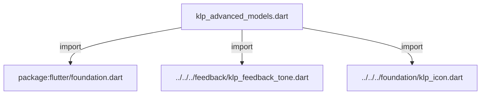
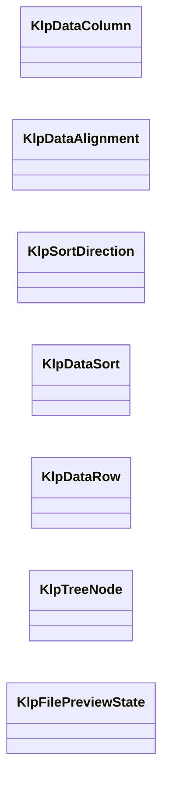

# klp_advanced_models.dart：直接依賴與宣告架構

[回到目錄](README.md) · [來源檔案](../../../../../../lib/src/data/advanced/models/klp_advanced_models.dart)

## 範圍

核心是 `lib/src/data/advanced/models/klp_advanced_models.dart`。主要視角為該檔案明寫的 import／export／part；輔助視角為本檔宣告及 extends／implements／with／on 關係。只展開一層外部邊界。

## 直接依賴圖

## 依賴證據

| 關係 | 原始 directive | 來源 |
|---|---|---|
| import | <code>import &#x27;package:flutter/foundation.dart&#x27;;</code> | [lib/src/data/advanced/models/klp_advanced_models.dart:1](../../../../../../lib/src/data/advanced/models/klp_advanced_models.dart#L1) |
| import | <code>import &#x27;../../../feedback/klp_feedback_tone.dart&#x27;;</code> | [lib/src/data/advanced/models/klp_advanced_models.dart:3](../../../../../../lib/src/data/advanced/models/klp_advanced_models.dart#L3) |
| import | <code>import &#x27;../../../foundation/klp_icon.dart&#x27;;</code> | [lib/src/data/advanced/models/klp_advanced_models.dart:4](../../../../../../lib/src/data/advanced/models/klp_advanced_models.dart#L4) |

## 宣告關係圖

本組節點是本檔宣告；沒有箭頭的宣告未在此圖主張互相依賴。

## 宣告與成員證據

成員包含 public 與 private；簽章取自來源，省略函式本體與欄位初始值。`(inferred)` 表示來源未明寫型別；建構子只顯示參數部分，不含初始化列表。

### KlpDataColumn

ClassDeclaration · public · [lib/src/data/advanced/models/klp_advanced_models.dart:6](../../../../../../lib/src/data/advanced/models/klp_advanced_models.dart#L6)

<code>class KlpDataColumn</code>

| 成員 | 可見性 | 簽章／型別 | 來源註解摘要 | 證據 |
|---|---|---|---|---|
| constructor <code>KlpDataColumn</code> | public | <code>const KlpDataColumn({ required this.id, required this.label, this.width, this.sortable = false, this.alignment = KlpDataAlignment.start, this.verbatim = false, })</code> |  | [lib/src/data/advanced/models/klp_advanced_models.dart:8](../../../../../../lib/src/data/advanced/models/klp_advanced_models.dart#L8) |
| field <code>id</code> | public | <code>final String id</code> |  | [lib/src/data/advanced/models/klp_advanced_models.dart:17](../../../../../../lib/src/data/advanced/models/klp_advanced_models.dart#L17) |
| field <code>label</code> | public | <code>final String label</code> |  | [lib/src/data/advanced/models/klp_advanced_models.dart:18](../../../../../../lib/src/data/advanced/models/klp_advanced_models.dart#L18) |
| field <code>width</code> | public | <code>final double? width</code> |  | [lib/src/data/advanced/models/klp_advanced_models.dart:19](../../../../../../lib/src/data/advanced/models/klp_advanced_models.dart#L19) |
| field <code>sortable</code> | public | <code>final bool sortable</code> |  | [lib/src/data/advanced/models/klp_advanced_models.dart:20](../../../../../../lib/src/data/advanced/models/klp_advanced_models.dart#L20) |
| field <code>alignment</code> | public | <code>final KlpDataAlignment alignment</code> |  | [lib/src/data/advanced/models/klp_advanced_models.dart:21](../../../../../../lib/src/data/advanced/models/klp_advanced_models.dart#L21) |
| field <code>verbatim</code> | public | <code>final bool verbatim</code> |  | [lib/src/data/advanced/models/klp_advanced_models.dart:22](../../../../../../lib/src/data/advanced/models/klp_advanced_models.dart#L22) |

### KlpDataAlignment

EnumDeclaration · public · [lib/src/data/advanced/models/klp_advanced_models.dart:25](../../../../../../lib/src/data/advanced/models/klp_advanced_models.dart#L25)

<code>enum KlpDataAlignment</code>

| 成員 | 可見性 | 簽章／型別 | 來源註解摘要 | 證據 |
|---|---|---|---|---|
| enum value <code>start</code> | public | <code>start</code> |  | [lib/src/data/advanced/models/klp_advanced_models.dart:25](../../../../../../lib/src/data/advanced/models/klp_advanced_models.dart#L25) |
| enum value <code>end</code> | public | <code>end</code> |  | [lib/src/data/advanced/models/klp_advanced_models.dart:25](../../../../../../lib/src/data/advanced/models/klp_advanced_models.dart#L25) |

### KlpSortDirection

EnumDeclaration · public · [lib/src/data/advanced/models/klp_advanced_models.dart:26](../../../../../../lib/src/data/advanced/models/klp_advanced_models.dart#L26)

<code>enum KlpSortDirection</code>

| 成員 | 可見性 | 簽章／型別 | 來源註解摘要 | 證據 |
|---|---|---|---|---|
| enum value <code>ascending</code> | public | <code>ascending</code> |  | [lib/src/data/advanced/models/klp_advanced_models.dart:26](../../../../../../lib/src/data/advanced/models/klp_advanced_models.dart#L26) |
| enum value <code>descending</code> | public | <code>descending</code> |  | [lib/src/data/advanced/models/klp_advanced_models.dart:26](../../../../../../lib/src/data/advanced/models/klp_advanced_models.dart#L26) |

### KlpDataSort

ClassDeclaration · public · [lib/src/data/advanced/models/klp_advanced_models.dart:28](../../../../../../lib/src/data/advanced/models/klp_advanced_models.dart#L28)

<code>class KlpDataSort</code>

| 成員 | 可見性 | 簽章／型別 | 來源註解摘要 | 證據 |
|---|---|---|---|---|
| constructor <code>KlpDataSort</code> | public | <code>const KlpDataSort({required this.columnId, required this.direction})</code> |  | [lib/src/data/advanced/models/klp_advanced_models.dart:30](../../../../../../lib/src/data/advanced/models/klp_advanced_models.dart#L30) |
| field <code>columnId</code> | public | <code>final String columnId</code> |  | [lib/src/data/advanced/models/klp_advanced_models.dart:32](../../../../../../lib/src/data/advanced/models/klp_advanced_models.dart#L32) |
| field <code>direction</code> | public | <code>final KlpSortDirection direction</code> |  | [lib/src/data/advanced/models/klp_advanced_models.dart:33](../../../../../../lib/src/data/advanced/models/klp_advanced_models.dart#L33) |

### KlpDataRow

ClassDeclaration · public · [lib/src/data/advanced/models/klp_advanced_models.dart:36](../../../../../../lib/src/data/advanced/models/klp_advanced_models.dart#L36)

<code>class KlpDataRow</code>

| 成員 | 可見性 | 簽章／型別 | 來源註解摘要 | 證據 |
|---|---|---|---|---|
| constructor <code>KlpDataRow</code> | public | <code>const KlpDataRow({required this.id, required this.cells})</code> |  | [lib/src/data/advanced/models/klp_advanced_models.dart:38](../../../../../../lib/src/data/advanced/models/klp_advanced_models.dart#L38) |
| field <code>id</code> | public | <code>final String id</code> |  | [lib/src/data/advanced/models/klp_advanced_models.dart:40](../../../../../../lib/src/data/advanced/models/klp_advanced_models.dart#L40) |
| field <code>cells</code> | public | <code>final Map&lt;String, Object&gt; cells</code> |  | [lib/src/data/advanced/models/klp_advanced_models.dart:41](../../../../../../lib/src/data/advanced/models/klp_advanced_models.dart#L41) |

### KlpTreeNode

ClassDeclaration · public · [lib/src/data/advanced/models/klp_advanced_models.dart:44](../../../../../../lib/src/data/advanced/models/klp_advanced_models.dart#L44)

<code>class KlpTreeNode</code>

| 成員 | 可見性 | 簽章／型別 | 來源註解摘要 | 證據 |
|---|---|---|---|---|
| constructor <code>KlpTreeNode</code> | public | <code>const KlpTreeNode({ required this.id, required this.label, this.icon, this.children = const [], this.expanded = true, this.selected = false, this.hasChildren = false, this.deleted = false, this.badge, this.tone, })</code> |  | [lib/src/data/advanced/models/klp_advanced_models.dart:46](../../../../../../lib/src/data/advanced/models/klp_advanced_models.dart#L46) |
| field <code>id</code> | public | <code>final String id</code> |  | [lib/src/data/advanced/models/klp_advanced_models.dart:59](../../../../../../lib/src/data/advanced/models/klp_advanced_models.dart#L59) |
| field <code>label</code> | public | <code>final String label</code> |  | [lib/src/data/advanced/models/klp_advanced_models.dart:60](../../../../../../lib/src/data/advanced/models/klp_advanced_models.dart#L60) |
| field <code>icon</code> | public | <code>final KlpIconData? icon</code> |  | [lib/src/data/advanced/models/klp_advanced_models.dart:61](../../../../../../lib/src/data/advanced/models/klp_advanced_models.dart#L61) |
| field <code>children</code> | public | <code>final List&lt;KlpTreeNode&gt; children</code> |  | [lib/src/data/advanced/models/klp_advanced_models.dart:62](../../../../../../lib/src/data/advanced/models/klp_advanced_models.dart#L62) |
| field <code>expanded</code> | public | <code>final bool expanded</code> |  | [lib/src/data/advanced/models/klp_advanced_models.dart:63](../../../../../../lib/src/data/advanced/models/klp_advanced_models.dart#L63) |
| field <code>selected</code> | public | <code>final bool selected</code> |  | [lib/src/data/advanced/models/klp_advanced_models.dart:64](../../../../../../lib/src/data/advanced/models/klp_advanced_models.dart#L64) |
| field <code>hasChildren</code> | public | <code>final bool hasChildren</code> |  | [lib/src/data/advanced/models/klp_advanced_models.dart:65](../../../../../../lib/src/data/advanced/models/klp_advanced_models.dart#L65) |
| field <code>deleted</code> | public | <code>final bool deleted</code> |  | [lib/src/data/advanced/models/klp_advanced_models.dart:66](../../../../../../lib/src/data/advanced/models/klp_advanced_models.dart#L66) |
| field <code>badge</code> | public | <code>final String? badge</code> |  | [lib/src/data/advanced/models/klp_advanced_models.dart:67](../../../../../../lib/src/data/advanced/models/klp_advanced_models.dart#L67) |
| field <code>tone</code> | public | <code>final KlpFeedbackTone? tone</code> |  | [lib/src/data/advanced/models/klp_advanced_models.dart:68](../../../../../../lib/src/data/advanced/models/klp_advanced_models.dart#L68) |

### KlpFilePreviewState

EnumDeclaration · public · [lib/src/data/advanced/models/klp_advanced_models.dart:71](../../../../../../lib/src/data/advanced/models/klp_advanced_models.dart#L71)

<code>enum KlpFilePreviewState</code>

| 成員 | 可見性 | 簽章／型別 | 來源註解摘要 | 證據 |
|---|---|---|---|---|
| enum value <code>ready</code> | public | <code>ready</code> |  | [lib/src/data/advanced/models/klp_advanced_models.dart:71](../../../../../../lib/src/data/advanced/models/klp_advanced_models.dart#L71) |
| enum value <code>loading</code> | public | <code>loading</code> |  | [lib/src/data/advanced/models/klp_advanced_models.dart:71](../../../../../../lib/src/data/advanced/models/klp_advanced_models.dart#L71) |
| enum value <code>error</code> | public | <code>error</code> |  | [lib/src/data/advanced/models/klp_advanced_models.dart:71](../../../../../../lib/src/data/advanced/models/klp_advanced_models.dart#L71) |
| enum value <code>unsupported</code> | public | <code>unsupported</code> |  | [lib/src/data/advanced/models/klp_advanced_models.dart:71](../../../../../../lib/src/data/advanced/models/klp_advanced_models.dart#L71) |

## 閱讀說明與限制

箭頭只表示來源明寫的靜態關係；import 不等於呼叫。未分析動態呼叫、欄位的實際物件擁有權、狀態轉移或渲染流程；型別未進行語意解析，繼承目標保留原始型別拼寫。public／private 依 Dart 名稱前綴判斷；public 宣告不代表已由 `lib/kallopis.dart` 匯出。

本頁由 `tool/architecture_atlas` 產生；編輯來源或生成工具後重新產生，避免手改本頁。
