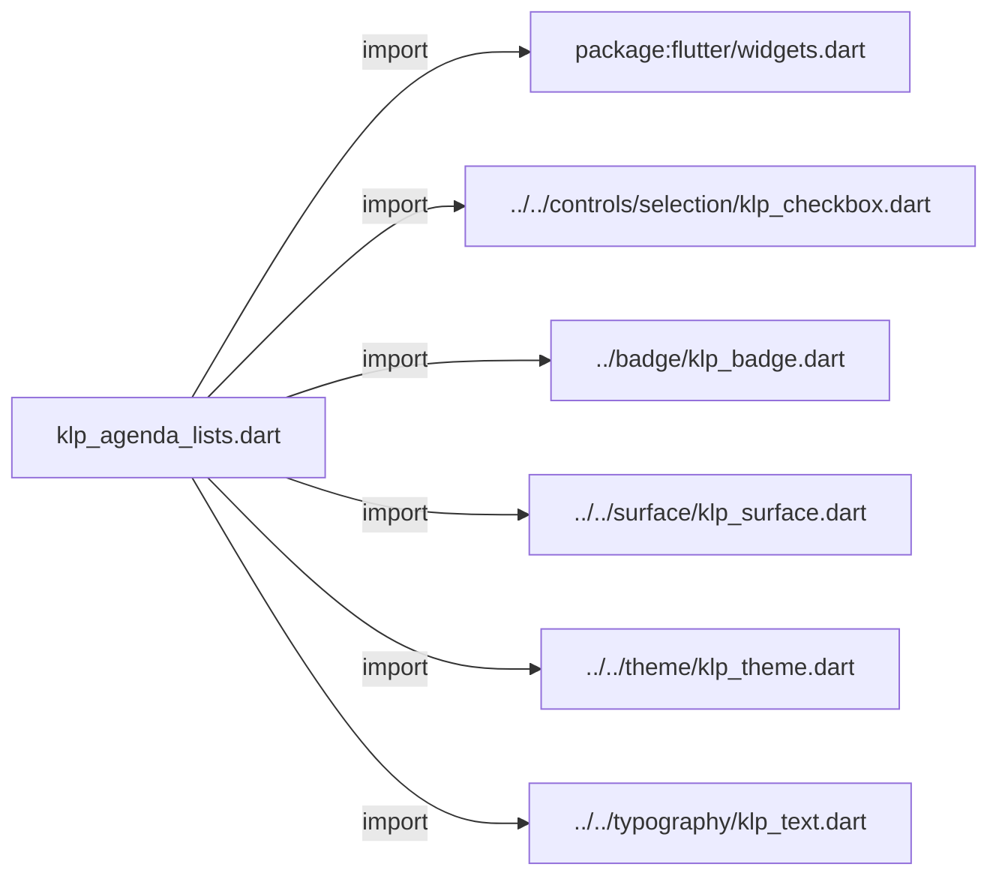
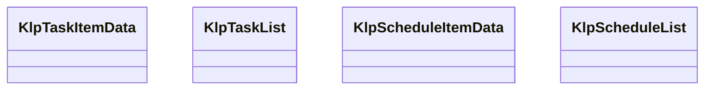
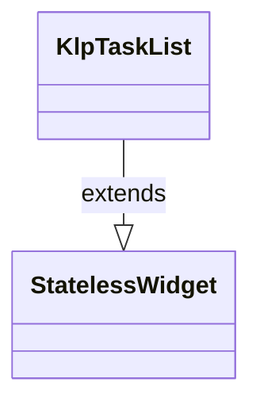
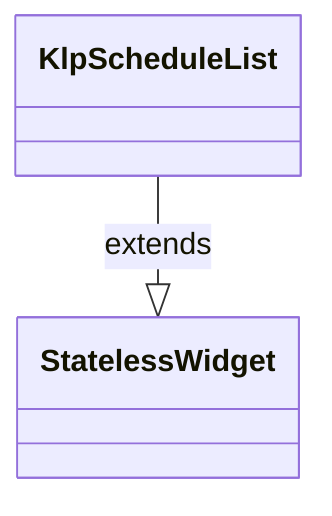

# klp_agenda_lists.dart：直接依賴與宣告架構

[回到目錄](README.md) · [來源檔案](../../../../../lib/src/data/agenda/klp_agenda_lists.dart)

## 範圍

核心是 `lib/src/data/agenda/klp_agenda_lists.dart`。主要視角為該檔案明寫的 import／export／part；輔助視角為本檔宣告及 extends／implements／with／on 關係。只展開一層外部邊界。

## 直接依賴圖

## 依賴證據

| 關係 | 原始 directive | 來源 |
|---|---|---|
| import | <code>import &#x27;package:flutter/widgets.dart&#x27;;</code> | [lib/src/data/agenda/klp_agenda_lists.dart:1](../../../../../lib/src/data/agenda/klp_agenda_lists.dart#L1) |
| import | <code>import &#x27;../../controls/selection/klp_checkbox.dart&#x27;;</code> | [lib/src/data/agenda/klp_agenda_lists.dart:3](../../../../../lib/src/data/agenda/klp_agenda_lists.dart#L3) |
| import | <code>import &#x27;../badge/klp_badge.dart&#x27;;</code> | [lib/src/data/agenda/klp_agenda_lists.dart:4](../../../../../lib/src/data/agenda/klp_agenda_lists.dart#L4) |
| import | <code>import &#x27;../../surface/klp_surface.dart&#x27;;</code> | [lib/src/data/agenda/klp_agenda_lists.dart:5](../../../../../lib/src/data/agenda/klp_agenda_lists.dart#L5) |
| import | <code>import &#x27;../../theme/klp_theme.dart&#x27;;</code> | [lib/src/data/agenda/klp_agenda_lists.dart:6](../../../../../lib/src/data/agenda/klp_agenda_lists.dart#L6) |
| import | <code>import &#x27;../../typography/klp_text.dart&#x27;;</code> | [lib/src/data/agenda/klp_agenda_lists.dart:7](../../../../../lib/src/data/agenda/klp_agenda_lists.dart#L7) |

## 宣告關係圖

本組節點是本檔宣告；沒有箭頭的宣告未在此圖主張互相依賴。

## 宣告與成員證據

成員包含 public 與 private；簽章取自來源，省略函式本體與欄位初始值。`(inferred)` 表示來源未明寫型別；建構子只顯示參數部分，不含初始化列表。

### KlpTaskItemData

ClassDeclaration · public · [lib/src/data/agenda/klp_agenda_lists.dart:9](../../../../../lib/src/data/agenda/klp_agenda_lists.dart#L9)

<code>class KlpTaskItemData</code>

來源註解摘要：待辦列的呈現資料。

| 成員 | 可見性 | 簽章／型別 | 來源註解摘要 | 證據 |
|---|---|---|---|---|
| constructor <code>KlpTaskItemData</code> | public | <code>const KlpTaskItemData({ required this.title, required this.detail, this.checked = false, })</code> |  | [lib/src/data/agenda/klp_agenda_lists.dart:12](../../../../../lib/src/data/agenda/klp_agenda_lists.dart#L12) |
| field <code>title</code> | public | <code>final String title</code> |  | [lib/src/data/agenda/klp_agenda_lists.dart:18](../../../../../lib/src/data/agenda/klp_agenda_lists.dart#L18) |
| field <code>detail</code> | public | <code>final String detail</code> |  | [lib/src/data/agenda/klp_agenda_lists.dart:19](../../../../../lib/src/data/agenda/klp_agenda_lists.dart#L19) |
| field <code>checked</code> | public | <code>final bool checked</code> |  | [lib/src/data/agenda/klp_agenda_lists.dart:20](../../../../../lib/src/data/agenda/klp_agenda_lists.dart#L20) |

### KlpTaskList

ClassDeclaration · public · [lib/src/data/agenda/klp_agenda_lists.dart:23](../../../../../lib/src/data/agenda/klp_agenda_lists.dart#L23)

<code>class KlpTaskList extends StatelessWidget</code>

來源註解摘要：帶有核取狀態與輔助資訊的待辦清單。

- `extends` → <code>StatelessWidget</code>：[lib/src/data/agenda/klp_agenda_lists.dart:24](../../../../../lib/src/data/agenda/klp_agenda_lists.dart#L24)

| 成員 | 可見性 | 簽章／型別 | 來源註解摘要 | 證據 |
|---|---|---|---|---|
| constructor <code>KlpTaskList</code> | public | <code>const KlpTaskList({super.key, required this.items, this.onChanged})</code> |  | [lib/src/data/agenda/klp_agenda_lists.dart:25](../../../../../lib/src/data/agenda/klp_agenda_lists.dart#L25) |
| field <code>items</code> | public | <code>final List&lt;KlpTaskItemData&gt; items</code> |  | [lib/src/data/agenda/klp_agenda_lists.dart:27](../../../../../lib/src/data/agenda/klp_agenda_lists.dart#L27) |
| field <code>onChanged</code> | public | <code>final void Function(int index, bool value)? onChanged</code> |  | [lib/src/data/agenda/klp_agenda_lists.dart:28](../../../../../lib/src/data/agenda/klp_agenda_lists.dart#L28) |
| method <code>build</code> | public | <code>Widget build(BuildContext context)</code> |  | [lib/src/data/agenda/klp_agenda_lists.dart:30](../../../../../lib/src/data/agenda/klp_agenda_lists.dart#L30) |

### KlpScheduleItemData

ClassDeclaration · public · [lib/src/data/agenda/klp_agenda_lists.dart:79](../../../../../lib/src/data/agenda/klp_agenda_lists.dart#L79)

<code>class KlpScheduleItemData</code>

來源註解摘要：排程列的呈現資料。

| 成員 | 可見性 | 簽章／型別 | 來源註解摘要 | 證據 |
|---|---|---|---|---|
| constructor <code>KlpScheduleItemData</code> | public | <code>const KlpScheduleItemData({ required this.time, required this.title, this.tag, })</code> |  | [lib/src/data/agenda/klp_agenda_lists.dart:82](../../../../../lib/src/data/agenda/klp_agenda_lists.dart#L82) |
| field <code>time</code> | public | <code>final String time</code> |  | [lib/src/data/agenda/klp_agenda_lists.dart:88](../../../../../lib/src/data/agenda/klp_agenda_lists.dart#L88) |
| field <code>title</code> | public | <code>final String title</code> |  | [lib/src/data/agenda/klp_agenda_lists.dart:89](../../../../../lib/src/data/agenda/klp_agenda_lists.dart#L89) |
| field <code>tag</code> | public | <code>final String? tag</code> |  | [lib/src/data/agenda/klp_agenda_lists.dart:90](../../../../../lib/src/data/agenda/klp_agenda_lists.dart#L90) |

### KlpScheduleList

ClassDeclaration · public · [lib/src/data/agenda/klp_agenda_lists.dart:93](../../../../../lib/src/data/agenda/klp_agenda_lists.dart#L93)

<code>class KlpScheduleList extends StatelessWidget</code>

來源註解摘要：固定時間欄、標題與選填標籤的排程清單。

- `extends` → <code>StatelessWidget</code>：[lib/src/data/agenda/klp_agenda_lists.dart:94](../../../../../lib/src/data/agenda/klp_agenda_lists.dart#L94)

| 成員 | 可見性 | 簽章／型別 | 來源註解摘要 | 證據 |
|---|---|---|---|---|
| constructor <code>KlpScheduleList</code> | public | <code>const KlpScheduleList({super.key, required this.items})</code> |  | [lib/src/data/agenda/klp_agenda_lists.dart:95](../../../../../lib/src/data/agenda/klp_agenda_lists.dart#L95) |
| field <code>items</code> | public | <code>final List&lt;KlpScheduleItemData&gt; items</code> |  | [lib/src/data/agenda/klp_agenda_lists.dart:97](../../../../../lib/src/data/agenda/klp_agenda_lists.dart#L97) |
| method <code>build</code> | public | <code>Widget build(BuildContext context)</code> |  | [lib/src/data/agenda/klp_agenda_lists.dart:99](../../../../../lib/src/data/agenda/klp_agenda_lists.dart#L99) |

## 閱讀說明與限制

箭頭只表示來源明寫的靜態關係；import 不等於呼叫。未分析動態呼叫、欄位的實際物件擁有權、狀態轉移或渲染流程；型別未進行語意解析，繼承目標保留原始型別拼寫。public／private 依 Dart 名稱前綴判斷；public 宣告不代表已由 `lib/kallopis.dart` 匯出。

本頁由 `tool/architecture_atlas` 產生；編輯來源或生成工具後重新產生，避免手改本頁。
