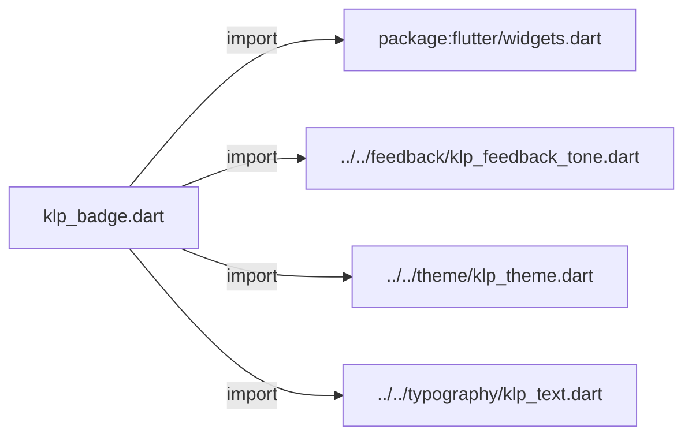
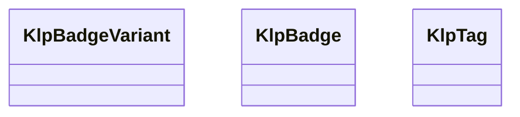
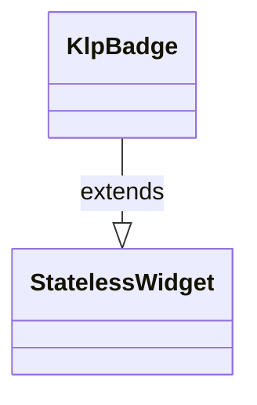
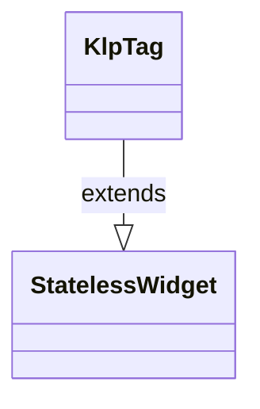

# klp_badge.dart：直接依賴與宣告架構

[回到目錄](README.md) · [來源檔案](../../../../../lib/src/data/badge/klp_badge.dart)

## 範圍

核心是 `lib/src/data/badge/klp_badge.dart`。主要視角為該檔案明寫的 import／export／part；輔助視角為本檔宣告及 extends／implements／with／on 關係。只展開一層外部邊界。

## 直接依賴圖

## 依賴證據

| 關係 | 原始 directive | 來源 |
|---|---|---|
| import | <code>import &#x27;package:flutter/widgets.dart&#x27;;</code> | [lib/src/data/badge/klp_badge.dart:1](../../../../../lib/src/data/badge/klp_badge.dart#L1) |
| import | <code>import &#x27;../../feedback/klp_feedback_tone.dart&#x27;;</code> | [lib/src/data/badge/klp_badge.dart:3](../../../../../lib/src/data/badge/klp_badge.dart#L3) |
| import | <code>import &#x27;../../theme/klp_theme.dart&#x27;;</code> | [lib/src/data/badge/klp_badge.dart:4](../../../../../lib/src/data/badge/klp_badge.dart#L4) |
| import | <code>import &#x27;../../typography/klp_text.dart&#x27;;</code> | [lib/src/data/badge/klp_badge.dart:5](../../../../../lib/src/data/badge/klp_badge.dart#L5) |

## 宣告關係圖

本組節點是本檔宣告；沒有箭頭的宣告未在此圖主張互相依賴。

## 宣告與成員證據

成員包含 public 與 private；簽章取自來源，省略函式本體與欄位初始值。`(inferred)` 表示來源未明寫型別；建構子只顯示參數部分，不含初始化列表。

### KlpBadgeVariant

EnumDeclaration · public · [lib/src/data/badge/klp_badge.dart:7](../../../../../lib/src/data/badge/klp_badge.dart#L7)

<code>enum KlpBadgeVariant</code>

來源註解摘要：標記視覺樣式：柔和填色 (filled)、外框 (outline)、深黑高對比填色 (solid)。

| 成員 | 可見性 | 簽章／型別 | 來源註解摘要 | 證據 |
|---|---|---|---|---|
| enum value <code>filled</code> | public | <code>filled</code> | 柔和填色底。 | [lib/src/data/badge/klp_badge.dart:9](../../../../../lib/src/data/badge/klp_badge.dart#L9) |
| enum value <code>outline</code> | public | <code>outline</code> | 外框無填色（外框與文字同色）。 | [lib/src/data/badge/klp_badge.dart:12](../../../../../lib/src/data/badge/klp_badge.dart#L12) |
| enum value <code>solid</code> | public | <code>solid</code> | 純深色底與高對比文字。 | [lib/src/data/badge/klp_badge.dart:15](../../../../../lib/src/data/badge/klp_badge.dart#L15) |

### KlpBadge

ClassDeclaration · public · [lib/src/data/badge/klp_badge.dart:19](../../../../../lib/src/data/badge/klp_badge.dart#L19)

<code>class KlpBadge extends StatelessWidget</code>

來源註解摘要：狀態標記 (Badge)。預設使用 12px／16px 文字、6px 水平與 2px 垂直內距， 組成約 20px 高的 pill。

- `extends` → <code>StatelessWidget</code>：[lib/src/data/badge/klp_badge.dart:21](../../../../../lib/src/data/badge/klp_badge.dart#L21)

| 成員 | 可見性 | 簽章／型別 | 來源註解摘要 | 證據 |
|---|---|---|---|---|
| constructor <code>KlpBadge</code> | public | <code>const KlpBadge({ super.key, required this.label, this.tone = KlpFeedbackTone.neutral, this.variant = KlpBadgeVariant.filled, this.dot = false, })</code> |  | [lib/src/data/badge/klp_badge.dart:22](../../../../../lib/src/data/badge/klp_badge.dart#L22) |
| field <code>label</code> | public | <code>final String label</code> | 標籤文字。 | [lib/src/data/badge/klp_badge.dart:31](../../../../../lib/src/data/badge/klp_badge.dart#L31) |
| field <code>tone</code> | public | <code>final KlpFeedbackTone tone</code> | 語意色調。 | [lib/src/data/badge/klp_badge.dart:34](../../../../../lib/src/data/badge/klp_badge.dart#L34) |
| field <code>variant</code> | public | <code>final KlpBadgeVariant variant</code> | 視覺樣式（填色、外框或純深色）。 | [lib/src/data/badge/klp_badge.dart:37](../../../../../lib/src/data/badge/klp_badge.dart#L37) |
| field <code>dot</code> | public | <code>final bool dot</code> | 是否顯示狀態圓點。 | [lib/src/data/badge/klp_badge.dart:40](../../../../../lib/src/data/badge/klp_badge.dart#L40) |
| method <code>build</code> | public | <code>Widget build(BuildContext context)</code> |  | [lib/src/data/badge/klp_badge.dart:42](../../../../../lib/src/data/badge/klp_badge.dart#L42) |

### KlpTag

ClassDeclaration · public · [lib/src/data/badge/klp_badge.dart:112](../../../../../lib/src/data/badge/klp_badge.dart#L112)

<code>class KlpTag extends StatelessWidget</code>

來源註解摘要：可移除或可點擊的分類標籤 (Tag)。

- `extends` → <code>StatelessWidget</code>：[lib/src/data/badge/klp_badge.dart:113](../../../../../lib/src/data/badge/klp_badge.dart#L113)

| 成員 | 可見性 | 簽章／型別 | 來源註解摘要 | 證據 |
|---|---|---|---|---|
| constructor <code>KlpTag</code> | public | <code>const KlpTag({super.key, required this.label, this.prefix, this.onRemove})</code> |  | [lib/src/data/badge/klp_badge.dart:114](../../../../../lib/src/data/badge/klp_badge.dart#L114) |
| field <code>label</code> | public | <code>final String label</code> | 標籤文字。 | [lib/src/data/badge/klp_badge.dart:117](../../../../../lib/src/data/badge/klp_badge.dart#L117) |
| field <code>prefix</code> | public | <code>final String? prefix</code> | 前綴符號（如 &#x27;#&#x27;）。 | [lib/src/data/badge/klp_badge.dart:120](../../../../../lib/src/data/badge/klp_badge.dart#L120) |
| field <code>onRemove</code> | public | <code>final VoidCallback? onRemove</code> | 移除標籤的回呼。 | [lib/src/data/badge/klp_badge.dart:123](../../../../../lib/src/data/badge/klp_badge.dart#L123) |
| method <code>build</code> | public | <code>Widget build(BuildContext context)</code> |  | [lib/src/data/badge/klp_badge.dart:125](../../../../../lib/src/data/badge/klp_badge.dart#L125) |

## 閱讀說明與限制

箭頭只表示來源明寫的靜態關係；import 不等於呼叫。未分析動態呼叫、欄位的實際物件擁有權、狀態轉移或渲染流程；型別未進行語意解析，繼承目標保留原始型別拼寫。public／private 依 Dart 名稱前綴判斷；public 宣告不代表已由 `lib/kallopis.dart` 匯出。

本頁由 `tool/architecture_atlas` 產生；編輯來源或生成工具後重新產生，避免手改本頁。
