# klp_code_viewer.dart：直接依賴與宣告架構

[回到目錄](README.md) · [來源檔案](../../../../../lib/src/data/code/klp_code_viewer.dart)

## 範圍

核心是 `lib/src/data/code/klp_code_viewer.dart`。主要視角為該檔案明寫的 import／export／part；輔助視角為本檔宣告及 extends／implements／with／on 關係。只展開一層外部邊界。

## 直接依賴圖

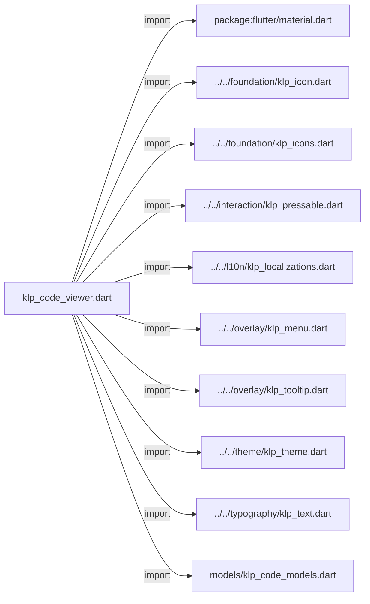

## 依賴證據

| 關係 | 原始 directive | 來源 |
|---|---|---|
| import | <code>import &#x27;package:flutter/material.dart&#x27;;</code> | [lib/src/data/code/klp_code_viewer.dart:1](../../../../../lib/src/data/code/klp_code_viewer.dart#L1) |
| import | <code>import &#x27;../../foundation/klp_icon.dart&#x27;;</code> | [lib/src/data/code/klp_code_viewer.dart:3](../../../../../lib/src/data/code/klp_code_viewer.dart#L3) |
| import | <code>import &#x27;../../foundation/klp_icons.dart&#x27;;</code> | [lib/src/data/code/klp_code_viewer.dart:4](../../../../../lib/src/data/code/klp_code_viewer.dart#L4) |
| import | <code>import &#x27;../../interaction/klp_pressable.dart&#x27;;</code> | [lib/src/data/code/klp_code_viewer.dart:5](../../../../../lib/src/data/code/klp_code_viewer.dart#L5) |
| import | <code>import &#x27;../../l10n/klp_localizations.dart&#x27;;</code> | [lib/src/data/code/klp_code_viewer.dart:6](../../../../../lib/src/data/code/klp_code_viewer.dart#L6) |
| import | <code>import &#x27;../../overlay/klp_menu.dart&#x27;;</code> | [lib/src/data/code/klp_code_viewer.dart:7](../../../../../lib/src/data/code/klp_code_viewer.dart#L7) |
| import | <code>import &#x27;../../overlay/klp_tooltip.dart&#x27;;</code> | [lib/src/data/code/klp_code_viewer.dart:8](../../../../../lib/src/data/code/klp_code_viewer.dart#L8) |
| import | <code>import &#x27;../../theme/klp_theme.dart&#x27;;</code> | [lib/src/data/code/klp_code_viewer.dart:9](../../../../../lib/src/data/code/klp_code_viewer.dart#L9) |
| import | <code>import &#x27;../../typography/klp_text.dart&#x27;;</code> | [lib/src/data/code/klp_code_viewer.dart:10](../../../../../lib/src/data/code/klp_code_viewer.dart#L10) |
| import | <code>import &#x27;models/klp_code_models.dart&#x27;;</code> | [lib/src/data/code/klp_code_viewer.dart:11](../../../../../lib/src/data/code/klp_code_viewer.dart#L11) |

## 宣告關係圖

本組節點是本檔宣告；沒有箭頭的宣告未在此圖主張互相依賴。

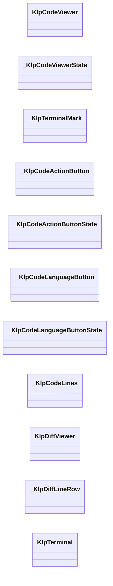

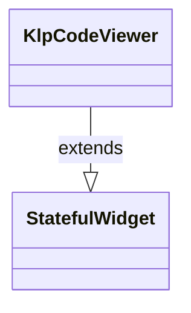

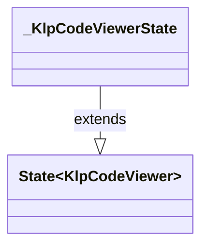

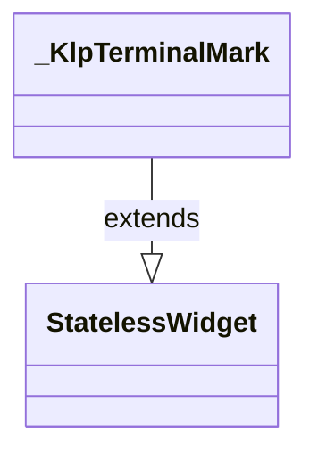

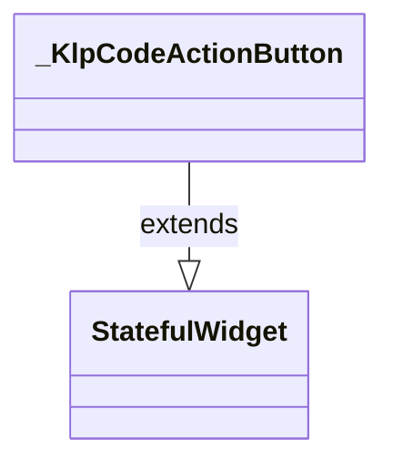

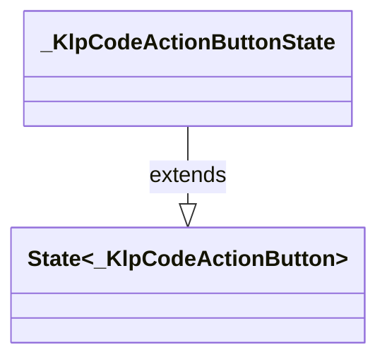

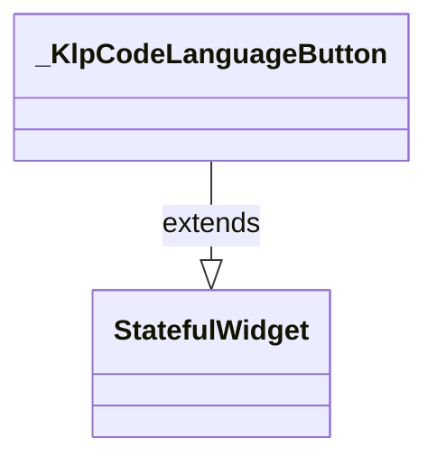

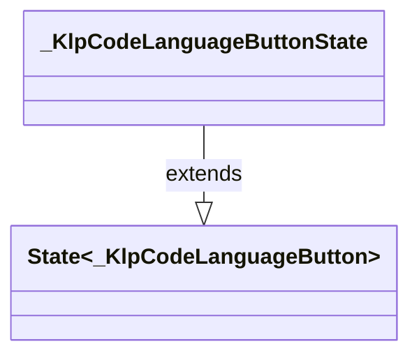

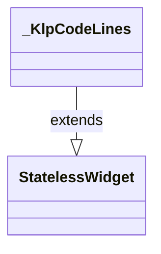

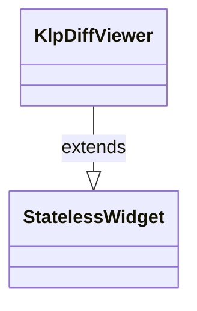

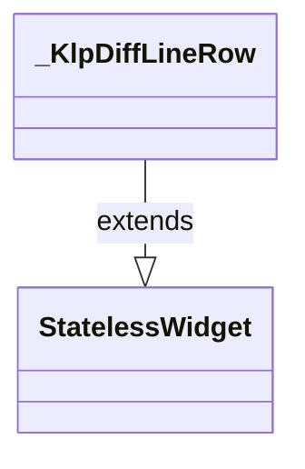

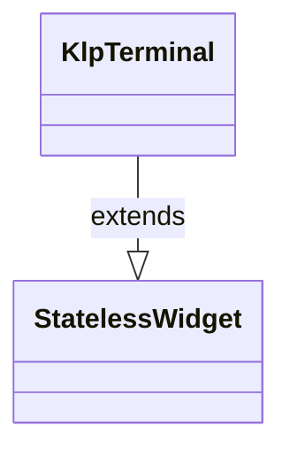

## 宣告與成員證據

成員包含 public 與 private；簽章取自來源，省略函式本體與欄位初始值。`(inferred)` 表示來源未明寫型別；建構子只顯示參數部分，不含初始化列表。

### KlpCodeViewer

ClassDeclaration · public · [lib/src/data/code/klp_code_viewer.dart:13](../../../../../lib/src/data/code/klp_code_viewer.dart#L13)

<code>class KlpCodeViewer extends StatefulWidget</code>

- `extends` → <code>StatefulWidget</code>：[lib/src/data/code/klp_code_viewer.dart:13](../../../../../lib/src/data/code/klp_code_viewer.dart#L13)

| 成員 | 可見性 | 簽章／型別 | 來源註解摘要 | 證據 |
|---|---|---|---|---|
| constructor <code>KlpCodeViewer</code> | public | <code>const KlpCodeViewer({ super.key, required this.code, this.language, this.languageOptions = KlpCodeLanguages.options, this.labels = KlpCodeViewerLabels.english, this.showLineNumbers = false, this.startLine = 1, this.wrapped = false, this.loading = false, this.expandable = false, this.expanded = false, this.maxHeight, this.content, this.viewSelected = false, this.onLanguageChanged, this.onToggleWrap, this.onToggleLineNumbers, this.onToggleView, this.onToggleExpand, this.onCopy, })</code> |  | [lib/src/data/code/klp_code_viewer.dart:14](../../../../../lib/src/data/code/klp_code_viewer.dart#L14) |
| field <code>code</code> | public | <code>final String code</code> |  | [lib/src/data/code/klp_code_viewer.dart:37](../../../../../lib/src/data/code/klp_code_viewer.dart#L37) |
| field <code>language</code> | public | <code>final String? language</code> |  | [lib/src/data/code/klp_code_viewer.dart:38](../../../../../lib/src/data/code/klp_code_viewer.dart#L38) |
| field <code>languageOptions</code> | public | <code>final List&lt;KlpCodeLanguageOption&gt; languageOptions</code> |  | [lib/src/data/code/klp_code_viewer.dart:39](../../../../../lib/src/data/code/klp_code_viewer.dart#L39) |
| field <code>labels</code> | public | <code>final KlpCodeViewerLabels labels</code> |  | [lib/src/data/code/klp_code_viewer.dart:40](../../../../../lib/src/data/code/klp_code_viewer.dart#L40) |
| field <code>showLineNumbers</code> | public | <code>final bool showLineNumbers</code> |  | [lib/src/data/code/klp_code_viewer.dart:41](../../../../../lib/src/data/code/klp_code_viewer.dart#L41) |
| field <code>startLine</code> | public | <code>final int startLine</code> |  | [lib/src/data/code/klp_code_viewer.dart:42](../../../../../lib/src/data/code/klp_code_viewer.dart#L42) |
| field <code>wrapped</code> | public | <code>final bool wrapped</code> |  | [lib/src/data/code/klp_code_viewer.dart:43](../../../../../lib/src/data/code/klp_code_viewer.dart#L43) |
| field <code>loading</code> | public | <code>final bool loading</code> |  | [lib/src/data/code/klp_code_viewer.dart:44](../../../../../lib/src/data/code/klp_code_viewer.dart#L44) |
| field <code>expandable</code> | public | <code>final bool expandable</code> |  | [lib/src/data/code/klp_code_viewer.dart:45](../../../../../lib/src/data/code/klp_code_viewer.dart#L45) |
| field <code>expanded</code> | public | <code>final bool expanded</code> |  | [lib/src/data/code/klp_code_viewer.dart:46](../../../../../lib/src/data/code/klp_code_viewer.dart#L46) |
| field <code>maxHeight</code> | public | <code>final double? maxHeight</code> |  | [lib/src/data/code/klp_code_viewer.dart:47](../../../../../lib/src/data/code/klp_code_viewer.dart#L47) |
| field <code>content</code> | public | <code>final Widget? content</code> |  | [lib/src/data/code/klp_code_viewer.dart:48](../../../../../lib/src/data/code/klp_code_viewer.dart#L48) |
| field <code>viewSelected</code> | public | <code>final bool viewSelected</code> |  | [lib/src/data/code/klp_code_viewer.dart:49](../../../../../lib/src/data/code/klp_code_viewer.dart#L49) |
| field <code>onLanguageChanged</code> | public | <code>final ValueChanged&lt;String&gt;? onLanguageChanged</code> |  | [lib/src/data/code/klp_code_viewer.dart:50](../../../../../lib/src/data/code/klp_code_viewer.dart#L50) |
| field <code>onToggleWrap</code> | public | <code>final VoidCallback? onToggleWrap</code> |  | [lib/src/data/code/klp_code_viewer.dart:51](../../../../../lib/src/data/code/klp_code_viewer.dart#L51) |
| field <code>onToggleLineNumbers</code> | public | <code>final VoidCallback? onToggleLineNumbers</code> |  | [lib/src/data/code/klp_code_viewer.dart:52](../../../../../lib/src/data/code/klp_code_viewer.dart#L52) |
| field <code>onToggleView</code> | public | <code>final VoidCallback? onToggleView</code> |  | [lib/src/data/code/klp_code_viewer.dart:53](../../../../../lib/src/data/code/klp_code_viewer.dart#L53) |
| field <code>onToggleExpand</code> | public | <code>final VoidCallback? onToggleExpand</code> |  | [lib/src/data/code/klp_code_viewer.dart:54](../../../../../lib/src/data/code/klp_code_viewer.dart#L54) |
| field <code>onCopy</code> | public | <code>final VoidCallback? onCopy</code> |  | [lib/src/data/code/klp_code_viewer.dart:55](../../../../../lib/src/data/code/klp_code_viewer.dart#L55) |
| method <code>createState</code> | public | <code>State&lt;KlpCodeViewer&gt; createState()</code> |  | [lib/src/data/code/klp_code_viewer.dart:57](../../../../../lib/src/data/code/klp_code_viewer.dart#L57) |

### _KlpCodeViewerState

ClassDeclaration · private · [lib/src/data/code/klp_code_viewer.dart:61](../../../../../lib/src/data/code/klp_code_viewer.dart#L61)

<code>class _KlpCodeViewerState extends State&lt;KlpCodeViewer&gt;</code>

- `extends` → <code>State&lt;KlpCodeViewer&gt;</code>：[lib/src/data/code/klp_code_viewer.dart:61](../../../../../lib/src/data/code/klp_code_viewer.dart#L61)

| 成員 | 可見性 | 簽章／型別 | 來源註解摘要 | 證據 |
|---|---|---|---|---|
| field <code>_wrapped</code> | private | <code>late bool _wrapped</code> |  | [lib/src/data/code/klp_code_viewer.dart:62](../../../../../lib/src/data/code/klp_code_viewer.dart#L62) |
| field <code>_showLineNumbers</code> | private | <code>late bool _showLineNumbers</code> |  | [lib/src/data/code/klp_code_viewer.dart:63](../../../../../lib/src/data/code/klp_code_viewer.dart#L63) |
| field <code>_expanded</code> | private | <code>late bool _expanded</code> |  | [lib/src/data/code/klp_code_viewer.dart:64](../../../../../lib/src/data/code/klp_code_viewer.dart#L64) |
| getter <code>_currentLanguage</code> | private | <code>KlpCodeLanguageOption? get _currentLanguage</code> |  | [lib/src/data/code/klp_code_viewer.dart:66](../../../../../lib/src/data/code/klp_code_viewer.dart#L66) |
| getter <code>_languageLabel</code> | private | <code>String get _languageLabel</code> |  | [lib/src/data/code/klp_code_viewer.dart:74](../../../../../lib/src/data/code/klp_code_viewer.dart#L74) |
| getter <code>_supportsView</code> | private | <code>bool get _supportsView</code> |  | [lib/src/data/code/klp_code_viewer.dart:80](../../../../../lib/src/data/code/klp_code_viewer.dart#L80) |
| method <code>initState</code> | public | <code>void initState()</code> |  | [lib/src/data/code/klp_code_viewer.dart:83](../../../../../lib/src/data/code/klp_code_viewer.dart#L83) |
| method <code>didUpdateWidget</code> | public | <code>void didUpdateWidget(KlpCodeViewer oldWidget)</code> |  | [lib/src/data/code/klp_code_viewer.dart:91](../../../../../lib/src/data/code/klp_code_viewer.dart#L91) |
| method <code>build</code> | public | <code>Widget build(BuildContext context)</code> |  | [lib/src/data/code/klp_code_viewer.dart:103](../../../../../lib/src/data/code/klp_code_viewer.dart#L103) |
| method <code>_buildHeader</code> | private | <code>Widget _buildHeader()</code> |  | [lib/src/data/code/klp_code_viewer.dart:124](../../../../../lib/src/data/code/klp_code_viewer.dart#L124) |
| method <code>_buildBody</code> | private | <code>Widget _buildBody()</code> |  | [lib/src/data/code/klp_code_viewer.dart:202](../../../../../lib/src/data/code/klp_code_viewer.dart#L202) |
| method <code>_openLanguageMenu</code> | private | <code>Future&lt;void&gt; _openLanguageMenu(BuildContext context)</code> |  | [lib/src/data/code/klp_code_viewer.dart:233](../../../../../lib/src/data/code/klp_code_viewer.dart#L233) |
| method <code>_openOptionsMenu</code> | private | <code>Future&lt;void&gt; _openOptionsMenu(BuildContext context)</code> |  | [lib/src/data/code/klp_code_viewer.dart:260](../../../../../lib/src/data/code/klp_code_viewer.dart#L260) |
| method <code>_openMenu</code> | private | <code>Future&lt;int?&gt; _openMenu( BuildContext context, { required String label, required List&lt;KlpMenuItemData&gt; items, })</code> |  | [lib/src/data/code/klp_code_viewer.dart:289](../../../../../lib/src/data/code/klp_code_viewer.dart#L289) |

### _KlpTerminalMark

ClassDeclaration · private · [lib/src/data/code/klp_code_viewer.dart:344](../../../../../lib/src/data/code/klp_code_viewer.dart#L344)

<code>class _KlpTerminalMark extends StatelessWidget</code>

- `extends` → <code>StatelessWidget</code>：[lib/src/data/code/klp_code_viewer.dart:344](../../../../../lib/src/data/code/klp_code_viewer.dart#L344)

| 成員 | 可見性 | 簽章／型別 | 來源註解摘要 | 證據 |
|---|---|---|---|---|
| constructor <code>_KlpTerminalMark</code> | private | <code>const _KlpTerminalMark()</code> |  | [lib/src/data/code/klp_code_viewer.dart:345](../../../../../lib/src/data/code/klp_code_viewer.dart#L345) |
| method <code>build</code> | public | <code>Widget build(BuildContext context)</code> |  | [lib/src/data/code/klp_code_viewer.dart:347](../../../../../lib/src/data/code/klp_code_viewer.dart#L347) |

### _KlpCodeActionButton

ClassDeclaration · private · [lib/src/data/code/klp_code_viewer.dart:368](../../../../../lib/src/data/code/klp_code_viewer.dart#L368)

<code>class _KlpCodeActionButton extends StatefulWidget</code>

- `extends` → <code>StatefulWidget</code>：[lib/src/data/code/klp_code_viewer.dart:368](../../../../../lib/src/data/code/klp_code_viewer.dart#L368)

| 成員 | 可見性 | 簽章／型別 | 來源註解摘要 | 證據 |
|---|---|---|---|---|
| constructor <code>_KlpCodeActionButton</code> | private | <code>const _KlpCodeActionButton({ super.key, required this.icon, required this.label, required this.onPressed, this.selected = false, })</code> |  | [lib/src/data/code/klp_code_viewer.dart:369](../../../../../lib/src/data/code/klp_code_viewer.dart#L369) |
| field <code>icon</code> | public | <code>final KlpIconData icon</code> |  | [lib/src/data/code/klp_code_viewer.dart:377](../../../../../lib/src/data/code/klp_code_viewer.dart#L377) |
| field <code>label</code> | public | <code>final String label</code> |  | [lib/src/data/code/klp_code_viewer.dart:378](../../../../../lib/src/data/code/klp_code_viewer.dart#L378) |
| field <code>onPressed</code> | public | <code>final VoidCallback? onPressed</code> |  | [lib/src/data/code/klp_code_viewer.dart:379](../../../../../lib/src/data/code/klp_code_viewer.dart#L379) |
| field <code>selected</code> | public | <code>final bool selected</code> |  | [lib/src/data/code/klp_code_viewer.dart:380](../../../../../lib/src/data/code/klp_code_viewer.dart#L380) |
| method <code>createState</code> | public | <code>State&lt;_KlpCodeActionButton&gt; createState()</code> |  | [lib/src/data/code/klp_code_viewer.dart:382](../../../../../lib/src/data/code/klp_code_viewer.dart#L382) |

### _KlpCodeActionButtonState

ClassDeclaration · private · [lib/src/data/code/klp_code_viewer.dart:386](../../../../../lib/src/data/code/klp_code_viewer.dart#L386)

<code>class _KlpCodeActionButtonState extends State&lt;_KlpCodeActionButton&gt;</code>

- `extends` → <code>State&lt;_KlpCodeActionButton&gt;</code>：[lib/src/data/code/klp_code_viewer.dart:386](../../../../../lib/src/data/code/klp_code_viewer.dart#L386)

| 成員 | 可見性 | 簽章／型別 | 來源註解摘要 | 證據 |
|---|---|---|---|---|
| field <code>_hovered</code> | private | <code>bool _hovered</code> |  | [lib/src/data/code/klp_code_viewer.dart:387](../../../../../lib/src/data/code/klp_code_viewer.dart#L387) |
| field <code>_focused</code> | private | <code>bool _focused</code> |  | [lib/src/data/code/klp_code_viewer.dart:388](../../../../../lib/src/data/code/klp_code_viewer.dart#L388) |
| method <code>build</code> | public | <code>Widget build(BuildContext context)</code> |  | [lib/src/data/code/klp_code_viewer.dart:390](../../../../../lib/src/data/code/klp_code_viewer.dart#L390) |

### _KlpCodeLanguageButton

ClassDeclaration · private · [lib/src/data/code/klp_code_viewer.dart:443](../../../../../lib/src/data/code/klp_code_viewer.dart#L443)

<code>class _KlpCodeLanguageButton extends StatefulWidget</code>

- `extends` → <code>StatefulWidget</code>：[lib/src/data/code/klp_code_viewer.dart:443](../../../../../lib/src/data/code/klp_code_viewer.dart#L443)

| 成員 | 可見性 | 簽章／型別 | 來源註解摘要 | 證據 |
|---|---|---|---|---|
| constructor <code>_KlpCodeLanguageButton</code> | private | <code>const _KlpCodeLanguageButton({ super.key, required this.label, required this.enabled, required this.onPressed, })</code> |  | [lib/src/data/code/klp_code_viewer.dart:444](../../../../../lib/src/data/code/klp_code_viewer.dart#L444) |
| field <code>label</code> | public | <code>final String label</code> |  | [lib/src/data/code/klp_code_viewer.dart:451](../../../../../lib/src/data/code/klp_code_viewer.dart#L451) |
| field <code>enabled</code> | public | <code>final bool enabled</code> |  | [lib/src/data/code/klp_code_viewer.dart:452](../../../../../lib/src/data/code/klp_code_viewer.dart#L452) |
| field <code>onPressed</code> | public | <code>final VoidCallback onPressed</code> |  | [lib/src/data/code/klp_code_viewer.dart:453](../../../../../lib/src/data/code/klp_code_viewer.dart#L453) |
| method <code>createState</code> | public | <code>State&lt;_KlpCodeLanguageButton&gt; createState()</code> |  | [lib/src/data/code/klp_code_viewer.dart:455](../../../../../lib/src/data/code/klp_code_viewer.dart#L455) |

### _KlpCodeLanguageButtonState

ClassDeclaration · private · [lib/src/data/code/klp_code_viewer.dart:459](../../../../../lib/src/data/code/klp_code_viewer.dart#L459)

<code>class _KlpCodeLanguageButtonState extends State&lt;_KlpCodeLanguageButton&gt;</code>

- `extends` → <code>State&lt;_KlpCodeLanguageButton&gt;</code>：[lib/src/data/code/klp_code_viewer.dart:459](../../../../../lib/src/data/code/klp_code_viewer.dart#L459)

| 成員 | 可見性 | 簽章／型別 | 來源註解摘要 | 證據 |
|---|---|---|---|---|
| field <code>_hovered</code> | private | <code>bool _hovered</code> |  | [lib/src/data/code/klp_code_viewer.dart:460](../../../../../lib/src/data/code/klp_code_viewer.dart#L460) |
| field <code>_focused</code> | private | <code>bool _focused</code> |  | [lib/src/data/code/klp_code_viewer.dart:461](../../../../../lib/src/data/code/klp_code_viewer.dart#L461) |
| method <code>build</code> | public | <code>Widget build(BuildContext context)</code> |  | [lib/src/data/code/klp_code_viewer.dart:463](../../../../../lib/src/data/code/klp_code_viewer.dart#L463) |

### _KlpCodeLines

ClassDeclaration · private · [lib/src/data/code/klp_code_viewer.dart:506](../../../../../lib/src/data/code/klp_code_viewer.dart#L506)

<code>class _KlpCodeLines extends StatelessWidget</code>

- `extends` → <code>StatelessWidget</code>：[lib/src/data/code/klp_code_viewer.dart:506](../../../../../lib/src/data/code/klp_code_viewer.dart#L506)

| 成員 | 可見性 | 簽章／型別 | 來源註解摘要 | 證據 |
|---|---|---|---|---|
| constructor <code>_KlpCodeLines</code> | private | <code>const _KlpCodeLines({ required this.code, required this.startLine, required this.wrapped, required this.showLineNumbers, })</code> |  | [lib/src/data/code/klp_code_viewer.dart:507](../../../../../lib/src/data/code/klp_code_viewer.dart#L507) |
| field <code>code</code> | public | <code>final String code</code> |  | [lib/src/data/code/klp_code_viewer.dart:514](../../../../../lib/src/data/code/klp_code_viewer.dart#L514) |
| field <code>startLine</code> | public | <code>final int startLine</code> |  | [lib/src/data/code/klp_code_viewer.dart:515](../../../../../lib/src/data/code/klp_code_viewer.dart#L515) |
| field <code>wrapped</code> | public | <code>final bool wrapped</code> |  | [lib/src/data/code/klp_code_viewer.dart:516](../../../../../lib/src/data/code/klp_code_viewer.dart#L516) |
| field <code>showLineNumbers</code> | public | <code>final bool showLineNumbers</code> |  | [lib/src/data/code/klp_code_viewer.dart:517](../../../../../lib/src/data/code/klp_code_viewer.dart#L517) |
| method <code>build</code> | public | <code>Widget build(BuildContext context)</code> |  | [lib/src/data/code/klp_code_viewer.dart:519](../../../../../lib/src/data/code/klp_code_viewer.dart#L519) |

### KlpDiffViewer

ClassDeclaration · public · [lib/src/data/code/klp_code_viewer.dart:563](../../../../../lib/src/data/code/klp_code_viewer.dart#L563)

<code>class KlpDiffViewer extends StatelessWidget</code>

來源註解摘要：程式碼差異檢視器 (Diff Viewer)。 呈現檔案名稱標題、雙欄行號對照、新增（綠底）與刪除（紅底）標記行，以及逐行審查操作。

- `extends` → <code>StatelessWidget</code>：[lib/src/data/code/klp_code_viewer.dart:566](../../../../../lib/src/data/code/klp_code_viewer.dart#L566)

| 成員 | 可見性 | 簽章／型別 | 來源註解摘要 | 證據 |
|---|---|---|---|---|
| constructor <code>KlpDiffViewer</code> | public | <code>const KlpDiffViewer({ super.key, required this.filename, required this.lines, this.maxHeight, this.onCopy, })</code> |  | [lib/src/data/code/klp_code_viewer.dart:567](../../../../../lib/src/data/code/klp_code_viewer.dart#L567) |
| field <code>filename</code> | public | <code>final String filename</code> | 檔案名稱或路徑標題。 | [lib/src/data/code/klp_code_viewer.dart:576](../../../../../lib/src/data/code/klp_code_viewer.dart#L576) |
| field <code>lines</code> | public | <code>final List&lt;KlpDiffLine&gt; lines</code> | 差異行清單。 | [lib/src/data/code/klp_code_viewer.dart:579](../../../../../lib/src/data/code/klp_code_viewer.dart#L579) |
| field <code>maxHeight</code> | public | <code>final double? maxHeight</code> | 最大高度。超過時內部自動出現滾動條。 | [lib/src/data/code/klp_code_viewer.dart:582](../../../../../lib/src/data/code/klp_code_viewer.dart#L582) |
| field <code>onCopy</code> | public | <code>final VoidCallback? onCopy</code> | 複製內容的回呼。 | [lib/src/data/code/klp_code_viewer.dart:585](../../../../../lib/src/data/code/klp_code_viewer.dart#L585) |
| method <code>build</code> | public | <code>Widget build(BuildContext context)</code> |  | [lib/src/data/code/klp_code_viewer.dart:587](../../../../../lib/src/data/code/klp_code_viewer.dart#L587) |

### _KlpDiffLineRow

ClassDeclaration · private · [lib/src/data/code/klp_code_viewer.dart:665](../../../../../lib/src/data/code/klp_code_viewer.dart#L665)

<code>class _KlpDiffLineRow extends StatelessWidget</code>

- `extends` → <code>StatelessWidget</code>：[lib/src/data/code/klp_code_viewer.dart:665](../../../../../lib/src/data/code/klp_code_viewer.dart#L665)

| 成員 | 可見性 | 簽章／型別 | 來源註解摘要 | 證據 |
|---|---|---|---|---|
| constructor <code>_KlpDiffLineRow</code> | private | <code>const _KlpDiffLineRow({required this.line})</code> |  | [lib/src/data/code/klp_code_viewer.dart:666](../../../../../lib/src/data/code/klp_code_viewer.dart#L666) |
| field <code>line</code> | public | <code>final KlpDiffLine line</code> |  | [lib/src/data/code/klp_code_viewer.dart:668](../../../../../lib/src/data/code/klp_code_viewer.dart#L668) |
| method <code>build</code> | public | <code>Widget build(BuildContext context)</code> |  | [lib/src/data/code/klp_code_viewer.dart:670](../../../../../lib/src/data/code/klp_code_viewer.dart#L670) |

### KlpTerminal

ClassDeclaration · public · [lib/src/data/code/klp_code_viewer.dart:773](../../../../../lib/src/data/code/klp_code_viewer.dart#L773)

<code>class KlpTerminal extends StatelessWidget</code>

來源註解摘要：終端機模擬與指令執行檢視器 (Terminal)。 具備整體實線細邊框、頂部三點視窗標記、指令列與輸出區，內容區域採用 stage 底色。

- `extends` → <code>StatelessWidget</code>：[lib/src/data/code/klp_code_viewer.dart:776](../../../../../lib/src/data/code/klp_code_viewer.dart#L776)

| 成員 | 可見性 | 簽章／型別 | 來源註解摘要 | 證據 |
|---|---|---|---|---|
| constructor <code>KlpTerminal</code> | public | <code>const KlpTerminal({ super.key, this.title = &#x27;terminal&#x27;, required this.lines, this.maxHeight, this.onCopy, this.onClear, })</code> |  | [lib/src/data/code/klp_code_viewer.dart:777](../../../../../lib/src/data/code/klp_code_viewer.dart#L777) |
| field <code>title</code> | public | <code>final String title</code> | 終端機視窗標題。 | [lib/src/data/code/klp_code_viewer.dart:787](../../../../../lib/src/data/code/klp_code_viewer.dart#L787) |
| field <code>lines</code> | public | <code>final List&lt;String&gt; lines</code> | 輸出字串行清單。 | [lib/src/data/code/klp_code_viewer.dart:790](../../../../../lib/src/data/code/klp_code_viewer.dart#L790) |
| field <code>maxHeight</code> | public | <code>final double? maxHeight</code> | 最大高度。超過時內部自動出現滾動條。 | [lib/src/data/code/klp_code_viewer.dart:793](../../../../../lib/src/data/code/klp_code_viewer.dart#L793) |
| field <code>onCopy</code> | public | <code>final VoidCallback? onCopy</code> | 複製終端機內容的回呼。 | [lib/src/data/code/klp_code_viewer.dart:796](../../../../../lib/src/data/code/klp_code_viewer.dart#L796) |
| field <code>onClear</code> | public | <code>final VoidCallback? onClear</code> | 清除終端機內容的回呼。 | [lib/src/data/code/klp_code_viewer.dart:799](../../../../../lib/src/data/code/klp_code_viewer.dart#L799) |
| method <code>build</code> | public | <code>Widget build(BuildContext context)</code> |  | [lib/src/data/code/klp_code_viewer.dart:801](../../../../../lib/src/data/code/klp_code_viewer.dart#L801) |

## 閱讀說明與限制

箭頭只表示來源明寫的靜態關係；import 不等於呼叫。未分析動態呼叫、欄位的實際物件擁有權、狀態轉移或渲染流程；型別未進行語意解析，繼承目標保留原始型別拼寫。public／private 依 Dart 名稱前綴判斷；public 宣告不代表已由 `lib/kallopis.dart` 匯出。

本頁由 `tool/architecture_atlas` 產生；編輯來源或生成工具後重新產生，避免手改本頁。
