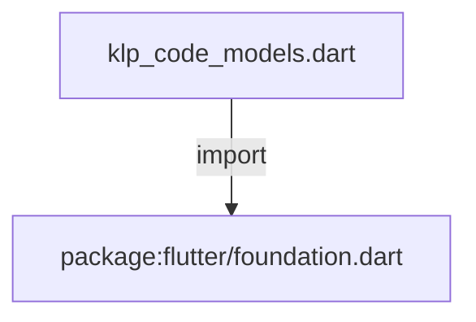
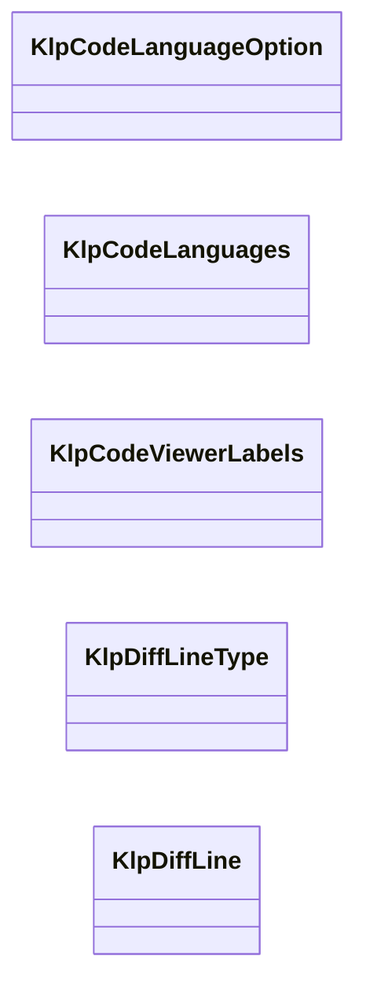

# klp_code_models.dart：直接依賴與宣告架構

[回到目錄](README.md) · [來源檔案](../../../../../../lib/src/data/code/models/klp_code_models.dart)

## 範圍

核心是 `lib/src/data/code/models/klp_code_models.dart`。主要視角為該檔案明寫的 import／export／part；輔助視角為本檔宣告及 extends／implements／with／on 關係。只展開一層外部邊界。

## 直接依賴圖

## 依賴證據

| 關係 | 原始 directive | 來源 |
|---|---|---|
| import | <code>import &#x27;package:flutter/foundation.dart&#x27;;</code> | [lib/src/data/code/models/klp_code_models.dart:1](../../../../../../lib/src/data/code/models/klp_code_models.dart#L1) |

## 宣告關係圖

本組節點是本檔宣告；沒有箭頭的宣告未在此圖主張互相依賴。

## 宣告與成員證據

成員包含 public 與 private；簽章取自來源，省略函式本體與欄位初始值。`(inferred)` 表示來源未明寫型別；建構子只顯示參數部分，不含初始化列表。

### KlpCodeLanguageOption

ClassDeclaration · public · [lib/src/data/code/models/klp_code_models.dart:3](../../../../../../lib/src/data/code/models/klp_code_models.dart#L3)

<code>class KlpCodeLanguageOption</code>

來源註解摘要：Code Viewer 可用的語言選項。

| 成員 | 可見性 | 簽章／型別 | 來源註解摘要 | 證據 |
|---|---|---|---|---|
| constructor <code>KlpCodeLanguageOption</code> | public | <code>const KlpCodeLanguageOption({ required this.id, required this.label, this.supportsView = false, })</code> |  | [lib/src/data/code/models/klp_code_models.dart:6](../../../../../../lib/src/data/code/models/klp_code_models.dart#L6) |
| field <code>id</code> | public | <code>final String id</code> |  | [lib/src/data/code/models/klp_code_models.dart:12](../../../../../../lib/src/data/code/models/klp_code_models.dart#L12) |
| field <code>label</code> | public | <code>final String label</code> |  | [lib/src/data/code/models/klp_code_models.dart:13](../../../../../../lib/src/data/code/models/klp_code_models.dart#L13) |
| field <code>supportsView</code> | public | <code>final bool supportsView</code> |  | [lib/src/data/code/models/klp_code_models.dart:14](../../../../../../lib/src/data/code/models/klp_code_models.dart#L14) |

### KlpCodeLanguages

ClassDeclaration · public · [lib/src/data/code/models/klp_code_models.dart:17](../../../../../../lib/src/data/code/models/klp_code_models.dart#L17)

<code>abstract final class KlpCodeLanguages</code>

來源註解摘要：Code Viewer 的預設語言清單。

| 成員 | 可見性 | 簽章／型別 | 來源註解摘要 | 證據 |
|---|---|---|---|---|
| field <code>options</code> | public | <code>static const (inferred) options</code> |  | [lib/src/data/code/models/klp_code_models.dart:19](../../../../../../lib/src/data/code/models/klp_code_models.dart#L19) |

### KlpCodeViewerLabels

ClassDeclaration · public · [lib/src/data/code/models/klp_code_models.dart:45](../../../../../../lib/src/data/code/models/klp_code_models.dart#L45)

<code>class KlpCodeViewerLabels</code>

來源註解摘要：Code Viewer 的介面文字。

| 成員 | 可見性 | 簽章／型別 | 來源註解摘要 | 證據 |
|---|---|---|---|---|
| constructor <code>KlpCodeViewerLabels</code> | public | <code>const KlpCodeViewerLabels({ required this.copy, required this.menu, required this.toggleView, required this.languageMenu, required this.wrap, required this.lineNumbers, })</code> |  | [lib/src/data/code/models/klp_code_models.dart:48](../../../../../../lib/src/data/code/models/klp_code_models.dart#L48) |
| field <code>english</code> | public | <code>static const (inferred) english</code> |  | [lib/src/data/code/models/klp_code_models.dart:57](../../../../../../lib/src/data/code/models/klp_code_models.dart#L57) |
| field <code>copy</code> | public | <code>final String copy</code> |  | [lib/src/data/code/models/klp_code_models.dart:66](../../../../../../lib/src/data/code/models/klp_code_models.dart#L66) |
| field <code>menu</code> | public | <code>final String menu</code> |  | [lib/src/data/code/models/klp_code_models.dart:67](../../../../../../lib/src/data/code/models/klp_code_models.dart#L67) |
| field <code>toggleView</code> | public | <code>final String toggleView</code> |  | [lib/src/data/code/models/klp_code_models.dart:68](../../../../../../lib/src/data/code/models/klp_code_models.dart#L68) |
| field <code>languageMenu</code> | public | <code>final String languageMenu</code> |  | [lib/src/data/code/models/klp_code_models.dart:69](../../../../../../lib/src/data/code/models/klp_code_models.dart#L69) |
| field <code>wrap</code> | public | <code>final String wrap</code> |  | [lib/src/data/code/models/klp_code_models.dart:70](../../../../../../lib/src/data/code/models/klp_code_models.dart#L70) |
| field <code>lineNumbers</code> | public | <code>final String lineNumbers</code> |  | [lib/src/data/code/models/klp_code_models.dart:71](../../../../../../lib/src/data/code/models/klp_code_models.dart#L71) |

### KlpDiffLineType

EnumDeclaration · public · [lib/src/data/code/models/klp_code_models.dart:74](../../../../../../lib/src/data/code/models/klp_code_models.dart#L74)

<code>enum KlpDiffLineType</code>

| 成員 | 可見性 | 簽章／型別 | 來源註解摘要 | 證據 |
|---|---|---|---|---|
| enum value <code>unchanged</code> | public | <code>unchanged</code> |  | [lib/src/data/code/models/klp_code_models.dart:74](../../../../../../lib/src/data/code/models/klp_code_models.dart#L74) |
| enum value <code>added</code> | public | <code>added</code> |  | [lib/src/data/code/models/klp_code_models.dart:74](../../../../../../lib/src/data/code/models/klp_code_models.dart#L74) |
| enum value <code>deleted</code> | public | <code>deleted</code> |  | [lib/src/data/code/models/klp_code_models.dart:74](../../../../../../lib/src/data/code/models/klp_code_models.dart#L74) |

### KlpDiffLine

ClassDeclaration · public · [lib/src/data/code/models/klp_code_models.dart:76](../../../../../../lib/src/data/code/models/klp_code_models.dart#L76)

<code>class KlpDiffLine</code>

來源註解摘要：Diff 單行資料。

| 成員 | 可見性 | 簽章／型別 | 來源註解摘要 | 證據 |
|---|---|---|---|---|
| constructor <code>KlpDiffLine</code> | public | <code>const KlpDiffLine({ this.oldNumber, this.newNumber, required this.content, this.type = KlpDiffLineType.unchanged, this.onApprove, this.onReject, })</code> |  | [lib/src/data/code/models/klp_code_models.dart:79](../../../../../../lib/src/data/code/models/klp_code_models.dart#L79) |
| field <code>oldNumber</code> | public | <code>final int? oldNumber</code> |  | [lib/src/data/code/models/klp_code_models.dart:88](../../../../../../lib/src/data/code/models/klp_code_models.dart#L88) |
| field <code>newNumber</code> | public | <code>final int? newNumber</code> |  | [lib/src/data/code/models/klp_code_models.dart:89](../../../../../../lib/src/data/code/models/klp_code_models.dart#L89) |
| field <code>content</code> | public | <code>final String content</code> |  | [lib/src/data/code/models/klp_code_models.dart:90](../../../../../../lib/src/data/code/models/klp_code_models.dart#L90) |
| field <code>type</code> | public | <code>final KlpDiffLineType type</code> |  | [lib/src/data/code/models/klp_code_models.dart:91](../../../../../../lib/src/data/code/models/klp_code_models.dart#L91) |
| field <code>onApprove</code> | public | <code>final VoidCallback? onApprove</code> |  | [lib/src/data/code/models/klp_code_models.dart:92](../../../../../../lib/src/data/code/models/klp_code_models.dart#L92) |
| field <code>onReject</code> | public | <code>final VoidCallback? onReject</code> |  | [lib/src/data/code/models/klp_code_models.dart:93](../../../../../../lib/src/data/code/models/klp_code_models.dart#L93) |

## 閱讀說明與限制

箭頭只表示來源明寫的靜態關係；import 不等於呼叫。未分析動態呼叫、欄位的實際物件擁有權、狀態轉移或渲染流程；型別未進行語意解析，繼承目標保留原始型別拼寫。public／private 依 Dart 名稱前綴判斷；public 宣告不代表已由 `lib/kallopis.dart` 匯出。

本頁由 `tool/architecture_atlas` 產生；編輯來源或生成工具後重新產生，避免手改本頁。
