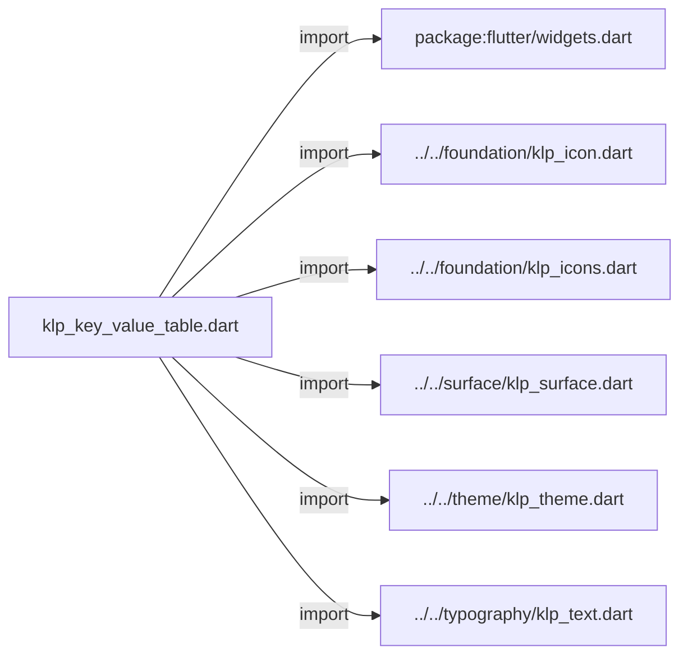
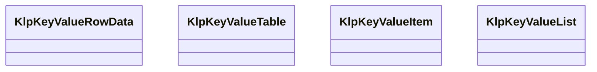
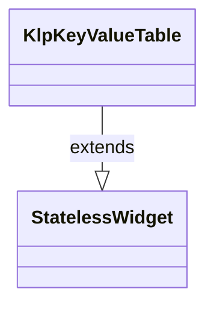
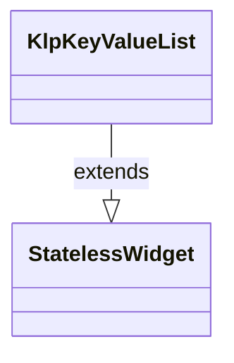

# klp_key_value_table.dart：直接依賴與宣告架構

[回到目錄](README.md) · [來源檔案](../../../../../lib/src/data/key_value/klp_key_value_table.dart)

## 範圍

核心是 `lib/src/data/key_value/klp_key_value_table.dart`。主要視角為該檔案明寫的 import／export／part；輔助視角為本檔宣告及 extends／implements／with／on 關係。只展開一層外部邊界。

## 直接依賴圖

## 依賴證據

| 關係 | 原始 directive | 來源 |
|---|---|---|
| import | <code>import &#x27;package:flutter/widgets.dart&#x27;;</code> | [lib/src/data/key_value/klp_key_value_table.dart:1](../../../../../lib/src/data/key_value/klp_key_value_table.dart#L1) |
| import | <code>import &#x27;../../foundation/klp_icon.dart&#x27;;</code> | [lib/src/data/key_value/klp_key_value_table.dart:3](../../../../../lib/src/data/key_value/klp_key_value_table.dart#L3) |
| import | <code>import &#x27;../../foundation/klp_icons.dart&#x27;;</code> | [lib/src/data/key_value/klp_key_value_table.dart:4](../../../../../lib/src/data/key_value/klp_key_value_table.dart#L4) |
| import | <code>import &#x27;../../surface/klp_surface.dart&#x27;;</code> | [lib/src/data/key_value/klp_key_value_table.dart:5](../../../../../lib/src/data/key_value/klp_key_value_table.dart#L5) |
| import | <code>import &#x27;../../theme/klp_theme.dart&#x27;;</code> | [lib/src/data/key_value/klp_key_value_table.dart:6](../../../../../lib/src/data/key_value/klp_key_value_table.dart#L6) |
| import | <code>import &#x27;../../typography/klp_text.dart&#x27;;</code> | [lib/src/data/key_value/klp_key_value_table.dart:7](../../../../../lib/src/data/key_value/klp_key_value_table.dart#L7) |

## 宣告關係圖

本組節點是本檔宣告；沒有箭頭的宣告未在此圖主張互相依賴。

## 宣告與成員證據

成員包含 public 與 private；簽章取自來源，省略函式本體與欄位初始值。`(inferred)` 表示來源未明寫型別；建構子只顯示參數部分，不含初始化列表。

### KlpKeyValueRowData

ClassDeclaration · public · [lib/src/data/key_value/klp_key_value_table.dart:9](../../../../../lib/src/data/key_value/klp_key_value_table.dart#L9)

<code>class KlpKeyValueRowData</code>

| 成員 | 可見性 | 簽章／型別 | 來源註解摘要 | 證據 |
|---|---|---|---|---|
| constructor <code>KlpKeyValueRowData</code> | public | <code>const KlpKeyValueRowData({required this.label, required this.value})</code> |  | [lib/src/data/key_value/klp_key_value_table.dart:11](../../../../../lib/src/data/key_value/klp_key_value_table.dart#L11) |
| field <code>label</code> | public | <code>final String label</code> |  | [lib/src/data/key_value/klp_key_value_table.dart:13](../../../../../lib/src/data/key_value/klp_key_value_table.dart#L13) |
| field <code>value</code> | public | <code>final String value</code> |  | [lib/src/data/key_value/klp_key_value_table.dart:14](../../../../../lib/src/data/key_value/klp_key_value_table.dart#L14) |

### KlpKeyValueTable

ClassDeclaration · public · [lib/src/data/key_value/klp_key_value_table.dart:17](../../../../../lib/src/data/key_value/klp_key_value_table.dart#L17)

<code>class KlpKeyValueTable extends StatelessWidget</code>

- `extends` → <code>StatelessWidget</code>：[lib/src/data/key_value/klp_key_value_table.dart:17](../../../../../lib/src/data/key_value/klp_key_value_table.dart#L17)

| 成員 | 可見性 | 簽章／型別 | 來源註解摘要 | 證據 |
|---|---|---|---|---|
| constructor <code>KlpKeyValueTable</code> | public | <code>const KlpKeyValueTable({ super.key, required this.rows, this.title, this.labelWidth = 112, })</code> |  | [lib/src/data/key_value/klp_key_value_table.dart:18](../../../../../lib/src/data/key_value/klp_key_value_table.dart#L18) |
| field <code>rows</code> | public | <code>final List&lt;KlpKeyValueRowData&gt; rows</code> |  | [lib/src/data/key_value/klp_key_value_table.dart:25](../../../../../lib/src/data/key_value/klp_key_value_table.dart#L25) |
| field <code>title</code> | public | <code>final String? title</code> |  | [lib/src/data/key_value/klp_key_value_table.dart:26](../../../../../lib/src/data/key_value/klp_key_value_table.dart#L26) |
| field <code>labelWidth</code> | public | <code>final double labelWidth</code> |  | [lib/src/data/key_value/klp_key_value_table.dart:27](../../../../../lib/src/data/key_value/klp_key_value_table.dart#L27) |
| method <code>build</code> | public | <code>Widget build(BuildContext context)</code> |  | [lib/src/data/key_value/klp_key_value_table.dart:29](../../../../../lib/src/data/key_value/klp_key_value_table.dart#L29) |

### KlpKeyValueItem

ClassDeclaration · public · [lib/src/data/key_value/klp_key_value_table.dart:78](../../../../../lib/src/data/key_value/klp_key_value_table.dart#L78)

<code>class KlpKeyValueItem</code>

| 成員 | 可見性 | 簽章／型別 | 來源註解摘要 | 證據 |
|---|---|---|---|---|
| constructor <code>KlpKeyValueItem</code> | public | <code>const KlpKeyValueItem({ required this.id, required this.label, required this.value, this.verbatim = false, this.copyable = false, })</code> |  | [lib/src/data/key_value/klp_key_value_table.dart:80](../../../../../lib/src/data/key_value/klp_key_value_table.dart#L80) |
| field <code>id</code> | public | <code>final String id</code> |  | [lib/src/data/key_value/klp_key_value_table.dart:88](../../../../../lib/src/data/key_value/klp_key_value_table.dart#L88) |
| field <code>label</code> | public | <code>final String label</code> |  | [lib/src/data/key_value/klp_key_value_table.dart:89](../../../../../lib/src/data/key_value/klp_key_value_table.dart#L89) |
| field <code>value</code> | public | <code>final Widget value</code> |  | [lib/src/data/key_value/klp_key_value_table.dart:90](../../../../../lib/src/data/key_value/klp_key_value_table.dart#L90) |
| field <code>verbatim</code> | public | <code>final bool verbatim</code> |  | [lib/src/data/key_value/klp_key_value_table.dart:91](../../../../../lib/src/data/key_value/klp_key_value_table.dart#L91) |
| field <code>copyable</code> | public | <code>final bool copyable</code> |  | [lib/src/data/key_value/klp_key_value_table.dart:92](../../../../../lib/src/data/key_value/klp_key_value_table.dart#L92) |

### KlpKeyValueList

ClassDeclaration · public · [lib/src/data/key_value/klp_key_value_table.dart:95](../../../../../lib/src/data/key_value/klp_key_value_table.dart#L95)

<code>class KlpKeyValueList extends StatelessWidget</code>

- `extends` → <code>StatelessWidget</code>：[lib/src/data/key_value/klp_key_value_table.dart:95](../../../../../lib/src/data/key_value/klp_key_value_table.dart#L95)

| 成員 | 可見性 | 簽章／型別 | 來源註解摘要 | 證據 |
|---|---|---|---|---|
| constructor <code>KlpKeyValueList</code> | public | <code>const KlpKeyValueList({ super.key, required this.rows, this.labelWidth = 96, this.onCopy, this.emptyState, })</code> |  | [lib/src/data/key_value/klp_key_value_table.dart:96](../../../../../lib/src/data/key_value/klp_key_value_table.dart#L96) |
| field <code>rows</code> | public | <code>final List&lt;KlpKeyValueItem&gt; rows</code> |  | [lib/src/data/key_value/klp_key_value_table.dart:104](../../../../../lib/src/data/key_value/klp_key_value_table.dart#L104) |
| field <code>labelWidth</code> | public | <code>final double labelWidth</code> |  | [lib/src/data/key_value/klp_key_value_table.dart:105](../../../../../lib/src/data/key_value/klp_key_value_table.dart#L105) |
| field <code>onCopy</code> | public | <code>final ValueChanged&lt;String&gt;? onCopy</code> |  | [lib/src/data/key_value/klp_key_value_table.dart:106](../../../../../lib/src/data/key_value/klp_key_value_table.dart#L106) |
| field <code>emptyState</code> | public | <code>final Widget? emptyState</code> |  | [lib/src/data/key_value/klp_key_value_table.dart:107](../../../../../lib/src/data/key_value/klp_key_value_table.dart#L107) |
| method <code>build</code> | public | <code>Widget build(BuildContext context)</code> |  | [lib/src/data/key_value/klp_key_value_table.dart:109](../../../../../lib/src/data/key_value/klp_key_value_table.dart#L109) |

## 閱讀說明與限制

箭頭只表示來源明寫的靜態關係；import 不等於呼叫。未分析動態呼叫、欄位的實際物件擁有權、狀態轉移或渲染流程；型別未進行語意解析，繼承目標保留原始型別拼寫。public／private 依 Dart 名稱前綴判斷；public 宣告不代表已由 `lib/kallopis.dart` 匯出。

本頁由 `tool/architecture_atlas` 產生；編輯來源或生成工具後重新產生，避免手改本頁。
