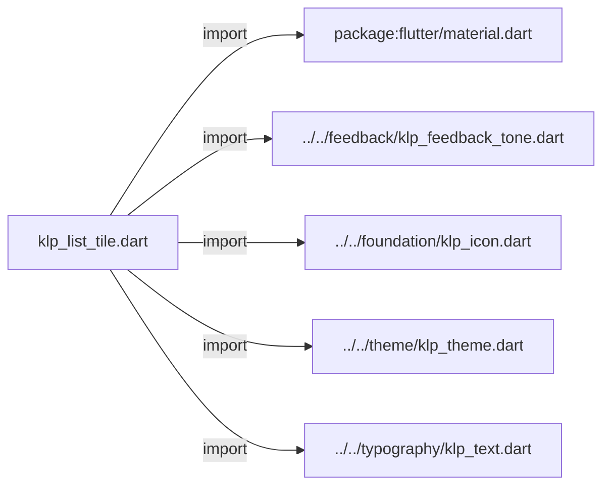
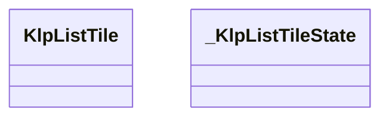
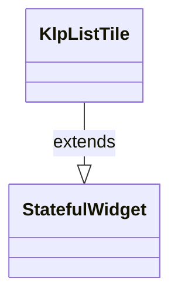
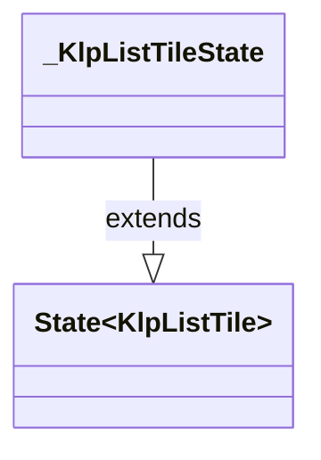

# klp_list_tile.dart：直接依賴與宣告架構

[回到目錄](README.md) · [來源檔案](../../../../../lib/src/data/list_tile/klp_list_tile.dart)

## 範圍

核心是 `lib/src/data/list_tile/klp_list_tile.dart`。主要視角為該檔案明寫的 import／export／part；輔助視角為本檔宣告及 extends／implements／with／on 關係。只展開一層外部邊界。

## 直接依賴圖

## 依賴證據

| 關係 | 原始 directive | 來源 |
|---|---|---|
| import | <code>import &#x27;package:flutter/material.dart&#x27;;</code> | [lib/src/data/list_tile/klp_list_tile.dart:1](../../../../../lib/src/data/list_tile/klp_list_tile.dart#L1) |
| import | <code>import &#x27;../../feedback/klp_feedback_tone.dart&#x27;;</code> | [lib/src/data/list_tile/klp_list_tile.dart:3](../../../../../lib/src/data/list_tile/klp_list_tile.dart#L3) |
| import | <code>import &#x27;../../foundation/klp_icon.dart&#x27;;</code> | [lib/src/data/list_tile/klp_list_tile.dart:4](../../../../../lib/src/data/list_tile/klp_list_tile.dart#L4) |
| import | <code>import &#x27;../../theme/klp_theme.dart&#x27;;</code> | [lib/src/data/list_tile/klp_list_tile.dart:5](../../../../../lib/src/data/list_tile/klp_list_tile.dart#L5) |
| import | <code>import &#x27;../../typography/klp_text.dart&#x27;;</code> | [lib/src/data/list_tile/klp_list_tile.dart:6](../../../../../lib/src/data/list_tile/klp_list_tile.dart#L6) |

## 宣告關係圖

本組節點是本檔宣告；沒有箭頭的宣告未在此圖主張互相依賴。

## 宣告與成員證據

成員包含 public 與 private；簽章取自來源，省略函式本體與欄位初始值。`(inferred)` 表示來源未明寫型別；建構子只顯示參數部分，不含初始化列表。

### KlpListTile

ClassDeclaration · public · [lib/src/data/list_tile/klp_list_tile.dart:8](../../../../../lib/src/data/list_tile/klp_list_tile.dart#L8)

<code>class KlpListTile extends StatefulWidget</code>

- `extends` → <code>StatefulWidget</code>：[lib/src/data/list_tile/klp_list_tile.dart:8](../../../../../lib/src/data/list_tile/klp_list_tile.dart#L8)

| 成員 | 可見性 | 簽章／型別 | 來源註解摘要 | 證據 |
|---|---|---|---|---|
| constructor <code>KlpListTile</code> | public | <code>const KlpListTile({ super.key, required this.title, this.subtitle, this.icon, this.trailing, this.badge, this.selected = false, this.onPressed, this.titleColor, this.subtitleColor, this.compact = false, this.tone, })</code> |  | [lib/src/data/list_tile/klp_list_tile.dart:9](../../../../../lib/src/data/list_tile/klp_list_tile.dart#L9) |
| field <code>title</code> | public | <code>final String title</code> |  | [lib/src/data/list_tile/klp_list_tile.dart:24](../../../../../lib/src/data/list_tile/klp_list_tile.dart#L24) |
| field <code>subtitle</code> | public | <code>final String? subtitle</code> |  | [lib/src/data/list_tile/klp_list_tile.dart:25](../../../../../lib/src/data/list_tile/klp_list_tile.dart#L25) |
| field <code>icon</code> | public | <code>final KlpIconData? icon</code> |  | [lib/src/data/list_tile/klp_list_tile.dart:26](../../../../../lib/src/data/list_tile/klp_list_tile.dart#L26) |
| field <code>trailing</code> | public | <code>final Widget? trailing</code> |  | [lib/src/data/list_tile/klp_list_tile.dart:27](../../../../../lib/src/data/list_tile/klp_list_tile.dart#L27) |
| field <code>badge</code> | public | <code>final String? badge</code> |  | [lib/src/data/list_tile/klp_list_tile.dart:28](../../../../../lib/src/data/list_tile/klp_list_tile.dart#L28) |
| field <code>selected</code> | public | <code>final bool selected</code> |  | [lib/src/data/list_tile/klp_list_tile.dart:29](../../../../../lib/src/data/list_tile/klp_list_tile.dart#L29) |
| field <code>onPressed</code> | public | <code>final VoidCallback? onPressed</code> |  | [lib/src/data/list_tile/klp_list_tile.dart:30](../../../../../lib/src/data/list_tile/klp_list_tile.dart#L30) |
| field <code>titleColor</code> | public | <code>final Color? titleColor</code> |  | [lib/src/data/list_tile/klp_list_tile.dart:31](../../../../../lib/src/data/list_tile/klp_list_tile.dart#L31) |
| field <code>subtitleColor</code> | public | <code>final Color? subtitleColor</code> |  | [lib/src/data/list_tile/klp_list_tile.dart:32](../../../../../lib/src/data/list_tile/klp_list_tile.dart#L32) |
| field <code>compact</code> | public | <code>final bool compact</code> |  | [lib/src/data/list_tile/klp_list_tile.dart:33](../../../../../lib/src/data/list_tile/klp_list_tile.dart#L33) |
| field <code>tone</code> | public | <code>final KlpFeedbackTone? tone</code> |  | [lib/src/data/list_tile/klp_list_tile.dart:34](../../../../../lib/src/data/list_tile/klp_list_tile.dart#L34) |
| method <code>createState</code> | public | <code>State&lt;KlpListTile&gt; createState()</code> |  | [lib/src/data/list_tile/klp_list_tile.dart:36](../../../../../lib/src/data/list_tile/klp_list_tile.dart#L36) |

### _KlpListTileState

ClassDeclaration · private · [lib/src/data/list_tile/klp_list_tile.dart:40](../../../../../lib/src/data/list_tile/klp_list_tile.dart#L40)

<code>class _KlpListTileState extends State&lt;KlpListTile&gt;</code>

- `extends` → <code>State&lt;KlpListTile&gt;</code>：[lib/src/data/list_tile/klp_list_tile.dart:40](../../../../../lib/src/data/list_tile/klp_list_tile.dart#L40)

| 成員 | 可見性 | 簽章／型別 | 來源註解摘要 | 證據 |
|---|---|---|---|---|
| field <code>_hovered</code> | private | <code>bool _hovered</code> |  | [lib/src/data/list_tile/klp_list_tile.dart:41](../../../../../lib/src/data/list_tile/klp_list_tile.dart#L41) |
| field <code>_focused</code> | private | <code>bool _focused</code> |  | [lib/src/data/list_tile/klp_list_tile.dart:42](../../../../../lib/src/data/list_tile/klp_list_tile.dart#L42) |
| method <code>build</code> | public | <code>Widget build(BuildContext context)</code> |  | [lib/src/data/list_tile/klp_list_tile.dart:44](../../../../../lib/src/data/list_tile/klp_list_tile.dart#L44) |

## 閱讀說明與限制

箭頭只表示來源明寫的靜態關係；import 不等於呼叫。未分析動態呼叫、欄位的實際物件擁有權、狀態轉移或渲染流程；型別未進行語意解析，繼承目標保留原始型別拼寫。public／private 依 Dart 名稱前綴判斷；public 宣告不代表已由 `lib/kallopis.dart` 匯出。

本頁由 `tool/architecture_atlas` 產生；編輯來源或生成工具後重新產生，避免手改本頁。
