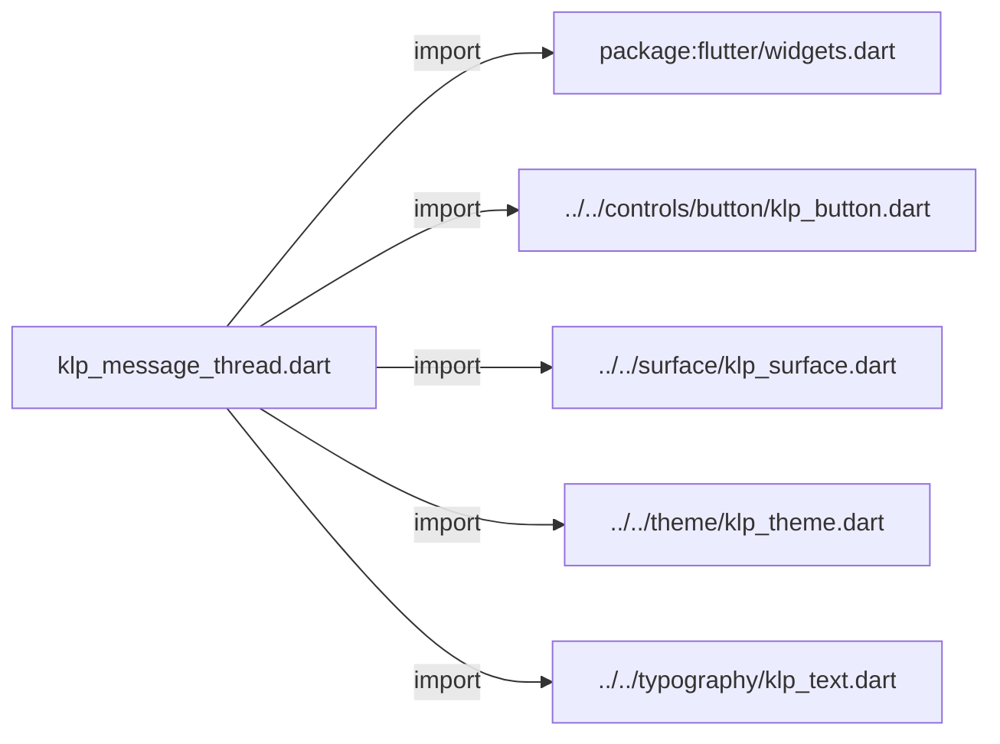
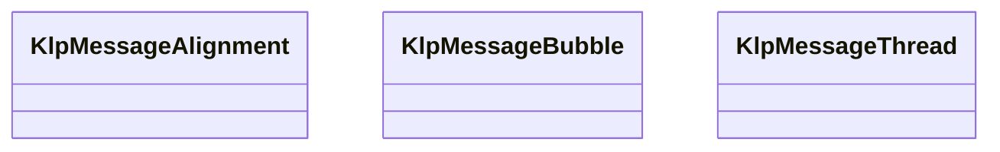
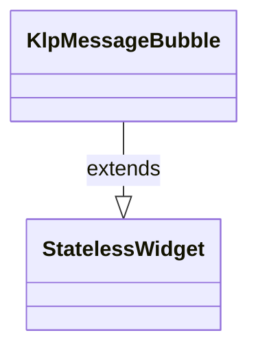
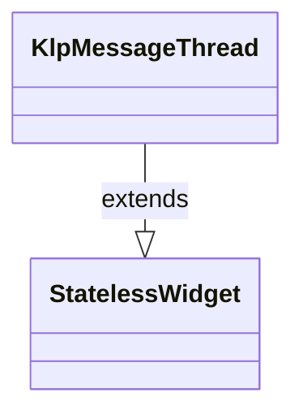

# klp_message_thread.dart：直接依賴與宣告架構

[回到目錄](README.md) · [來源檔案](../../../../../lib/src/data/message_thread/klp_message_thread.dart)

## 範圍

核心是 `lib/src/data/message_thread/klp_message_thread.dart`。主要視角為該檔案明寫的 import／export／part；輔助視角為本檔宣告及 extends／implements／with／on 關係。只展開一層外部邊界。

## 直接依賴圖

## 依賴證據

| 關係 | 原始 directive | 來源 |
|---|---|---|
| import | <code>import &#x27;package:flutter/widgets.dart&#x27;;</code> | [lib/src/data/message_thread/klp_message_thread.dart:1](../../../../../lib/src/data/message_thread/klp_message_thread.dart#L1) |
| import | <code>import &#x27;../../controls/button/klp_button.dart&#x27;;</code> | [lib/src/data/message_thread/klp_message_thread.dart:3](../../../../../lib/src/data/message_thread/klp_message_thread.dart#L3) |
| import | <code>import &#x27;../../surface/klp_surface.dart&#x27;;</code> | [lib/src/data/message_thread/klp_message_thread.dart:4](../../../../../lib/src/data/message_thread/klp_message_thread.dart#L4) |
| import | <code>import &#x27;../../theme/klp_theme.dart&#x27;;</code> | [lib/src/data/message_thread/klp_message_thread.dart:5](../../../../../lib/src/data/message_thread/klp_message_thread.dart#L5) |
| import | <code>import &#x27;../../typography/klp_text.dart&#x27;;</code> | [lib/src/data/message_thread/klp_message_thread.dart:6](../../../../../lib/src/data/message_thread/klp_message_thread.dart#L6) |

## 宣告關係圖

本組節點是本檔宣告；沒有箭頭的宣告未在此圖主張互相依賴。

## 宣告與成員證據

成員包含 public 與 private；簽章取自來源，省略函式本體與欄位初始值。`(inferred)` 表示來源未明寫型別；建構子只顯示參數部分，不含初始化列表。

### KlpMessageAlignment

EnumDeclaration · public · [lib/src/data/message_thread/klp_message_thread.dart:8](../../../../../lib/src/data/message_thread/klp_message_thread.dart#L8)

<code>enum KlpMessageAlignment</code>

| 成員 | 可見性 | 簽章／型別 | 來源註解摘要 | 證據 |
|---|---|---|---|---|
| enum value <code>leading</code> | public | <code>leading</code> |  | [lib/src/data/message_thread/klp_message_thread.dart:8](../../../../../lib/src/data/message_thread/klp_message_thread.dart#L8) |
| enum value <code>trailing</code> | public | <code>trailing</code> |  | [lib/src/data/message_thread/klp_message_thread.dart:8](../../../../../lib/src/data/message_thread/klp_message_thread.dart#L8) |

### KlpMessageBubble

ClassDeclaration · public · [lib/src/data/message_thread/klp_message_thread.dart:10](../../../../../lib/src/data/message_thread/klp_message_thread.dart#L10)

<code>class KlpMessageBubble extends StatelessWidget</code>

來源註解摘要：訊息作者、時間與內容的通用呈現單元。

- `extends` → <code>StatelessWidget</code>：[lib/src/data/message_thread/klp_message_thread.dart:11](../../../../../lib/src/data/message_thread/klp_message_thread.dart#L11)

| 成員 | 可見性 | 簽章／型別 | 來源註解摘要 | 證據 |
|---|---|---|---|---|
| constructor <code>KlpMessageBubble</code> | public | <code>const KlpMessageBubble({ super.key, required this.author, required this.timestamp, required this.child, this.emphasized = false, this.alignment = KlpMessageAlignment.leading, this.background, this.dense = false, })</code> |  | [lib/src/data/message_thread/klp_message_thread.dart:12](../../../../../lib/src/data/message_thread/klp_message_thread.dart#L12) |
| field <code>author</code> | public | <code>final String author</code> |  | [lib/src/data/message_thread/klp_message_thread.dart:23](../../../../../lib/src/data/message_thread/klp_message_thread.dart#L23) |
| field <code>timestamp</code> | public | <code>final String timestamp</code> |  | [lib/src/data/message_thread/klp_message_thread.dart:24](../../../../../lib/src/data/message_thread/klp_message_thread.dart#L24) |
| field <code>child</code> | public | <code>final Widget child</code> |  | [lib/src/data/message_thread/klp_message_thread.dart:25](../../../../../lib/src/data/message_thread/klp_message_thread.dart#L25) |
| field <code>emphasized</code> | public | <code>final bool emphasized</code> |  | [lib/src/data/message_thread/klp_message_thread.dart:26](../../../../../lib/src/data/message_thread/klp_message_thread.dart#L26) |
| field <code>alignment</code> | public | <code>final KlpMessageAlignment alignment</code> |  | [lib/src/data/message_thread/klp_message_thread.dart:27](../../../../../lib/src/data/message_thread/klp_message_thread.dart#L27) |
| field <code>background</code> | public | <code>final bool? background</code> |  | [lib/src/data/message_thread/klp_message_thread.dart:28](../../../../../lib/src/data/message_thread/klp_message_thread.dart#L28) |
| field <code>dense</code> | public | <code>final bool dense</code> |  | [lib/src/data/message_thread/klp_message_thread.dart:29](../../../../../lib/src/data/message_thread/klp_message_thread.dart#L29) |
| method <code>build</code> | public | <code>Widget build(BuildContext context)</code> |  | [lib/src/data/message_thread/klp_message_thread.dart:31](../../../../../lib/src/data/message_thread/klp_message_thread.dart#L31) |

### KlpMessageThread

ClassDeclaration · public · [lib/src/data/message_thread/klp_message_thread.dart:67](../../../../../lib/src/data/message_thread/klp_message_thread.dart#L67)

<code>class KlpMessageThread extends StatelessWidget</code>

來源註解摘要：可載入較早內容的訊息串版面。

- `extends` → <code>StatelessWidget</code>：[lib/src/data/message_thread/klp_message_thread.dart:68](../../../../../lib/src/data/message_thread/klp_message_thread.dart#L68)

| 成員 | 可見性 | 簽章／型別 | 來源註解摘要 | 證據 |
|---|---|---|---|---|
| constructor <code>KlpMessageThread</code> | public | <code>const KlpMessageThread({ super.key, required this.messages, this.loadOlderLabel, this.onLoadOlder, this.dense = false, })</code> |  | [lib/src/data/message_thread/klp_message_thread.dart:69](../../../../../lib/src/data/message_thread/klp_message_thread.dart#L69) |
| field <code>messages</code> | public | <code>final List&lt;Widget&gt; messages</code> |  | [lib/src/data/message_thread/klp_message_thread.dart:77](../../../../../lib/src/data/message_thread/klp_message_thread.dart#L77) |
| field <code>loadOlderLabel</code> | public | <code>final String? loadOlderLabel</code> |  | [lib/src/data/message_thread/klp_message_thread.dart:78](../../../../../lib/src/data/message_thread/klp_message_thread.dart#L78) |
| field <code>onLoadOlder</code> | public | <code>final VoidCallback? onLoadOlder</code> |  | [lib/src/data/message_thread/klp_message_thread.dart:79](../../../../../lib/src/data/message_thread/klp_message_thread.dart#L79) |
| field <code>dense</code> | public | <code>final bool dense</code> |  | [lib/src/data/message_thread/klp_message_thread.dart:80](../../../../../lib/src/data/message_thread/klp_message_thread.dart#L80) |
| method <code>build</code> | public | <code>Widget build(BuildContext context)</code> |  | [lib/src/data/message_thread/klp_message_thread.dart:82](../../../../../lib/src/data/message_thread/klp_message_thread.dart#L82) |

## 閱讀說明與限制

箭頭只表示來源明寫的靜態關係；import 不等於呼叫。未分析動態呼叫、欄位的實際物件擁有權、狀態轉移或渲染流程；型別未進行語意解析，繼承目標保留原始型別拼寫。public／private 依 Dart 名稱前綴判斷；public 宣告不代表已由 `lib/kallopis.dart` 匯出。

本頁由 `tool/architecture_atlas` 產生；編輯來源或生成工具後重新產生，避免手改本頁。
