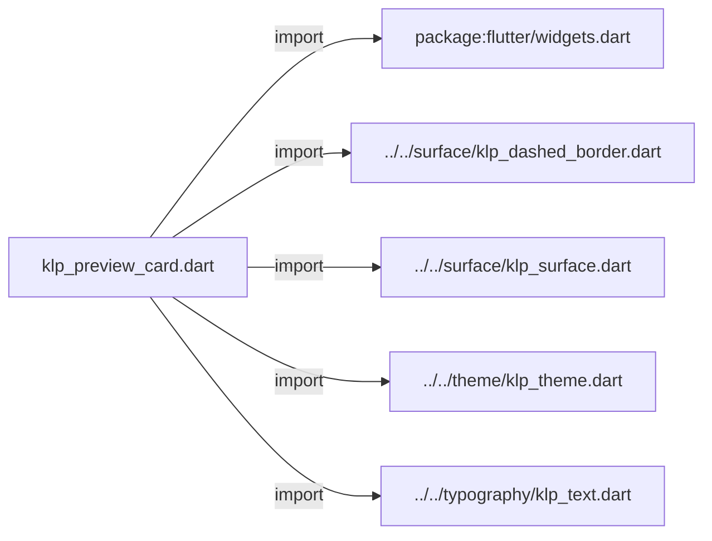
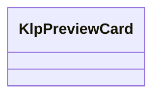
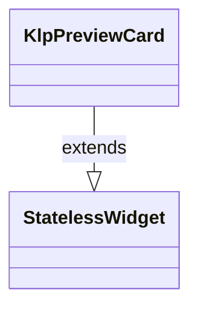

# klp_preview_card.dart：直接依賴與宣告架構

[回到目錄](README.md) · [來源檔案](../../../../../lib/src/data/preview_card/klp_preview_card.dart)

## 範圍

核心是 `lib/src/data/preview_card/klp_preview_card.dart`。主要視角為該檔案明寫的 import／export／part；輔助視角為本檔宣告及 extends／implements／with／on 關係。只展開一層外部邊界。

## 直接依賴圖

## 依賴證據

| 關係 | 原始 directive | 來源 |
|---|---|---|
| import | <code>import &#x27;package:flutter/widgets.dart&#x27;;</code> | [lib/src/data/preview_card/klp_preview_card.dart:1](../../../../../lib/src/data/preview_card/klp_preview_card.dart#L1) |
| import | <code>import &#x27;../../surface/klp_dashed_border.dart&#x27;;</code> | [lib/src/data/preview_card/klp_preview_card.dart:3](../../../../../lib/src/data/preview_card/klp_preview_card.dart#L3) |
| import | <code>import &#x27;../../surface/klp_surface.dart&#x27;;</code> | [lib/src/data/preview_card/klp_preview_card.dart:4](../../../../../lib/src/data/preview_card/klp_preview_card.dart#L4) |
| import | <code>import &#x27;../../theme/klp_theme.dart&#x27;;</code> | [lib/src/data/preview_card/klp_preview_card.dart:5](../../../../../lib/src/data/preview_card/klp_preview_card.dart#L5) |
| import | <code>import &#x27;../../typography/klp_text.dart&#x27;;</code> | [lib/src/data/preview_card/klp_preview_card.dart:6](../../../../../lib/src/data/preview_card/klp_preview_card.dart#L6) |

## 宣告關係圖

本組節點是本檔宣告；沒有箭頭的宣告未在此圖主張互相依賴。

## 宣告與成員證據

成員包含 public 與 private；簽章取自來源，省略函式本體與欄位初始值。`(inferred)` 表示來源未明寫型別；建構子只顯示參數部分，不含初始化列表。

### KlpPreviewCard

ClassDeclaration · public · [lib/src/data/preview_card/klp_preview_card.dart:8](../../../../../lib/src/data/preview_card/klp_preview_card.dart#L8)

<code>class KlpPreviewCard extends StatelessWidget</code>

來源註解摘要：預覽內容、標題與中繼資訊的通用卡片。

- `extends` → <code>StatelessWidget</code>：[lib/src/data/preview_card/klp_preview_card.dart:9](../../../../../lib/src/data/preview_card/klp_preview_card.dart#L9)

| 成員 | 可見性 | 簽章／型別 | 來源註解摘要 | 證據 |
|---|---|---|---|---|
| constructor <code>KlpPreviewCard</code> | public | <code>const KlpPreviewCard({ super.key, required this.title, required this.preview, this.metadata = const [], this.previewHeight, })</code> |  | [lib/src/data/preview_card/klp_preview_card.dart:10](../../../../../lib/src/data/preview_card/klp_preview_card.dart#L10) |
| field <code>title</code> | public | <code>final String title</code> |  | [lib/src/data/preview_card/klp_preview_card.dart:18](../../../../../lib/src/data/preview_card/klp_preview_card.dart#L18) |
| field <code>preview</code> | public | <code>final Widget preview</code> |  | [lib/src/data/preview_card/klp_preview_card.dart:19](../../../../../lib/src/data/preview_card/klp_preview_card.dart#L19) |
| field <code>metadata</code> | public | <code>final List&lt;String&gt; metadata</code> |  | [lib/src/data/preview_card/klp_preview_card.dart:20](../../../../../lib/src/data/preview_card/klp_preview_card.dart#L20) |
| field <code>previewHeight</code> | public | <code>final double? previewHeight</code> |  | [lib/src/data/preview_card/klp_preview_card.dart:21](../../../../../lib/src/data/preview_card/klp_preview_card.dart#L21) |
| method <code>build</code> | public | <code>Widget build(BuildContext context)</code> |  | [lib/src/data/preview_card/klp_preview_card.dart:23](../../../../../lib/src/data/preview_card/klp_preview_card.dart#L23) |

## 閱讀說明與限制

箭頭只表示來源明寫的靜態關係；import 不等於呼叫。未分析動態呼叫、欄位的實際物件擁有權、狀態轉移或渲染流程；型別未進行語意解析，繼承目標保留原始型別拼寫。public／private 依 Dart 名稱前綴判斷；public 宣告不代表已由 `lib/kallopis.dart` 匯出。

本頁由 `tool/architecture_atlas` 產生；編輯來源或生成工具後重新產生，避免手改本頁。
