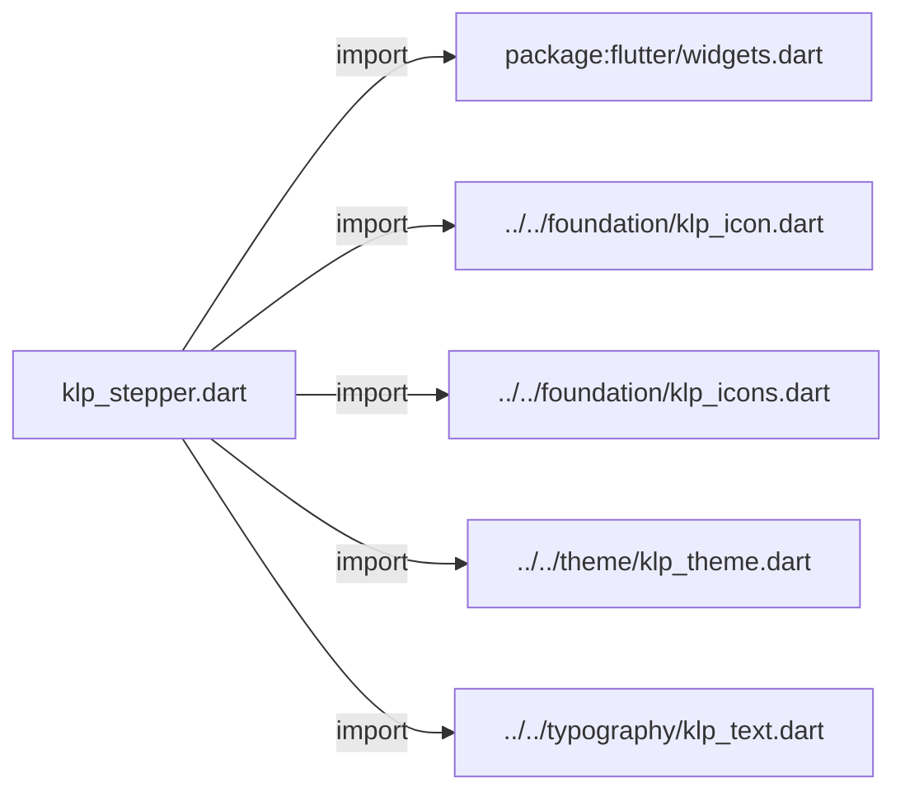
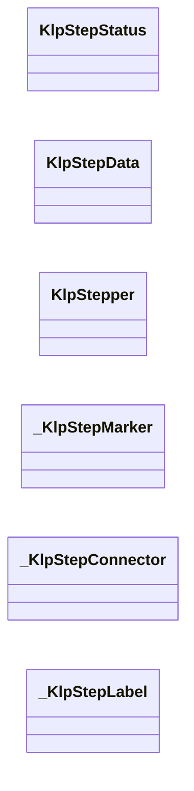
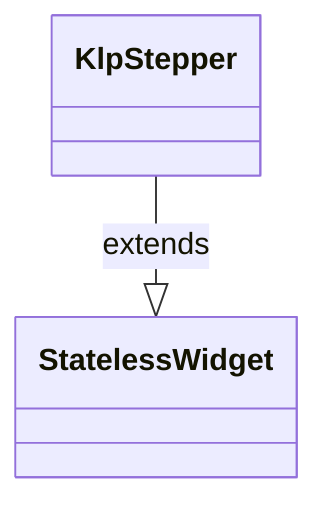
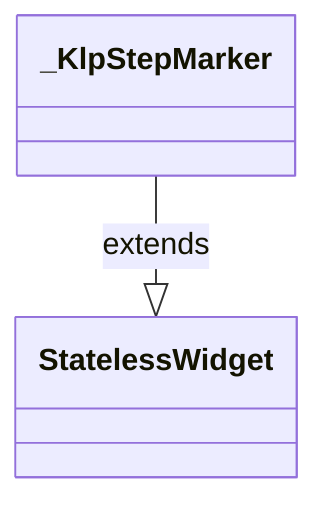
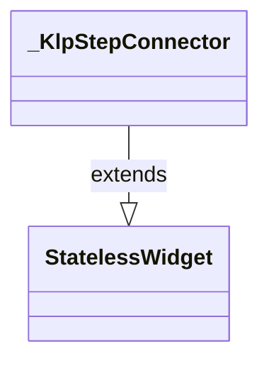
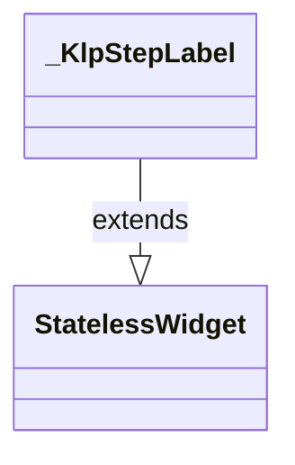

# klp_stepper.dart：直接依賴與宣告架構

[回到目錄](README.md) · [來源檔案](../../../../../lib/src/data/stepper/klp_stepper.dart)

## 範圍

核心是 `lib/src/data/stepper/klp_stepper.dart`。主要視角為該檔案明寫的 import／export／part；輔助視角為本檔宣告及 extends／implements／with／on 關係。只展開一層外部邊界。

## 直接依賴圖

## 依賴證據

| 關係 | 原始 directive | 來源 |
|---|---|---|
| import | <code>import &#x27;package:flutter/widgets.dart&#x27;;</code> | [lib/src/data/stepper/klp_stepper.dart:1](../../../../../lib/src/data/stepper/klp_stepper.dart#L1) |
| import | <code>import &#x27;../../foundation/klp_icon.dart&#x27;;</code> | [lib/src/data/stepper/klp_stepper.dart:3](../../../../../lib/src/data/stepper/klp_stepper.dart#L3) |
| import | <code>import &#x27;../../foundation/klp_icons.dart&#x27;;</code> | [lib/src/data/stepper/klp_stepper.dart:4](../../../../../lib/src/data/stepper/klp_stepper.dart#L4) |
| import | <code>import &#x27;../../theme/klp_theme.dart&#x27;;</code> | [lib/src/data/stepper/klp_stepper.dart:5](../../../../../lib/src/data/stepper/klp_stepper.dart#L5) |
| import | <code>import &#x27;../../typography/klp_text.dart&#x27;;</code> | [lib/src/data/stepper/klp_stepper.dart:6](../../../../../lib/src/data/stepper/klp_stepper.dart#L6) |

## 宣告關係圖

本組節點是本檔宣告；沒有箭頭的宣告未在此圖主張互相依賴。

## 宣告與成員證據

成員包含 public 與 private；簽章取自來源，省略函式本體與欄位初始值。`(inferred)` 表示來源未明寫型別；建構子只顯示參數部分，不含初始化列表。

### KlpStepStatus

EnumDeclaration · public · [lib/src/data/stepper/klp_stepper.dart:8](../../../../../lib/src/data/stepper/klp_stepper.dart#L8)

<code>enum KlpStepStatus</code>

來源註解摘要：單一步驟相對於 [KlpStepper.currentIndex] 的狀態。 由 [KlpStepper] 依步驟位置自動推導，呼叫端不需要（也不應該）自行指定—— 三態永遠只由「目前在第幾步」這一個事實決定。

| 成員 | 可見性 | 簽章／型別 | 來源註解摘要 | 證據 |
|---|---|---|---|---|
| enum value <code>completed</code> | public | <code>completed</code> |  | [lib/src/data/stepper/klp_stepper.dart:12](../../../../../lib/src/data/stepper/klp_stepper.dart#L12) |
| enum value <code>current</code> | public | <code>current</code> |  | [lib/src/data/stepper/klp_stepper.dart:12](../../../../../lib/src/data/stepper/klp_stepper.dart#L12) |
| enum value <code>upcoming</code> | public | <code>upcoming</code> |  | [lib/src/data/stepper/klp_stepper.dart:12](../../../../../lib/src/data/stepper/klp_stepper.dart#L12) |

### KlpStepData

ClassDeclaration · public · [lib/src/data/stepper/klp_stepper.dart:14](../../../../../lib/src/data/stepper/klp_stepper.dart#L14)

<code>class KlpStepData</code>

來源註解摘要：步驟流程中的一步。

| 成員 | 可見性 | 簽章／型別 | 來源註解摘要 | 證據 |
|---|---|---|---|---|
| constructor <code>KlpStepData</code> | public | <code>const KlpStepData({required this.label, this.description})</code> |  | [lib/src/data/stepper/klp_stepper.dart:17](../../../../../lib/src/data/stepper/klp_stepper.dart#L17) |
| field <code>label</code> | public | <code>final String label</code> |  | [lib/src/data/stepper/klp_stepper.dart:19](../../../../../lib/src/data/stepper/klp_stepper.dart#L19) |
| field <code>description</code> | public | <code>final String? description</code> |  | [lib/src/data/stepper/klp_stepper.dart:20](../../../../../lib/src/data/stepper/klp_stepper.dart#L20) |

### KlpStepper

ClassDeclaration · public · [lib/src/data/stepper/klp_stepper.dart:23](../../../../../lib/src/data/stepper/klp_stepper.dart#L23)

<code>class KlpStepper extends StatelessWidget</code>

來源註解摘要：步驟流程指示。依 [currentIndex] 把 [steps] 分成已完成／進行中／未開始三態。 純顯示元件——不持有互動狀態，也不處理點擊；切換到下一步是呼叫端更新 [currentIndex] 後重建的結果。[direction] 決定排列方向。

- `extends` → <code>StatelessWidget</code>：[lib/src/data/stepper/klp_stepper.dart:27](../../../../../lib/src/data/stepper/klp_stepper.dart#L27)

| 成員 | 可見性 | 簽章／型別 | 來源註解摘要 | 證據 |
|---|---|---|---|---|
| constructor <code>KlpStepper</code> | public | <code>const KlpStepper({ super.key, required this.steps, required this.currentIndex, this.direction = Axis.horizontal, })</code> |  | [lib/src/data/stepper/klp_stepper.dart:28](../../../../../lib/src/data/stepper/klp_stepper.dart#L28) |
| field <code>steps</code> | public | <code>final List&lt;KlpStepData&gt; steps</code> |  | [lib/src/data/stepper/klp_stepper.dart:35](../../../../../lib/src/data/stepper/klp_stepper.dart#L35) |
| field <code>currentIndex</code> | public | <code>final int currentIndex</code> |  | [lib/src/data/stepper/klp_stepper.dart:36](../../../../../lib/src/data/stepper/klp_stepper.dart#L36) |
| field <code>direction</code> | public | <code>final Axis direction</code> |  | [lib/src/data/stepper/klp_stepper.dart:37](../../../../../lib/src/data/stepper/klp_stepper.dart#L37) |
| method <code>_statusOf</code> | private | <code>KlpStepStatus _statusOf(int index)</code> |  | [lib/src/data/stepper/klp_stepper.dart:39](../../../../../lib/src/data/stepper/klp_stepper.dart#L39) |
| method <code>build</code> | public | <code>Widget build(BuildContext context)</code> |  | [lib/src/data/stepper/klp_stepper.dart:45](../../../../../lib/src/data/stepper/klp_stepper.dart#L45) |
| method <code>_buildHorizontal</code> | private | <code>Widget _buildHorizontal(BuildContext context)</code> |  | [lib/src/data/stepper/klp_stepper.dart:58](../../../../../lib/src/data/stepper/klp_stepper.dart#L58) |
| method <code>_buildVertical</code> | private | <code>Widget _buildVertical(BuildContext context)</code> |  | [lib/src/data/stepper/klp_stepper.dart:98](../../../../../lib/src/data/stepper/klp_stepper.dart#L98) |

### _KlpStepMarker

ClassDeclaration · private · [lib/src/data/stepper/klp_stepper.dart:153](../../../../../lib/src/data/stepper/klp_stepper.dart#L153)

<code>class _KlpStepMarker extends StatelessWidget</code>

- `extends` → <code>StatelessWidget</code>：[lib/src/data/stepper/klp_stepper.dart:153](../../../../../lib/src/data/stepper/klp_stepper.dart#L153)

| 成員 | 可見性 | 簽章／型別 | 來源註解摘要 | 證據 |
|---|---|---|---|---|
| constructor <code>_KlpStepMarker</code> | private | <code>const _KlpStepMarker({ required this.status, required this.index, required this.size, })</code> |  | [lib/src/data/stepper/klp_stepper.dart:154](../../../../../lib/src/data/stepper/klp_stepper.dart#L154) |
| field <code>status</code> | public | <code>final KlpStepStatus status</code> |  | [lib/src/data/stepper/klp_stepper.dart:160](../../../../../lib/src/data/stepper/klp_stepper.dart#L160) |
| field <code>index</code> | public | <code>final int index</code> |  | [lib/src/data/stepper/klp_stepper.dart:161](../../../../../lib/src/data/stepper/klp_stepper.dart#L161) |
| field <code>size</code> | public | <code>final double size</code> |  | [lib/src/data/stepper/klp_stepper.dart:162](../../../../../lib/src/data/stepper/klp_stepper.dart#L162) |
| method <code>build</code> | public | <code>Widget build(BuildContext context)</code> |  | [lib/src/data/stepper/klp_stepper.dart:164](../../../../../lib/src/data/stepper/klp_stepper.dart#L164) |

### _KlpStepConnector

ClassDeclaration · private · [lib/src/data/stepper/klp_stepper.dart:211](../../../../../lib/src/data/stepper/klp_stepper.dart#L211)

<code>class _KlpStepConnector extends StatelessWidget</code>

- `extends` → <code>StatelessWidget</code>：[lib/src/data/stepper/klp_stepper.dart:211](../../../../../lib/src/data/stepper/klp_stepper.dart#L211)

| 成員 | 可見性 | 簽章／型別 | 來源註解摘要 | 證據 |
|---|---|---|---|---|
| constructor <code>_KlpStepConnector</code> | private | <code>const _KlpStepConnector({required this.completed, required this.axis})</code> |  | [lib/src/data/stepper/klp_stepper.dart:212](../../../../../lib/src/data/stepper/klp_stepper.dart#L212) |
| field <code>completed</code> | public | <code>final bool completed</code> |  | [lib/src/data/stepper/klp_stepper.dart:214](../../../../../lib/src/data/stepper/klp_stepper.dart#L214) |
| field <code>axis</code> | public | <code>final Axis axis</code> |  | [lib/src/data/stepper/klp_stepper.dart:215](../../../../../lib/src/data/stepper/klp_stepper.dart#L215) |
| method <code>build</code> | public | <code>Widget build(BuildContext context)</code> |  | [lib/src/data/stepper/klp_stepper.dart:217](../../../../../lib/src/data/stepper/klp_stepper.dart#L217) |

### _KlpStepLabel

ClassDeclaration · private · [lib/src/data/stepper/klp_stepper.dart:237](../../../../../lib/src/data/stepper/klp_stepper.dart#L237)

<code>class _KlpStepLabel extends StatelessWidget</code>

- `extends` → <code>StatelessWidget</code>：[lib/src/data/stepper/klp_stepper.dart:237](../../../../../lib/src/data/stepper/klp_stepper.dart#L237)

| 成員 | 可見性 | 簽章／型別 | 來源註解摘要 | 證據 |
|---|---|---|---|---|
| constructor <code>_KlpStepLabel</code> | private | <code>const _KlpStepLabel({ required this.step, required this.status, this.align = TextAlign.start, })</code> |  | [lib/src/data/stepper/klp_stepper.dart:238](../../../../../lib/src/data/stepper/klp_stepper.dart#L238) |
| field <code>step</code> | public | <code>final KlpStepData step</code> |  | [lib/src/data/stepper/klp_stepper.dart:244](../../../../../lib/src/data/stepper/klp_stepper.dart#L244) |
| field <code>status</code> | public | <code>final KlpStepStatus status</code> |  | [lib/src/data/stepper/klp_stepper.dart:245](../../../../../lib/src/data/stepper/klp_stepper.dart#L245) |
| field <code>align</code> | public | <code>final TextAlign align</code> |  | [lib/src/data/stepper/klp_stepper.dart:246](../../../../../lib/src/data/stepper/klp_stepper.dart#L246) |
| method <code>build</code> | public | <code>Widget build(BuildContext context)</code> |  | [lib/src/data/stepper/klp_stepper.dart:248](../../../../../lib/src/data/stepper/klp_stepper.dart#L248) |

## 閱讀說明與限制

箭頭只表示來源明寫的靜態關係；import 不等於呼叫。未分析動態呼叫、欄位的實際物件擁有權、狀態轉移或渲染流程；型別未進行語意解析，繼承目標保留原始型別拼寫。public／private 依 Dart 名稱前綴判斷；public 宣告不代表已由 `lib/kallopis.dart` 匯出。

本頁由 `tool/architecture_atlas` 產生；編輯來源或生成工具後重新產生，避免手改本頁。
