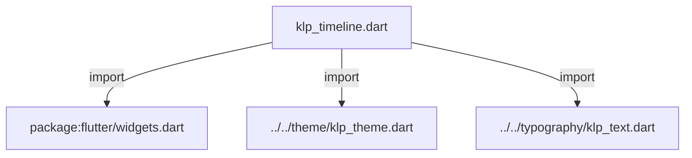
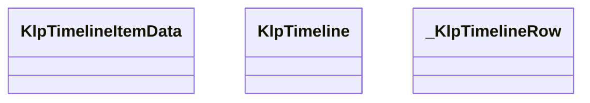
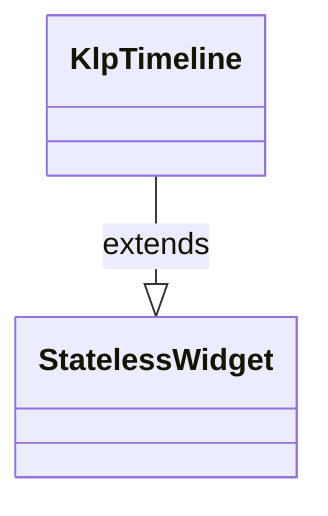
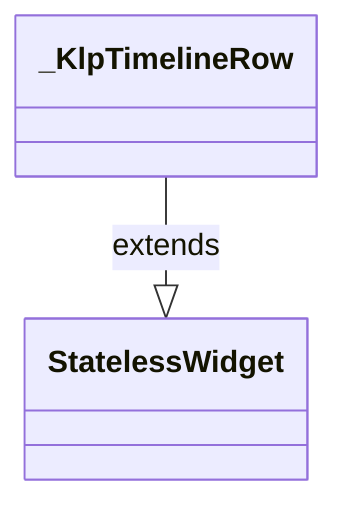

# klp_timeline.dart：直接依賴與宣告架構

[回到目錄](README.md) · [來源檔案](../../../../../lib/src/data/timeline/klp_timeline.dart)

## 範圍

核心是 `lib/src/data/timeline/klp_timeline.dart`。主要視角為該檔案明寫的 import／export／part；輔助視角為本檔宣告及 extends／implements／with／on 關係。只展開一層外部邊界。

## 直接依賴圖

## 依賴證據

| 關係 | 原始 directive | 來源 |
|---|---|---|
| import | <code>import &#x27;package:flutter/widgets.dart&#x27;;</code> | [lib/src/data/timeline/klp_timeline.dart:1](../../../../../lib/src/data/timeline/klp_timeline.dart#L1) |
| import | <code>import &#x27;../../theme/klp_theme.dart&#x27;;</code> | [lib/src/data/timeline/klp_timeline.dart:3](../../../../../lib/src/data/timeline/klp_timeline.dart#L3) |
| import | <code>import &#x27;../../typography/klp_text.dart&#x27;;</code> | [lib/src/data/timeline/klp_timeline.dart:4](../../../../../lib/src/data/timeline/klp_timeline.dart#L4) |

## 宣告關係圖

本組節點是本檔宣告；沒有箭頭的宣告未在此圖主張互相依賴。

## 宣告與成員證據

成員包含 public 與 private；簽章取自來源，省略函式本體與欄位初始值。`(inferred)` 表示來源未明寫型別；建構子只顯示參數部分，不含初始化列表。

### KlpTimelineItemData

ClassDeclaration · public · [lib/src/data/timeline/klp_timeline.dart:6](../../../../../lib/src/data/timeline/klp_timeline.dart#L6)

<code>class KlpTimelineItemData</code>

來源註解摘要：時間軸上的一個事件。 [marker] 為 `null` 時使用預設圓點；需要客製標記（例如放圖示）時提供這個 slot， 而不是加一堆布林參數去描述「這是哪一種標記」。[highlighted] 只改變預設圓點的 顏色深淺，不表達產品語意（不是「成功」或「危險」那種狀態）。

| 成員 | 可見性 | 簽章／型別 | 來源註解摘要 | 證據 |
|---|---|---|---|---|
| constructor <code>KlpTimelineItemData</code> | public | <code>const KlpTimelineItemData({ required this.title, this.time, this.content, this.marker, this.highlighted = false, })</code> |  | [lib/src/data/timeline/klp_timeline.dart:13](../../../../../lib/src/data/timeline/klp_timeline.dart#L13) |
| field <code>title</code> | public | <code>final String title</code> |  | [lib/src/data/timeline/klp_timeline.dart:21](../../../../../lib/src/data/timeline/klp_timeline.dart#L21) |
| field <code>time</code> | public | <code>final String? time</code> |  | [lib/src/data/timeline/klp_timeline.dart:22](../../../../../lib/src/data/timeline/klp_timeline.dart#L22) |
| field <code>content</code> | public | <code>final Widget? content</code> |  | [lib/src/data/timeline/klp_timeline.dart:23](../../../../../lib/src/data/timeline/klp_timeline.dart#L23) |
| field <code>marker</code> | public | <code>final Widget? marker</code> |  | [lib/src/data/timeline/klp_timeline.dart:24](../../../../../lib/src/data/timeline/klp_timeline.dart#L24) |
| field <code>highlighted</code> | public | <code>final bool highlighted</code> |  | [lib/src/data/timeline/klp_timeline.dart:25](../../../../../lib/src/data/timeline/klp_timeline.dart#L25) |

### KlpTimeline

ClassDeclaration · public · [lib/src/data/timeline/klp_timeline.dart:28](../../../../../lib/src/data/timeline/klp_timeline.dart#L28)

<code>class KlpTimeline extends StatelessWidget</code>

來源註解摘要：時間軸：事件依序排列，每項有標記、標題、時間、可選內容。 只負責排版與標記／連接線的視覺語言；事件的先後順序、時間格式與內容完全由 呼叫端的 [items] 決定，這裡不做排序也不解讀時間字串。

- `extends` → <code>StatelessWidget</code>：[lib/src/data/timeline/klp_timeline.dart:32](../../../../../lib/src/data/timeline/klp_timeline.dart#L32)

| 成員 | 可見性 | 簽章／型別 | 來源註解摘要 | 證據 |
|---|---|---|---|---|
| constructor <code>KlpTimeline</code> | public | <code>const KlpTimeline({super.key, required this.items})</code> |  | [lib/src/data/timeline/klp_timeline.dart:33](../../../../../lib/src/data/timeline/klp_timeline.dart#L33) |
| field <code>items</code> | public | <code>final List&lt;KlpTimelineItemData&gt; items</code> |  | [lib/src/data/timeline/klp_timeline.dart:35](../../../../../lib/src/data/timeline/klp_timeline.dart#L35) |
| method <code>build</code> | public | <code>Widget build(BuildContext context)</code> |  | [lib/src/data/timeline/klp_timeline.dart:37](../../../../../lib/src/data/timeline/klp_timeline.dart#L37) |

### _KlpTimelineRow

ClassDeclaration · private · [lib/src/data/timeline/klp_timeline.dart:54](../../../../../lib/src/data/timeline/klp_timeline.dart#L54)

<code>class _KlpTimelineRow extends StatelessWidget</code>

- `extends` → <code>StatelessWidget</code>：[lib/src/data/timeline/klp_timeline.dart:54](../../../../../lib/src/data/timeline/klp_timeline.dart#L54)

| 成員 | 可見性 | 簽章／型別 | 來源註解摘要 | 證據 |
|---|---|---|---|---|
| constructor <code>_KlpTimelineRow</code> | private | <code>const _KlpTimelineRow({ required this.item, required this.isFirst, required this.isLast, })</code> |  | [lib/src/data/timeline/klp_timeline.dart:55](../../../../../lib/src/data/timeline/klp_timeline.dart#L55) |
| field <code>item</code> | public | <code>final KlpTimelineItemData item</code> |  | [lib/src/data/timeline/klp_timeline.dart:61](../../../../../lib/src/data/timeline/klp_timeline.dart#L61) |
| field <code>isFirst</code> | public | <code>final bool isFirst</code> |  | [lib/src/data/timeline/klp_timeline.dart:62](../../../../../lib/src/data/timeline/klp_timeline.dart#L62) |
| field <code>isLast</code> | public | <code>final bool isLast</code> |  | [lib/src/data/timeline/klp_timeline.dart:63](../../../../../lib/src/data/timeline/klp_timeline.dart#L63) |
| method <code>build</code> | public | <code>Widget build(BuildContext context)</code> |  | [lib/src/data/timeline/klp_timeline.dart:65](../../../../../lib/src/data/timeline/klp_timeline.dart#L65) |

## 閱讀說明與限制

箭頭只表示來源明寫的靜態關係；import 不等於呼叫。未分析動態呼叫、欄位的實際物件擁有權、狀態轉移或渲染流程；型別未進行語意解析，繼承目標保留原始型別拼寫。public／private 依 Dart 名稱前綴判斷；public 宣告不代表已由 `lib/kallopis.dart` 匯出。

本頁由 `tool/architecture_atlas` 產生；編輯來源或生成工具後重新產生，避免手改本頁。
