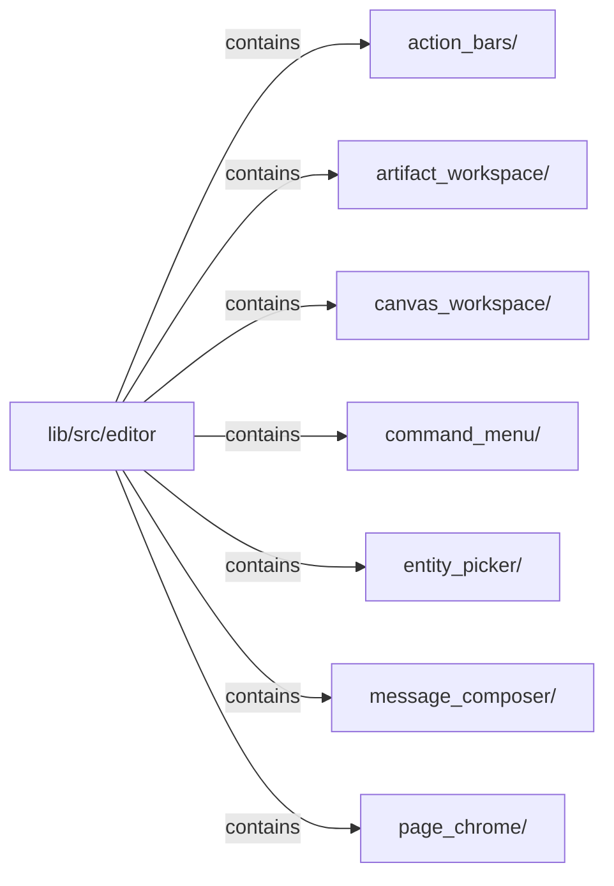

# lib/src/editor：架構分析入口

[上一層](../README.md)

## 範圍

閱讀 `lib/src/editor` 的直接子目錄與 Dart 檔案。結構圖表示實際檔案包含關係；依賴圖表示本層檔案明寫的 directives。每個檔案頁另列直接依賴、宣告、欄位、方法、建構子及行號證據。

## 模組閱讀重點

## 分析入口

此目錄提供文件、畫布、訊息編輯等無產品語意的高階組合元件。可從 `KlpDocumentField` 與 `KlpCanvasViewport` 追蹤欄位和畫布容器。Requirement／Proposal 等產品工作流程已移至 Notist。

| 想回答的問題 | 精確符號與來源 |
| --- | --- |
| 文件欄位如何接到表單視覺？ | `KlpDocumentField`：lib/src/editor/artifact_workspace/klp_artifact_workspace.dart:67 |
| 畫布容器與選取覆層在哪裡？ | `KlpCanvasViewport`、`KlpCanvasSelectionOverlay`：lib/src/editor/canvas_workspace/klp_canvas_workspace.dart:11、55 |

重要依賴：artifact workspace 只組合 Kallopis form、tabs 與 feedback；這是來源依賴分類，不能畫成提交、保存或 AI 執行鏈。

## 本層直接依賴圖

箭頭以本層 Dart 檔案明寫的 directive 彙總到目標所在目錄或外部套件邊界；不遞迴將子目錄依賴算入本層。相同目標的不同 directive 類型分開計數。

本層檔案未宣告跨目錄依賴；子目錄依賴請循下一層入口閱讀。

| 目標邊界 | 關係 | directive 數 | 第一筆來源證據 |
|---|---|---|---|
| 無 | — | 0 | 來源清單見本層檔案 |

## 目錄結構圖

## 子目錄

| 目錄 | 導航 | 來源證據 |
|---|---|---|
| `action_bars/` | [架構入口](action_bars/README.md) | [來源目錄](../../../../lib/src/editor/action_bars) |
| `artifact_workspace/` | [架構入口](artifact_workspace/README.md) | [來源目錄](../../../../lib/src/editor/artifact_workspace) |
| `canvas_workspace/` | [架構入口](canvas_workspace/README.md) | [來源目錄](../../../../lib/src/editor/canvas_workspace) |
| `command_menu/` | [架構入口](command_menu/README.md) | [來源目錄](../../../../lib/src/editor/command_menu) |
| `entity_picker/` | [架構入口](entity_picker/README.md) | [來源目錄](../../../../lib/src/editor/entity_picker) |
| `message_composer/` | [架構入口](message_composer/README.md) | [來源目錄](../../../../lib/src/editor/message_composer) |
| `page_chrome/` | [架構入口](page_chrome/README.md) | [來源目錄](../../../../lib/src/editor/page_chrome) |

## 本層檔案

| 檔案 | 宣告 | 細節 | 來源證據 |
|---|---|---|---|
| 無 | 本層沒有 Dart 檔案 | — | — |

## 閱讀說明

箭頭只表示來源明寫的靜態關係；import 不等於呼叫。未分析動態呼叫、欄位的實際物件擁有權、狀態轉移或渲染流程；型別未進行語意解析，繼承目標保留原始型別拼寫。public／private 依 Dart 名稱前綴判斷；public 宣告不代表已由 `lib/kallopis.dart` 匯出。

本頁的目錄與檔案由來源清冊產生；`manifest.json` 位於本圖集根目錄，可核對 SHA-256 與覆蓋數。人工模組摘要存於 `tool/architecture_atlas/briefs/`，重新生成時保留。
