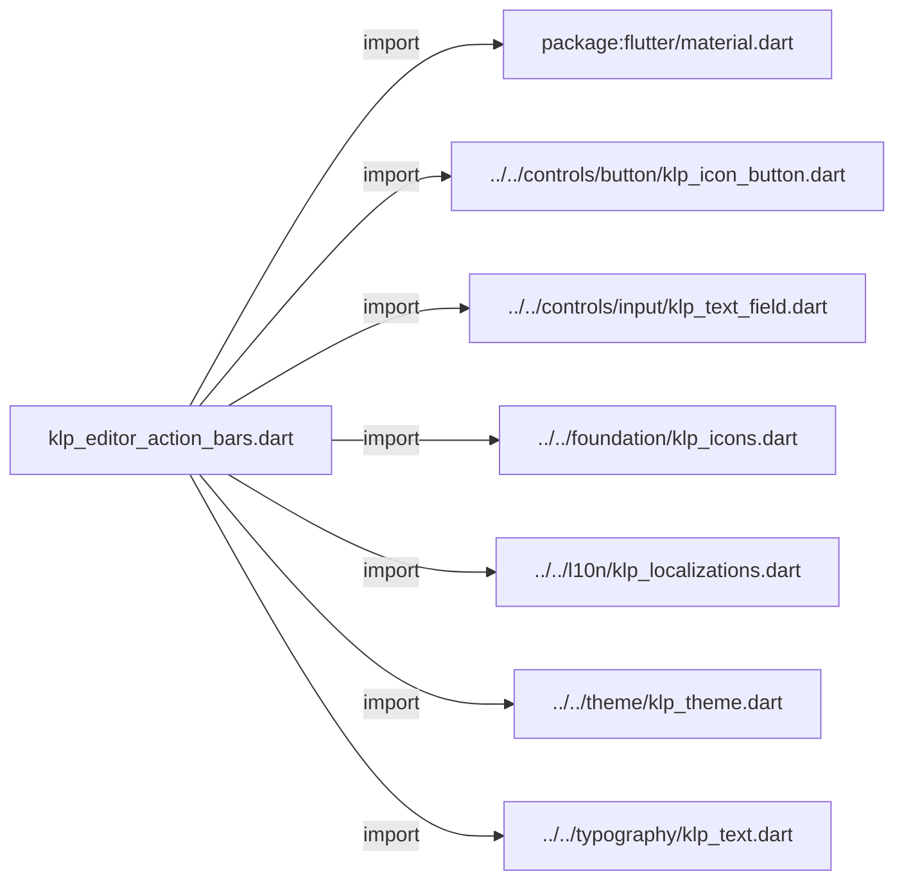
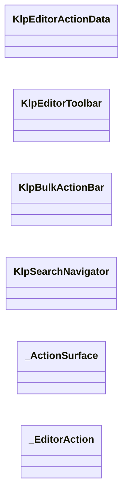
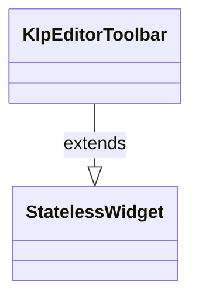
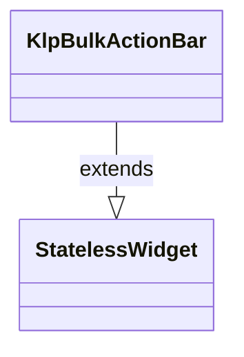
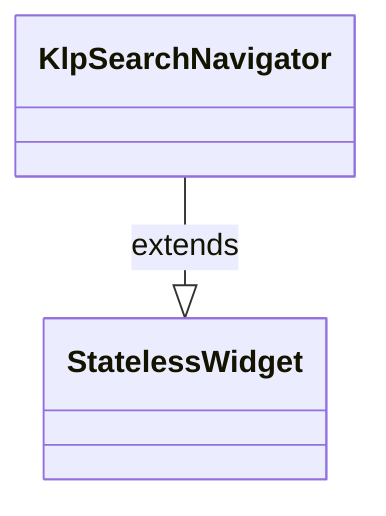
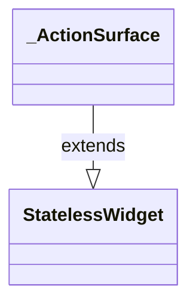
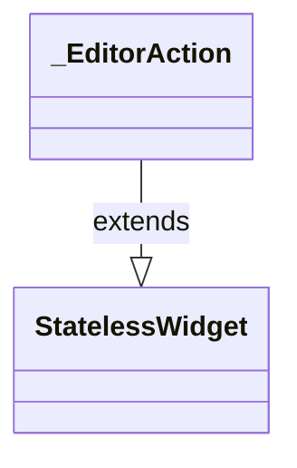

# klp_editor_action_bars.dart：直接依賴與宣告架構

[回到目錄](README.md) · [來源檔案](../../../../../lib/src/editor/action_bars/klp_editor_action_bars.dart)

## 範圍

核心是 `lib/src/editor/action_bars/klp_editor_action_bars.dart`。主要視角為該檔案明寫的 import／export／part；輔助視角為本檔宣告及 extends／implements／with／on 關係。只展開一層外部邊界。

## 直接依賴圖

## 依賴證據

| 關係 | 原始 directive | 來源 |
|---|---|---|
| import | <code>import &#x27;package:flutter/material.dart&#x27;;</code> | [lib/src/editor/action_bars/klp_editor_action_bars.dart:1](../../../../../lib/src/editor/action_bars/klp_editor_action_bars.dart#L1) |
| import | <code>import &#x27;../../controls/button/klp_icon_button.dart&#x27;;</code> | [lib/src/editor/action_bars/klp_editor_action_bars.dart:3](../../../../../lib/src/editor/action_bars/klp_editor_action_bars.dart#L3) |
| import | <code>import &#x27;../../controls/input/klp_text_field.dart&#x27;;</code> | [lib/src/editor/action_bars/klp_editor_action_bars.dart:4](../../../../../lib/src/editor/action_bars/klp_editor_action_bars.dart#L4) |
| import | <code>import &#x27;../../foundation/klp_icons.dart&#x27;;</code> | [lib/src/editor/action_bars/klp_editor_action_bars.dart:5](../../../../../lib/src/editor/action_bars/klp_editor_action_bars.dart#L5) |
| import | <code>import &#x27;../../l10n/klp_localizations.dart&#x27;;</code> | [lib/src/editor/action_bars/klp_editor_action_bars.dart:6](../../../../../lib/src/editor/action_bars/klp_editor_action_bars.dart#L6) |
| import | <code>import &#x27;../../theme/klp_theme.dart&#x27;;</code> | [lib/src/editor/action_bars/klp_editor_action_bars.dart:7](../../../../../lib/src/editor/action_bars/klp_editor_action_bars.dart#L7) |
| import | <code>import &#x27;../../typography/klp_text.dart&#x27;;</code> | [lib/src/editor/action_bars/klp_editor_action_bars.dart:8](../../../../../lib/src/editor/action_bars/klp_editor_action_bars.dart#L8) |

## 宣告關係圖

本組節點是本檔宣告；沒有箭頭的宣告未在此圖主張互相依賴。

## 宣告與成員證據

成員包含 public 與 private；簽章取自來源，省略函式本體與欄位初始值。`(inferred)` 表示來源未明寫型別；建構子只顯示參數部分，不含初始化列表。

### KlpEditorActionData

ClassDeclaration · public · [lib/src/editor/action_bars/klp_editor_action_bars.dart:10](../../../../../lib/src/editor/action_bars/klp_editor_action_bars.dart#L10)

<code>class KlpEditorActionData</code>

| 成員 | 可見性 | 簽章／型別 | 來源註解摘要 | 證據 |
|---|---|---|---|---|
| constructor <code>KlpEditorActionData</code> | public | <code>const KlpEditorActionData({ required this.label, required this.onPressed, this.selected = false, this.danger = false, })</code> |  | [lib/src/editor/action_bars/klp_editor_action_bars.dart:12](../../../../../lib/src/editor/action_bars/klp_editor_action_bars.dart#L12) |
| field <code>label</code> | public | <code>final String label</code> |  | [lib/src/editor/action_bars/klp_editor_action_bars.dart:19](../../../../../lib/src/editor/action_bars/klp_editor_action_bars.dart#L19) |
| field <code>onPressed</code> | public | <code>final VoidCallback? onPressed</code> |  | [lib/src/editor/action_bars/klp_editor_action_bars.dart:20](../../../../../lib/src/editor/action_bars/klp_editor_action_bars.dart#L20) |
| field <code>selected</code> | public | <code>final bool selected</code> |  | [lib/src/editor/action_bars/klp_editor_action_bars.dart:21](../../../../../lib/src/editor/action_bars/klp_editor_action_bars.dart#L21) |
| field <code>danger</code> | public | <code>final bool danger</code> |  | [lib/src/editor/action_bars/klp_editor_action_bars.dart:22](../../../../../lib/src/editor/action_bars/klp_editor_action_bars.dart#L22) |

### KlpEditorToolbar

ClassDeclaration · public · [lib/src/editor/action_bars/klp_editor_action_bars.dart:25](../../../../../lib/src/editor/action_bars/klp_editor_action_bars.dart#L25)

<code>class KlpEditorToolbar extends StatelessWidget</code>

- `extends` → <code>StatelessWidget</code>：[lib/src/editor/action_bars/klp_editor_action_bars.dart:25](../../../../../lib/src/editor/action_bars/klp_editor_action_bars.dart#L25)

| 成員 | 可見性 | 簽章／型別 | 來源註解摘要 | 證據 |
|---|---|---|---|---|
| constructor <code>KlpEditorToolbar</code> | public | <code>const KlpEditorToolbar({super.key, required this.actions})</code> |  | [lib/src/editor/action_bars/klp_editor_action_bars.dart:26](../../../../../lib/src/editor/action_bars/klp_editor_action_bars.dart#L26) |
| field <code>actions</code> | public | <code>final List&lt;KlpEditorActionData&gt; actions</code> |  | [lib/src/editor/action_bars/klp_editor_action_bars.dart:28](../../../../../lib/src/editor/action_bars/klp_editor_action_bars.dart#L28) |
| method <code>build</code> | public | <code>Widget build(BuildContext context)</code> |  | [lib/src/editor/action_bars/klp_editor_action_bars.dart:30](../../../../../lib/src/editor/action_bars/klp_editor_action_bars.dart#L30) |

### KlpBulkActionBar

ClassDeclaration · public · [lib/src/editor/action_bars/klp_editor_action_bars.dart:42](../../../../../lib/src/editor/action_bars/klp_editor_action_bars.dart#L42)

<code>class KlpBulkActionBar extends StatelessWidget</code>

- `extends` → <code>StatelessWidget</code>：[lib/src/editor/action_bars/klp_editor_action_bars.dart:42](../../../../../lib/src/editor/action_bars/klp_editor_action_bars.dart#L42)

| 成員 | 可見性 | 簽章／型別 | 來源註解摘要 | 證據 |
|---|---|---|---|---|
| constructor <code>KlpBulkActionBar</code> | public | <code>const KlpBulkActionBar({ super.key, required this.label, required this.actions, })</code> |  | [lib/src/editor/action_bars/klp_editor_action_bars.dart:43](../../../../../lib/src/editor/action_bars/klp_editor_action_bars.dart#L43) |
| field <code>label</code> | public | <code>final String label</code> |  | [lib/src/editor/action_bars/klp_editor_action_bars.dart:49](../../../../../lib/src/editor/action_bars/klp_editor_action_bars.dart#L49) |
| field <code>actions</code> | public | <code>final List&lt;KlpEditorActionData&gt; actions</code> |  | [lib/src/editor/action_bars/klp_editor_action_bars.dart:50](../../../../../lib/src/editor/action_bars/klp_editor_action_bars.dart#L50) |
| method <code>build</code> | public | <code>Widget build(BuildContext context)</code> |  | [lib/src/editor/action_bars/klp_editor_action_bars.dart:52](../../../../../lib/src/editor/action_bars/klp_editor_action_bars.dart#L52) |

### KlpSearchNavigator

ClassDeclaration · public · [lib/src/editor/action_bars/klp_editor_action_bars.dart:68](../../../../../lib/src/editor/action_bars/klp_editor_action_bars.dart#L68)

<code>class KlpSearchNavigator extends StatelessWidget</code>

- `extends` → <code>StatelessWidget</code>：[lib/src/editor/action_bars/klp_editor_action_bars.dart:68](../../../../../lib/src/editor/action_bars/klp_editor_action_bars.dart#L68)

| 成員 | 可見性 | 簽章／型別 | 來源註解摘要 | 證據 |
|---|---|---|---|---|
| constructor <code>KlpSearchNavigator</code> | public | <code>const KlpSearchNavigator({ super.key, required this.initialQuery, required this.current, required this.total, required this.onPrevious, required this.onNext, required this.onClose, this.onQueryChanged, })</code> |  | [lib/src/editor/action_bars/klp_editor_action_bars.dart:69](../../../../../lib/src/editor/action_bars/klp_editor_action_bars.dart#L69) |
| field <code>initialQuery</code> | public | <code>final String initialQuery</code> |  | [lib/src/editor/action_bars/klp_editor_action_bars.dart:80](../../../../../lib/src/editor/action_bars/klp_editor_action_bars.dart#L80) |
| field <code>current</code> | public | <code>final int current</code> |  | [lib/src/editor/action_bars/klp_editor_action_bars.dart:81](../../../../../lib/src/editor/action_bars/klp_editor_action_bars.dart#L81) |
| field <code>total</code> | public | <code>final int total</code> |  | [lib/src/editor/action_bars/klp_editor_action_bars.dart:82](../../../../../lib/src/editor/action_bars/klp_editor_action_bars.dart#L82) |
| field <code>onPrevious</code> | public | <code>final VoidCallback? onPrevious</code> |  | [lib/src/editor/action_bars/klp_editor_action_bars.dart:83](../../../../../lib/src/editor/action_bars/klp_editor_action_bars.dart#L83) |
| field <code>onNext</code> | public | <code>final VoidCallback? onNext</code> |  | [lib/src/editor/action_bars/klp_editor_action_bars.dart:84](../../../../../lib/src/editor/action_bars/klp_editor_action_bars.dart#L84) |
| field <code>onClose</code> | public | <code>final VoidCallback? onClose</code> |  | [lib/src/editor/action_bars/klp_editor_action_bars.dart:85](../../../../../lib/src/editor/action_bars/klp_editor_action_bars.dart#L85) |
| field <code>onQueryChanged</code> | public | <code>final ValueChanged&lt;String&gt;? onQueryChanged</code> |  | [lib/src/editor/action_bars/klp_editor_action_bars.dart:86](../../../../../lib/src/editor/action_bars/klp_editor_action_bars.dart#L86) |
| method <code>build</code> | public | <code>Widget build(BuildContext context)</code> |  | [lib/src/editor/action_bars/klp_editor_action_bars.dart:88](../../../../../lib/src/editor/action_bars/klp_editor_action_bars.dart#L88) |

### _ActionSurface

ClassDeclaration · private · [lib/src/editor/action_bars/klp_editor_action_bars.dart:127](../../../../../lib/src/editor/action_bars/klp_editor_action_bars.dart#L127)

<code>class _ActionSurface extends StatelessWidget</code>

- `extends` → <code>StatelessWidget</code>：[lib/src/editor/action_bars/klp_editor_action_bars.dart:127](../../../../../lib/src/editor/action_bars/klp_editor_action_bars.dart#L127)

| 成員 | 可見性 | 簽章／型別 | 來源註解摘要 | 證據 |
|---|---|---|---|---|
| constructor <code>_ActionSurface</code> | private | <code>const _ActionSurface({required this.child})</code> |  | [lib/src/editor/action_bars/klp_editor_action_bars.dart:128](../../../../../lib/src/editor/action_bars/klp_editor_action_bars.dart#L128) |
| field <code>child</code> | public | <code>final Widget child</code> |  | [lib/src/editor/action_bars/klp_editor_action_bars.dart:130](../../../../../lib/src/editor/action_bars/klp_editor_action_bars.dart#L130) |
| method <code>build</code> | public | <code>Widget build(BuildContext context)</code> |  | [lib/src/editor/action_bars/klp_editor_action_bars.dart:132](../../../../../lib/src/editor/action_bars/klp_editor_action_bars.dart#L132) |

### _EditorAction

ClassDeclaration · private · [lib/src/editor/action_bars/klp_editor_action_bars.dart:149](../../../../../lib/src/editor/action_bars/klp_editor_action_bars.dart#L149)

<code>class _EditorAction extends StatelessWidget</code>

- `extends` → <code>StatelessWidget</code>：[lib/src/editor/action_bars/klp_editor_action_bars.dart:149](../../../../../lib/src/editor/action_bars/klp_editor_action_bars.dart#L149)

| 成員 | 可見性 | 簽章／型別 | 來源註解摘要 | 證據 |
|---|---|---|---|---|
| constructor <code>_EditorAction</code> | private | <code>const _EditorAction({required this.data})</code> |  | [lib/src/editor/action_bars/klp_editor_action_bars.dart:150](../../../../../lib/src/editor/action_bars/klp_editor_action_bars.dart#L150) |
| field <code>data</code> | public | <code>final KlpEditorActionData data</code> |  | [lib/src/editor/action_bars/klp_editor_action_bars.dart:152](../../../../../lib/src/editor/action_bars/klp_editor_action_bars.dart#L152) |
| method <code>build</code> | public | <code>Widget build(BuildContext context)</code> |  | [lib/src/editor/action_bars/klp_editor_action_bars.dart:154](../../../../../lib/src/editor/action_bars/klp_editor_action_bars.dart#L154) |

## 閱讀說明與限制

箭頭只表示來源明寫的靜態關係；import 不等於呼叫。未分析動態呼叫、欄位的實際物件擁有權、狀態轉移或渲染流程；型別未進行語意解析，繼承目標保留原始型別拼寫。public／private 依 Dart 名稱前綴判斷；public 宣告不代表已由 `lib/kallopis.dart` 匯出。

本頁由 `tool/architecture_atlas` 產生；編輯來源或生成工具後重新產生，避免手改本頁。
