# klp_artifact_workspace.dart：直接依賴與宣告架構

[回到目錄](README.md) · [來源檔案](../../../../../lib/src/editor/artifact_workspace/klp_artifact_workspace.dart)

## 範圍

核心是 `lib/src/editor/artifact_workspace/klp_artifact_workspace.dart`。主要視角為該檔案明寫的 import／export／part；輔助視角為本檔宣告及 extends／implements／with／on 關係。只展開一層外部邊界。

## 直接依賴圖

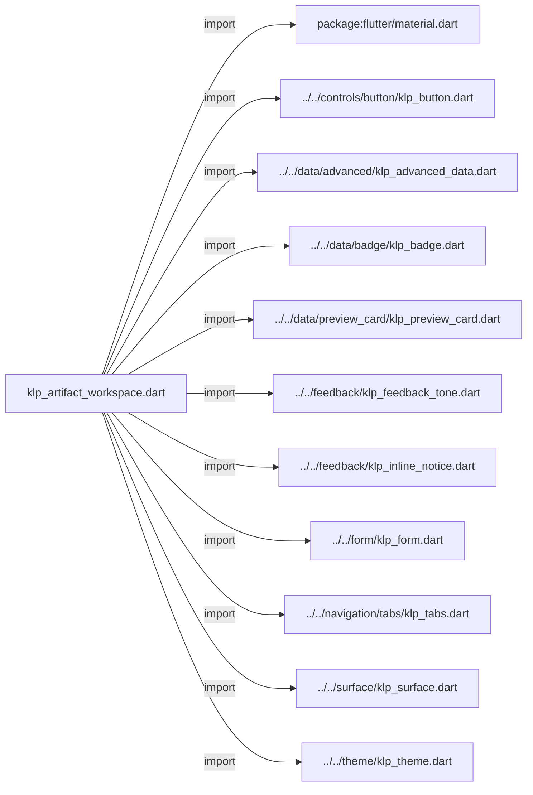

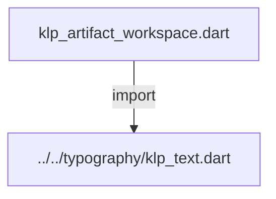

## 依賴證據

| 關係 | 原始 directive | 來源 |
|---|---|---|
| import | <code>import &#x27;package:flutter/material.dart&#x27;;</code> | [lib/src/editor/artifact_workspace/klp_artifact_workspace.dart:1](../../../../../lib/src/editor/artifact_workspace/klp_artifact_workspace.dart#L1) |
| import | <code>import &#x27;../../controls/button/klp_button.dart&#x27;;</code> | [lib/src/editor/artifact_workspace/klp_artifact_workspace.dart:3](../../../../../lib/src/editor/artifact_workspace/klp_artifact_workspace.dart#L3) |
| import | <code>import &#x27;../../data/advanced/klp_advanced_data.dart&#x27;;</code> | [lib/src/editor/artifact_workspace/klp_artifact_workspace.dart:4](../../../../../lib/src/editor/artifact_workspace/klp_artifact_workspace.dart#L4) |
| import | <code>import &#x27;../../data/badge/klp_badge.dart&#x27;;</code> | [lib/src/editor/artifact_workspace/klp_artifact_workspace.dart:5](../../../../../lib/src/editor/artifact_workspace/klp_artifact_workspace.dart#L5) |
| import | <code>import &#x27;../../data/preview_card/klp_preview_card.dart&#x27;;</code> | [lib/src/editor/artifact_workspace/klp_artifact_workspace.dart:6](../../../../../lib/src/editor/artifact_workspace/klp_artifact_workspace.dart#L6) |
| import | <code>import &#x27;../../feedback/klp_feedback_tone.dart&#x27;;</code> | [lib/src/editor/artifact_workspace/klp_artifact_workspace.dart:7](../../../../../lib/src/editor/artifact_workspace/klp_artifact_workspace.dart#L7) |
| import | <code>import &#x27;../../feedback/klp_inline_notice.dart&#x27;;</code> | [lib/src/editor/artifact_workspace/klp_artifact_workspace.dart:8](../../../../../lib/src/editor/artifact_workspace/klp_artifact_workspace.dart#L8) |
| import | <code>import &#x27;../../form/klp_form.dart&#x27;;</code> | [lib/src/editor/artifact_workspace/klp_artifact_workspace.dart:9](../../../../../lib/src/editor/artifact_workspace/klp_artifact_workspace.dart#L9) |
| import | <code>import &#x27;../../navigation/tabs/klp_tabs.dart&#x27;;</code> | [lib/src/editor/artifact_workspace/klp_artifact_workspace.dart:10](../../../../../lib/src/editor/artifact_workspace/klp_artifact_workspace.dart#L10) |
| import | <code>import &#x27;../../surface/klp_surface.dart&#x27;;</code> | [lib/src/editor/artifact_workspace/klp_artifact_workspace.dart:11](../../../../../lib/src/editor/artifact_workspace/klp_artifact_workspace.dart#L11) |
| import | <code>import &#x27;../../theme/klp_theme.dart&#x27;;</code> | [lib/src/editor/artifact_workspace/klp_artifact_workspace.dart:12](../../../../../lib/src/editor/artifact_workspace/klp_artifact_workspace.dart#L12) |
| import | <code>import &#x27;../../typography/klp_text.dart&#x27;;</code> | [lib/src/editor/artifact_workspace/klp_artifact_workspace.dart:13](../../../../../lib/src/editor/artifact_workspace/klp_artifact_workspace.dart#L13) |

## 宣告關係圖

本組節點是本檔宣告；沒有箭頭的宣告未在此圖主張互相依賴。

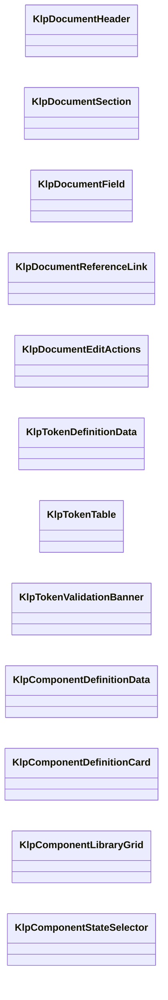

本組節點是本檔宣告；沒有箭頭的宣告未在此圖主張互相依賴。

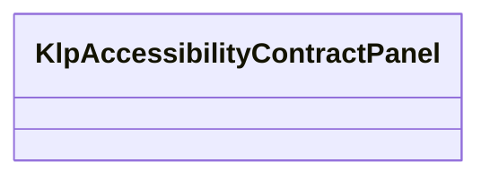

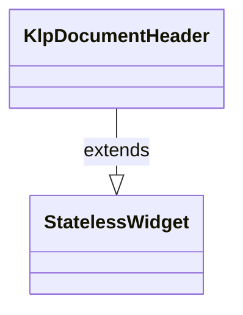

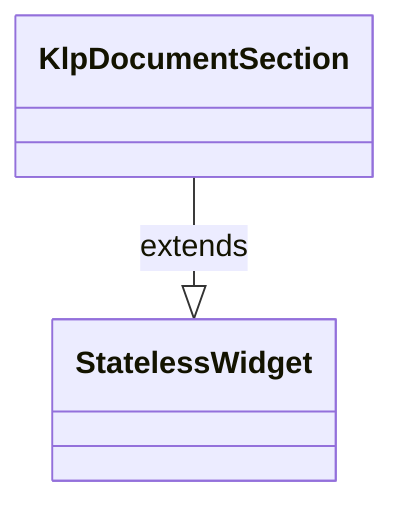

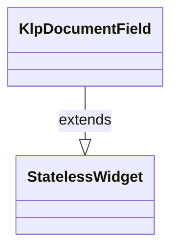

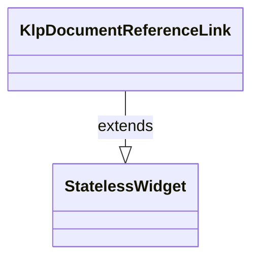

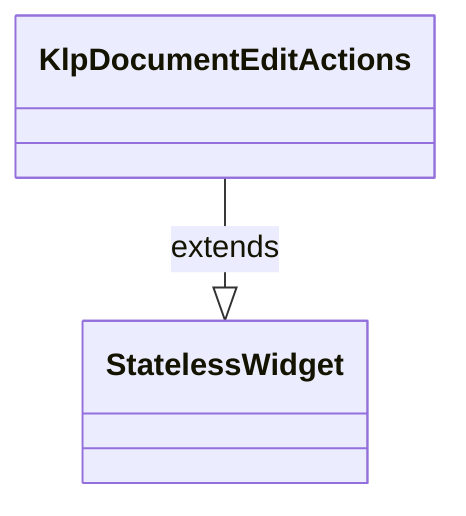

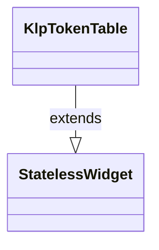

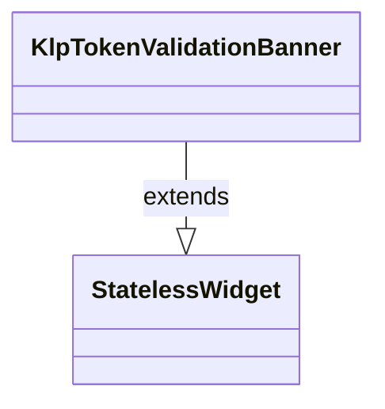

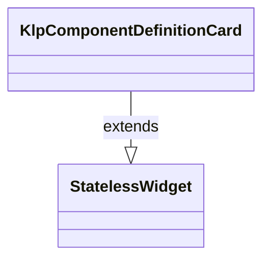

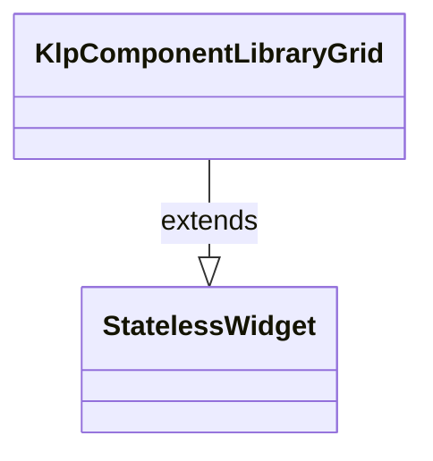

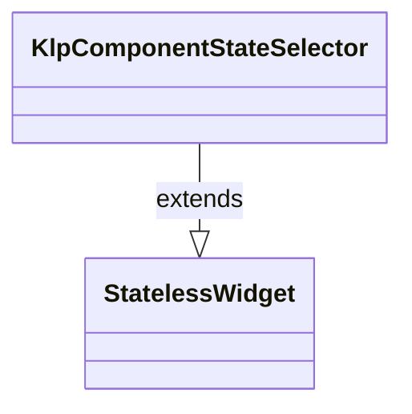

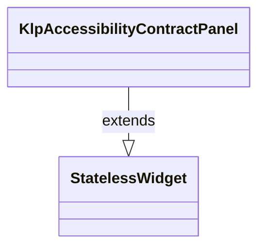

## 宣告與成員證據

成員包含 public 與 private；簽章取自來源，省略函式本體與欄位初始值。`(inferred)` 表示來源未明寫型別；建構子只顯示參數部分，不含初始化列表。

### KlpDocumentHeader

ClassDeclaration · public · [lib/src/editor/artifact_workspace/klp_artifact_workspace.dart:15](../../../../../lib/src/editor/artifact_workspace/klp_artifact_workspace.dart#L15)

<code>class KlpDocumentHeader extends StatelessWidget</code>

來源註解摘要：結構化文件的標頭；修訂與狀態文字由產品提供。

- `extends` → <code>StatelessWidget</code>：[lib/src/editor/artifact_workspace/klp_artifact_workspace.dart:16](../../../../../lib/src/editor/artifact_workspace/klp_artifact_workspace.dart#L16)

| 成員 | 可見性 | 簽章／型別 | 來源註解摘要 | 證據 |
|---|---|---|---|---|
| constructor <code>KlpDocumentHeader</code> | public | <code>const KlpDocumentHeader({ super.key, required this.title, required this.revisionLabel, required this.statusLabel, this.stale = false, this.actions = const [], })</code> |  | [lib/src/editor/artifact_workspace/klp_artifact_workspace.dart:17](../../../../../lib/src/editor/artifact_workspace/klp_artifact_workspace.dart#L17) |
| field <code>title</code> | public | <code>final String title</code> |  | [lib/src/editor/artifact_workspace/klp_artifact_workspace.dart:26](../../../../../lib/src/editor/artifact_workspace/klp_artifact_workspace.dart#L26) |
| field <code>revisionLabel</code> | public | <code>final String revisionLabel</code> |  | [lib/src/editor/artifact_workspace/klp_artifact_workspace.dart:27](../../../../../lib/src/editor/artifact_workspace/klp_artifact_workspace.dart#L27) |
| field <code>statusLabel</code> | public | <code>final String statusLabel</code> |  | [lib/src/editor/artifact_workspace/klp_artifact_workspace.dart:28](../../../../../lib/src/editor/artifact_workspace/klp_artifact_workspace.dart#L28) |
| field <code>stale</code> | public | <code>final bool stale</code> |  | [lib/src/editor/artifact_workspace/klp_artifact_workspace.dart:29](../../../../../lib/src/editor/artifact_workspace/klp_artifact_workspace.dart#L29) |
| field <code>actions</code> | public | <code>final List&lt;Widget&gt; actions</code> |  | [lib/src/editor/artifact_workspace/klp_artifact_workspace.dart:30](../../../../../lib/src/editor/artifact_workspace/klp_artifact_workspace.dart#L30) |
| method <code>build</code> | public | <code>Widget build(BuildContext context)</code> |  | [lib/src/editor/artifact_workspace/klp_artifact_workspace.dart:32](../../../../../lib/src/editor/artifact_workspace/klp_artifact_workspace.dart#L32) |

### KlpDocumentSection

ClassDeclaration · public · [lib/src/editor/artifact_workspace/klp_artifact_workspace.dart:41](../../../../../lib/src/editor/artifact_workspace/klp_artifact_workspace.dart#L41)

<code>class KlpDocumentSection extends StatelessWidget</code>

來源註解摘要：文件的單一語意章節；可選的動作不改變章節資料所有權。

- `extends` → <code>StatelessWidget</code>：[lib/src/editor/artifact_workspace/klp_artifact_workspace.dart:42](../../../../../lib/src/editor/artifact_workspace/klp_artifact_workspace.dart#L42)

| 成員 | 可見性 | 簽章／型別 | 來源註解摘要 | 證據 |
|---|---|---|---|---|
| constructor <code>KlpDocumentSection</code> | public | <code>const KlpDocumentSection({super.key, required this.title, required this.child, this.description, this.actions = const []})</code> |  | [lib/src/editor/artifact_workspace/klp_artifact_workspace.dart:43](../../../../../lib/src/editor/artifact_workspace/klp_artifact_workspace.dart#L43) |
| field <code>title</code> | public | <code>final String title</code> |  | [lib/src/editor/artifact_workspace/klp_artifact_workspace.dart:45](../../../../../lib/src/editor/artifact_workspace/klp_artifact_workspace.dart#L45) |
| field <code>description</code> | public | <code>final String? description</code> |  | [lib/src/editor/artifact_workspace/klp_artifact_workspace.dart:46](../../../../../lib/src/editor/artifact_workspace/klp_artifact_workspace.dart#L46) |
| field <code>child</code> | public | <code>final Widget child</code> |  | [lib/src/editor/artifact_workspace/klp_artifact_workspace.dart:47](../../../../../lib/src/editor/artifact_workspace/klp_artifact_workspace.dart#L47) |
| field <code>actions</code> | public | <code>final List&lt;Widget&gt; actions</code> |  | [lib/src/editor/artifact_workspace/klp_artifact_workspace.dart:48](../../../../../lib/src/editor/artifact_workspace/klp_artifact_workspace.dart#L48) |
| method <code>build</code> | public | <code>Widget build(BuildContext context)</code> |  | [lib/src/editor/artifact_workspace/klp_artifact_workspace.dart:50](../../../../../lib/src/editor/artifact_workspace/klp_artifact_workspace.dart#L50) |

### KlpDocumentField

ClassDeclaration · public · [lib/src/editor/artifact_workspace/klp_artifact_workspace.dart:66](../../../../../lib/src/editor/artifact_workspace/klp_artifact_workspace.dart#L66)

<code>class KlpDocumentField extends StatelessWidget</code>

來源註解摘要：文件欄位的標籤、值、說明與驗證組合。

- `extends` → <code>StatelessWidget</code>：[lib/src/editor/artifact_workspace/klp_artifact_workspace.dart:67](../../../../../lib/src/editor/artifact_workspace/klp_artifact_workspace.dart#L67)

| 成員 | 可見性 | 簽章／型別 | 來源註解摘要 | 證據 |
|---|---|---|---|---|
| constructor <code>KlpDocumentField</code> | public | <code>const KlpDocumentField({super.key, required this.label, required this.value, this.help, this.error})</code> |  | [lib/src/editor/artifact_workspace/klp_artifact_workspace.dart:68](../../../../../lib/src/editor/artifact_workspace/klp_artifact_workspace.dart#L68) |
| field <code>label</code> | public | <code>final String label</code> |  | [lib/src/editor/artifact_workspace/klp_artifact_workspace.dart:70](../../../../../lib/src/editor/artifact_workspace/klp_artifact_workspace.dart#L70) |
| field <code>value</code> | public | <code>final Widget value</code> |  | [lib/src/editor/artifact_workspace/klp_artifact_workspace.dart:71](../../../../../lib/src/editor/artifact_workspace/klp_artifact_workspace.dart#L71) |
| field <code>help</code> | public | <code>final String? help</code> |  | [lib/src/editor/artifact_workspace/klp_artifact_workspace.dart:72](../../../../../lib/src/editor/artifact_workspace/klp_artifact_workspace.dart#L72) |
| field <code>error</code> | public | <code>final String? error</code> |  | [lib/src/editor/artifact_workspace/klp_artifact_workspace.dart:73](../../../../../lib/src/editor/artifact_workspace/klp_artifact_workspace.dart#L73) |
| method <code>build</code> | public | <code>Widget build(BuildContext context)</code> |  | [lib/src/editor/artifact_workspace/klp_artifact_workspace.dart:75](../../../../../lib/src/editor/artifact_workspace/klp_artifact_workspace.dart#L75) |

### KlpDocumentReferenceLink

ClassDeclaration · public · [lib/src/editor/artifact_workspace/klp_artifact_workspace.dart:79](../../../../../lib/src/editor/artifact_workspace/klp_artifact_workspace.dart#L79)

<code>class KlpDocumentReferenceLink extends StatelessWidget</code>

來源註解摘要：指向另一個 canonical artifact 的可及性連結。

- `extends` → <code>StatelessWidget</code>：[lib/src/editor/artifact_workspace/klp_artifact_workspace.dart:80](../../../../../lib/src/editor/artifact_workspace/klp_artifact_workspace.dart#L80)

| 成員 | 可見性 | 簽章／型別 | 來源註解摘要 | 證據 |
|---|---|---|---|---|
| constructor <code>KlpDocumentReferenceLink</code> | public | <code>const KlpDocumentReferenceLink({super.key, required this.label, required this.onPressed, this.detail})</code> |  | [lib/src/editor/artifact_workspace/klp_artifact_workspace.dart:81](../../../../../lib/src/editor/artifact_workspace/klp_artifact_workspace.dart#L81) |
| field <code>label</code> | public | <code>final String label</code> |  | [lib/src/editor/artifact_workspace/klp_artifact_workspace.dart:83](../../../../../lib/src/editor/artifact_workspace/klp_artifact_workspace.dart#L83) |
| field <code>detail</code> | public | <code>final String? detail</code> |  | [lib/src/editor/artifact_workspace/klp_artifact_workspace.dart:84](../../../../../lib/src/editor/artifact_workspace/klp_artifact_workspace.dart#L84) |
| field <code>onPressed</code> | public | <code>final VoidCallback? onPressed</code> |  | [lib/src/editor/artifact_workspace/klp_artifact_workspace.dart:85](../../../../../lib/src/editor/artifact_workspace/klp_artifact_workspace.dart#L85) |
| method <code>build</code> | public | <code>Widget build(BuildContext context)</code> |  | [lib/src/editor/artifact_workspace/klp_artifact_workspace.dart:87](../../../../../lib/src/editor/artifact_workspace/klp_artifact_workspace.dart#L87) |

### KlpDocumentEditActions

ClassDeclaration · public · [lib/src/editor/artifact_workspace/klp_artifact_workspace.dart:95](../../../../../lib/src/editor/artifact_workspace/klp_artifact_workspace.dart#L95)

<code>class KlpDocumentEditActions extends StatelessWidget</code>

來源註解摘要：文件的進入編輯、儲存與取消動作組。

- `extends` → <code>StatelessWidget</code>：[lib/src/editor/artifact_workspace/klp_artifact_workspace.dart:96](../../../../../lib/src/editor/artifact_workspace/klp_artifact_workspace.dart#L96)

| 成員 | 可見性 | 簽章／型別 | 來源註解摘要 | 證據 |
|---|---|---|---|---|
| constructor <code>KlpDocumentEditActions</code> | public | <code>const KlpDocumentEditActions({ super.key, required this.editing, required this.editLabel, required this.saveLabel, required this.cancelLabel, this.onEdit, this.onSave, this.onCancel, })</code> |  | [lib/src/editor/artifact_workspace/klp_artifact_workspace.dart:97](../../../../../lib/src/editor/artifact_workspace/klp_artifact_workspace.dart#L97) |
| field <code>editing</code> | public | <code>final bool editing</code> |  | [lib/src/editor/artifact_workspace/klp_artifact_workspace.dart:108](../../../../../lib/src/editor/artifact_workspace/klp_artifact_workspace.dart#L108) |
| field <code>editLabel</code> | public | <code>final String editLabel</code> |  | [lib/src/editor/artifact_workspace/klp_artifact_workspace.dart:109](../../../../../lib/src/editor/artifact_workspace/klp_artifact_workspace.dart#L109) |
| field <code>saveLabel</code> | public | <code>final String saveLabel</code> |  | [lib/src/editor/artifact_workspace/klp_artifact_workspace.dart:110](../../../../../lib/src/editor/artifact_workspace/klp_artifact_workspace.dart#L110) |
| field <code>cancelLabel</code> | public | <code>final String cancelLabel</code> |  | [lib/src/editor/artifact_workspace/klp_artifact_workspace.dart:111](../../../../../lib/src/editor/artifact_workspace/klp_artifact_workspace.dart#L111) |
| field <code>onEdit</code> | public | <code>final VoidCallback? onEdit</code> |  | [lib/src/editor/artifact_workspace/klp_artifact_workspace.dart:112](../../../../../lib/src/editor/artifact_workspace/klp_artifact_workspace.dart#L112) |
| field <code>onSave</code> | public | <code>final VoidCallback? onSave</code> |  | [lib/src/editor/artifact_workspace/klp_artifact_workspace.dart:113](../../../../../lib/src/editor/artifact_workspace/klp_artifact_workspace.dart#L113) |
| field <code>onCancel</code> | public | <code>final VoidCallback? onCancel</code> |  | [lib/src/editor/artifact_workspace/klp_artifact_workspace.dart:114](../../../../../lib/src/editor/artifact_workspace/klp_artifact_workspace.dart#L114) |
| method <code>build</code> | public | <code>Widget build(BuildContext context)</code> |  | [lib/src/editor/artifact_workspace/klp_artifact_workspace.dart:116](../../../../../lib/src/editor/artifact_workspace/klp_artifact_workspace.dart#L116) |

### KlpTokenDefinitionData

ClassDeclaration · public · [lib/src/editor/artifact_workspace/klp_artifact_workspace.dart:125](../../../../../lib/src/editor/artifact_workspace/klp_artifact_workspace.dart#L125)

<code>class KlpTokenDefinitionData</code>

來源註解摘要：一筆產品中立的 Token 呈現資料。

| 成員 | 可見性 | 簽章／型別 | 來源註解摘要 | 證據 |
|---|---|---|---|---|
| constructor <code>KlpTokenDefinitionData</code> | public | <code>const KlpTokenDefinitionData({required this.name, required this.typeLabel, required this.valueLabel, required this.statusLabel, this.referenceLabel, this.preview})</code> |  | [lib/src/editor/artifact_workspace/klp_artifact_workspace.dart:128](../../../../../lib/src/editor/artifact_workspace/klp_artifact_workspace.dart#L128) |
| field <code>name</code> | public | <code>final String name</code> |  | [lib/src/editor/artifact_workspace/klp_artifact_workspace.dart:130](../../../../../lib/src/editor/artifact_workspace/klp_artifact_workspace.dart#L130) |
| field <code>typeLabel</code> | public | <code>final String typeLabel</code> |  | [lib/src/editor/artifact_workspace/klp_artifact_workspace.dart:131](../../../../../lib/src/editor/artifact_workspace/klp_artifact_workspace.dart#L131) |
| field <code>valueLabel</code> | public | <code>final String valueLabel</code> |  | [lib/src/editor/artifact_workspace/klp_artifact_workspace.dart:132](../../../../../lib/src/editor/artifact_workspace/klp_artifact_workspace.dart#L132) |
| field <code>statusLabel</code> | public | <code>final String statusLabel</code> |  | [lib/src/editor/artifact_workspace/klp_artifact_workspace.dart:133](../../../../../lib/src/editor/artifact_workspace/klp_artifact_workspace.dart#L133) |
| field <code>referenceLabel</code> | public | <code>final String? referenceLabel</code> |  | [lib/src/editor/artifact_workspace/klp_artifact_workspace.dart:134](../../../../../lib/src/editor/artifact_workspace/klp_artifact_workspace.dart#L134) |
| field <code>preview</code> | public | <code>final Widget? preview</code> |  | [lib/src/editor/artifact_workspace/klp_artifact_workspace.dart:135](../../../../../lib/src/editor/artifact_workspace/klp_artifact_workspace.dart#L135) |

### KlpTokenTable

ClassDeclaration · public · [lib/src/editor/artifact_workspace/klp_artifact_workspace.dart:138](../../../../../lib/src/editor/artifact_workspace/klp_artifact_workspace.dart#L138)

<code>class KlpTokenTable extends StatelessWidget</code>

來源註解摘要：可排序 Token 清單的表格呈現；排序狀態由呼叫端持有。

- `extends` → <code>StatelessWidget</code>：[lib/src/editor/artifact_workspace/klp_artifact_workspace.dart:139](../../../../../lib/src/editor/artifact_workspace/klp_artifact_workspace.dart#L139)

| 成員 | 可見性 | 簽章／型別 | 來源註解摘要 | 證據 |
|---|---|---|---|---|
| constructor <code>KlpTokenTable</code> | public | <code>const KlpTokenTable({ super.key, required this.tokens, required this.nameLabel, required this.typeLabel, required this.valueLabel, required this.referenceLabel, required this.statusLabel, })</code> |  | [lib/src/editor/artifact_workspace/klp_artifact_workspace.dart:140](../../../../../lib/src/editor/artifact_workspace/klp_artifact_workspace.dart#L140) |
| field <code>tokens</code> | public | <code>final List&lt;KlpTokenDefinitionData&gt; tokens</code> |  | [lib/src/editor/artifact_workspace/klp_artifact_workspace.dart:150](../../../../../lib/src/editor/artifact_workspace/klp_artifact_workspace.dart#L150) |
| field <code>nameLabel</code> | public | <code>final String nameLabel</code> |  | [lib/src/editor/artifact_workspace/klp_artifact_workspace.dart:151](../../../../../lib/src/editor/artifact_workspace/klp_artifact_workspace.dart#L151) |
| field <code>typeLabel</code> | public | <code>final String typeLabel</code> |  | [lib/src/editor/artifact_workspace/klp_artifact_workspace.dart:152](../../../../../lib/src/editor/artifact_workspace/klp_artifact_workspace.dart#L152) |
| field <code>valueLabel</code> | public | <code>final String valueLabel</code> |  | [lib/src/editor/artifact_workspace/klp_artifact_workspace.dart:153](../../../../../lib/src/editor/artifact_workspace/klp_artifact_workspace.dart#L153) |
| field <code>referenceLabel</code> | public | <code>final String referenceLabel</code> |  | [lib/src/editor/artifact_workspace/klp_artifact_workspace.dart:154](../../../../../lib/src/editor/artifact_workspace/klp_artifact_workspace.dart#L154) |
| field <code>statusLabel</code> | public | <code>final String statusLabel</code> |  | [lib/src/editor/artifact_workspace/klp_artifact_workspace.dart:155](../../../../../lib/src/editor/artifact_workspace/klp_artifact_workspace.dart#L155) |
| method <code>build</code> | public | <code>Widget build(BuildContext context)</code> |  | [lib/src/editor/artifact_workspace/klp_artifact_workspace.dart:157](../../../../../lib/src/editor/artifact_workspace/klp_artifact_workspace.dart#L157) |

### KlpTokenValidationBanner

ClassDeclaration · public · [lib/src/editor/artifact_workspace/klp_artifact_workspace.dart:167](../../../../../lib/src/editor/artifact_workspace/klp_artifact_workspace.dart#L167)

<code>class KlpTokenValidationBanner extends StatelessWidget</code>

來源註解摘要：Token 圖形驗證結果，不自行推導循環或型別相容性。

- `extends` → <code>StatelessWidget</code>：[lib/src/editor/artifact_workspace/klp_artifact_workspace.dart:168](../../../../../lib/src/editor/artifact_workspace/klp_artifact_workspace.dart#L168)

| 成員 | 可見性 | 簽章／型別 | 來源註解摘要 | 證據 |
|---|---|---|---|---|
| constructor <code>KlpTokenValidationBanner</code> | public | <code>const KlpTokenValidationBanner({super.key, required this.title, required this.message, required this.valid})</code> |  | [lib/src/editor/artifact_workspace/klp_artifact_workspace.dart:169](../../../../../lib/src/editor/artifact_workspace/klp_artifact_workspace.dart#L169) |
| field <code>title</code> | public | <code>final String title</code> |  | [lib/src/editor/artifact_workspace/klp_artifact_workspace.dart:171](../../../../../lib/src/editor/artifact_workspace/klp_artifact_workspace.dart#L171) |
| field <code>message</code> | public | <code>final String message</code> |  | [lib/src/editor/artifact_workspace/klp_artifact_workspace.dart:172](../../../../../lib/src/editor/artifact_workspace/klp_artifact_workspace.dart#L172) |
| field <code>valid</code> | public | <code>final bool valid</code> |  | [lib/src/editor/artifact_workspace/klp_artifact_workspace.dart:173](../../../../../lib/src/editor/artifact_workspace/klp_artifact_workspace.dart#L173) |
| method <code>build</code> | public | <code>Widget build(BuildContext context)</code> |  | [lib/src/editor/artifact_workspace/klp_artifact_workspace.dart:175](../../../../../lib/src/editor/artifact_workspace/klp_artifact_workspace.dart#L175) |

### KlpComponentDefinitionData

ClassDeclaration · public · [lib/src/editor/artifact_workspace/klp_artifact_workspace.dart:179](../../../../../lib/src/editor/artifact_workspace/klp_artifact_workspace.dart#L179)

<code>class KlpComponentDefinitionData</code>

來源註解摘要：一個元件定義的產品中立預覽資料。

| 成員 | 可見性 | 簽章／型別 | 來源註解摘要 | 證據 |
|---|---|---|---|---|
| constructor <code>KlpComponentDefinitionData</code> | public | <code>const KlpComponentDefinitionData({required this.id, required this.name, required this.statusLabel, required this.preview, this.description})</code> |  | [lib/src/editor/artifact_workspace/klp_artifact_workspace.dart:182](../../../../../lib/src/editor/artifact_workspace/klp_artifact_workspace.dart#L182) |
| field <code>id</code> | public | <code>final String id</code> |  | [lib/src/editor/artifact_workspace/klp_artifact_workspace.dart:184](../../../../../lib/src/editor/artifact_workspace/klp_artifact_workspace.dart#L184) |
| field <code>name</code> | public | <code>final String name</code> |  | [lib/src/editor/artifact_workspace/klp_artifact_workspace.dart:185](../../../../../lib/src/editor/artifact_workspace/klp_artifact_workspace.dart#L185) |
| field <code>statusLabel</code> | public | <code>final String statusLabel</code> |  | [lib/src/editor/artifact_workspace/klp_artifact_workspace.dart:186](../../../../../lib/src/editor/artifact_workspace/klp_artifact_workspace.dart#L186) |
| field <code>description</code> | public | <code>final String? description</code> |  | [lib/src/editor/artifact_workspace/klp_artifact_workspace.dart:187](../../../../../lib/src/editor/artifact_workspace/klp_artifact_workspace.dart#L187) |
| field <code>preview</code> | public | <code>final Widget preview</code> |  | [lib/src/editor/artifact_workspace/klp_artifact_workspace.dart:188](../../../../../lib/src/editor/artifact_workspace/klp_artifact_workspace.dart#L188) |

### KlpComponentDefinitionCard

ClassDeclaration · public · [lib/src/editor/artifact_workspace/klp_artifact_workspace.dart:191](../../../../../lib/src/editor/artifact_workspace/klp_artifact_workspace.dart#L191)

<code>class KlpComponentDefinitionCard extends StatelessWidget</code>

來源註解摘要：元件定義卡，不持有元件文件或 instance override。

- `extends` → <code>StatelessWidget</code>：[lib/src/editor/artifact_workspace/klp_artifact_workspace.dart:192](../../../../../lib/src/editor/artifact_workspace/klp_artifact_workspace.dart#L192)

| 成員 | 可見性 | 簽章／型別 | 來源註解摘要 | 證據 |
|---|---|---|---|---|
| constructor <code>KlpComponentDefinitionCard</code> | public | <code>const KlpComponentDefinitionCard({super.key, required this.data, this.onPressed})</code> |  | [lib/src/editor/artifact_workspace/klp_artifact_workspace.dart:193](../../../../../lib/src/editor/artifact_workspace/klp_artifact_workspace.dart#L193) |
| field <code>data</code> | public | <code>final KlpComponentDefinitionData data</code> |  | [lib/src/editor/artifact_workspace/klp_artifact_workspace.dart:195](../../../../../lib/src/editor/artifact_workspace/klp_artifact_workspace.dart#L195) |
| field <code>onPressed</code> | public | <code>final VoidCallback? onPressed</code> |  | [lib/src/editor/artifact_workspace/klp_artifact_workspace.dart:196](../../../../../lib/src/editor/artifact_workspace/klp_artifact_workspace.dart#L196) |
| method <code>build</code> | public | <code>Widget build(BuildContext context)</code> |  | [lib/src/editor/artifact_workspace/klp_artifact_workspace.dart:198](../../../../../lib/src/editor/artifact_workspace/klp_artifact_workspace.dart#L198) |

### KlpComponentLibraryGrid

ClassDeclaration · public · [lib/src/editor/artifact_workspace/klp_artifact_workspace.dart:214](../../../../../lib/src/editor/artifact_workspace/klp_artifact_workspace.dart#L214)

<code>class KlpComponentLibraryGrid extends StatelessWidget</code>

來源註解摘要：元件定義的響應式預覽網格。

- `extends` → <code>StatelessWidget</code>：[lib/src/editor/artifact_workspace/klp_artifact_workspace.dart:215](../../../../../lib/src/editor/artifact_workspace/klp_artifact_workspace.dart#L215)

| 成員 | 可見性 | 簽章／型別 | 來源註解摘要 | 證據 |
|---|---|---|---|---|
| constructor <code>KlpComponentLibraryGrid</code> | public | <code>const KlpComponentLibraryGrid({super.key, required this.components, this.onSelected})</code> |  | [lib/src/editor/artifact_workspace/klp_artifact_workspace.dart:216](../../../../../lib/src/editor/artifact_workspace/klp_artifact_workspace.dart#L216) |
| field <code>components</code> | public | <code>final List&lt;KlpComponentDefinitionData&gt; components</code> |  | [lib/src/editor/artifact_workspace/klp_artifact_workspace.dart:218](../../../../../lib/src/editor/artifact_workspace/klp_artifact_workspace.dart#L218) |
| field <code>onSelected</code> | public | <code>final ValueChanged&lt;String&gt;? onSelected</code> |  | [lib/src/editor/artifact_workspace/klp_artifact_workspace.dart:219](../../../../../lib/src/editor/artifact_workspace/klp_artifact_workspace.dart#L219) |
| method <code>build</code> | public | <code>Widget build(BuildContext context)</code> |  | [lib/src/editor/artifact_workspace/klp_artifact_workspace.dart:221](../../../../../lib/src/editor/artifact_workspace/klp_artifact_workspace.dart#L221) |

### KlpComponentStateSelector

ClassDeclaration · public · [lib/src/editor/artifact_workspace/klp_artifact_workspace.dart:234](../../../../../lib/src/editor/artifact_workspace/klp_artifact_workspace.dart#L234)

<code>class KlpComponentStateSelector extends StatelessWidget</code>

來源註解摘要：元件的狀態切換器；狀態值與標籤皆由呼叫端定義。

- `extends` → <code>StatelessWidget</code>：[lib/src/editor/artifact_workspace/klp_artifact_workspace.dart:235](../../../../../lib/src/editor/artifact_workspace/klp_artifact_workspace.dart#L235)

| 成員 | 可見性 | 簽章／型別 | 來源註解摘要 | 證據 |
|---|---|---|---|---|
| constructor <code>KlpComponentStateSelector</code> | public | <code>const KlpComponentStateSelector({super.key, required this.labels, required this.selectedIndex, required this.onSelected})</code> |  | [lib/src/editor/artifact_workspace/klp_artifact_workspace.dart:236](../../../../../lib/src/editor/artifact_workspace/klp_artifact_workspace.dart#L236) |
| field <code>labels</code> | public | <code>final List&lt;String&gt; labels</code> |  | [lib/src/editor/artifact_workspace/klp_artifact_workspace.dart:238](../../../../../lib/src/editor/artifact_workspace/klp_artifact_workspace.dart#L238) |
| field <code>selectedIndex</code> | public | <code>final int selectedIndex</code> |  | [lib/src/editor/artifact_workspace/klp_artifact_workspace.dart:239](../../../../../lib/src/editor/artifact_workspace/klp_artifact_workspace.dart#L239) |
| field <code>onSelected</code> | public | <code>final ValueChanged&lt;int&gt; onSelected</code> |  | [lib/src/editor/artifact_workspace/klp_artifact_workspace.dart:240](../../../../../lib/src/editor/artifact_workspace/klp_artifact_workspace.dart#L240) |
| method <code>build</code> | public | <code>Widget build(BuildContext context)</code> |  | [lib/src/editor/artifact_workspace/klp_artifact_workspace.dart:242](../../../../../lib/src/editor/artifact_workspace/klp_artifact_workspace.dart#L242) |

### KlpAccessibilityContractPanel

ClassDeclaration · public · [lib/src/editor/artifact_workspace/klp_artifact_workspace.dart:246](../../../../../lib/src/editor/artifact_workspace/klp_artifact_workspace.dart#L246)

<code>class KlpAccessibilityContractPanel extends StatelessWidget</code>

來源註解摘要：元件可及性合約表面，內容由產品的元件定義投影而來。

- `extends` → <code>StatelessWidget</code>：[lib/src/editor/artifact_workspace/klp_artifact_workspace.dart:247](../../../../../lib/src/editor/artifact_workspace/klp_artifact_workspace.dart#L247)

| 成員 | 可見性 | 簽章／型別 | 來源註解摘要 | 證據 |
|---|---|---|---|---|
| constructor <code>KlpAccessibilityContractPanel</code> | public | <code>const KlpAccessibilityContractPanel({super.key, required this.title, required this.items})</code> |  | [lib/src/editor/artifact_workspace/klp_artifact_workspace.dart:248](../../../../../lib/src/editor/artifact_workspace/klp_artifact_workspace.dart#L248) |
| field <code>title</code> | public | <code>final String title</code> |  | [lib/src/editor/artifact_workspace/klp_artifact_workspace.dart:250](../../../../../lib/src/editor/artifact_workspace/klp_artifact_workspace.dart#L250) |
| field <code>items</code> | public | <code>final Map&lt;String, String&gt; items</code> |  | [lib/src/editor/artifact_workspace/klp_artifact_workspace.dart:251](../../../../../lib/src/editor/artifact_workspace/klp_artifact_workspace.dart#L251) |
| method <code>build</code> | public | <code>Widget build(BuildContext context)</code> |  | [lib/src/editor/artifact_workspace/klp_artifact_workspace.dart:253](../../../../../lib/src/editor/artifact_workspace/klp_artifact_workspace.dart#L253) |

## 閱讀說明與限制

箭頭只表示來源明寫的靜態關係；import 不等於呼叫。未分析動態呼叫、欄位的實際物件擁有權、狀態轉移或渲染流程；型別未進行語意解析，繼承目標保留原始型別拼寫。public／private 依 Dart 名稱前綴判斷；public 宣告不代表已由 `lib/kallopis.dart` 匯出。

本頁由 `tool/architecture_atlas` 產生；編輯來源或生成工具後重新產生，避免手改本頁。
