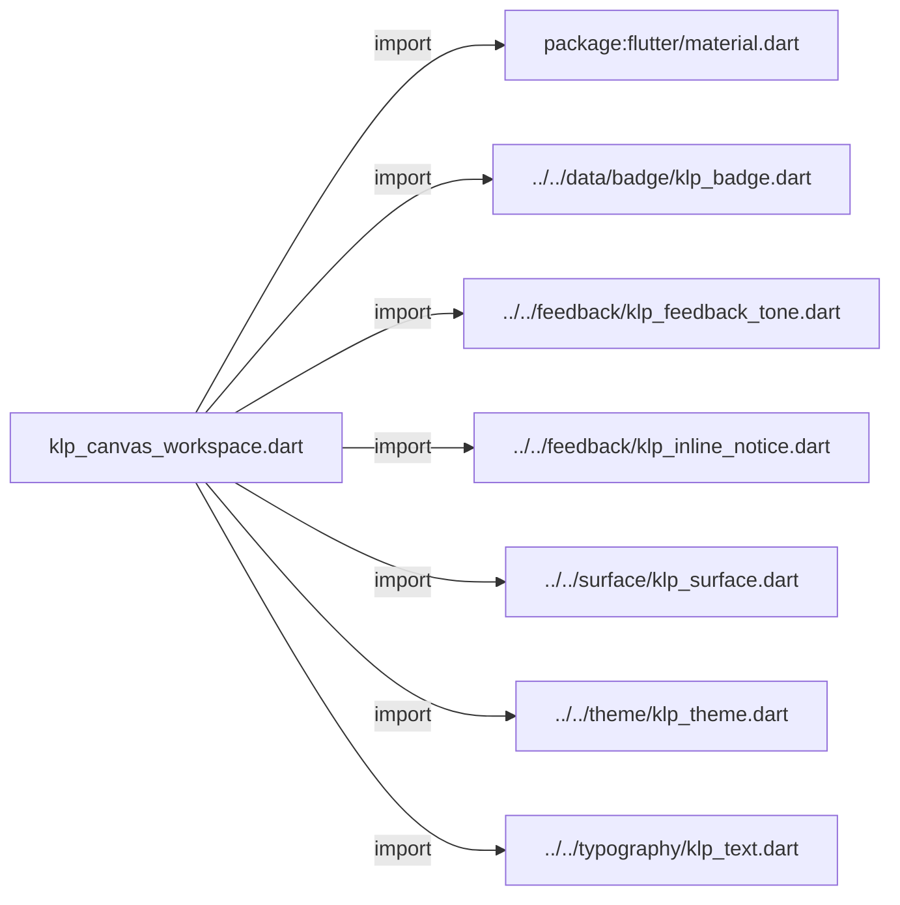
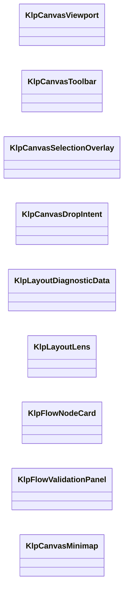
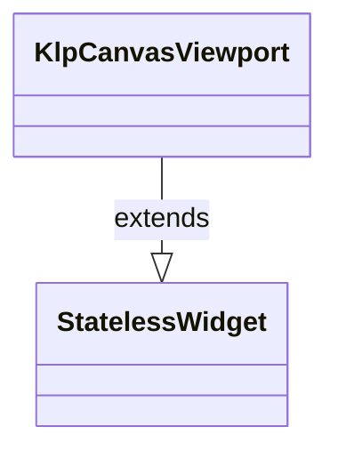
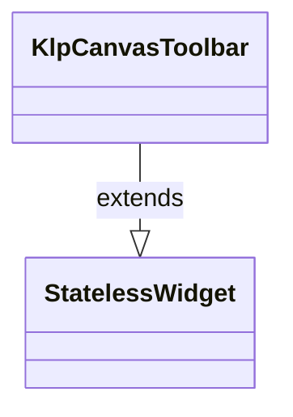
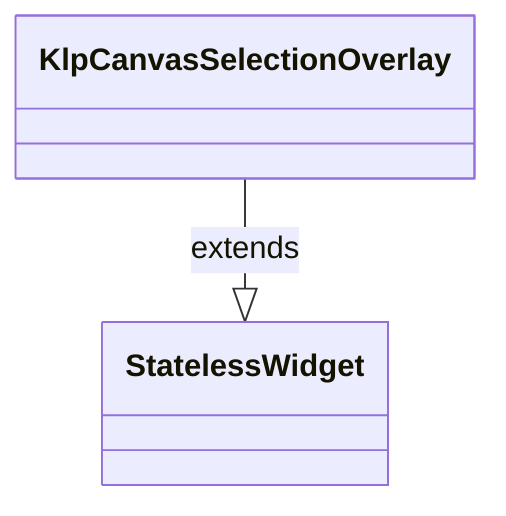
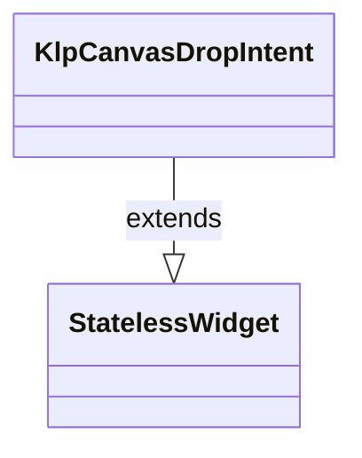
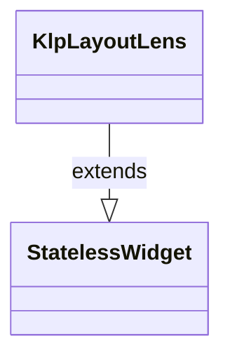
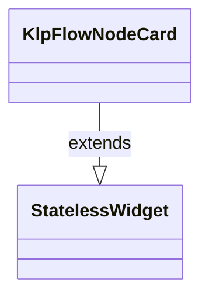
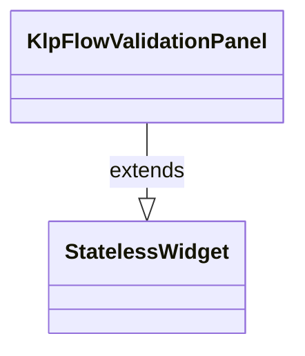
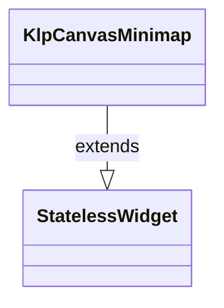

# klp_canvas_workspace.dart：直接依賴與宣告架構

[回到目錄](README.md) · [來源檔案](../../../../../lib/src/editor/canvas_workspace/klp_canvas_workspace.dart)

## 範圍

核心是 `lib/src/editor/canvas_workspace/klp_canvas_workspace.dart`。主要視角為該檔案明寫的 import／export／part；輔助視角為本檔宣告及 extends／implements／with／on 關係。只展開一層外部邊界。

## 直接依賴圖

## 依賴證據

| 關係 | 原始 directive | 來源 |
|---|---|---|
| import | <code>import &#x27;package:flutter/material.dart&#x27;;</code> | [lib/src/editor/canvas_workspace/klp_canvas_workspace.dart:1](../../../../../lib/src/editor/canvas_workspace/klp_canvas_workspace.dart#L1) |
| import | <code>import &#x27;../../data/badge/klp_badge.dart&#x27;;</code> | [lib/src/editor/canvas_workspace/klp_canvas_workspace.dart:3](../../../../../lib/src/editor/canvas_workspace/klp_canvas_workspace.dart#L3) |
| import | <code>import &#x27;../../feedback/klp_feedback_tone.dart&#x27;;</code> | [lib/src/editor/canvas_workspace/klp_canvas_workspace.dart:4](../../../../../lib/src/editor/canvas_workspace/klp_canvas_workspace.dart#L4) |
| import | <code>import &#x27;../../feedback/klp_inline_notice.dart&#x27;;</code> | [lib/src/editor/canvas_workspace/klp_canvas_workspace.dart:5](../../../../../lib/src/editor/canvas_workspace/klp_canvas_workspace.dart#L5) |
| import | <code>import &#x27;../../surface/klp_surface.dart&#x27;;</code> | [lib/src/editor/canvas_workspace/klp_canvas_workspace.dart:6](../../../../../lib/src/editor/canvas_workspace/klp_canvas_workspace.dart#L6) |
| import | <code>import &#x27;../../theme/klp_theme.dart&#x27;;</code> | [lib/src/editor/canvas_workspace/klp_canvas_workspace.dart:7](../../../../../lib/src/editor/canvas_workspace/klp_canvas_workspace.dart#L7) |
| import | <code>import &#x27;../../typography/klp_text.dart&#x27;;</code> | [lib/src/editor/canvas_workspace/klp_canvas_workspace.dart:8](../../../../../lib/src/editor/canvas_workspace/klp_canvas_workspace.dart#L8) |

## 宣告關係圖

本組節點是本檔宣告；沒有箭頭的宣告未在此圖主張互相依賴。

## 宣告與成員證據

成員包含 public 與 private；簽章取自來源，省略函式本體與欄位初始值。`(inferred)` 表示來源未明寫型別；建構子只顯示參數部分，不含初始化列表。

### KlpCanvasViewport

ClassDeclaration · public · [lib/src/editor/canvas_workspace/klp_canvas_workspace.dart:10](../../../../../lib/src/editor/canvas_workspace/klp_canvas_workspace.dart#L10)

<code>class KlpCanvasViewport extends StatelessWidget</code>

來源註解摘要：編輯器畫布視窗；背景直接繼承 Stage surface，不建立另一塊畫布色。

- `extends` → <code>StatelessWidget</code>：[lib/src/editor/canvas_workspace/klp_canvas_workspace.dart:11](../../../../../lib/src/editor/canvas_workspace/klp_canvas_workspace.dart#L11)

| 成員 | 可見性 | 簽章／型別 | 來源註解摘要 | 證據 |
|---|---|---|---|---|
| constructor <code>KlpCanvasViewport</code> | public | <code>const KlpCanvasViewport({ super.key, required this.child, this.transformationController, this.panEnabled = true, this.scaleEnabled = true, })</code> |  | [lib/src/editor/canvas_workspace/klp_canvas_workspace.dart:12](../../../../../lib/src/editor/canvas_workspace/klp_canvas_workspace.dart#L12) |
| field <code>child</code> | public | <code>final Widget child</code> |  | [lib/src/editor/canvas_workspace/klp_canvas_workspace.dart:20](../../../../../lib/src/editor/canvas_workspace/klp_canvas_workspace.dart#L20) |
| field <code>transformationController</code> | public | <code>final TransformationController? transformationController</code> |  | [lib/src/editor/canvas_workspace/klp_canvas_workspace.dart:21](../../../../../lib/src/editor/canvas_workspace/klp_canvas_workspace.dart#L21) |
| field <code>panEnabled</code> | public | <code>final bool panEnabled</code> |  | [lib/src/editor/canvas_workspace/klp_canvas_workspace.dart:22](../../../../../lib/src/editor/canvas_workspace/klp_canvas_workspace.dart#L22) |
| field <code>scaleEnabled</code> | public | <code>final bool scaleEnabled</code> |  | [lib/src/editor/canvas_workspace/klp_canvas_workspace.dart:23](../../../../../lib/src/editor/canvas_workspace/klp_canvas_workspace.dart#L23) |
| method <code>build</code> | public | <code>Widget build(BuildContext context)</code> |  | [lib/src/editor/canvas_workspace/klp_canvas_workspace.dart:25](../../../../../lib/src/editor/canvas_workspace/klp_canvas_workspace.dart#L25) |

### KlpCanvasToolbar

ClassDeclaration · public · [lib/src/editor/canvas_workspace/klp_canvas_workspace.dart:40](../../../../../lib/src/editor/canvas_workspace/klp_canvas_workspace.dart#L40)

<code>class KlpCanvasToolbar extends StatelessWidget</code>

來源註解摘要：畫布上的有限動作工具列；動作能力由呼叫端決定。

- `extends` → <code>StatelessWidget</code>：[lib/src/editor/canvas_workspace/klp_canvas_workspace.dart:41](../../../../../lib/src/editor/canvas_workspace/klp_canvas_workspace.dart#L41)

| 成員 | 可見性 | 簽章／型別 | 來源註解摘要 | 證據 |
|---|---|---|---|---|
| constructor <code>KlpCanvasToolbar</code> | public | <code>const KlpCanvasToolbar({super.key, required this.actions})</code> |  | [lib/src/editor/canvas_workspace/klp_canvas_workspace.dart:42](../../../../../lib/src/editor/canvas_workspace/klp_canvas_workspace.dart#L42) |
| field <code>actions</code> | public | <code>final List&lt;Widget&gt; actions</code> |  | [lib/src/editor/canvas_workspace/klp_canvas_workspace.dart:44](../../../../../lib/src/editor/canvas_workspace/klp_canvas_workspace.dart#L44) |
| method <code>build</code> | public | <code>Widget build(BuildContext context)</code> |  | [lib/src/editor/canvas_workspace/klp_canvas_workspace.dart:46](../../../../../lib/src/editor/canvas_workspace/klp_canvas_workspace.dart#L46) |

### KlpCanvasSelectionOverlay

ClassDeclaration · public · [lib/src/editor/canvas_workspace/klp_canvas_workspace.dart:54](../../../../../lib/src/editor/canvas_workspace/klp_canvas_workspace.dart#L54)

<code>class KlpCanvasSelectionOverlay extends StatelessWidget</code>

來源註解摘要：選取範圍與可選 resize handles 的通用覆層。

- `extends` → <code>StatelessWidget</code>：[lib/src/editor/canvas_workspace/klp_canvas_workspace.dart:55](../../../../../lib/src/editor/canvas_workspace/klp_canvas_workspace.dart#L55)

| 成員 | 可見性 | 簽章／型別 | 來源註解摘要 | 證據 |
|---|---|---|---|---|
| constructor <code>KlpCanvasSelectionOverlay</code> | public | <code>const KlpCanvasSelectionOverlay({super.key, required this.child, this.selected = true, this.showHandles = false})</code> |  | [lib/src/editor/canvas_workspace/klp_canvas_workspace.dart:56](../../../../../lib/src/editor/canvas_workspace/klp_canvas_workspace.dart#L56) |
| field <code>child</code> | public | <code>final Widget child</code> |  | [lib/src/editor/canvas_workspace/klp_canvas_workspace.dart:58](../../../../../lib/src/editor/canvas_workspace/klp_canvas_workspace.dart#L58) |
| field <code>selected</code> | public | <code>final bool selected</code> |  | [lib/src/editor/canvas_workspace/klp_canvas_workspace.dart:59](../../../../../lib/src/editor/canvas_workspace/klp_canvas_workspace.dart#L59) |
| field <code>showHandles</code> | public | <code>final bool showHandles</code> |  | [lib/src/editor/canvas_workspace/klp_canvas_workspace.dart:60](../../../../../lib/src/editor/canvas_workspace/klp_canvas_workspace.dart#L60) |
| method <code>build</code> | public | <code>Widget build(BuildContext context)</code> |  | [lib/src/editor/canvas_workspace/klp_canvas_workspace.dart:62](../../../../../lib/src/editor/canvas_workspace/klp_canvas_workspace.dart#L62) |

### KlpCanvasDropIntent

ClassDeclaration · public · [lib/src/editor/canvas_workspace/klp_canvas_workspace.dart:84](../../../../../lib/src/editor/canvas_workspace/klp_canvas_workspace.dart#L84)

<code>class KlpCanvasDropIntent extends StatelessWidget</code>

來源註解摘要：插入、重排、包覆、重設父層或疊放等 drop intent 指示器。

- `extends` → <code>StatelessWidget</code>：[lib/src/editor/canvas_workspace/klp_canvas_workspace.dart:85](../../../../../lib/src/editor/canvas_workspace/klp_canvas_workspace.dart#L85)

| 成員 | 可見性 | 簽章／型別 | 來源註解摘要 | 證據 |
|---|---|---|---|---|
| constructor <code>KlpCanvasDropIntent</code> | public | <code>const KlpCanvasDropIntent({super.key, required this.label, required this.child})</code> |  | [lib/src/editor/canvas_workspace/klp_canvas_workspace.dart:86](../../../../../lib/src/editor/canvas_workspace/klp_canvas_workspace.dart#L86) |
| field <code>label</code> | public | <code>final String label</code> |  | [lib/src/editor/canvas_workspace/klp_canvas_workspace.dart:88](../../../../../lib/src/editor/canvas_workspace/klp_canvas_workspace.dart#L88) |
| field <code>child</code> | public | <code>final Widget child</code> |  | [lib/src/editor/canvas_workspace/klp_canvas_workspace.dart:89](../../../../../lib/src/editor/canvas_workspace/klp_canvas_workspace.dart#L89) |
| method <code>build</code> | public | <code>Widget build(BuildContext context)</code> |  | [lib/src/editor/canvas_workspace/klp_canvas_workspace.dart:91](../../../../../lib/src/editor/canvas_workspace/klp_canvas_workspace.dart#L91) |

### KlpLayoutDiagnosticData

ClassDeclaration · public · [lib/src/editor/canvas_workspace/klp_canvas_workspace.dart:102](../../../../../lib/src/editor/canvas_workspace/klp_canvas_workspace.dart#L102)

<code>class KlpLayoutDiagnosticData</code>

來源註解摘要：Layout Lens 的單一診斷項目。

| 成員 | 可見性 | 簽章／型別 | 來源註解摘要 | 證據 |
|---|---|---|---|---|
| constructor <code>KlpLayoutDiagnosticData</code> | public | <code>const KlpLayoutDiagnosticData({required this.label, required this.value, this.tone = KlpFeedbackTone.neutral})</code> |  | [lib/src/editor/canvas_workspace/klp_canvas_workspace.dart:105](../../../../../lib/src/editor/canvas_workspace/klp_canvas_workspace.dart#L105) |
| field <code>label</code> | public | <code>final String label</code> |  | [lib/src/editor/canvas_workspace/klp_canvas_workspace.dart:107](../../../../../lib/src/editor/canvas_workspace/klp_canvas_workspace.dart#L107) |
| field <code>value</code> | public | <code>final String value</code> |  | [lib/src/editor/canvas_workspace/klp_canvas_workspace.dart:108](../../../../../lib/src/editor/canvas_workspace/klp_canvas_workspace.dart#L108) |
| field <code>tone</code> | public | <code>final KlpFeedbackTone tone</code> |  | [lib/src/editor/canvas_workspace/klp_canvas_workspace.dart:109](../../../../../lib/src/editor/canvas_workspace/klp_canvas_workspace.dart#L109) |

### KlpLayoutLens

ClassDeclaration · public · [lib/src/editor/canvas_workspace/klp_canvas_workspace.dart:112](../../../../../lib/src/editor/canvas_workspace/klp_canvas_workspace.dart#L112)

<code>class KlpLayoutLens extends StatelessWidget</code>

來源註解摘要：顯示 layout、size、padding、gap 與 parent 關係，不推導文件狀態。

- `extends` → <code>StatelessWidget</code>：[lib/src/editor/canvas_workspace/klp_canvas_workspace.dart:113](../../../../../lib/src/editor/canvas_workspace/klp_canvas_workspace.dart#L113)

| 成員 | 可見性 | 簽章／型別 | 來源註解摘要 | 證據 |
|---|---|---|---|---|
| constructor <code>KlpLayoutLens</code> | public | <code>const KlpLayoutLens({super.key, required this.label, required this.diagnostics})</code> |  | [lib/src/editor/canvas_workspace/klp_canvas_workspace.dart:114](../../../../../lib/src/editor/canvas_workspace/klp_canvas_workspace.dart#L114) |
| field <code>label</code> | public | <code>final String label</code> |  | [lib/src/editor/canvas_workspace/klp_canvas_workspace.dart:116](../../../../../lib/src/editor/canvas_workspace/klp_canvas_workspace.dart#L116) |
| field <code>diagnostics</code> | public | <code>final List&lt;KlpLayoutDiagnosticData&gt; diagnostics</code> |  | [lib/src/editor/canvas_workspace/klp_canvas_workspace.dart:117](../../../../../lib/src/editor/canvas_workspace/klp_canvas_workspace.dart#L117) |
| method <code>build</code> | public | <code>Widget build(BuildContext context)</code> |  | [lib/src/editor/canvas_workspace/klp_canvas_workspace.dart:119](../../../../../lib/src/editor/canvas_workspace/klp_canvas_workspace.dart#L119) |

### KlpFlowNodeCard

ClassDeclaration · public · [lib/src/editor/canvas_workspace/klp_canvas_workspace.dart:131](../../../../../lib/src/editor/canvas_workspace/klp_canvas_workspace.dart#L131)

<code>class KlpFlowNodeCard extends StatelessWidget</code>

來源註解摘要：Flow 節點卡；節點種類與風險文字由呼叫端提供。

- `extends` → <code>StatelessWidget</code>：[lib/src/editor/canvas_workspace/klp_canvas_workspace.dart:132](../../../../../lib/src/editor/canvas_workspace/klp_canvas_workspace.dart#L132)

| 成員 | 可見性 | 簽章／型別 | 來源註解摘要 | 證據 |
|---|---|---|---|---|
| constructor <code>KlpFlowNodeCard</code> | public | <code>const KlpFlowNodeCard({super.key, required this.title, required this.typeLabel, required this.child, this.selected = false, this.onPressed})</code> |  | [lib/src/editor/canvas_workspace/klp_canvas_workspace.dart:133](../../../../../lib/src/editor/canvas_workspace/klp_canvas_workspace.dart#L133) |
| field <code>title</code> | public | <code>final String title</code> |  | [lib/src/editor/canvas_workspace/klp_canvas_workspace.dart:135](../../../../../lib/src/editor/canvas_workspace/klp_canvas_workspace.dart#L135) |
| field <code>typeLabel</code> | public | <code>final String typeLabel</code> |  | [lib/src/editor/canvas_workspace/klp_canvas_workspace.dart:136](../../../../../lib/src/editor/canvas_workspace/klp_canvas_workspace.dart#L136) |
| field <code>child</code> | public | <code>final Widget child</code> |  | [lib/src/editor/canvas_workspace/klp_canvas_workspace.dart:137](../../../../../lib/src/editor/canvas_workspace/klp_canvas_workspace.dart#L137) |
| field <code>selected</code> | public | <code>final bool selected</code> |  | [lib/src/editor/canvas_workspace/klp_canvas_workspace.dart:138](../../../../../lib/src/editor/canvas_workspace/klp_canvas_workspace.dart#L138) |
| field <code>onPressed</code> | public | <code>final VoidCallback? onPressed</code> |  | [lib/src/editor/canvas_workspace/klp_canvas_workspace.dart:139](../../../../../lib/src/editor/canvas_workspace/klp_canvas_workspace.dart#L139) |
| method <code>build</code> | public | <code>Widget build(BuildContext context)</code> |  | [lib/src/editor/canvas_workspace/klp_canvas_workspace.dart:141](../../../../../lib/src/editor/canvas_workspace/klp_canvas_workspace.dart#L141) |

### KlpFlowValidationPanel

ClassDeclaration · public · [lib/src/editor/canvas_workspace/klp_canvas_workspace.dart:157](../../../../../lib/src/editor/canvas_workspace/klp_canvas_workspace.dart#L157)

<code>class KlpFlowValidationPanel extends StatelessWidget</code>

來源註解摘要：Flow 風險或驗證訊息清單；風險計算與修復動作由領域層提供。

- `extends` → <code>StatelessWidget</code>：[lib/src/editor/canvas_workspace/klp_canvas_workspace.dart:158](../../../../../lib/src/editor/canvas_workspace/klp_canvas_workspace.dart#L158)

| 成員 | 可見性 | 簽章／型別 | 來源註解摘要 | 證據 |
|---|---|---|---|---|
| constructor <code>KlpFlowValidationPanel</code> | public | <code>const KlpFlowValidationPanel({super.key, required this.title, required this.issues, this.recoveryActions = const []})</code> |  | [lib/src/editor/canvas_workspace/klp_canvas_workspace.dart:159](../../../../../lib/src/editor/canvas_workspace/klp_canvas_workspace.dart#L159) |
| field <code>title</code> | public | <code>final String title</code> |  | [lib/src/editor/canvas_workspace/klp_canvas_workspace.dart:161](../../../../../lib/src/editor/canvas_workspace/klp_canvas_workspace.dart#L161) |
| field <code>issues</code> | public | <code>final List&lt;(String, KlpFeedbackTone)&gt; issues</code> |  | [lib/src/editor/canvas_workspace/klp_canvas_workspace.dart:162](../../../../../lib/src/editor/canvas_workspace/klp_canvas_workspace.dart#L162) |
| field <code>recoveryActions</code> | public | <code>final List&lt;Widget&gt; recoveryActions</code> |  | [lib/src/editor/canvas_workspace/klp_canvas_workspace.dart:163](../../../../../lib/src/editor/canvas_workspace/klp_canvas_workspace.dart#L163) |
| method <code>build</code> | public | <code>Widget build(BuildContext context)</code> |  | [lib/src/editor/canvas_workspace/klp_canvas_workspace.dart:165](../../../../../lib/src/editor/canvas_workspace/klp_canvas_workspace.dart#L165) |

### KlpCanvasMinimap

ClassDeclaration · public · [lib/src/editor/canvas_workspace/klp_canvas_workspace.dart:176](../../../../../lib/src/editor/canvas_workspace/klp_canvas_workspace.dart#L176)

<code>class KlpCanvasMinimap extends StatelessWidget</code>

來源註解摘要：大型空間文件的小地圖容器；viewport 投影由呼叫端提供。

- `extends` → <code>StatelessWidget</code>：[lib/src/editor/canvas_workspace/klp_canvas_workspace.dart:177](../../../../../lib/src/editor/canvas_workspace/klp_canvas_workspace.dart#L177)

| 成員 | 可見性 | 簽章／型別 | 來源註解摘要 | 證據 |
|---|---|---|---|---|
| constructor <code>KlpCanvasMinimap</code> | public | <code>const KlpCanvasMinimap({super.key, required this.label, required this.child, this.onPressed})</code> |  | [lib/src/editor/canvas_workspace/klp_canvas_workspace.dart:178](../../../../../lib/src/editor/canvas_workspace/klp_canvas_workspace.dart#L178) |
| field <code>label</code> | public | <code>final String label</code> |  | [lib/src/editor/canvas_workspace/klp_canvas_workspace.dart:180](../../../../../lib/src/editor/canvas_workspace/klp_canvas_workspace.dart#L180) |
| field <code>child</code> | public | <code>final Widget child</code> |  | [lib/src/editor/canvas_workspace/klp_canvas_workspace.dart:181](../../../../../lib/src/editor/canvas_workspace/klp_canvas_workspace.dart#L181) |
| field <code>onPressed</code> | public | <code>final VoidCallback? onPressed</code> |  | [lib/src/editor/canvas_workspace/klp_canvas_workspace.dart:182](../../../../../lib/src/editor/canvas_workspace/klp_canvas_workspace.dart#L182) |
| method <code>build</code> | public | <code>Widget build(BuildContext context)</code> |  | [lib/src/editor/canvas_workspace/klp_canvas_workspace.dart:184](../../../../../lib/src/editor/canvas_workspace/klp_canvas_workspace.dart#L184) |

## 閱讀說明與限制

箭頭只表示來源明寫的靜態關係；import 不等於呼叫。未分析動態呼叫、欄位的實際物件擁有權、狀態轉移或渲染流程；型別未進行語意解析，繼承目標保留原始型別拼寫。public／private 依 Dart 名稱前綴判斷；public 宣告不代表已由 `lib/kallopis.dart` 匯出。

本頁由 `tool/architecture_atlas` 產生；編輯來源或生成工具後重新產生，避免手改本頁。
