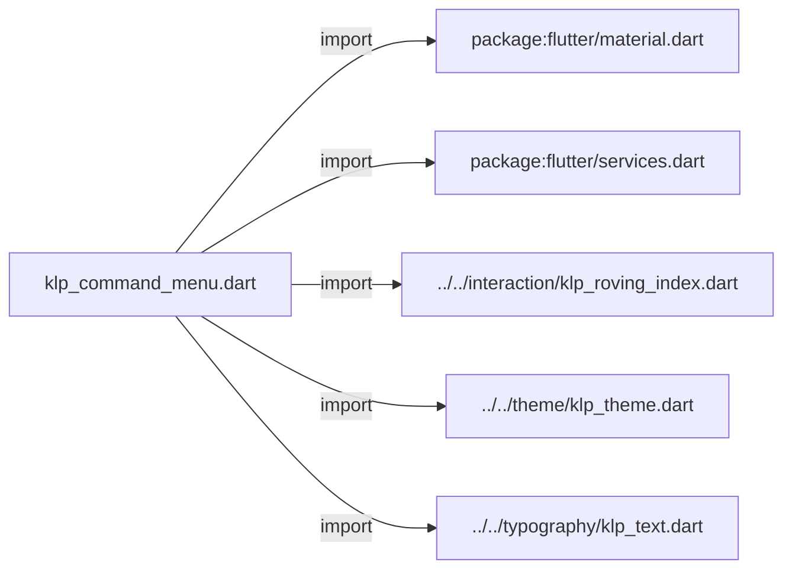
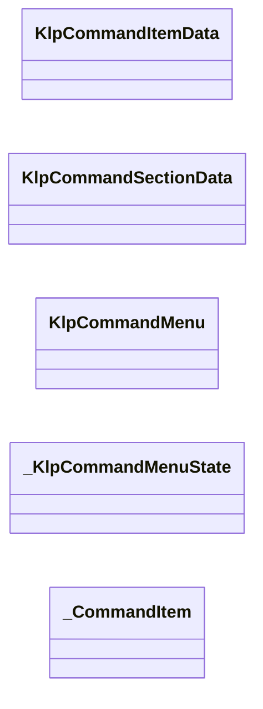
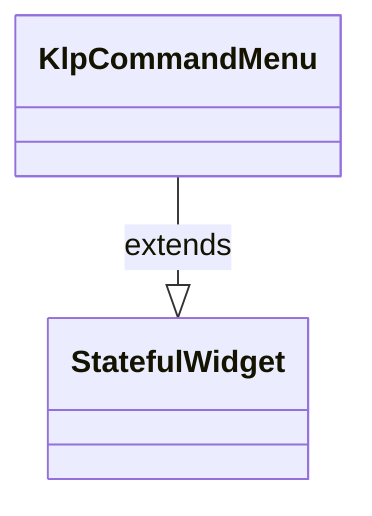
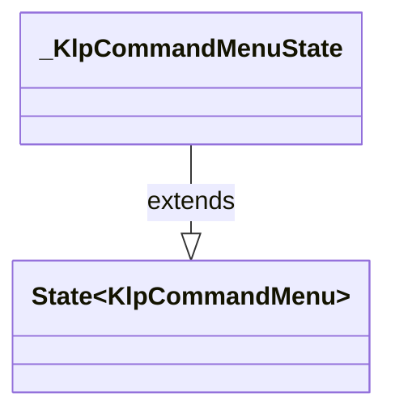
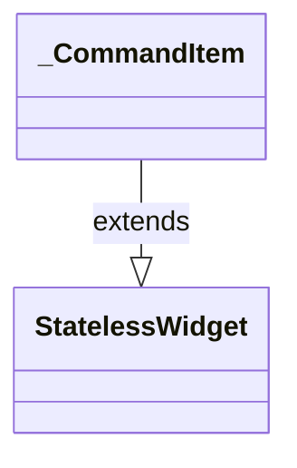

# klp_command_menu.dart：直接依賴與宣告架構

[回到目錄](README.md) · [來源檔案](../../../../../lib/src/editor/command_menu/klp_command_menu.dart)

## 範圍

核心是 `lib/src/editor/command_menu/klp_command_menu.dart`。主要視角為該檔案明寫的 import／export／part；輔助視角為本檔宣告及 extends／implements／with／on 關係。只展開一層外部邊界。

## 直接依賴圖

## 依賴證據

| 關係 | 原始 directive | 來源 |
|---|---|---|
| import | <code>import &#x27;package:flutter/material.dart&#x27;;</code> | [lib/src/editor/command_menu/klp_command_menu.dart:1](../../../../../lib/src/editor/command_menu/klp_command_menu.dart#L1) |
| import | <code>import &#x27;package:flutter/services.dart&#x27;;</code> | [lib/src/editor/command_menu/klp_command_menu.dart:2](../../../../../lib/src/editor/command_menu/klp_command_menu.dart#L2) |
| import | <code>import &#x27;../../interaction/klp_roving_index.dart&#x27;;</code> | [lib/src/editor/command_menu/klp_command_menu.dart:4](../../../../../lib/src/editor/command_menu/klp_command_menu.dart#L4) |
| import | <code>import &#x27;../../theme/klp_theme.dart&#x27;;</code> | [lib/src/editor/command_menu/klp_command_menu.dart:5](../../../../../lib/src/editor/command_menu/klp_command_menu.dart#L5) |
| import | <code>import &#x27;../../typography/klp_text.dart&#x27;;</code> | [lib/src/editor/command_menu/klp_command_menu.dart:6](../../../../../lib/src/editor/command_menu/klp_command_menu.dart#L6) |

## 宣告關係圖

本組節點是本檔宣告；沒有箭頭的宣告未在此圖主張互相依賴。

## 宣告與成員證據

成員包含 public 與 private；簽章取自來源，省略函式本體與欄位初始值。`(inferred)` 表示來源未明寫型別；建構子只顯示參數部分，不含初始化列表。

### KlpCommandItemData

ClassDeclaration · public · [lib/src/editor/command_menu/klp_command_menu.dart:8](../../../../../lib/src/editor/command_menu/klp_command_menu.dart#L8)

<code>class KlpCommandItemData</code>

| 成員 | 可見性 | 簽章／型別 | 來源註解摘要 | 證據 |
|---|---|---|---|---|
| constructor <code>KlpCommandItemData</code> | public | <code>const KlpCommandItemData({ required this.label, this.onPressed, this.caption, this.shortcut, this.selected = false, this.danger = false, })</code> |  | [lib/src/editor/command_menu/klp_command_menu.dart:10](../../../../../lib/src/editor/command_menu/klp_command_menu.dart#L10) |
| field <code>label</code> | public | <code>final String label</code> |  | [lib/src/editor/command_menu/klp_command_menu.dart:19](../../../../../lib/src/editor/command_menu/klp_command_menu.dart#L19) |
| field <code>onPressed</code> | public | <code>final VoidCallback? onPressed</code> |  | [lib/src/editor/command_menu/klp_command_menu.dart:20](../../../../../lib/src/editor/command_menu/klp_command_menu.dart#L20) |
| field <code>caption</code> | public | <code>final String? caption</code> |  | [lib/src/editor/command_menu/klp_command_menu.dart:21](../../../../../lib/src/editor/command_menu/klp_command_menu.dart#L21) |
| field <code>shortcut</code> | public | <code>final String? shortcut</code> |  | [lib/src/editor/command_menu/klp_command_menu.dart:22](../../../../../lib/src/editor/command_menu/klp_command_menu.dart#L22) |
| field <code>selected</code> | public | <code>final bool selected</code> |  | [lib/src/editor/command_menu/klp_command_menu.dart:23](../../../../../lib/src/editor/command_menu/klp_command_menu.dart#L23) |
| field <code>danger</code> | public | <code>final bool danger</code> |  | [lib/src/editor/command_menu/klp_command_menu.dart:24](../../../../../lib/src/editor/command_menu/klp_command_menu.dart#L24) |

### KlpCommandSectionData

ClassDeclaration · public · [lib/src/editor/command_menu/klp_command_menu.dart:27](../../../../../lib/src/editor/command_menu/klp_command_menu.dart#L27)

<code>class KlpCommandSectionData</code>

| 成員 | 可見性 | 簽章／型別 | 來源註解摘要 | 證據 |
|---|---|---|---|---|
| constructor <code>KlpCommandSectionData</code> | public | <code>const KlpCommandSectionData({required this.label, required this.items})</code> |  | [lib/src/editor/command_menu/klp_command_menu.dart:29](../../../../../lib/src/editor/command_menu/klp_command_menu.dart#L29) |
| field <code>label</code> | public | <code>final String label</code> |  | [lib/src/editor/command_menu/klp_command_menu.dart:31](../../../../../lib/src/editor/command_menu/klp_command_menu.dart#L31) |
| field <code>items</code> | public | <code>final List&lt;KlpCommandItemData&gt; items</code> |  | [lib/src/editor/command_menu/klp_command_menu.dart:32](../../../../../lib/src/editor/command_menu/klp_command_menu.dart#L32) |

### KlpCommandMenu

ClassDeclaration · public · [lib/src/editor/command_menu/klp_command_menu.dart:35](../../../../../lib/src/editor/command_menu/klp_command_menu.dart#L35)

<code>class KlpCommandMenu extends StatefulWidget</code>

來源註解摘要：命令面板：分組的指令清單，存在的意義就是不用滑鼠也能操作。 **鍵盤**：`↓`／`↑` 在（跨分組攤平後的）項目間移動高亮，跳過 [KlpCommandItemData.onPressed] 為 `null`（停用）的項目，並在頭尾之間循環； `Home`／`End` 跳到第一／最後一個可用項目；`Enter`／`Space` 觸發目前高亮的 項目；`Escape` 呼叫 [onEscape]。索引移動規則沿用 [KlpRovingIndex]，與 [KlpMenu]、[KlpCombobox] 共用同一套實作。 面板預設會在出現時自動取得鍵盤焦點（[autofocus]），因為命令面板通常是剛彈出 的 overlay。

- `extends` → <code>StatefulWidget</code>：[lib/src/editor/command_menu/klp_command_menu.dart:45](../../../../../lib/src/editor/command_menu/klp_command_menu.dart#L45)

| 成員 | 可見性 | 簽章／型別 | 來源註解摘要 | 證據 |
|---|---|---|---|---|
| constructor <code>KlpCommandMenu</code> | public | <code>const KlpCommandMenu({ super.key, required this.sections, this.width = 300, this.framed = true, this.autofocus = true, this.onEscape, })</code> |  | [lib/src/editor/command_menu/klp_command_menu.dart:46](../../../../../lib/src/editor/command_menu/klp_command_menu.dart#L46) |
| field <code>sections</code> | public | <code>final List&lt;KlpCommandSectionData&gt; sections</code> |  | [lib/src/editor/command_menu/klp_command_menu.dart:55](../../../../../lib/src/editor/command_menu/klp_command_menu.dart#L55) |
| field <code>width</code> | public | <code>final double width</code> |  | [lib/src/editor/command_menu/klp_command_menu.dart:56](../../../../../lib/src/editor/command_menu/klp_command_menu.dart#L56) |
| field <code>framed</code> | public | <code>final bool framed</code> |  | [lib/src/editor/command_menu/klp_command_menu.dart:57](../../../../../lib/src/editor/command_menu/klp_command_menu.dart#L57) |
| field <code>autofocus</code> | public | <code>final bool autofocus</code> | 是否在面板出現時自動取得鍵盤焦點。預設 `true`。 | [lib/src/editor/command_menu/klp_command_menu.dart:60](../../../../../lib/src/editor/command_menu/klp_command_menu.dart#L60) |
| field <code>onEscape</code> | public | <code>final VoidCallback? onEscape</code> | 按下 `Escape` 時呼叫，通常由呼叫端用來關閉面板；未提供時無效果。 | [lib/src/editor/command_menu/klp_command_menu.dart:63](../../../../../lib/src/editor/command_menu/klp_command_menu.dart#L63) |
| method <code>createState</code> | public | <code>State&lt;KlpCommandMenu&gt; createState()</code> |  | [lib/src/editor/command_menu/klp_command_menu.dart:65](../../../../../lib/src/editor/command_menu/klp_command_menu.dart#L65) |

### _KlpCommandMenuState

ClassDeclaration · private · [lib/src/editor/command_menu/klp_command_menu.dart:69](../../../../../lib/src/editor/command_menu/klp_command_menu.dart#L69)

<code>class _KlpCommandMenuState extends State&lt;KlpCommandMenu&gt;</code>

- `extends` → <code>State&lt;KlpCommandMenu&gt;</code>：[lib/src/editor/command_menu/klp_command_menu.dart:69](../../../../../lib/src/editor/command_menu/klp_command_menu.dart#L69)

| 成員 | 可見性 | 簽章／型別 | 來源註解摘要 | 證據 |
|---|---|---|---|---|
| field <code>_highlightedIndex</code> | private | <code>int _highlightedIndex</code> |  | [lib/src/editor/command_menu/klp_command_menu.dart:70](../../../../../lib/src/editor/command_menu/klp_command_menu.dart#L70) |
| getter <code>_flatItems</code> | private | <code>List&lt;KlpCommandItemData&gt; get _flatItems</code> |  | [lib/src/editor/command_menu/klp_command_menu.dart:72](../../../../../lib/src/editor/command_menu/klp_command_menu.dart#L72) |
| method <code>_isEnabled</code> | private | <code>bool _isEnabled(int index)</code> |  | [lib/src/editor/command_menu/klp_command_menu.dart:76](../../../../../lib/src/editor/command_menu/klp_command_menu.dart#L76) |
| method <code>_handleKey</code> | private | <code>KeyEventResult _handleKey(FocusNode node, KeyEvent event)</code> |  | [lib/src/editor/command_menu/klp_command_menu.dart:78](../../../../../lib/src/editor/command_menu/klp_command_menu.dart#L78) |
| method <code>build</code> | public | <code>Widget build(BuildContext context)</code> |  | [lib/src/editor/command_menu/klp_command_menu.dart:140](../../../../../lib/src/editor/command_menu/klp_command_menu.dart#L140) |

### _CommandItem

ClassDeclaration · private · [lib/src/editor/command_menu/klp_command_menu.dart:192](../../../../../lib/src/editor/command_menu/klp_command_menu.dart#L192)

<code>class _CommandItem extends StatelessWidget</code>

- `extends` → <code>StatelessWidget</code>：[lib/src/editor/command_menu/klp_command_menu.dart:192](../../../../../lib/src/editor/command_menu/klp_command_menu.dart#L192)

| 成員 | 可見性 | 簽章／型別 | 來源註解摘要 | 證據 |
|---|---|---|---|---|
| constructor <code>_CommandItem</code> | private | <code>const _CommandItem({required this.data, this.keyboardHighlighted = false})</code> |  | [lib/src/editor/command_menu/klp_command_menu.dart:193](../../../../../lib/src/editor/command_menu/klp_command_menu.dart#L193) |
| field <code>data</code> | public | <code>final KlpCommandItemData data</code> |  | [lib/src/editor/command_menu/klp_command_menu.dart:195](../../../../../lib/src/editor/command_menu/klp_command_menu.dart#L195) |
| field <code>keyboardHighlighted</code> | public | <code>final bool keyboardHighlighted</code> | 由 [KlpCommandMenu] 以鍵盤方向鍵移動出的高亮狀態。沿用與 [KlpCommandItemData.selected] 相同的底色語言——這個元件目前沒有另一套 hover 視覺可以借用，加第三種視覺不如共用既有的這一種。 | [lib/src/editor/command_menu/klp_command_menu.dart:200](../../../../../lib/src/editor/command_menu/klp_command_menu.dart#L200) |
| method <code>build</code> | public | <code>Widget build(BuildContext context)</code> |  | [lib/src/editor/command_menu/klp_command_menu.dart:202](../../../../../lib/src/editor/command_menu/klp_command_menu.dart#L202) |

## 閱讀說明與限制

箭頭只表示來源明寫的靜態關係；import 不等於呼叫。未分析動態呼叫、欄位的實際物件擁有權、狀態轉移或渲染流程；型別未進行語意解析，繼承目標保留原始型別拼寫。public／private 依 Dart 名稱前綴判斷；public 宣告不代表已由 `lib/kallopis.dart` 匯出。

本頁由 `tool/architecture_atlas` 產生；編輯來源或生成工具後重新產生，避免手改本頁。
