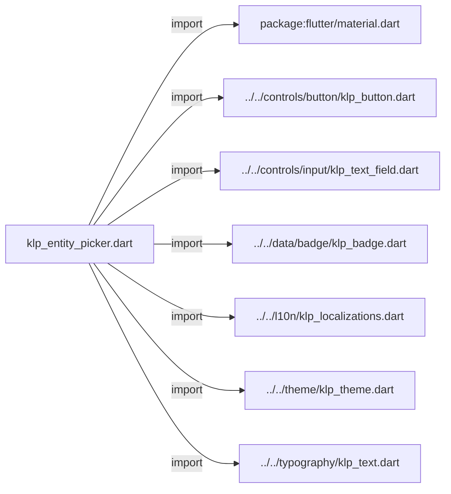
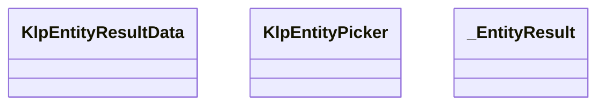
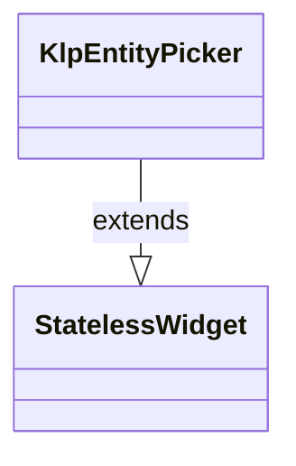
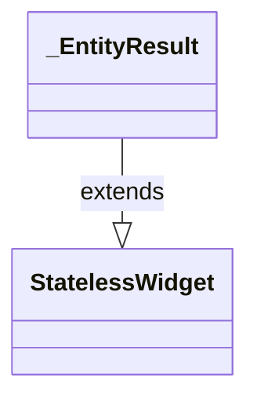

# klp_entity_picker.dart：直接依賴與宣告架構

[回到目錄](README.md) · [來源檔案](../../../../../lib/src/editor/entity_picker/klp_entity_picker.dart)

## 範圍

核心是 `lib/src/editor/entity_picker/klp_entity_picker.dart`。主要視角為該檔案明寫的 import／export／part；輔助視角為本檔宣告及 extends／implements／with／on 關係。只展開一層外部邊界。

## 直接依賴圖

## 依賴證據

| 關係 | 原始 directive | 來源 |
|---|---|---|
| import | <code>import &#x27;package:flutter/material.dart&#x27;;</code> | [lib/src/editor/entity_picker/klp_entity_picker.dart:1](../../../../../lib/src/editor/entity_picker/klp_entity_picker.dart#L1) |
| import | <code>import &#x27;../../controls/button/klp_button.dart&#x27;;</code> | [lib/src/editor/entity_picker/klp_entity_picker.dart:3](../../../../../lib/src/editor/entity_picker/klp_entity_picker.dart#L3) |
| import | <code>import &#x27;../../controls/input/klp_text_field.dart&#x27;;</code> | [lib/src/editor/entity_picker/klp_entity_picker.dart:4](../../../../../lib/src/editor/entity_picker/klp_entity_picker.dart#L4) |
| import | <code>import &#x27;../../data/badge/klp_badge.dart&#x27;;</code> | [lib/src/editor/entity_picker/klp_entity_picker.dart:5](../../../../../lib/src/editor/entity_picker/klp_entity_picker.dart#L5) |
| import | <code>import &#x27;../../l10n/klp_localizations.dart&#x27;;</code> | [lib/src/editor/entity_picker/klp_entity_picker.dart:6](../../../../../lib/src/editor/entity_picker/klp_entity_picker.dart#L6) |
| import | <code>import &#x27;../../theme/klp_theme.dart&#x27;;</code> | [lib/src/editor/entity_picker/klp_entity_picker.dart:7](../../../../../lib/src/editor/entity_picker/klp_entity_picker.dart#L7) |
| import | <code>import &#x27;../../typography/klp_text.dart&#x27;;</code> | [lib/src/editor/entity_picker/klp_entity_picker.dart:8](../../../../../lib/src/editor/entity_picker/klp_entity_picker.dart#L8) |

## 宣告關係圖

本組節點是本檔宣告；沒有箭頭的宣告未在此圖主張互相依賴。

## 宣告與成員證據

成員包含 public 與 private；簽章取自來源，省略函式本體與欄位初始值。`(inferred)` 表示來源未明寫型別；建構子只顯示參數部分，不含初始化列表。

### KlpEntityResultData

ClassDeclaration · public · [lib/src/editor/entity_picker/klp_entity_picker.dart:10](../../../../../lib/src/editor/entity_picker/klp_entity_picker.dart#L10)

<code>class KlpEntityResultData</code>

| 成員 | 可見性 | 簽章／型別 | 來源註解摘要 | 證據 |
|---|---|---|---|---|
| constructor <code>KlpEntityResultData</code> | public | <code>const KlpEntityResultData({ required this.kind, required this.label, this.trailing, this.selected = false, })</code> |  | [lib/src/editor/entity_picker/klp_entity_picker.dart:12](../../../../../lib/src/editor/entity_picker/klp_entity_picker.dart#L12) |
| field <code>kind</code> | public | <code>final String kind</code> |  | [lib/src/editor/entity_picker/klp_entity_picker.dart:19](../../../../../lib/src/editor/entity_picker/klp_entity_picker.dart#L19) |
| field <code>label</code> | public | <code>final String label</code> |  | [lib/src/editor/entity_picker/klp_entity_picker.dart:20](../../../../../lib/src/editor/entity_picker/klp_entity_picker.dart#L20) |
| field <code>trailing</code> | public | <code>final String? trailing</code> |  | [lib/src/editor/entity_picker/klp_entity_picker.dart:21](../../../../../lib/src/editor/entity_picker/klp_entity_picker.dart#L21) |
| field <code>selected</code> | public | <code>final bool selected</code> |  | [lib/src/editor/entity_picker/klp_entity_picker.dart:22](../../../../../lib/src/editor/entity_picker/klp_entity_picker.dart#L22) |

### KlpEntityPicker

ClassDeclaration · public · [lib/src/editor/entity_picker/klp_entity_picker.dart:25](../../../../../lib/src/editor/entity_picker/klp_entity_picker.dart#L25)

<code>class KlpEntityPicker extends StatelessWidget</code>

- `extends` → <code>StatelessWidget</code>：[lib/src/editor/entity_picker/klp_entity_picker.dart:25](../../../../../lib/src/editor/entity_picker/klp_entity_picker.dart#L25)

| 成員 | 可見性 | 簽章／型別 | 來源註解摘要 | 證據 |
|---|---|---|---|---|
| constructor <code>KlpEntityPicker</code> | public | <code>const KlpEntityPicker({ super.key, required this.title, required this.initialQuery, required this.results, required this.onQueryChanged, required this.onClear, required this.onApply, this.onResultSelected, })</code> |  | [lib/src/editor/entity_picker/klp_entity_picker.dart:26](../../../../../lib/src/editor/entity_picker/klp_entity_picker.dart#L26) |
| field <code>title</code> | public | <code>final String title</code> |  | [lib/src/editor/entity_picker/klp_entity_picker.dart:37](../../../../../lib/src/editor/entity_picker/klp_entity_picker.dart#L37) |
| field <code>initialQuery</code> | public | <code>final String initialQuery</code> |  | [lib/src/editor/entity_picker/klp_entity_picker.dart:38](../../../../../lib/src/editor/entity_picker/klp_entity_picker.dart#L38) |
| field <code>results</code> | public | <code>final List&lt;KlpEntityResultData&gt; results</code> |  | [lib/src/editor/entity_picker/klp_entity_picker.dart:39](../../../../../lib/src/editor/entity_picker/klp_entity_picker.dart#L39) |
| field <code>onQueryChanged</code> | public | <code>final ValueChanged&lt;String&gt; onQueryChanged</code> |  | [lib/src/editor/entity_picker/klp_entity_picker.dart:40](../../../../../lib/src/editor/entity_picker/klp_entity_picker.dart#L40) |
| field <code>onClear</code> | public | <code>final VoidCallback onClear</code> |  | [lib/src/editor/entity_picker/klp_entity_picker.dart:41](../../../../../lib/src/editor/entity_picker/klp_entity_picker.dart#L41) |
| field <code>onApply</code> | public | <code>final VoidCallback onApply</code> |  | [lib/src/editor/entity_picker/klp_entity_picker.dart:42](../../../../../lib/src/editor/entity_picker/klp_entity_picker.dart#L42) |
| field <code>onResultSelected</code> | public | <code>final ValueChanged&lt;int&gt;? onResultSelected</code> |  | [lib/src/editor/entity_picker/klp_entity_picker.dart:43](../../../../../lib/src/editor/entity_picker/klp_entity_picker.dart#L43) |
| method <code>build</code> | public | <code>Widget build(BuildContext context)</code> |  | [lib/src/editor/entity_picker/klp_entity_picker.dart:45](../../../../../lib/src/editor/entity_picker/klp_entity_picker.dart#L45) |

### _EntityResult

ClassDeclaration · private · [lib/src/editor/entity_picker/klp_entity_picker.dart:97](../../../../../lib/src/editor/entity_picker/klp_entity_picker.dart#L97)

<code>class _EntityResult extends StatelessWidget</code>

- `extends` → <code>StatelessWidget</code>：[lib/src/editor/entity_picker/klp_entity_picker.dart:97](../../../../../lib/src/editor/entity_picker/klp_entity_picker.dart#L97)

| 成員 | 可見性 | 簽章／型別 | 來源註解摘要 | 證據 |
|---|---|---|---|---|
| constructor <code>_EntityResult</code> | private | <code>const _EntityResult({required this.data, required this.onPressed})</code> |  | [lib/src/editor/entity_picker/klp_entity_picker.dart:98](../../../../../lib/src/editor/entity_picker/klp_entity_picker.dart#L98) |
| field <code>data</code> | public | <code>final KlpEntityResultData data</code> |  | [lib/src/editor/entity_picker/klp_entity_picker.dart:100](../../../../../lib/src/editor/entity_picker/klp_entity_picker.dart#L100) |
| field <code>onPressed</code> | public | <code>final VoidCallback? onPressed</code> |  | [lib/src/editor/entity_picker/klp_entity_picker.dart:101](../../../../../lib/src/editor/entity_picker/klp_entity_picker.dart#L101) |
| method <code>build</code> | public | <code>Widget build(BuildContext context)</code> |  | [lib/src/editor/entity_picker/klp_entity_picker.dart:103](../../../../../lib/src/editor/entity_picker/klp_entity_picker.dart#L103) |

## 閱讀說明與限制

箭頭只表示來源明寫的靜態關係；import 不等於呼叫。未分析動態呼叫、欄位的實際物件擁有權、狀態轉移或渲染流程；型別未進行語意解析，繼承目標保留原始型別拼寫。public／private 依 Dart 名稱前綴判斷；public 宣告不代表已由 `lib/kallopis.dart` 匯出。

本頁由 `tool/architecture_atlas` 產生；編輯來源或生成工具後重新產生，避免手改本頁。
