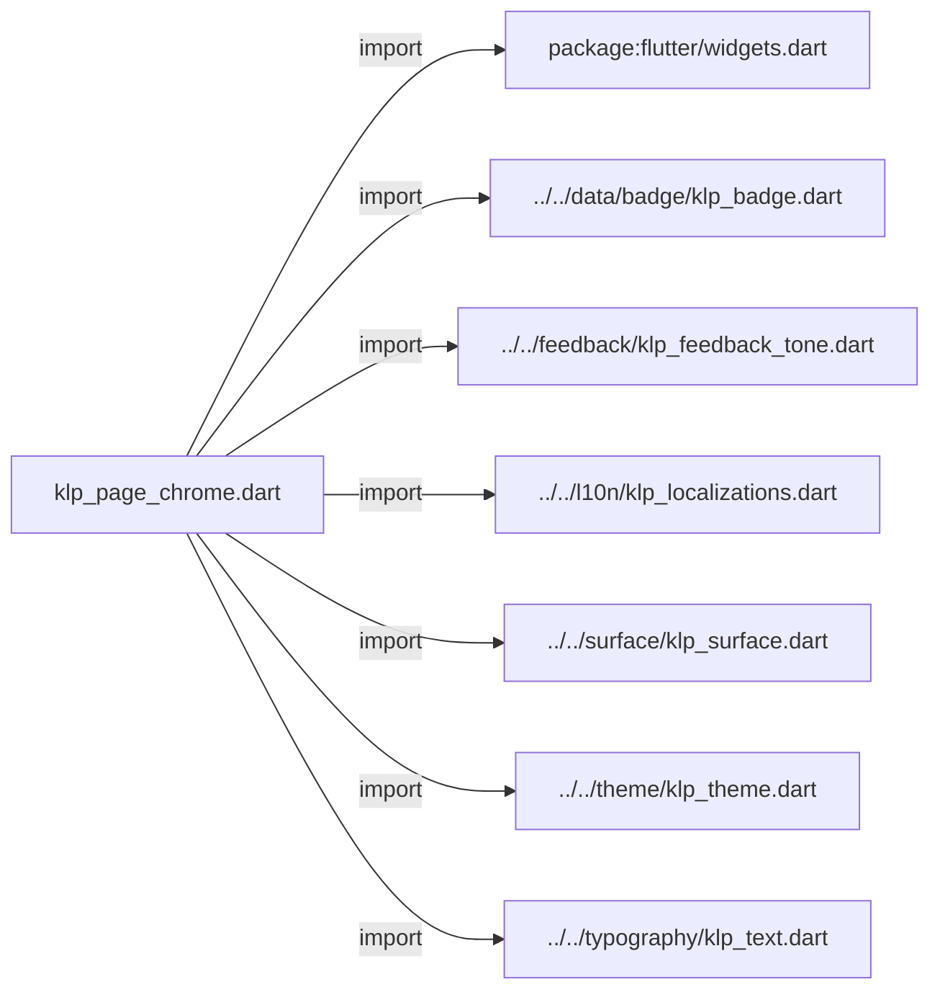
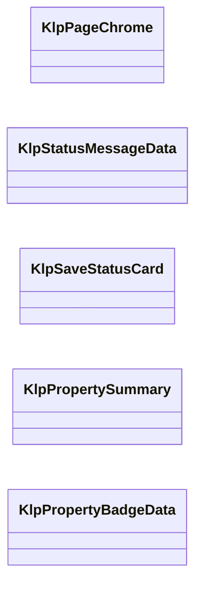
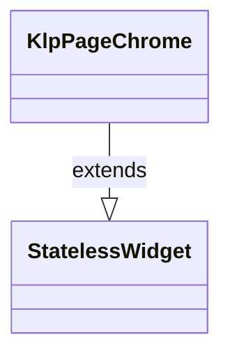
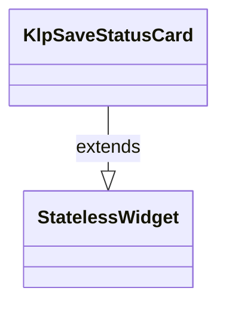
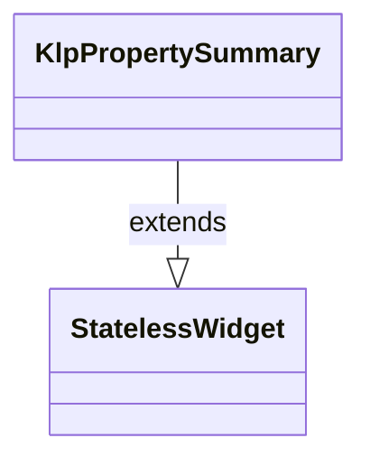

# klp_page_chrome.dart：直接依賴與宣告架構

[回到目錄](README.md) · [來源檔案](../../../../../lib/src/editor/page_chrome/klp_page_chrome.dart)

## 範圍

核心是 `lib/src/editor/page_chrome/klp_page_chrome.dart`。主要視角為該檔案明寫的 import／export／part；輔助視角為本檔宣告及 extends／implements／with／on 關係。只展開一層外部邊界。

## 直接依賴圖

## 依賴證據

| 關係 | 原始 directive | 來源 |
|---|---|---|
| import | <code>import &#x27;package:flutter/widgets.dart&#x27;;</code> | [lib/src/editor/page_chrome/klp_page_chrome.dart:1](../../../../../lib/src/editor/page_chrome/klp_page_chrome.dart#L1) |
| import | <code>import &#x27;../../data/badge/klp_badge.dart&#x27;;</code> | [lib/src/editor/page_chrome/klp_page_chrome.dart:3](../../../../../lib/src/editor/page_chrome/klp_page_chrome.dart#L3) |
| import | <code>import &#x27;../../feedback/klp_feedback_tone.dart&#x27;;</code> | [lib/src/editor/page_chrome/klp_page_chrome.dart:4](../../../../../lib/src/editor/page_chrome/klp_page_chrome.dart#L4) |
| import | <code>import &#x27;../../l10n/klp_localizations.dart&#x27;;</code> | [lib/src/editor/page_chrome/klp_page_chrome.dart:5](../../../../../lib/src/editor/page_chrome/klp_page_chrome.dart#L5) |
| import | <code>import &#x27;../../surface/klp_surface.dart&#x27;;</code> | [lib/src/editor/page_chrome/klp_page_chrome.dart:6](../../../../../lib/src/editor/page_chrome/klp_page_chrome.dart#L6) |
| import | <code>import &#x27;../../theme/klp_theme.dart&#x27;;</code> | [lib/src/editor/page_chrome/klp_page_chrome.dart:7](../../../../../lib/src/editor/page_chrome/klp_page_chrome.dart#L7) |
| import | <code>import &#x27;../../typography/klp_text.dart&#x27;;</code> | [lib/src/editor/page_chrome/klp_page_chrome.dart:8](../../../../../lib/src/editor/page_chrome/klp_page_chrome.dart#L8) |

## 宣告關係圖

本組節點是本檔宣告；沒有箭頭的宣告未在此圖主張互相依賴。

## 宣告與成員證據

成員包含 public 與 private；簽章取自來源，省略函式本體與欄位初始值。`(inferred)` 表示來源未明寫型別；建構子只顯示參數部分，不含初始化列表。

### KlpPageChrome

ClassDeclaration · public · [lib/src/editor/page_chrome/klp_page_chrome.dart:10](../../../../../lib/src/editor/page_chrome/klp_page_chrome.dart#L10)

<code>class KlpPageChrome extends StatelessWidget</code>

來源註解摘要：頁面頂部的識別區塊：麵包屑導覽、選填的狀態文字與協作者標記，以及頁面 大標題。 [breadcrumb] 以 `/` 串接顯示，不提供逐段可點擊的導覽——需要可點擊麵包屑 請改用 [KlpBreadcrumb]。[status] 與 [collaborator] 都是單一文字，若要顯示 多位協作者或多筆狀態，需自行組合字串或改用其他元件。

- `extends` → <code>StatelessWidget</code>：[lib/src/editor/page_chrome/klp_page_chrome.dart:16](../../../../../lib/src/editor/page_chrome/klp_page_chrome.dart#L16)

| 成員 | 可見性 | 簽章／型別 | 來源註解摘要 | 證據 |
|---|---|---|---|---|
| constructor <code>KlpPageChrome</code> | public | <code>const KlpPageChrome({ super.key, required this.breadcrumb, required this.title, this.status, this.collaborator, })</code> |  | [lib/src/editor/page_chrome/klp_page_chrome.dart:17](../../../../../lib/src/editor/page_chrome/klp_page_chrome.dart#L17) |
| field <code>breadcrumb</code> | public | <code>final List&lt;String&gt; breadcrumb</code> |  | [lib/src/editor/page_chrome/klp_page_chrome.dart:25](../../../../../lib/src/editor/page_chrome/klp_page_chrome.dart#L25) |
| field <code>title</code> | public | <code>final String title</code> |  | [lib/src/editor/page_chrome/klp_page_chrome.dart:26](../../../../../lib/src/editor/page_chrome/klp_page_chrome.dart#L26) |
| field <code>status</code> | public | <code>final String? status</code> |  | [lib/src/editor/page_chrome/klp_page_chrome.dart:27](../../../../../lib/src/editor/page_chrome/klp_page_chrome.dart#L27) |
| field <code>collaborator</code> | public | <code>final String? collaborator</code> |  | [lib/src/editor/page_chrome/klp_page_chrome.dart:28](../../../../../lib/src/editor/page_chrome/klp_page_chrome.dart#L28) |
| method <code>build</code> | public | <code>Widget build(BuildContext context)</code> |  | [lib/src/editor/page_chrome/klp_page_chrome.dart:30](../../../../../lib/src/editor/page_chrome/klp_page_chrome.dart#L30) |

### KlpStatusMessageData

ClassDeclaration · public · [lib/src/editor/page_chrome/klp_page_chrome.dart:69](../../../../../lib/src/editor/page_chrome/klp_page_chrome.dart#L69)

<code>class KlpStatusMessageData</code>

來源註解摘要：[KlpSaveStatusCard] 裡的一則狀態訊息，例如「已同步」「有欄位驗證失敗」。 [tone] 為 [KlpFeedbackTone.neutral] 時走低對比的靜音文字色，其餘 tone 才 使用對應的狀態色。

| 成員 | 可見性 | 簽章／型別 | 來源註解摘要 | 證據 |
|---|---|---|---|---|
| constructor <code>KlpStatusMessageData</code> | public | <code>const KlpStatusMessageData({ required this.label, this.tone = KlpFeedbackTone.neutral, })</code> |  | [lib/src/editor/page_chrome/klp_page_chrome.dart:74](../../../../../lib/src/editor/page_chrome/klp_page_chrome.dart#L74) |
| field <code>label</code> | public | <code>final String label</code> |  | [lib/src/editor/page_chrome/klp_page_chrome.dart:79](../../../../../lib/src/editor/page_chrome/klp_page_chrome.dart#L79) |
| field <code>tone</code> | public | <code>final KlpFeedbackTone tone</code> |  | [lib/src/editor/page_chrome/klp_page_chrome.dart:80](../../../../../lib/src/editor/page_chrome/klp_page_chrome.dart#L80) |

### KlpSaveStatusCard

ClassDeclaration · public · [lib/src/editor/page_chrome/klp_page_chrome.dart:83](../../../../../lib/src/editor/page_chrome/klp_page_chrome.dart#L83)

<code>class KlpSaveStatusCard extends StatelessWidget</code>

來源註解摘要：顯示最後儲存時間與一組相關狀態訊息的卡片，用於編輯器頁面告知使用者 目前的儲存／同步狀況。 [savedAt] 是已經格式化好的顯示文字（例如「2 分鐘前」），這個元件不處理 時間格式化或相對時間更新。

- `extends` → <code>StatelessWidget</code>：[lib/src/editor/page_chrome/klp_page_chrome.dart:88](../../../../../lib/src/editor/page_chrome/klp_page_chrome.dart#L88)

| 成員 | 可見性 | 簽章／型別 | 來源註解摘要 | 證據 |
|---|---|---|---|---|
| constructor <code>KlpSaveStatusCard</code> | public | <code>const KlpSaveStatusCard({ super.key, required this.savedAt, required this.messages, })</code> |  | [lib/src/editor/page_chrome/klp_page_chrome.dart:89](../../../../../lib/src/editor/page_chrome/klp_page_chrome.dart#L89) |
| field <code>savedAt</code> | public | <code>final String savedAt</code> |  | [lib/src/editor/page_chrome/klp_page_chrome.dart:95](../../../../../lib/src/editor/page_chrome/klp_page_chrome.dart#L95) |
| field <code>messages</code> | public | <code>final List&lt;KlpStatusMessageData&gt; messages</code> |  | [lib/src/editor/page_chrome/klp_page_chrome.dart:96](../../../../../lib/src/editor/page_chrome/klp_page_chrome.dart#L96) |
| method <code>build</code> | public | <code>Widget build(BuildContext context)</code> |  | [lib/src/editor/page_chrome/klp_page_chrome.dart:98](../../../../../lib/src/editor/page_chrome/klp_page_chrome.dart#L98) |

### KlpPropertySummary

ClassDeclaration · public · [lib/src/editor/page_chrome/klp_page_chrome.dart:137](../../../../../lib/src/editor/page_chrome/klp_page_chrome.dart#L137)

<code>class KlpPropertySummary extends StatelessWidget</code>

來源註解摘要：實體的屬性摘要卡片：一排狀態徽章、一排標籤，再加一行中繼資料文字， 依序垂直排列。 三段固定按這個順序（badges → tags → metadata）呈現，不是各自獨立可 重排的插槽；若版面需要不同順序或省略某一段，請直接組合 [KlpBadge]／[KlpTag]／[KlpText] 而不是硬塞空清單進來。

- `extends` → <code>StatelessWidget</code>：[lib/src/editor/page_chrome/klp_page_chrome.dart:143](../../../../../lib/src/editor/page_chrome/klp_page_chrome.dart#L143)

| 成員 | 可見性 | 簽章／型別 | 來源註解摘要 | 證據 |
|---|---|---|---|---|
| constructor <code>KlpPropertySummary</code> | public | <code>const KlpPropertySummary({ super.key, required this.badges, required this.tags, required this.metadata, })</code> |  | [lib/src/editor/page_chrome/klp_page_chrome.dart:144](../../../../../lib/src/editor/page_chrome/klp_page_chrome.dart#L144) |
| field <code>badges</code> | public | <code>final List&lt;KlpPropertyBadgeData&gt; badges</code> |  | [lib/src/editor/page_chrome/klp_page_chrome.dart:151](../../../../../lib/src/editor/page_chrome/klp_page_chrome.dart#L151) |
| field <code>tags</code> | public | <code>final List&lt;String&gt; tags</code> |  | [lib/src/editor/page_chrome/klp_page_chrome.dart:152](../../../../../lib/src/editor/page_chrome/klp_page_chrome.dart#L152) |
| field <code>metadata</code> | public | <code>final String metadata</code> |  | [lib/src/editor/page_chrome/klp_page_chrome.dart:153](../../../../../lib/src/editor/page_chrome/klp_page_chrome.dart#L153) |
| method <code>build</code> | public | <code>Widget build(BuildContext context)</code> |  | [lib/src/editor/page_chrome/klp_page_chrome.dart:155](../../../../../lib/src/editor/page_chrome/klp_page_chrome.dart#L155) |

### KlpPropertyBadgeData

ClassDeclaration · public · [lib/src/editor/page_chrome/klp_page_chrome.dart:185](../../../../../lib/src/editor/page_chrome/klp_page_chrome.dart#L185)

<code>class KlpPropertyBadgeData</code>

來源註解摘要：[KlpPropertySummary.badges] 的一筆徽章資料，直接對應 [KlpBadge] 的 `label`／`tone`／`dot` 參數。

| 成員 | 可見性 | 簽章／型別 | 來源註解摘要 | 證據 |
|---|---|---|---|---|
| constructor <code>KlpPropertyBadgeData</code> | public | <code>const KlpPropertyBadgeData({ required this.label, this.tone = KlpFeedbackTone.neutral, this.dot = false, })</code> |  | [lib/src/editor/page_chrome/klp_page_chrome.dart:189](../../../../../lib/src/editor/page_chrome/klp_page_chrome.dart#L189) |
| field <code>label</code> | public | <code>final String label</code> |  | [lib/src/editor/page_chrome/klp_page_chrome.dart:195](../../../../../lib/src/editor/page_chrome/klp_page_chrome.dart#L195) |
| field <code>tone</code> | public | <code>final KlpFeedbackTone tone</code> |  | [lib/src/editor/page_chrome/klp_page_chrome.dart:196](../../../../../lib/src/editor/page_chrome/klp_page_chrome.dart#L196) |
| field <code>dot</code> | public | <code>final bool dot</code> |  | [lib/src/editor/page_chrome/klp_page_chrome.dart:197](../../../../../lib/src/editor/page_chrome/klp_page_chrome.dart#L197) |

## 閱讀說明與限制

箭頭只表示來源明寫的靜態關係；import 不等於呼叫。未分析動態呼叫、欄位的實際物件擁有權、狀態轉移或渲染流程；型別未進行語意解析，繼承目標保留原始型別拼寫。public／private 依 Dart 名稱前綴判斷；public 宣告不代表已由 `lib/kallopis.dart` 匯出。

本頁由 `tool/architecture_atlas` 產生；編輯來源或生成工具後重新產生，避免手改本頁。
