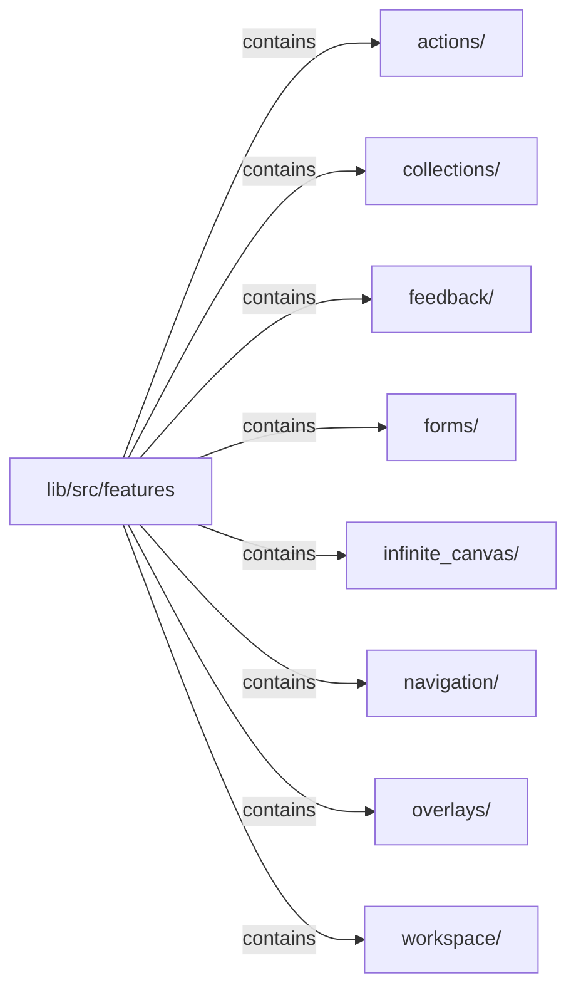

# lib/src/features：架構分析入口

[上一層](../README.md)

## 範圍

閱讀 `lib/src/features` 的直接子目錄與 Dart 檔案。結構圖表示實際檔案包含關係；依賴圖表示本層檔案明寫的 directives。每個檔案頁另列直接依賴、宣告、欄位、方法、建構子及行號證據。

## 模組閱讀重點

## 分析入口

目前先實作 `navigation/rail/`：`contracts/KlpRail` 固定 top／center／bottom 三區，全部只接受 `KlpRailItem`；外部項目可同時實作其他資格介面。清單及展開順序在建構時封存，重複放置識別由 composition registry 拒絕。Rail 本身具備 `KlpScreenBody` 資格。

`internal/klp_rail_adapter.dart` 先解析本庫 semantic、驗證幾何及語意標籤並投影 callback；`klp_prepared_rail.dart` 將已準備資料降為選擇、線性排版、三區配置、表面與尺寸等基礎原語，沒有 Flutter 相依。`klp_rail_placement.dart` 擁有選取狀態及其借用 controller；移除選取項時清空選取，釋放時關閉自己建立的資源。操作接受後依序通知狀態、onSelected、onPressed，單一回呼失敗不吞掉其他通知。

焦點、鍵盤與輔助科技操作由通用 renderer 原語處理，feature 不另寫一份。目前尚未遷移原 rail 的排序、分隔線及完整平台行為，不能描述成全部 navigation rail 已完成。元件定義與內容投影參見 [模板樣板](../../component-template-prototype.md)。

## 本層直接依賴圖

箭頭以本層 Dart 檔案明寫的 directive 彙總到目標所在目錄或外部套件邊界；不遞迴將子目錄依賴算入本層。相同目標的不同 directive 類型分開計數。

本層檔案未宣告跨目錄依賴；子目錄依賴請循下一層入口閱讀。

| 目標邊界 | 關係 | directive 數 | 第一筆來源證據 |
|---|---|---|---|
| 無 | — | 0 | 來源清單見本層檔案 |

## 目錄結構圖

## 子目錄

| 目錄 | 導航 | 來源證據 |
|---|---|---|
| `actions/` | [架構入口](actions/README.md) | [來源目錄](../../../../lib/src/features/actions) |
| `collections/` | [架構入口](collections/README.md) | [來源目錄](../../../../lib/src/features/collections) |
| `feedback/` | [架構入口](feedback/README.md) | [來源目錄](../../../../lib/src/features/feedback) |
| `forms/` | [架構入口](forms/README.md) | [來源目錄](../../../../lib/src/features/forms) |
| `infinite_canvas/` | [架構入口](infinite_canvas/README.md) | [來源目錄](../../../../lib/src/features/infinite_canvas) |
| `navigation/` | [架構入口](navigation/README.md) | [來源目錄](../../../../lib/src/features/navigation) |
| `overlays/` | [架構入口](overlays/README.md) | [來源目錄](../../../../lib/src/features/overlays) |
| `workspace/` | [架構入口](workspace/README.md) | [來源目錄](../../../../lib/src/features/workspace) |

## 本層檔案

| 檔案 | 宣告 | 細節 | 來源證據 |
|---|---|---|---|
| 無 | 本層沒有 Dart 檔案 | — | — |

## 閱讀說明

箭頭只表示來源明寫的靜態關係；import 不等於呼叫。未分析動態呼叫、欄位的實際物件擁有權、狀態轉移或渲染流程；型別未進行語意解析，繼承目標保留原始型別拼寫。public／private 依 Dart 名稱前綴判斷；public 宣告不代表已由 `lib/kallopis.dart` 匯出。

本頁的目錄與檔案由來源清冊產生；`manifest.json` 位於本圖集根目錄，可核對 SHA-256 與覆蓋數。人工模組摘要存於 `tool/architecture_atlas/briefs/`，重新生成時保留。
